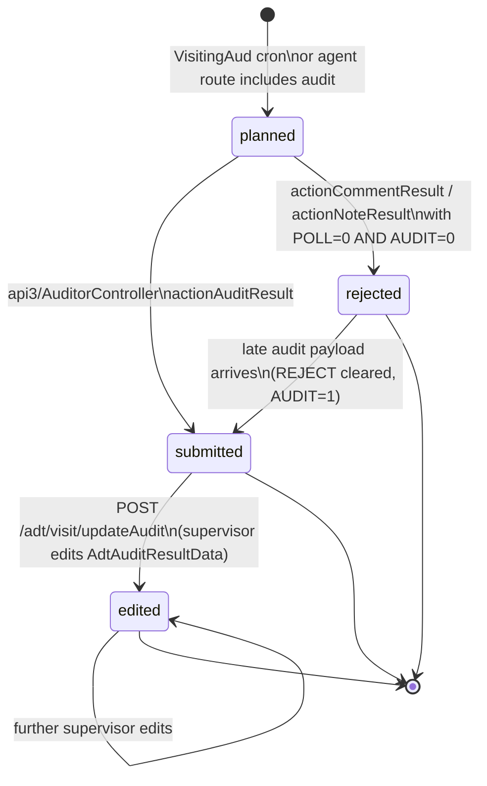

# Audit lifecycle (ADT)

> **TL;DR** — Unlike Order, Trip, and PaymentTransfer, the ADT (retail audit) submission does **not** have a `STATUS` column. Its lifecycle is implicit: an audit moves from *planned* → *submitted* → *edited* through the *presence and content* of `Visit`, `AdtAuditResult`, and `AdtAuditResultData` rows. Supervisor "approval" is realised by editing the audit's data via `/adt/visit/updateAudit` — there is no approve/reject button. Don't expect a state column; read the rows.

## What it is

The Audit module — internally called **ADT** (Audit / Аудит) — captures the agent's or auditor's structured assessment of an outlet during a visit. Per planned audit template (`AdtAudit`), the field user fills:

- Per-product **facing** (shelf count) — `AdtAuditResultData.FACE`
- Per-product **price** — `AdtAuditResultData.PRICE`
- Per-product **sold-since-last-visit** — `AdtAuditResultData.SOLD`
- Per-product **store** (back-room stock) — `AdtAuditResultData.STORE`
- Per-product **available / out-of-stock** flags — `AdtAuditResultData.AVAILABLE`, `OUT_OF_STOCK`

Plus optional photos, polls (`AdtPollResult`), notes (`AdtNoteResult`), and comments (`AdtCommentResult`) — each its own table.

The audit submission is **anchored to a Visit row**: `AdtAuditResult.VISIT_ID` is non-null. One visit can carry several `AdtAuditResult` rows (one per template the agent ran).

## Why "no STATUS column"

The state of an audit is read from three concurrent signals:

| Signal | "State" it implies |
|---|---|
| `Visit` row exists, `AUDIT = 0` | **planned, not yet done** |
| `Visit.AUDIT = 1`, no `AdtAuditResult` row | inconsistent — should not happen (planner bug) |
| `Visit.AUDIT = 1`, `AdtAuditResult` row exists, all `AdtAuditResultData.FACE/PRICE/SOLD/STORE` null and `AVAILABLE = 0` | **submitted, marked unavailable** (agent recorded "product not present") |
| `Visit.AUDIT = 1`, data filled, `UPDATE_BY` empty | **submitted, awaiting supervisor review** |
| `Visit.AUDIT = 1`, `AdtAuditResultData.UPDATE_BY` set | **edited / corrected by supervisor** (de-facto "approved with edits") |
| `Visit.REJECT = 1`, no `AdtAuditResult` row | **rejected** — agent visited but produced no audit |

This is brittle but it is the actual model. Anyone adding an explicit `STATUS` later must migrate against these signals.

## Two versions: v1 retail audit vs v2 (AdtAudit fullReport)

The codebase contains **two parallel implementations** of the retail audit:

- **v1** — `modules/adt/views/retail/*`, `modules/adt/controllers/RetailController.php`. The older static template path.
- **v2** — `modules/adt/views/adtAudit/*`, `modules/adt/controllers/AdtAuditController.php`. The newer template-builder path, the one that uses `AdtAudit`, `AdtAuditProducts`, `AdtAuditUsers` config tables.

`AdtReports::getItems()` exposes both menu entries ("Ритейл аудит" vs "Ритейл аудит 2"). They write to the *same* `AdtAuditResult` / `AdtAuditResultData` tables, but they construct the template binding differently. The lifecycle below applies to both — the difference is only in the configuration row that defines *which* products and *which* checks (`FACE_CHECK`, `PRICE_CHECK`, `SOLD_CHECK`, `STORE_CHECK`) are required.

## State diagram

## Transitions

| From | → To | Trigger | Actor | Side-effects |
|---|---|---|---|---|
| *(none)* | **planned** | `CronVisitController` (planner) or `VisitingAud` row matching today's day-of-week (role 11 auditor) | System | Generates `Visit` row with `PLANED = 1`, `AUDIT = 0`, `STORE_CHECK = 0`. Auditor-role visits use `ROLE = 11`; sales-agent audits use `ROLE = 4`. |
| **planned** | **submitted** | `api3/AuditorController::actionAuditResult` (the main audit-submit endpoint) | Agent / Auditor (mobile) | Per submitted audit: `Visit.AUDIT = 1`, `Visit.STORE_CHECK = 1`, `Visit.REJECT = 0` (force-cleared). New `AdtAuditResult` row with `TOKEN, AUDIT_ID, CLIENT_ID, VISIT_ID, POSITION_ID, USER_ID`. For every product in the audit template, an `AdtAuditResultData` row is written — either with the supplied `price/face/sold/store/available` (when the product is on shelf) or with `AVAILABLE = 0, OUT_OF_STOCK = 0/1` (when missing). De-duped by `TOKEN + AUDIT_ID + CLIENT_ID + DATE(DATE)`: a re-submit with the same token is a no-op. Also fires `TelegramReport::firstVisitSvr` if this is the auditor's first visit of the day. |
| **planned** | **rejected** | `api3/AuditorController::actionCommentResult` or `actionNoteResult` invoked on a visit where both `POLL = 0` and `AUDIT = 0` | Auditor / Agent | `Visit.REJECT = 1`. The auditor logged a comment or a note but didn't fill the audit. No `AdtAuditResult` is created. |
| **submitted** | **edited** | `POST /adt/visit/updateAudit` from the audit-detail web view | Supervisor / Manager / Admin (web RBAC on `audit.visit.updateAudit`) | For each touched product, `AdtAuditResultData.FACE/PRICE/SOLD/STORE` is overwritten with the supervisor's values **OR** cleared and `OUT_OF_STOCK` set, depending on the `available` toggle in the payload. `UPDATE_BY` stamped on each touched row. No transition on the parent `AdtAuditResult` — only the per-product data rows change. No "approve" flag is written — the *fact of edit* is itself the audit-trail. |
| **submitted** | **resubmitted** | A duplicate `actionAuditResult` with the **same** `TOKEN + AUDIT_ID + CLIENT_ID + DATE` | Agent / Auditor | No-op (early-exit `continue` in the loop). Mobile retries are idempotent. |
| **submitted** | **resubmitted-different-token** | `actionAuditResult` with a **different** `TOKEN` but same `CLIENT_ID + DATE` | Agent / Auditor | A **second** `AdtAuditResult` row is created — both coexist. Reports must dedupe by token. |
| **rejected** | **submitted** | A late `actionAuditResult` payload arrives on a previously-rejected visit | Auditor | `Visit.REJECT` is overwritten by `0` and `AUDIT = 1` is set; `AdtAuditResult` is created. The rejection is silently erased. |
| **edited** | **edited** | Repeated `/adt/visit/updateAudit` calls | Supervisor | Each call may overwrite values again; `UPDATE_BY` is bumped. There is no edit-history table on `AdtAuditResultData`. |
| **submitted / edited** | *(any)* | — | — | **No code-path deletes an `AdtAuditResult`** in normal flows. Hard delete is admin-only via direct DB. |

> **Approve / reject UI: where is it?** There isn't one. The "supervisor review" step is not a status flip — it is the act of *editing* the data. If a supervisor changes nothing, the audit is implicitly considered correct; if they change values, the edit is the only mark.

## Where it's used

| Consumer | Reads | Why |
|---|---|---|
| `modules/adt/controllers/VisitController` (`actionDetail`, `actionView`, `actionUpdateAudit`) | `Visit.AUDIT`, `AdtAuditResult`, `AdtAuditResultData` | The supervisor detail page — also the only state-transition surface for `edited`. |
| `modules/adt/controllers/RetailController` (v1) | `AdtAuditResultData` rows joined by audit-template | The classic retail-audit report. |
| `modules/adt/controllers/AdtAuditController` (v2) | Same data, plus `AdtAuditUsers`/`AdtAuditProducts` config | The new retail-audit report (the "fullReport"). |
| `modules/adt/controllers/StoreCheckController`, `PriceController`, `MonthlyController`, `MixReportController` | `AdtAuditResultData` rows | Specialised slice reports (only price, only stock, etc.). |
| `modules/adt/controllers/DashboardController` | `Visit.AUDIT`, `Visit.PHOTO`, `Visit.GPS_STATUS` | Supervisor's daily compliance board. |
| `models/Visit.php` (`dashboard`) | `Visit.AUDIT` | KPI counter for plan-audits-done. |
| `api3/AuditorController` | Read + write everything above | Mobile auditor sync. |

## Edge cases and gotchas

- **No approve / reject button.** Anyone looking for an approval workflow will hunt fruitlessly. The supervisor's tool is the edit form, which is also the closest thing to "approval".
- **Edits are destructive.** `AdtAuditResultData` overwrites in place; the agent's original values are not preserved. There is no shadow-history table. QA workflows that need to compare agent-submitted vs supervisor-edited values must export before the edit.
- **`UPDATE_BY` is the only review marker.** Reports that try to count "how many audits were reviewed" must check `AdtAuditResultData.UPDATE_BY IS NOT NULL` — there's no per-audit `reviewed` flag.
- **A rejected audit can become un-rejected silently.** If the agent re-syncs after marking reject, the `REJECT = 1` is cleared on the visit. Investigations of "audit was rejected then disappeared" usually trace to this.
- **Two `AdtAuditResult` rows can coexist for the same client+date.** The mobile token de-dupes; different tokens do not. Reports that aggregate by (CLIENT, DATE) without joining `TOKEN` double-count.
- **`AdtAuditResultData` for missing products is *also written*.** When a product is not on shelf, an `AVAILABLE = 0` row is still created — the absence is recorded, not implied. Joins must `WHERE AVAILABLE = 1` to count only present products.
- **v1 vs v2 use the same tables.** Both `retail` (v1) and `adtAudit/fullReport` (v2) write/read `AdtAuditResult`. A dealer that switched menu visibility from v1 to v2 sees the same data — no migration is needed.
- **No close-period guard.** Unlike Orders, audit rows are *not* gated by [period close](./period-close.md). A late audit payload for a closed month will still write.

## See also

- [Visit lifecycle](./visit-lifecycle.md) — the parent state machine; `Visit.AUDIT` is the upstream flag.
- [Visit (vs check-in)](./visit.md) — schema reference.
- [Audit module (ADT)](../modules/audit-adt) — module-level docs.
- [Visit audit — QA workflow](../quality/audit/visit-audit) — operator-side QA guide.
- Code: `protected/models/AdtAudit.php`, `protected/models/AdtAuditResult.php`, `protected/models/AdtAuditResultData.php`, `protected/models/AdtReports.php`, `protected/modules/api3/controllers/AuditorController.php`, `protected/modules/adt/controllers/VisitController.php`, `protected/modules/adt/controllers/AdtAuditController.php`, `protected/modules/adt/controllers/RetailController.php`.
