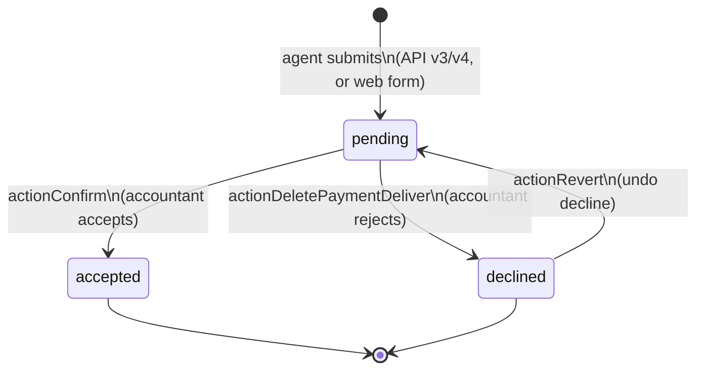
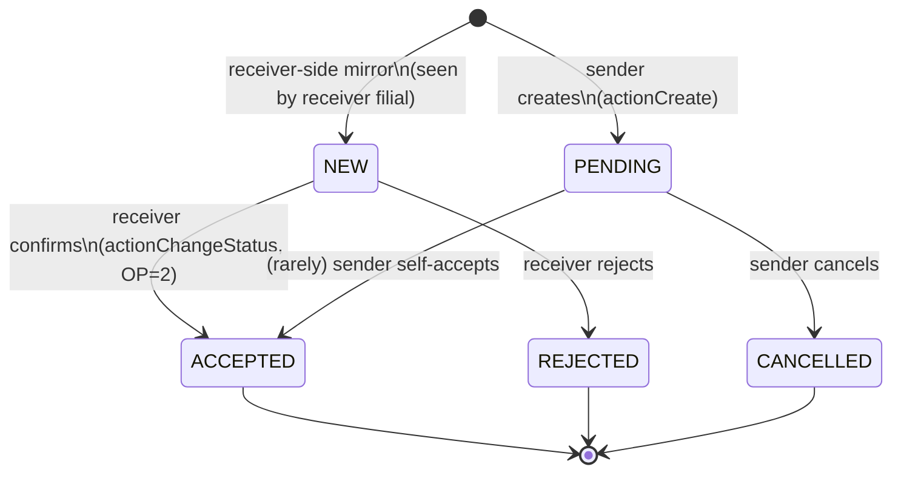

# Payment lifecycle (sd-main)

> **TL;DR** — sd-main runs **two independent payment state machines**:
>
> 1. **PaymentDeliver** — what the field agent / expeditor collected from a client. `CONFIRM = 0 (pending) → 1 (accepted) → 2 (declined)`. The accountant in the office decides.
> 2. **PaymentTransfer** — cash moving between filials. `1 (NEW) → 2 (PENDING) → 3 (ACCEPTED) | 4 (REJECTED) | 5 (CANCELLED)`. Two filials must agree.
>
> This page documents both. **Neither is the billing / online-payment subsystem** — those live in `modules/pay/*` (Click, Payme) and have their own provider-side states; they ultimately materialise as ClientTransaction rows, not as Payment-anything.

## PaymentDeliver — agent-collected payment

### Definition

A `PaymentDeliver` row is created when an agent (van-seller, expeditor, or pre-sale agent) collects cash or wire confirmation from a client at the outlet. It sits in `{{payment_deliver}}` and waits for an office-side accountant to *confirm* (turn it into a real `ClientTransaction`) or *decline* it.

Table: `{{payment_deliver}}`. Model: `PaymentDeliver.php`.

Key columns: `ID, CLIENT_ID, ORDER_ID, SUMMA, CURRENCY, DATE, USER_ID, AGENT_ID, TRADE_ID, TERM, CONFIRM, COMMENT, CREATE_AT, UPDATE_AT`.

There is **no enum class** for `CONFIRM` — the values are implied by code:

| `CONFIRM` | Meaning |
|---|---|
| `0` | pending — agent submitted, accountant has not acted |
| `1` | accepted — accountant approved, ClientTransaction posted |
| `2` | declined — accountant rejected |

### State diagram



### Transitions

| From | → To | Trigger | Actor | Side-effects |
|---|---|---|---|---|
| *(none)* | **pending (`CONFIRM=0`)** | Agent posts payment from mobile (api3 / api4) or new-payment web form | Agent / van-seller / expeditor / pre-seller (role 4 / TYPE_VANSEL / TYPE_SELLER / TYPE_EXPEDITOR) | New `PaymentDeliver` row. `CREATE_AT` stamped. Optional Telegram notification to the client (`PaymentDeliver::notifyClient` in `afterSave`). No `ClientTransaction` yet — the money is *claimed* but not *booked*. |
| **pending** | **accepted (`CONFIRM=1`)** | `clients/finans/Confirm` action (`actionPayConfirm` style) — see `FinansController.php` ~ line 4236 | Cashier / accountant (RBAC `operation.clients.finansCreate`) | `CONFIRM = 1`, `SUMMA` and `CURRENCY` potentially overwritten with the accountant's corrected value, `UPDATE_BY` stamped. **Creates a `ClientTransaction`** with `TRANS_TYPE = 3` (payment), `CONFIRM_ID = payment.ID`, `CONFIRM_USER = 1` (vansel) or `2` (seller). Multi-currency: if the payment is in a foreign currency, the corresponding USD rate is captured at confirmation time. Partial confirmation: if the accountant enters a smaller `summa` than the agent claimed, the row is overwritten — the difference is not tracked. |
| **pending** | **declined (`CONFIRM=2`)** | `actionDeletePaymentDeliver` (`/clients/finans/deletePaymentDeliver`) | Cashier / accountant | `CONFIRM = 2`. Triggers `PaymentDeliver::paymentDeclinedNotification` from `beforeSave` — a Telegram notification fires to the client's chat. No `ClientTransaction` is created or rolled back. |
| **declined** | **pending (`CONFIRM=0`)** | `actionRevertPaymentDeliver` | Cashier / accountant | `CONFIRM = 0`. Lets the office reconsider a declined payment without losing the original submission. |
| **accepted** | *(any)* | — | — | **Terminal.** The `ClientTransaction` is already on the ledger; rolling back the payment would require a manual finans correction (see [Settlement](../quality/finans/settlement)). |

### Multi-currency / partial / split notes

- One `PaymentDeliver` row = one currency. Multi-currency collection is recorded as **multiple rows**.
- The confirmer can attach the payment to a specific `ORDER_ID` (so it offsets a known invoice) or leave it unlinked (general credit on the client account).
- If the order was already partially paid, the new `ClientTransaction` extends the existing per-order transaction (`oldModel`) by setting `COMPUTATION` — a partial-vs-full split that keeps debt rolling correctly.
- `TRADE_ID` (default `1`) routes the payment to a specific *trade direction* (sub-business-line). Wrong `TRADE_ID` lands the money in the wrong cashbox.

---

## PaymentTransfer — inter-filial cash movement

### Definition

A `PaymentTransfer` row is one filial sending cash to another filial (or one cashbox to another). It is **two-sided**: the sending filial creates it; the receiving filial accepts or rejects.

Table: `{{payment_transfer}}`. Model: `PaymentTransfer.php`.

Status enum is documented directly on the model:

```php
public static $status = [
    '1' => 'NEW',
    '2' => 'PENDING',
    '3' => 'ACCEPTED',
    '4' => 'REJECTED',
    '5' => 'CANCELLED',
];

public static $operation = [
    '1' => 'SENDING',
    '2' => 'RECEIVING',
];
```

Roles split by `OPERATION_ID`: the *sender filial* sees `OPERATION_ID = 1` and the *receiver filial* sees `OPERATION_ID = 2` on the mirrored row.

### State diagram



### Transitions

The allowed transition matrix is encoded in `PaymentTransferController::allowedStatus($role, $newStatus, $filialStatus)`:

```
$data = [
    1 /* SENDER */ => [ 2 /* PENDING */ => [3, 4, 5] ],
    2 /* RECEIVER */ => [ 1 /* NEW */     => [3, 4, 5] ],
];
```

| From (`filialStatus`) | Actor side | → To | Trigger | Side-effects |
|---|---|---|---|---|
| *(none)* | sender | **PENDING (2)** | `actionCreate` | Sender's `PaymentTransfer` row created with `STATUS = 2`. Mirror row on the receiver filial appears (via `BaseFilial::setFilial` cross-filial write) with `OPERATION_ID = 2` and `STATUS = 1` (`NEW`). A `Consumption` row (`TRANS_TYPE = 4`) is written on the sender side as the *outgoing claim*. |
| **PENDING (2)** | sender | **ACCEPTED (3)** | `actionChangeStatus` with `status: 3` and a `payments[]` array of cashbox lines | Sender's STATUS → 3. Each `payments[]` item either creates a `ClientTransaction` (if `trans = 1`) or a `Consumption` (otherwise). Total `summa` of the `payments[]` array must equal `paymentTransfer.SUMMA` exactly — otherwise the transaction rolls back. Currency must still be `ACTIVE = 'Y'`. |
| **PENDING (2)** | sender | **REJECTED (4)** | `actionChangeStatus` with `status: 4` | Sender's STATUS → 4. All linked `Consumption` rows with `IDEN = documentId AND TRANS_TYPE = 4` are deleted. |
| **PENDING (2)** | sender | **CANCELLED (5)** | `actionChangeStatus` with `status: 5` | Same as REJECTED: STATUS → 5, `Consumption` rows deleted. Semantically a self-cancel before the receiver acts. |
| **NEW (1)** | receiver | **ACCEPTED (3)** | `actionChangeStatus` with `status: 3` and `payments[]` | Receiver's STATUS → 3. Same `payments[]` rules: each line writes a `ClientTransaction` (income) or `Consumption` row, summing exactly to the transfer total. Cashbox must be `ACTIVE = 'Y'`. |
| **NEW (1)** | receiver | **REJECTED (4)** | `actionChangeStatus` with `status: 4` | Receiver's STATUS → 4; receiver-side `Consumption` rows deleted. |
| **NEW (1)** | receiver | **CANCELLED (5)** | `actionChangeStatus` with `status: 5` | Same as REJECTED on the receiver side. |
| anything else | either | *rejected by `allowedStatus`* | — | HTTP 400 with `"reload_page"` hint — the UI is told to refresh because state diverged. |

### Two extra guards in `actionChangeStatus`

Beyond `allowedStatus`, the controller re-reads the filial-side row after switching tenants (`BaseFilial::setFilial`) and runs `statusCheck($role, $status)`:

| Role | Allowed `$status` to write |
|---|---|
| 1 (SENDER) | PENDING (2), ACCEPTED (3), CANCELLED (5) |
| 2 (RECEIVER) | NEW (1), ACCEPTED (3), REJECTED (4) |

These two checks together prevent: a sender rejecting on the receiver's behalf, a receiver cancelling on the sender's behalf, or any role writing a status that does not match the current `filialStatus` of the mirrored row.

### Where it's used

| Module | What it does |
|---|---|
| `modules/finans/controllers/PaymentTransferController.php` | The whole write surface — create, change-status, list, get. |
| `modules/finans/views/paymentTransfer/main-table.php` | Listing UI; reads `$status` enum directly for badges. |
| `Consumption` (model) | Receives the outgoing/incoming claim rows tied to a transfer via `TRANS_TYPE = 4` and `IDEN = paymentTransfer.DOCUMENT_ID`. |
| `ClientTransaction` | Real ledger movement when a transfer accepts with `trans = 1` (i.e. directly hitting a client's account). |
| `Cashbox` | Receiving cashbox must be `ACTIVE = 'Y'` at accept-time, else `"reload_page"`. |

### Edge cases and gotchas

- **Three guards.** `statusCheck` + `allowedStatus` + post-switch re-read. A transition that passes the first two but fails the third returns `"reload_page"` instead of a hard error — the UI is expected to refresh and show the new server-side state.
- **Cross-filial transaction safety.** The action begins one DB transaction but mid-flight switches filial context (`FilialComponent::setApi(true); BaseFilial::setFilial(...)`). Rollback semantics for the receiver-side row depend on the underlying DB being the same instance (cross-database transactions are *not* atomic).
- **The receiver never sees PENDING.** PENDING is sender-only; receiver sees NEW until they act.
- **Sum must match exactly.** `floatval($totalSum) !== floatval($paymentTransfer->SUMMA)` throws. No partial accept.
- **Deleting Consumption rows on reject does not roll back ClientTransactions.** If something already created a `ClientTransaction` outside the standard flow, rejecting the transfer will *not* clean it up.
- **No re-open from terminal.** Once a transfer is ACCEPTED, REJECTED, or CANCELLED, there is no path back to NEW / PENDING. Errors require a new transfer + manual finans correction.

---

## Note: this is not `modules/pay/*`

`modules/pay/` (Click + Payme online-payment integrations) is a *separate* subsystem. Those controllers ingest provider webhooks and ultimately write `ClientTransaction` rows directly — they do **not** flow through `PaymentDeliver` or `PaymentTransfer`. Online-payment state lives in the provider's response code, not in any sd-main lifecycle column. See `modules/pay/controllers/PaymeController.php` and `ClickController.php` for that flow.

## See also

- [Period close](./period-close.md) — confirmed payments in closed periods cannot be reverted via normal flows.
- [Defect vs reject](./defect-vs-reject.md) — how an order's defect/reject status affects what the agent is allowed to collect.
- [Trip lifecycle](./trip-lifecycle.md) — the expeditor's delivery run is what generates most `PaymentDeliver` rows.
- [Settlement (QA)](../quality/finans/settlement) — operator-side guide to confirming payments.
- [Manual correction (QA)](../quality/finans/manual-correction) — when the lifecycle locks a row and you need a finance-side fix.
- Code: `protected/models/PaymentDeliver.php`, `protected/models/PaymentTransfer.php`, `protected/modules/finans/controllers/PaymentTransferController.php`, `protected/modules/clients/controllers/FinansController.php`, `protected/modules/payment/controllers/ApprovalController.php`.
