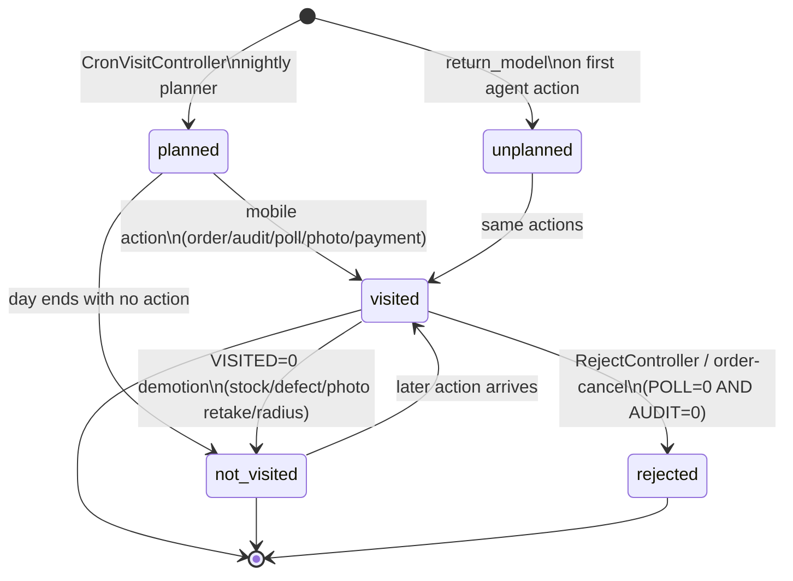

# Visit lifecycle

> **TL;DR** — A **Visit** is created either by the planner (`PLANED = 1`) or by the agent showing up off-plan (`PLANED = 0`). The agent then takes some action (order / audit / poll / payment / store-check / reject). That action stamps `VISITED = 1` and the matching outcome flag, plus computes `GPS_STATUS` from the distance between the agent's pin and the client's pin. KPI joins on **both** `VISITED = 1` *and* `GPS_STATUS = 10` to count a visit as trusted.

## What it is

The Visit lifecycle has **two independent axes** that the code treats separately:

1. **Activity axis** — `PLANED`, `VISITED`, `REJECT`, plus the outcome flags `ORDER / AUDIT / POLL / PHOTO / STORE_CHECK / PAYMENT / DELIVERY / ORDER_REPLACE / ORDER_DEFECT`. These track *what happened* during the call.
2. **GPS-trust axis** — `GPS_STATUS`. This tracks *whether the agent was actually at the outlet* when the visit's first action was logged.

Both move forward as the mobile app posts payloads. Both are written by a handful of API actions and a cron job; nothing else in sd-main flips them.

See also: [Visit (vs check-in)](./visit.md) for the schema-level intro.

## GPS_STATUS values (Visit row — not Gps row)

| Value | Meaning | When written |
|---|---|---|
| `0` | unset / default | New row before first action. |
| `1` | client coordinates missing | `client_latitude` or `client_longitude` was null in the API payload. |
| `2` | agent coordinates missing | The visit row had no `LON`/`LAT` yet (device didn't supply a pin). |
| `5` | **not visited** — pin too far from outlet | `distance(client, visit) > Visit::MIN_GPS_DISTANCE` (100 metres). |
| `10` | **visited** — pin near outlet | `distance(client, visit) ≤ 100 m`. |

The `MIN_GPS_DISTANCE` constant is on `Visit.php` (line 38) and is **not** dealer-configurable. Per-agent override comes from the agent's app config (`radius_visit`) via `GpsService::isRequiredRadiusVisit`, which can demote a visit's `VISITED` to `0` even if the distance gate passed.

> **Note on Gps rows.** A separate `Gps` table also has a `GPS_STATUS` column with a completely different value set — `0 off / 1 on / 2 denied / 3 bad_network / 4 unknown/cancelled / 5 not_accurate` — produced by `CreateGpsAction::getGpsStatus()`. This is the *device-side* GPS state, not the visit-trust state above. Don't confuse the two when reading reports.

## State diagram

`planned` and `unplanned` are not actually separate state values — they're just `PLANED = 1` vs `PLANED = 0`. The lifecycle is `VISITED + REJECT + GPS_STATUS` underneath.

## Transitions

| From | → To | Trigger | Actor | Side-effects |
|---|---|---|---|---|
| *(none)* | **planned (`PLANED=1`)** | `api/CronVisitController` nightly | System (cron) | New Visit row per agent × planned client × day, joining `Visiting` (route plan) and the day-of-week. `VISITED = 0`, `GPS_STATUS = 0`. Auditor role 11 visits are generated the same way from `VisitingAud`. |
| *(none)* | **unplanned (`PLANED=0`)** | `Visit::return_model($agent, $client, $date)` on first agent payload for an outlet that wasn't on the plan | Agent (via api3/api4 mobile) | New Visit row with `PLANED = 0`, `ROLE = 4`. Subsequently, if the planner cron sees an existing unplanned row for a now-planned client, it flips `PLANED` to `1`. |
| **planned (`PLANED=0`)** | **planned (`PLANED=1`)** | `CronVisitController` re-running on a day where the agent already filed an unplanned visit for a client now on the plan | System | `PLANED = 1` (`$model->PLANED = 1; $model->save()`). |
| any | **visited (`VISITED=1`)** | `setVisited()` in `CreateOrderAction` / `CreateReplaceAction` / `CreateDefectAction` (api4); also `api3/AuditorController` on audit/poll submit; also `api3/OrderController` on order create | Agent | `VISITED = 1`; sets the matching outcome flag (`ORDER = 1`, `AUDIT = 1`, etc.); stamps `CHECK_IN_TIME` (earliest event) and `CHECK_OUT_TIME` (latest event); writes `LON`/`LAT` from device; computes `DISTANCE` and `GPS_STATUS` per the table above. Idempotent — `setVisited` only re-computes `DISTANCE`/`GPS_STATUS` if `DISTANCE` is still empty. |
| **visited** | **not_visited (`VISITED=0`)** | `DefectController`, `StockController`, `FinansController`, `PhotoController` in api3 on certain failure paths; also `OrderController` on stock-rollback paths; also `CreateOrderAction` when `GpsService::isRequiredRadiusVisit` returns false | Agent / System | `VISITED = 0` while keeping the outcome flag that *was* set. Effectively a soft retraction. |
| **visited** | **rejected (`REJECT=1`)** | `api3/RejectController` (whole-order reject), `api3/OrderController` cancel path, `AuditorController::actionCommentResult` / `actionNoteResult` when both `POLL = 0` and `AUDIT = 0` | Agent / Auditor | `REJECT = 1`. The visit still counts as "the agent was there" but produced no productive outcome. |
| **planned** | **GPS_STATUS=10** | Agent action arrives, distance ≤ 100 m | Agent | Trusted: visit will count for KPI and `plan_gps_visited`. |
| **planned** | **GPS_STATUS=5** | Agent action arrives, distance > 100 m | Agent | Untrusted: visit will count as `plan_gps_no_visited`. Supervisor may override (see below). |
| **planned** | **GPS_STATUS=1 or 2** | Coordinates missing in payload | Agent (mobile bug / no fix) | KPI counts as `plan_gps_unknown`. |
| **unplanned (any GPS)** | **planned, `PLANED=1`** | `api3/AuditorController` supervisor flow (`$visit->PLANED = 0` is the supervisor side; an admin/auditor can re-mark it) | Supervisor / Auditor | Override path — flips `PLANED` to retroactively include an off-route call in the plan denominator. |

## Where it's used

| Consumer | Reads | Why |
|---|---|---|
| `Visit::dashboard()` (model) | `PLANED`, `VISITED`, `ORDER`, `PHOTO` | KPI / coverage tiles. |
| `adt/DashboardController` | `PLANED`, `GPS_STATUS`, `AUDIT`, `PHOTO`, `REJECT` | Supervisor's daily board. |
| `api3/AuditorController` (`actionVisitsDashboard`) | `GPS_STATUS = 10` / `5` / else | Supervisor view of per-agent visit quality. |
| `models/TelegramReport.php` (`firstVisit`) | `CHECK_IN_TIME` | Pushes a Telegram message on the agent's first stop of the day. |
| `api/V2Controller` and `api/V4Controller` agent-detail screens | `GPS_STATUS = 10` → "gps_visit" flag | Mobile rendering. |
| KPI module | `VISITED = 1 AND GPS_STATUS = 10` filtered counts | Plan-visit completion %, OKB-with-GPS. |
| AKB / OKB reports | `VISITED = 1` joined to `{{order}}` | [AKB](./akb.md) computation gates on the visit's `ORDER = 1` flag. |
| `quality/audit/visit-audit` QA workflow | All flags | Operator-side verification path. |

## Edge cases and gotchas

- **`VISITED = 1` and `GPS_STATUS = 5` is legal.** The agent was at *some* outlet — just not within 100 m of the one in `{{client}}`. Treat them as suspect, not as invalid; auditors review these.
- **`CHECK_IN_TIME` and `CHECK_OUT_TIME` are bumped, not set once.** `setVisited` widens the bracket: the earliest event becomes check-in, the latest becomes check-out. A late audit payload can move `CHECK_OUT_TIME` forward by hours.
- **Distance is sticky.** Once `DISTANCE` is non-empty, no later action re-computes `GPS_STATUS`. The first action that supplied both pins decides the trust verdict for the whole visit.
- **Supervisor can flip `PLANED` but not `GPS_STATUS`.** No code path lets a supervisor override `GPS_STATUS = 5` to `10`. Disputes are resolved by adjusting the client's lat/lon and waiting for the next visit.
- **`REJECT` is not a real terminal state.** Code paths that `REJECT = 1` can still receive subsequent actions on the same row that re-stamp `VISITED = 1` and clear `REJECT` (`CreateOrderAction::setVisited` sets `REJECT = 0`). Order matters.
- **Two `GPS_STATUS` columns.** `Visit.GPS_STATUS` (trust verdict above) vs `Gps.GPS_STATUS` (device state). Reports that join the two tables must disambiguate or they will mis-count.
- **Distance gate is 100 m, hard-coded.** Bigger outlets (warehouses, malls) routinely flag false positives. Per-agent `radius_visit` can *tighten* the gate via `isRequiredRadiusVisit`, but never widen it.

## See also

- [Visit (vs check-in)](./visit.md) — schema and per-row column reference.
- [Trip lifecycle](./trip-lifecycle.md) — delivery side state machine; visits are the upstream sales-side equivalent.
- [Audit lifecycle](./audit-lifecycle.md) — what an audit form submission does inside a visit.
- [AKB](./akb.md) — what counts as an "active customer" depends on `VISITED` and `ORDER`.
- [KPI](./kpi.md) — bonus tier rules read these flags.
- Code: `protected/models/Visit.php`, `protected/modules/api/controllers/CronVisitController.php`, `protected/modules/api4/actions/agent/CreateOrderAction.php`, `protected/modules/api4/actions/RejectVisitAction.php`, `protected/modules/api4/actions/CreateGpsAction.php`, `protected/modules/api3/controllers/AuditorController.php`.
