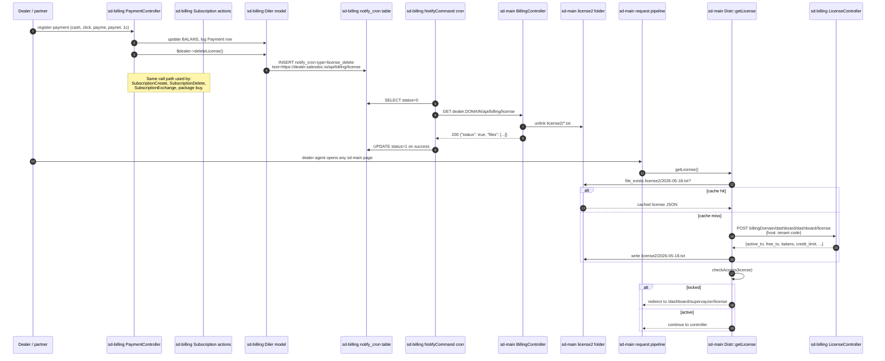

## Purpose

Every SalesDoctor dealer runs their own sd-main tenant. Access to that
tenant is gated by a **license** that lives in sd-billing and is pushed
out to sd-main whenever the dealer's payment or subscription state changes.
The license has an expiration date; once that date passes (and no grace
window or credit limit covers the gap), sd-main locks the tenant down to a
billing-only set of pages and refuses normal application traffic.

This flow documents the full round trip:

1. A payment lands in sd-billing.
2. The subscription in sd-billing is created, extended, exchanged, or cancelled.
3. sd-billing pushes a cache-invalidation signal to the dealer's sd-main.
4. sd-main fetches the fresh license JSON from sd-billing, writes it to
   `protected/license2/<date>.txt`, and uses it as the runtime gate for the
   next 24 hours.
5. When payment is missing or the subscription is cancelled, the same
   round-trip results in lockdown rather than unlock.

The flow has both a synchronous fast path (used by interactive sd-billing
actions that need the dealer cache cleared before the response returns) and
an asynchronous queue path (used by background subscription writes).

## Projects and modules involved

| Project / Module | Role in this flow | Key file path |
| --- | --- | --- |
| sd-billing / `operation` | Records dealer payment, triggers downstream | `protected/modules/operation/controllers/PaymentController.php` |
| sd-billing / `operation` | Creates, exchanges, or deletes subscriptions | `protected/modules/operation/actions/subscription/SubscriptionCreateAction.php` |
| sd-billing / `operation` | Same — delete and exchange paths | `protected/modules/operation/actions/subscription/SubscriptionDeleteAction.php`, `SubscriptionExchangeAction.php` |
| sd-billing / `api` | TOKEN-protected API surface for sd-main calls | `protected/modules/api/controllers/LicenseController.php` |
| sd-billing / model | Dealer model, enqueues the cache-invalidation request | `protected/models/Diler.php` (`deleteLicense`, `writeVisit`) |
| sd-billing / model | Async outbox row used by cache-invalidation | `protected/models/NotifyCron.php` (`TYPE_LICENSE_DELETE`) |
| sd-billing / cron | Drains the outbox once per minute | `protected/commands/NotifyCommand.php` (`sendLicenseDelete`) |
| sd-main / `api` | Receives the cache-invalidation GET, deletes today's license file | `protected/modules/api/controllers/BillingController.php` (`actionLicense`) |
| sd-main / runtime | Reads the license at request time, pulls fresh JSON from sd-billing if missing | `protected/components/Distr.php` (`getLicense`, `checkAccess`, `deniedAccess`) |
| sd-main / filesystem | Persists the license JSON for the day | `protected/license2/<YYYY-MM-DD>.txt` |
| sd-main / `dashboard` | The "billing" pages the tenant is redirected to when locked | `protected/modules/dashboard/controllers/SupervayzerController.php` |
| sd-main / `integration` | Some integration endpoints pre-check the license before allowing 3rd-party calls | `protected/modules/integration/IntegrationModule.php` |

## End-to-end sequence

## Phase-by-phase narrative

### 1. Payment lands

A payment can arrive through any of sd-billing's intake channels:

- Cash entered manually by a partner via `PaymentController::actionCreate`.
- A Click webhook on `/api/click/...` (Click integration).
- A Payme webhook on `/api/payme/...`.
- A Paynet webhook on `/api/paynet/...`.
- A 1C / accounting integration via `/api/api1c/...`.

Every channel converges on a `Payment` row in sd-billing and updates the
dealer's running balance (`Diler.BALANS`). When the payment closes a debt
or pre-pays the next month, the controller calls
`$dealer->deleteLicense()` before returning to the user — this is the
trigger that says "the dealer's snapshot in their sd-main is stale, push a
refresh out". The method name is misleading: it does not delete the
subscription, only the cached license file on the dealer's instance.

### 2. Subscription state changes

In parallel with raw payments, subscription writes also call
`Diler::deleteLicense()`:

- `SubscriptionCreateAction` after creating new month-bound subscriptions.
- `SubscriptionDeleteAction` after cancelling.
- `SubscriptionExchangeAction` on both ends of a dealer-to-dealer swap.
- `SubscriptionUpdateAction` when the count or amount changes within the
  early-month edit window.

Each of these write paths reaches the same `Diler::deleteLicense()` method
and enqueues exactly one `notify_cron` row.

### 3. Async outbox

`Diler::deleteLicense()` does **not** make the HTTP call inline. It calls
`NotifyCron::createLicenseDelete($url)`, where the URL is the dealer's
own domain followed by `/api/billing/license`. That row sits in the
`d0_notify_cron` table with `status = 0` and `type = 'license_delete'`
until the cron picks it up.

This decoupling matters: the cache invalidation is best-effort, must
survive transient dealer-side outages, and must not block the operator's
UI response. The trade-off is a delivery latency of up to one minute
(the cron tick interval).

### 4. Synchronous fast path

A small set of API actions inside `LicenseController` must invalidate the
dealer's cache **before** they return a response, because the same dealer
will immediately re-read the snapshot. Those actions skip the outbox and
call `deleteLicenseImmediately($diler)` instead, which curls the same
URL inline (20 s connect, 60 s timeout) and swallows failures into the
log so the API response is not affected.

The synchronous path runs for `actionBuyPackages`, `actionChangePackage`,
`actionExchange`, and `actionDeleteOne` — every write that originates
from sd-main itself.

### 5. Cron drains the outbox

`php cron.php notify` runs on a per-minute schedule (configured at the
infra level). `NotifyCommand::run` selects every `notify_cron` row with
`status = 0` and dispatches by `type`. For `license_delete`, the
dispatcher runs `sendLicenseDelete()` which delegates to a shared helper
`sendUrlGetExpectingStatusOk`. The helper:

- curls the URL with 20 s connect / 60 s timeout.
- decodes the JSON response.
- considers it a success only when `decoded.status` is truthy.
- on success, flips the row to `status = 1` and clears `error_response`.
- on failure, leaves `status = 0` and writes the curl/HTTP error into
  `error_response` so the next cron tick retries.

There is no max-retry count. A dealer that has been offline for an hour
will still see the queue drain when it comes back, in row order.

### 6. sd-main receives the invalidation

The dealer's sd-main answers `/api/billing/license` with
`BillingController::actionLicense`. The implementation is intentionally
trivial: `glob` every file in `protected/license2/*`, `unlink` each one,
and return `{"status": true, "files": [...]}`. There is no auth on the
endpoint — the assumption is that the dealer's hostname is private
enough and the only consequence of an unauthorized call is a forced
cache refresh on the next request. The endpoint also returns the full
`$_SERVER` array if the caller IP equals the sd-billing primary
(`185.22.234.226`) for diagnostic purposes.

### 7. Runtime license check on every sd-main request

`Distr::getLicense()` is invoked from the request pipeline (via the
ServerSettings layer and the dashboard layouts). The logic:

- Today's filename is `protected/license2/<YYYY-MM-DD>.txt`.
- If the file exists and its `cached` flag is `true`, use it directly
  (the file is the cache).
- If the file does not exist, POST to
  `<billingDomain>/dashboard/dashboard/license` with the dealer's host
  as the body, parse the response into a flattened structure with
  `active_to`, `free_to`, `balans`, `credit_limit`, `credit_date`,
  `tariff_name`, and `subcription` (the rest of the payload), set
  `cached = true`, and write it to the daily file.
- Yesterday's file is deleted to keep the folder small.

`Distr::checkAccess($license)` is the gate proper. It refuses access in
three cases:

1. `license.status === false` — the upstream call rejected the dealer.
2. `left_days < 0` and no overriding `free_to` window — subscription
   has lapsed and there is no grace period.
3. `balans + (credit_limit if within credit_date) < 0` — the dealer is
   in arrears.

When any of those triggers fires, the request is redirected to
`/dashboard/supervayzer/license` (or `/dashboard/billing` for select
URLs that stay accessible during lockdown so the dealer can still pay
their bill). Otherwise control returns to the actual controller.

### 8. Grace period semantics

There is no fixed grace period. Instead there are two overrides:

- **`free_to`** — a date string on the license payload. If today is on or
  before this date, access is granted regardless of `left_days`. This
  is used for trial accounts and goodwill extensions.
- **`credit_limit` + `credit_date`** — sd-billing can extend a soft
  credit limit until a particular date. As long as
  `balans + credit_limit >= 0` and today is on or before `credit_date`,
  the dealer keeps access even if their subscription is technically
  past due.

Both knobs are configured on the dealer's record in sd-billing
(`Diler.CREDIT_LIMIT`, `Diler.CREDIT_DATE`) and propagated through the
license payload on the next refresh.

### 9. Lockdown unwound

When sd-billing receives a payment that brings the balance back above
zero (or restores the subscription), the same chain runs in reverse:

- `PaymentController` writes the `Payment` row and updates `BALANS`.
- `Diler::deleteLicense()` enqueues the cache invalidation.
- Within one cron tick, sd-main's daily license file is unlinked.
- The next sd-main page load re-fetches the license, sees the positive
  balance, and stops redirecting to the billing pages.

The dealer therefore typically unlocks within 60–90 seconds of payment.

## State changes

| Trigger | sd-billing side | sd-main side | Dealer visible result |
| --- | --- | --- | --- |
| Payment created via webhook | new `Payment` row, `BALANS` updated, `notify_cron(license_delete)` enqueued | unchanged | none yet |
| Cron drains queue | `notify_cron.status` 0 to 1 | today's `license2/*.txt` files deleted | none yet |
| Next sd-main page load | none | `Distr::getLicense` POSTs to sd-billing, writes fresh file | full access if subscription valid |
| `actionBuyPackages` (sd-main initiated) | new `Subscription` rows, new `Payment(TYPE=10)`, synchronous invalidation | today's license file deleted inline | sees updated subscription immediately |
| `actionDeleteOne` within day 1-5 | `Subscription.DELETED=1` plus payment adjustment, synchronous invalidation | today's license file deleted inline | seat count drops on next refresh |
| `SubscriptionDeleteAction` | `Subscription.DELETED=1` plus payment reversal, async invalidation | today's license file deleted on next cron tick | lockdown within one tick if no other subs |
| Cron HTTP call fails | row stays `status=0`, `error_response` populated, next tick retries | unchanged | none until cron succeeds |
| sd-main cache hit (today's file present) | none | none, file served from disk | normal access |
| sd-main cache miss | sd-billing POST hit on `/dashboard/dashboard/license` | new daily file written | normal access |
| Cross-midnight cache rollover | none | yesterday's file deleted, today's fetched | one-off cache miss |

## Failure modes and recovery

**Cron not running.** The single most common cause of "I paid and nothing
changed" tickets. The `notify_cron` table fills with `status=0` rows.
Recovery: check the cron host (`/etc/cron.d/`, `crontab -l`, or the
systemd timer), tail the cron stdout. Re-running `php cron.php notify`
once will drain the backlog.

**Dealer domain unreachable.** Each row's `error_response` contains the
curl error and HTTP code. Recovery: fix DNS / SSL on the dealer's host,
let the next cron tick retry. If the dealer is permanently moving
domains, update `Diler.DOMAIN` so future enqueues use the new URL — the
existing stuck rows can either be retried by hand (edit the `text`
column) or marked `status=2` to drop them.

**Cache invalidation succeeded but sd-main still locked out.** Two
sub-cases:
- Today's license file was deleted but the next request happens to hit
  while sd-billing is unreachable. `Distr::getLicense` returns
  `status=false` from the empty response and `checkAccess` redirects to
  billing. Recovery: restore sd-billing connectivity, the next request
  re-fetches.
- The subscription truly is expired or cancelled. Recovery: pay or
  re-create the subscription in sd-billing, which re-triggers the
  whole chain.

**Manual re-push.** Operators can force the same flow by issuing the GET
manually: `curl https://dealer.example/api/billing/license`. This is the
same call the cron makes and the supported recovery for a stuck queue
row. After the GET, the operator can verify the unlock by loading any
sd-main page — the request will trigger a refresh of the daily license
file.

**Wrong tenant unlocked.** Misrouted because two `Diler` rows share the
same `DOMAIN`. Recovery: deduplicate the `Diler` table, update the
authoritative row, and re-issue the invalidation. The diagnostic
fingerprint in `BillingController::actionLicense` (the `server` block
returned when called from `185.22.234.226`) helps confirm which tenant
answered.

**License JSON deleted from disk by external process.** Harmless — the
next request rebuilds it from sd-billing. The system was designed
around this since the cache invalidation IS a delete.

**`free_to` typo.** A misformatted `free_to` date can either lock a
trial dealer out early or keep a closed account active. Recovery: fix
the date on the `Diler` row in sd-billing, invalidate the cache. The
next refresh adopts the corrected value.

**License2 folder permissions.** A web server that cannot write
`protected/license2/` will refetch the JSON on every request, which
both spams sd-billing and makes every page slow. Recovery: ensure the
folder is owned by the PHP user and is writable.

**Partner-initiated cancel that should not have happened.** If a
SubscriptionDelete went through in error, recreate the subscription via
`SubscriptionCreateAction` (or the operator UI). The replacement will
re-enqueue the invalidation and the dealer will unlock on the next cron
tick. The audit log preserves the cancel-then-recreate so finance can
reconcile.

## See also

- [License push API (sd-billing)](/docs/sd-billing/workflows/license-push) —
  the full controller-by-controller reference for `LicenseController`,
  including the 15 actions, the TOKEN auth, and the synchronous
  fast-path helper.
- [Operation: payment](/docs/sd-billing/workflows/operation-payment) — how
  payments are recorded and how each channel converges on the same
  enqueue.
- [Operation: subscription](/docs/sd-billing/workflows/operation-subscription) —
  subscription create / delete / exchange / update actions and the early
  edit window.
- [Operation module overview](/docs/sd-billing/modules/operation) — the
  module that owns the payment and subscription state machines.
- [Notification module](/docs/sd-billing/modules/notification) — the
  outbox and cron that this flow rides on top of.
- [Cross-project integration](/docs/architecture/cross-project-integration) —
  the broader picture of which projects call which.
- [Ecosystem overview](/docs/ecosystem) — high-level map of sd-main,
  sd-billing, and sd-cs.
