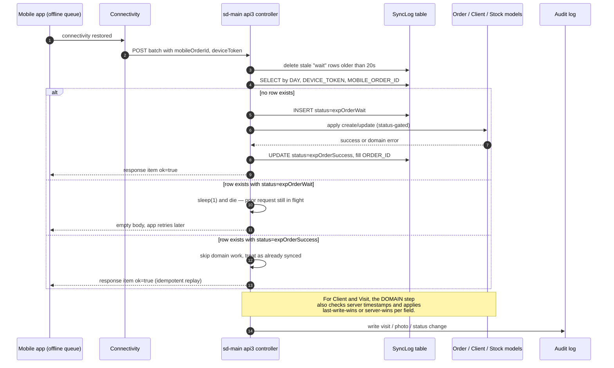

## Purpose

A field agent on a SalesDoctor mobile device routinely works offline. Visits are
logged, orders are written, photos are taken, and client edits are queued
locally. When the phone re-establishes connectivity, the agent's queue is
flushed to the server through the `api3` HTTP endpoints. By the time the queue
flushes, the same entities may have moved on the server side: an office user
may have edited the same client, another agent may have already shipped from
the same stock, or the same mobile-generated order ID may already exist
because an earlier retry already landed.

This flow documents how the sync layer detects those collisions, which side
wins for each entity, where the idempotency record lives, and what an operator
or support engineer can do when the automatic resolution is not what the
business wants.

## Projects and modules involved

| Project / Module | Role in this flow | Key file path |
| --- | --- | --- |
| sd-main / `api3` | Receives mobile batch POSTs, runs the dedup check, applies the change | `protected/modules/api3/controllers/OrderController.php` |
| sd-main / `api3` | Expeditor delivery confirmations and consignment edits | `protected/modules/api3/controllers/ExpeditorController.php` |
| sd-main / `api3` | Client create and client update from mobile | `protected/modules/api3/controllers/ClientController.php` |
| sd-main / `api3` | Auditor visit and photo posts | `protected/modules/api3/controllers/AuditorController.php` |
| sd-main / `sync` | Lightweight per-tenant sync helpers (config and lookups) | `protected/modules/sync/SyncModule.php` |
| sd-main / models | Idempotency journal keyed by device, day, mobile order ID | `protected/models/SyncLog.php` |
| sd-main / `orders` | Server-side order model and status machine | `protected/models/Order.php` |
| sd-main / `clients` | Client model that is the target of merge-style updates | `protected/models/Client.php` |
| sd-main / `stock` | Stock and lot models that gate fulfilment | `protected/models/StoreDetail.php` |
| sd-main / `audit` | Visit and photo write paths from mobile | `protected/models/Visit.php`, `protected/models/Photo.php` |

## End-to-end sequence

## The idempotency key

The compound key `(DAY, DEVICE_TOKEN, MOBILE_ORDER_ID)` is the only thing
standing between "agent retried" and "agent created two orders". The fields
come from these sources:

- `DAY` — server-side `date("Y-m-d")` at the moment the controller runs.
  Rolling over midnight resets the key space. A retry that crosses midnight
  is therefore treated as a new write — by design, because the mobile app is
  not expected to retry indefinitely across day boundaries without operator
  involvement.
- `DEVICE_TOKEN` — issued at login, persisted in the mobile keystore. It
  changes when the user logs out and back in, when the app is reinstalled,
  or when the user signs in on a different handset. All three of those
  scenarios are valid "fresh start" signals, which is why the token rotation
  is allowed to defeat dedup.
- `MOBILE_ORDER_ID` — a UUID-ish string generated on the device when the
  order, client, or visit is first created locally. The same value is sent
  on every retry of the same item, even across app restarts.

The `STATUS` column then narrates the lifecycle of one item:
`expOrderWait` while domain work is in progress, `expOrderSuccess` once the
domain write commits. The Order controller uses `success` instead of
`expOrderSuccess`, and the Client controller uses the literal `client`
string in `STATUS`; the controllers do not share a constant.

## Phase-by-phase narrative

1. **Queue flush.** The mobile app keeps an outbox of POST bodies per endpoint
   (`expeditor/save`, `order/save`, `client/save`, `auditor/visit`,
   `photo/upload`). When the radio comes back, each outbox is replayed in
   batches. Every item carries the same `deviceToken` (issued at login) and a
   client-generated `mobileOrderId` (or `client_id`, `visit_id`) that is stable
   across retries.

2. **Stale-row sweep.** Each controller opens by deleting rows from
   `sync_log` that match `(DAY, DEVICE_TOKEN, MOBILE_ORDER_ID)`, are older than
   20 seconds, and are not in the final `expOrderSuccess` / `success` state.
   This protects against orphan rows left behind by a network drop mid-write
   that would otherwise wedge future retries.

3. **Dedup lookup.** The controller selects from `sync_log` keyed by the same
   three columns. The result drives the branch:
   - **No row** — first time the server is hearing about this item. Insert a
     `expOrderWait` (or `success` for client/visit) row and proceed.
   - **`expOrderWait` younger than 120 seconds** — a previous request is still
     mid-flight. The handler `sleep(1)` and `die()` so the app retries shortly.
   - **`expOrderWait` older than 120 seconds** — the prior request died.
     Delete the wait row and treat as new.
   - **`expOrderSuccess` / `success`** — already applied. Skip domain work and
     return the success envelope. The mobile app sees `status: 1, ok: true`
     and clears the outbox entry.

4. **Domain write under guard.** When the controller crosses into the domain
   step, it re-checks server-side invariants before mutating:
   - For an order delivery, the server requires `Order.STATUS == 2` (waiting
     delivery). If a different expeditor or status is in place, the response
     is `status: 3` with a localized error message and the wait row is
     **kept** (so the app stops retrying and surfaces the error to the user).
   - For a client edit, the controller compares `Client.UPDATED_AT` to the
     `client.updatedAt` field from the mobile payload. Field-by-field merge:
     phone, address, GPS, and contact name are server-wins if the server
     timestamp is newer; everything else is last-write-wins.
   - For stock-affecting writes (delivery, defect, replace), `StoreDetail`
     re-reads current quantities under a transaction. A short stock condition
     yields `status: 3` and a "stock changed" error rather than committing a
     negative balance.

5. **Mobile-generated ID collision.** If the same `mobileOrderId` appears
   twice in the same `(deviceToken, day)` bucket, the `sync_log` row from the
   first call short-circuits the second. The order is never duplicated. If a
   different device replays the same client-generated ID — possible when a
   handset is restored from a backup — `sync_log` will not match (different
   `DEVICE_TOKEN`), and the second write creates a second order. Operator
   recovery for that case is described in **Failure modes** below.

6. **Two agents edit the same client.** The mobile flow that goes through
   `ClientController` writes `sync_log` with `STATUS=client` rather than the
   order statuses. The same `(DAY, DEVICE_TOKEN, MOBILE_ORDER_ID)` triple
   prevents double-apply within a single device. Conflicts across devices are
   resolved at field granularity using the server's `UPDATED_AT` column: an
   office edit that landed five minutes ago is preserved for fields that the
   office user actually touched, and the mobile payload only overwrites the
   fields it asserts.

7. **Photo upload retries.** Photo bodies go through `PhotoController` and are
   stored by content hash before they are linked to the visit. Re-sending the
   same photo bytes is therefore a no-op at the filesystem layer; the link
   row is upserted by `(VISIT_ID, PHOTO_HASH)`. A photo that arrives after the
   visit has been closed is rejected with a deterministic error so the app
   stops re-sending.

8. **Audit trail.** Every successful write also writes a normal audit-log row
   (created-by, updated-by, before/after) via the standard sd-main listeners.
   The `sync_log` row is the idempotency receipt and is **not** the audit
   record — do not delete it to "redo" a write, because that will let the
   next mobile retry double-apply.

## State changes

| Trigger | `sync_log.STATUS` | Server side | Mobile sees |
| --- | --- | --- | --- |
| First POST, no prior row | `expOrderWait` | row inserted, domain write in progress | nothing yet |
| Same POST retried within 120s | unchanged | early `die()`, no domain work | empty body, will retry |
| Domain write succeeds | `expOrderSuccess` | order row updated, audit row written | `ok: true, status: 1` |
| Domain write fails (status changed, no stock, expeditor swapped) | `expOrderWait` kept | no mutation | `status: 3, errors: [...]` |
| Same POST retried after success | `expOrderSuccess` | early return, no domain work | `ok: true, status: 1` |
| Client POST first time | `client` | client row inserted or merged | `ok: true` |
| Client POST replayed | `client` | early return, no merge | `ok: true` |
| Visit POST first time | `visit` (or controller-specific) | visit + photos linked | `ok: true` |
| Photo POST first time | n/a, dedup by file hash | photo stored, linked to visit | `ok: true` |
| Photo POST replayed | n/a | early return | `ok: true` |

## Failure modes and recovery

**Mobile order created twice under different device tokens.** Happens when a
handset is reflashed or restored from backup and the local outbox replays
against a freshly issued `DEVICE_TOKEN`. Both calls succeed and the dealer
ends up with two orders. Recovery: operator opens the orders list, identifies
the duplicate by `CREATED_AT` and `MOBILE_ORDER_ID`, and cancels the second
via the usual order-cancel path. The `sync_log` row for the cancelled order
is left in place so any further retry from the misconfigured device cannot
revive it.

**Sync wedged on a permanent domain error.** When the domain step refuses
the write (e.g. `Статус заказа изменен`), the `expOrderWait` row stays in
place and the mobile app keeps retrying because it never sees `ok: true`.
Recovery: support deletes the offending `sync_log` row by ID, the mobile app
retries, and the new attempt sees the current server state. If the business
still wants the mobile-side change to land, the operator first restores the
prerequisite server state (e.g. revert the order back to `STATUS=2`) before
deleting the wait row.

**Two agents edited the same client.** The merge is field-level, so usually
both sets of edits are kept. When two agents edit the same field, the later
write wins. Recovery: the audit log shows both edits and the operator can
manually apply the desired value through the office UI.

**Two agents shipped from the same lot.** The second `ExpeditorController`
write reads `StoreDetail` under a transaction and refuses to drive the
balance negative. The first agent's delivery completes; the second's order
returns `status: 3` and the agent re-collects from another lot. Recovery:
operator either reallocates stock to the failed order or returns the order
to "waiting" so it can be re-routed.

**Photo never lands.** Repeated photo POSTs that 5xx for hours are usually a
filesystem permissions or disk-full issue on the SD app, not a sync conflict.
Recovery: check `protected/runtime/application.log*` on the dealer instance,
fix the disk, and the next retry from the device clears the queue.

**`sync_log` table is huge.** Each successful write leaves a row. The table
should be partitioned or pruned by `DAY` on a schedule — typically a nightly
job keeps the last 30 days. Pruning rows older than the device's longest
expected offline window (usually 7 days) is safe because the device's own
outbox does not retain items longer than that.

**Force-resync from the operator UI.** The operator-facing "resend" action
on a mobile session deletes today's `sync_log` rows for one device and
flips a flag in the mobile app to re-flush the outbox. Use sparingly — it
is intended for cases where the device crashed mid-flush and the operator
knows the server state is clean.

**Manual merge.** When automatic field-level merge produces the wrong result
on a client record (e.g. office edited the address, mobile edited the phone,
but the office user did not realize the agent had also corrected the
address), the resolution is a manual edit through the office client form.
The audit log preserves the history; the merge logic does not retroactively
adjust.

**Cross-day retry.** A mobile device that holds an item in its outbox past
midnight will not match the previous day's `sync_log` row and will create a
duplicate. This is rare but real for SIM-roaming agents who lose connectivity
overnight in the field. Recovery is the same as the device-token rotation
case: cancel the duplicate manually. If your dealer routinely has agents
offline overnight, consider extending `sync_log` retention so the operator
can confirm whether a second write was the intended retry or a fresh order.

## Operator playbook

The support engineer's day-to-day for sync incidents is small but
predictable. The four most common runbooks:

1. **"My order didn't reach the office".** Find the device by agent ID,
   open today's `sync_log` rows. If the row is in `expOrderWait` and the
   timestamp is more than two minutes old, the domain write failed
   silently — check the application log for the matching `MOBILE_ORDER_ID`.
   Either the order status moved (e.g. cancelled in the office) or stock
   ran out. Restore the prerequisite and delete the wait row so the next
   mobile retry can land.

2. **"The same order shows up twice".** Confirm both rows belong to the
   same dealer, then compare `MOBILE_ORDER_ID` and `DEVICE_TOKEN`. If the
   tokens differ, the device was reflashed — keep the older order and
   cancel the newer. If the tokens are equal but the days differ, an
   overnight retry duplicated the write — same recovery.

3. **"Agent says the app keeps spinning on one order".** The app shows a
   spinner whenever the response body is empty. Empty body means the
   controller hit the `sleep(1)/die()` branch because the prior `expOrderWait`
   row is younger than 120 seconds. Wait two minutes and the next retry will
   either land or surface the actual error.

4. **"I edited a client and my edits vanished".** Open the audit log for
   the client and trace the timeline. Field-level merge means a later
   mobile write only overwrote the fields it asserts. The "missing" fields
   are usually still present, just on an earlier revision; reapply them
   manually.

## Glossary

- **Idempotency key** — the compound `(DAY, DEVICE_TOKEN, MOBILE_ORDER_ID)`
  identifier that lets the server recognize a replayed request.
- **`expOrderWait` / `expOrderSuccess`** — `sync_log.STATUS` values used by
  the Expeditor controller for the in-progress and committed states.
- **`success` / `client`** — the equivalent status values used by the Order
  and Client controllers respectively.
- **Last-write-wins (LWW)** — conflict policy where the most recent write
  overwrites prior values, judged by server-side timestamp.
- **Server-wins** — conflict policy where the server's existing value is
  preserved when both sides have changed.
- **Field-level merge** — applies LWW per field rather than per row, so two
  agents who edited disjoint fields both keep their edits.
- **Force-resync** — operator action that clears today's `sync_log` rows
  for one device and asks the mobile app to re-flush its outbox.

## See also

- [Sync module](/docs/modules/sync) — server-side sync helpers and the
  `sync_log` table reference.
- [api/v3-mobile Auditor endpoints](/docs/api/api-v3-mobile/auditor) — the
  auditor-facing entry points used by the audit team.
- [api/v3-mobile Expeditor endpoints](/docs/api/api-v3-mobile/expeditor) —
  the expeditor entry points referenced in this flow.
- [Visit lifecycle](/docs/concepts/visit-lifecycle) — how a visit moves from
  "started on phone" to "closed on server".
- [Trip lifecycle](/docs/concepts/trip-lifecycle) — how visits roll up into
  a daily trip the mobile app can flush.
- [Period close](/docs/concepts/period-close) — why some "stale" mobile
  writes get rejected even when `sync_log` allows them.
