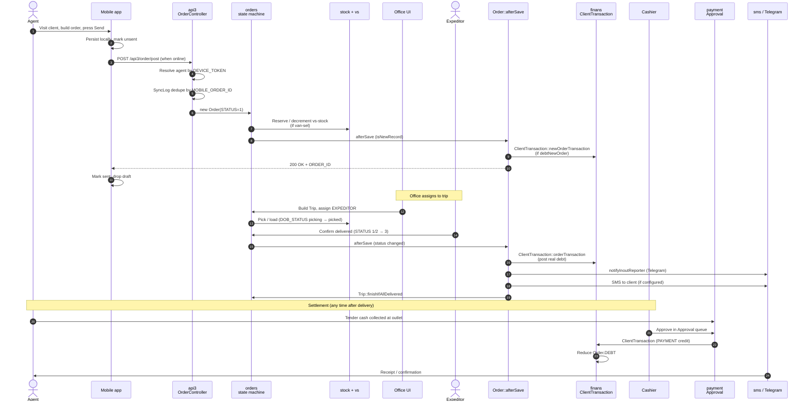

# Order end-to-end (sale to settled debt)

> **TL;DR** — One `Order` row travels through **seven modules** and **three apps** before the books are square. Mobile captures it, api3 syncs it, `orders` validates and reserves it, `stock`/`vs` deduct inventory, the expeditor flips it to delivered, `Order::afterSave()` fans out to `finans` (creating the debt) and the notification bots (telling the client), and `payment` finally closes the ledger when the cashier records the cash. Every state transition lives in exactly one place — this page traces them all.

## Purpose

A field agent walks into a retail outlet, opens the mobile app, scans the client, builds an order line-by-line from a price list, and presses **Send**. Twenty seconds later — or twenty hours later, if the agent was offline at an underground bazaar — the same order surfaces on the office screen, is folded into a delivery trip, leaves the warehouse on a van, gets handed to the client by an expeditor, and shows up as a row in the client's debt statement. When the client pays (in cash to the agent, or at the kassa, or by wire), the debt row is reduced; when fully paid, the order is done.

This page is the canonical reference for that journey. Every other flow doc on the site (online portal, Telegram bot, B2B api4) **forks off** this trunk — they all end up calling the same `orders` writes and the same `Order::afterSave()` fan-out. If you only read one cross-module page, read this one.

## Modules involved

| Module | What it does in this flow | Key file path |
| --- | --- | --- |
| `api3` (mobile sync) | Receives the order JSON from the agent's phone, de-duplicates by `MOBILE_ORDER_ID`, creates the `Order` row | `protected/modules/api3/controllers/OrderController.php` |
| `agents` | Resolves the agent identity by device token; determines `VAN_SELLING` mode (regular vs van-sel vs seller) | `protected/modules/agents/` |
| `orders` | Office-side state machine: edit, change status, cancel, reject, expeditor confirmation | `protected/modules/orders/controllers/` (Edit, OrderState, Expeditor) |
| `stock` | Warehouse stock balance; emits reservation entries on order create, deducts on ship | `protected/modules/stock/` |
| `vs` (van-stock) | Sub-warehouse tied to a van; van-sel agents post directly from van-stock instead of central stock | `protected/modules/vs/` |
| `finans` | Writes `ClientTransaction` rows (order debt, payment credit); produces client statement and agent PnL | `protected/modules/finans/` |
| `payment` | Cashier-side approval queue; converts pending tendered amounts into posted `ClientTransaction` payments | `protected/modules/payment/controllers/ApprovalController.php` |
| `sms` / notification | Sends inout-report Telegram messages and SMS on status transitions | `protected/modules/sms/`, `Order::notifyInoutReporter()` |

Cross-references — module deep dives: [orders](/docs/modules/orders), [stock](/docs/modules/stock), [vs](/docs/modules/vs), [finans](/docs/modules/finans), [payment](/docs/modules/payment), [sms](/docs/modules/sms), [agents](/docs/modules/agents). Concept pages: [trip lifecycle](/docs/concepts/trip-lifecycle), [payment lifecycle](/docs/concepts/payment-lifecycle), [visit lifecycle](/docs/concepts/visit-lifecycle). API: [api v3 mobile — order](/docs/api/api-v3-mobile/order).

## End-to-end sequence

## Phase-by-phase narrative

### Phase 1 — Order capture on mobile

**Who triggers:** the field agent, inside an active visit.

**What happens:** the mobile app builds an `Order` object locally — `CLIENT_ID`, `AGENT_ID`, `DATE`, an array of `OrderDetail` lines (product, price, quantity, unit, optional discount, optional bonus), free-text comment. The order gets a **client-side** `MOBILE_ORDER_ID` (monotonic per device) and is written to the device's offline draft store immediately, before any network call. The agent can keep building more orders while this one waits to sync.

**Where the state lives:** purely on the device. The server knows nothing yet. If the agent's battery dies before sync, the draft survives the next app launch.

See also: [tutorial — create an order on mobile](/docs/tutorials/create-order-mobile), [visit lifecycle](/docs/concepts/visit-lifecycle).

### Phase 2 — Offline-tolerant sync to api3

**Who triggers:** the mobile app's background sync, when it has connectivity.

**What happens:** the app `POST`s the order JSON to `api3/order/post`. `OrderController::actionPost` (`protected/modules/api3/controllers/OrderController.php`) does three things before it ever touches the `Order` model:

1. **Authenticates** by the `HTTP_DEVICETOKEN` header — `User::userByDeviceToken` → `Agent`.
2. **Deduplicates** by `MOBILE_ORDER_ID` against the `SyncLog` table. If a row already exists with `STATUS = success`, the server returns the previously assigned `ORDER_ID` without re-creating anything — this is what makes retries safe.
3. **Reserves a SyncLog slot** with `STATUS = wait`. Concurrent retries within a 120-second window short-circuit with `die()` so the same order is never double-inserted.

Only after these guards does the controller create the `Order` row (`STATUS = 1`, *New*), iterate the payload to insert each `OrderDetail`, and update the `SyncLog` row to `STATUS = success` with the freshly minted `ORDER_ID`.

**Where the state lives:** `{{order}}` table on the server, plus a `{{sync_log}}` row keyed by `(DEVICE_TOKEN, MOBILE_ORDER_ID, DAY)`.

API reference: [api v3 mobile — order](/docs/api/api-v3-mobile/order).

### Phase 3 — Server-side stock reservation

**Who triggers:** `Order::afterSave()` and `OrderDetail::updateLotDistribution()`, fired automatically on the new `Order` insert.

**What happens:** what gets reserved depends on the agent's selling mode (`Agent.VAN_SELLING`):

- **Regular agent (presale):** the order is a *promise to deliver later*. Central stock balance is **not** physically deducted yet — the office only sees a pending obligation. Lot management (if enabled) writes provisional lot distribution rows so FIFO/expiry tracking stays accurate.
- **Van-sel / seller agent:** the agent is selling **from the truck**. The order's lines are immediately deducted from that agent's van-stock (`{{vs}}`). If the van doesn't have enough, the validation in `EditOrderController::actionGetDetail` (and api3 equivalents) rejects the line before save.

The same `afterSave` hook calls `OrderReplace::changeStatus` and `BonusOrder::changeStatus` so any linked return-from-shelf, exchange, or bonus order rides along with the parent.

**Where the state lives:** `{{stock_log}}` (for central stock movements), `{{vs}}` (for van-stock balance), `{{lot_distribution}}` (when lot management is enabled).

See also: [stock module](/docs/modules/stock), [vs module](/docs/modules/vs).

### Phase 4 — Office processing and trip assignment

**Who triggers:** the operator (logistics coordinator) on the office web UI.

**What happens:** the office sees new orders on the *Orders* list (`orders/list`). For each order the operator:

1. Reviews and optionally edits via `EditController::actionIndex` — changing line quantities, applying a discount, switching the price type, swapping `STORE_ID`.
2. Picks a delivery date `DATE_LOAD` and an expeditor.
3. Adds the order to a Trip (see [trip lifecycle](/docs/concepts/trip-lifecycle)) — Trip stays `waiting` until dispatch.
4. Optionally moves the picking sub-status via `DOB_STATUS` (`picking` → `picked`) — warehouse staff use this to track preparation independent of the order's main `STATUS`.

When the trip is dispatched, the orders transition `STATUS = 1` (New) → `STATUS = 2` (Shipped). Inventory is now physically deducted from central stock.

**Where the state lives:** `{{order}}.STATUS` = 2, `{{order}}.DATE_LOAD` set, `{{trip}}` and `{{trip_orders}}` populated, `{{order}}.EXPEDITOR` and `{{order}}.TRIP_NUMBER` mirrored for legacy mobile queries.

See also: [orders module](/docs/modules/orders), [trip lifecycle](/docs/concepts/trip-lifecycle).

### Phase 5 — Expeditor delivery confirmation

**Who triggers:** the expeditor, on their app (`api3/expeditor*` or `api4` driver app).

**What happens:** the expeditor arrives at the client. The client signs, partial-accepts, or refuses. The expeditor flips one of three terminal sub-states:

- **Delivered in full** — `STATUS = 3` (Delivered). The order rides as-is.
- **Partial refusal** — the expeditor edits down `COUNT` and `SUMMA` for one or more lines, then sets `STATUS = 3`. The original quantities are preserved in `OrderHistory`.
- **Full refusal** — `STATUS = 5` (Cancelled) or a return is created against this order.

The save flows through `EditController` → `Order::save()` → `Order::afterSave()`. Because `oldStatus != STATUS` and `STATUS == 3`, `afterSave` also calls `Trip::finishIfAllDelivered($ORDER_ID)` — the moment every order on the trip is at 3 the trip auto-completes.

**Where the state lives:** `{{order}}.STATUS` = 3, `{{order}}.DATE_DELIVERED` set, `{{order_history}}` row appended.

### Phase 6 — Finans entry on delivery

**Who triggers:** `Order::afterSave()`, when the save isn't a new record and `Yii::app()->params['finans']` is enabled.

**What happens:** the hook reads `Agent.VAN_SELLING` and one of two server params:

- If `debtNewOrder` is set and agent is `VAN_SELLING` ∈ &#123;VANSEL, SELLER&#125;, **or** if `debtNewOrderAgent` is set globally — the debt was already written on insert (Phase 3). The delivery save just no-ops the finans branch (or refreshes if amounts changed).
- Otherwise (the regular presale case) — `ClientTransaction::orderTransaction($this)` posts a new debit row to the client's ledger for the delivered amount.

The hook also respects `startFinans` — orders older than that cutoff date are skipped (used during go-live migrations so historical orders don't double-count).

**Where the state lives:** `{{client_transaction}}` rows tagged `ORDER_ID = X` with debit-side amount = `Order.SUMMA - Order.DISCOUNT`. `Order.DEBT` is recomputed.

See also: [finans module](/docs/modules/finans), [payment lifecycle](/docs/concepts/payment-lifecycle).

### Phase 7 — Notifications fan-out

**Who triggers:** `Order::afterSave()` → `AfterResponse::run(...)` deferred block.

**What happens:** after the response has been flushed to the caller (so the mobile app sees a fast 200), the runtime executes three deferred jobs:

1. **OnlineOrder bridge** — if the original `Order` came from a portal/Telegram entry, `OnlineOrderController::onOrderChange` re-renders the client-facing state and pushes a Telegram update. See [online order flow](/docs/flows/online-order-fulfillment).
2. **InoutReporter** — `Order::notifyInoutReporter()` sends a Telegram message to each configured chat (supplier reporting bot, supervisor channels). Skipped during `BULK_STATUS_CHANGE` to avoid storms.
3. **SD integration** — `SDIntegration::sendOrder($ORDER_ID)` pushes the order to the external company (1C, ERP, accounting) if integration is wired.

SMS dispatch (when enabled at tenant level) piggybacks on `notifyInoutReporter` via the SMS module — the same chat-id resolution code is reused.

**Where the state lives:** outbound only. No DB write inside the hook beyond the audit row on a delivered SMS (`{{sms_log}}`).

See also: [sms module](/docs/modules/sms), [integration module](/docs/modules/integration).

### Phase 8 — Cash collected, payment approval, debt settled

**Who triggers:** the cashier, in the *Approval* queue (`payment/approval`).

**What happens:** cash flows back to the company along multiple paths:

- **Van-sel agent collected on the spot** — the agent records the payment on the mobile app at the time of sale; it lands in the cashier's *Approval* queue as **pending**.
- **Client paid at the kassa** — front desk creates the payment row directly.
- **Bank wire** — accounting imports via the reconciliation tool; arrives in approval queue.

`ApprovalController` (`protected/modules/payment/controllers/ApprovalController.php`) lets the cashier confirm or reject each row. Confirmation calls `ClientTransaction::paymentTransaction()` which writes a credit-side row in finans, recomputes the client's open balance, and reduces `Order.DEBT` for the orders that the payment is allocated against (FIFO by default, or explicit allocation if the operator selected specific orders).

When the cumulative credits against an order reach the order's `SUMMA`, the order is considered settled — there is no separate `STATUS` for *paid* (the order stays at 3, Delivered), but `Order.DEBT` is 0 and the order drops off the open-AR lists.

**Where the state lives:** `{{client_transaction}}` credit row, `{{order}}.DEBT` recomputed, `{{payment_approval}}` row updated.

See also: [payment module](/docs/modules/payment), [payment lifecycle](/docs/concepts/payment-lifecycle), [tutorial — approve payment as cashier](/docs/tutorials/approve-payment-as-cashier).

## State changes

| Phase | Order.STATUS | Stock state | Finans state | Payment state |
| --- | --- | --- | --- | --- |
| 1. Captured on mobile | n/a (no server row) | unchanged | unchanged | n/a |
| 2. Synced to server | 1 (New) | unchanged for presale; pending lot rows if lot mgmt on | depends on `debtNewOrder` flag — see Phase 3 | n/a |
| 3a. Van-sel reservation | 1 (New) | vs balance decremented | new debit row if `debtNewOrderAgent`/`debtNewOrder` | pending if agent collected cash |
| 4. Loaded onto trip | 2 (Shipped) | central stock decremented, DOB_STATUS picked | unchanged (no double post) | unchanged |
| 5. Delivered | 3 (Delivered) | stock state stable | debit row created (regular presale) or no-op (van-sel) | unchanged |
| 6. Cash approved | 3 (Delivered) | unchanged | credit row created, Order.DEBT reduced | row confirmed |
| 7. Fully paid | 3 (Delivered) | unchanged | Order.DEBT = 0 | nothing pending |
| Cancelled mid-flow | 5 (Cancelled) | stock returned, reservation released | reversal entries posted | none unless prepaid (refund path) |
| Partial refusal | 3 (Delivered, reduced amounts) | stock returned for refused lines | debit equals reduced sum only | as per phase 6 |

## Failure modes and recovery

**Mobile cannot reach the server (no network).** The order stays in the device draft store. The sync loop retries on every connectivity change. No data is lost because the `MOBILE_ORDER_ID` is local-monotonic and the server dedupes on it — the agent can sync at 2 PM tomorrow and the order arrives once.

**Sync succeeds at network layer but the server `Order::save` fails.** `SyncLog` row stays at `STATUS = wait` longer than 120 seconds, then gets garbage-collected on the next retry. The retry creates a fresh wait row, attempts the insert again. If the underlying validation error is persistent (e.g. price type withdrawn), the agent sees the failure in the app's *unsent* tray and edits or deletes the draft.

**Stock-out at office processing.** The operator either splits the order (delivers what is in stock, leaves the rest as a new order), or holds the order. Stock state stays where it was — no virtual deduction happens until a Trip carries the order out.

**Stock-out at van-sel time.** `EditOrderController::actionGetDetail` returns `left = $available` per line; the mobile app blocks the save. The agent has to drop the line or re-up the van at a vs-exchange before continuing.

**Expeditor cannot reach the client.** The order stays at `STATUS = 2` (Shipped) for the day, gets re-trip-assigned the next day, or gets cancelled by the operator. Stock that left the warehouse is parked on the truck — the next trip closes it out.

**Partial refusal.** Expeditor reduces the line quantities before flipping to 3. `OrderHistory` records the original amounts; `Order::afterSave` posts finans against the reduced sum; the refused inventory either rides back to the warehouse (becomes a return / write-up) or stays on the van for the next stop.

**Notification dispatch failure.** `notifyInoutReporter` errors are caught and reported via `ErrorReporter::sendMessage` — they never block the order save (it has already been committed before `AfterResponse::run` fires). SMS retries are handled by the sms module's own queue.

**Cashier approves the wrong amount.** Approval queue supports edit-before-confirm; if already posted, the operator creates a reversing `ClientTransaction` and reposts the correct amount. The original entry stays in finans for audit.

**Payment gateway timeout (online path).** This trunk doc deals with cash-only; for gateway timeouts see [online order fulfillment](/docs/flows/online-order-fulfillment).

**Refund.** A delivered order that has to be reversed (client complaint, defective product) becomes either a return-from-shelf (`TYPE = 2`) tied to the original `ORDER_ID` or a *cancellation* (`STATUS = 5`). Either path posts reversal entries to finans and, if money already flowed, queues a refund row on the payment side. See [defect vs reject states](/docs/concepts/defect-vs-reject) for the precise semantics.

## See also

- Modules: [orders](/docs/modules/orders), [stock](/docs/modules/stock), [vs](/docs/modules/vs), [finans](/docs/modules/finans), [payment](/docs/modules/payment), [sms](/docs/modules/sms), [agents](/docs/modules/agents), [integration](/docs/modules/integration)
- Concepts: [trip lifecycle](/docs/concepts/trip-lifecycle), [payment lifecycle](/docs/concepts/payment-lifecycle), [visit lifecycle](/docs/concepts/visit-lifecycle), [defect vs reject](/docs/concepts/defect-vs-reject), [bonus vs discount](/docs/concepts/bonus-vs-discount), [period close](/docs/concepts/period-close)
- API: [api v3 mobile — order](/docs/api/api-v3-mobile/order)
- Tutorials: [create order on mobile](/docs/tutorials/create-order-mobile), [create order on web](/docs/tutorials/create-order-web), [approve payment as cashier](/docs/tutorials/approve-payment-as-cashier), [register payment](/docs/tutorials/register-payment)
- Related flow: [online order fulfillment](/docs/flows/online-order-fulfillment)
