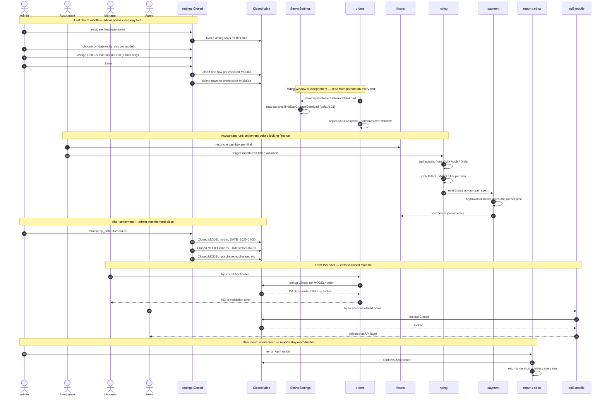

# Period close

Month-end is a coordinated cut-over across six modules. This page traces the choreography from the admin clicking **Save** on the Closed-day settings form to the new month's first agent visit.

## Purpose

At the end of every calendar month, the dealer must close the books. Orders older than the cut-off freeze: no edits to status, totals or lines are allowed. KPI evaluations are recomputed one last time and locked. Variable-pay bonuses are calculated against the locked KPI and posted to the payment journal. The next month opens with a clean balance carried forward.

The conceptual definition of what "closed" means lives in [Period close (concept)](/docs/concepts/period-close). This page is the *operational* trace — which module reads which flag, in what order, with what failure modes.

The same mechanism handles *rolling close* (every order older than N days is read-only, rolls forward daily) and *hard close* (admin pins a specific date or day, anything before it is permanently read-only). Both write to the same `Closed` table.

## Modules involved

| Module | What it does in this flow | Key file path |
|---|---|---|
| settings — Closed | The admin form that writes the `Closed` rows per-model | `protected/modules/settings/controllers/ClosedController.php` |
| Closed (model) | Per-model freeze record: MODEL, DATE, DAY, ROLES | `protected/models/Closed.php` |
| ServerSettings | Static helpers — `maxDaysBetweenDateAndDateLoad()` reads `limitDayChangeDateload` from per-tenant params | `protected/models/ServerSettings.php` |
| orders | Order edit, create, delete paths check `Closed` and the rolling window | `protected/modules/orders/controllers/EditController.php`, `OrdersController.php` |
| finans | Payments, expenses, cashbox movements check `Closed` | `protected/modules/finans/`, `protected/modules/clients/controllers/FinansController.php` |
| payment | Bonus payout, approval flow, posts the bonus journal | `protected/modules/payment/controllers/ApprovalController.php` |
| rating | Monthly KPI evaluation, freeze, bonus emission | `protected/modules/rating/` |
| report / sd-cs report | Period reports — re-readable because Closed is enforced | `protected/modules/report/`, sd-cs `modules/report/` |
| api3 (mobile) | Mobile order create blocked when the period is closed | `protected/modules/api3/controllers/OrderController.php` |
| commands | Cron jobs that run between months (lot, queue, order restore) | `protected/commands/LotCommand.php`, `OrderCommand.php`, `QueueCommand.php` |

## End-to-end sequence

## Phase-by-phase narrative

### Phase 1 — Pre-close housekeeping (last 2 or 3 days of month)

Before the admin locks anything, ops walks a checklist:

- Every agent has synced (no devices stuck offline). Mobile sync flow is in [sync flow QA](/docs/quality/mobile/sync-flow).
- Every order in pending status has been promoted or cancelled. Pending orders that stay in `STATUS = 1` get carried forward to the next month — they are not locked, only frozen if backdated.
- Every defect, return and replace is resolved. Defects on closed periods are rejected (see [Defect vs reject](/docs/concepts/defect-vs-reject)).
- Cashbox per filial is reconciled — payment receipts match `Order.PAID`.

The rolling-window check (`ServerSettings::maxDaysBetweenDateAndDateLoad`, default 21 days, sourced from `Yii::app()->params['limitDayChangeDateload']`) has been quietly rejecting edits more than 21 days back the whole month. The hard close is additive on top of that.

### Phase 2 — Settlement run (rating to payment to finans)

Before pinning the hard close, the accountant triggers month-end. Rating walks every active `Kpi` row whose `DATE_FROM..DATE_TO` covers the closing month:

- Pulls actuals from `Visit`, `Audit`, `Order`, `Finans`.
- For each `KpiTask`, picks the bonus tier — the highest `MARK..MARK7` threshold the actual exceeded.
- Writes the bonus amount on the task.

Payment then walks each agent's bonus total. `ApprovalController` (see `protected/modules/payment/controllers/ApprovalController.php`) gates the journal post — a second approver must sign. On approve, finans posts a cashbox-out movement on the payout date (typically the 10th of the following month).

The variable-pay journal post must complete *before* hard-close, because once finans is locked the journal cannot accept rows dated inside the locked window.

### Phase 3 — Hard close write (settings)

Admin opens `/settings/closed`. The form lets them set, per model:

- `by_date` — a specific cutoff date (e.g. 2026-04-30). Everything on or before is locked.
- `by_day` — a relative "N days back" (e.g. 30). Recomputed daily.
- `ROLES` — comma-separated roles that may still edit (typically only role 1 — admin).
- `DESCRIPTION` — free-text reason.

`ClosedController::actionIndex` iterates the seven canonical models:

- `order` — Sale: orders, replaces, returns
- `finans` — Cashbox: payments and expenses
- `purchase` — Warehouse: goods receipts
- `exchange` — Warehouse: stock transfers
- `corrector` — Warehouse: stock corrections
- `excretion` — Warehouse: write-offs
- `purchase_refund` — Warehouse: supplier returns

For each checked model it upserts a `Closed` row; for each unchecked model it deletes any pre-existing row. The table is per-filial — `Closed extends BaseFilial`.

### Phase 4 — Enforcement on edit paths

Every write-side controller that touches a closable model consults `Closed` before persisting:

- `orders/EditController` — `actionEdit`, `actionLines`, `actionStatus` all call `ServerSettings::maxDaysBetweenDateAndDateLoad()` first, then check `Closed.DATE` against the order's `DATE`.
- `orders/OrdersController` — the bulk-edit and bulk-status paths use `Yii::app()->params['limitDayChangeDateload']` directly with `time() - $accessTime` math.
- `clients/FinansController` and `clients/ShipperFinansController` — payment edit, refund.
- `finans/ConsumptionController` — expense entry.
- `payment/ApprovalController` — bonus journal.
- `onlineOrder/PaymentController` — partner-side payment.
- `api3/OrderController` — mobile order create or edit; rejection lands on the device as an API error.

If `Closed` rejects, the controller returns a validation error like *"Order is in closed period — cannot edit"*. Reports continue to read these rows; only writes are blocked.

### Phase 5 — Carry-forward

Pending orders (`STATUS = 1`) in the closing month *do not* get auto-closed. They:

- Stay in their original month for reporting (April pending order remains an April order).
- Are still editable for the limited subset of fields that do not break ledger consistency (e.g. delivery date), provided their `DATE` is inside the rolling window or the order's row is not yet covered by `Closed`.
- Get billed to the carry-forward bucket in the next month's opening balance.

Stock side: `LotCommand` cron runs between months to fold lots forward (see [Lot management concept](/docs/concepts/lot-management)).

### Phase 6 — KPI freeze

Once the hard close is in place, the rating module's monthly evaluation is final. The `Kpi` row is locked from the controller side — `KpiNewController` will refuse to re-evaluate a month whose `Closed.MODEL = order` row covers its `DATE_TO`. KPI exports (PDF, Excel) re-read the locked data and must be reproducible.

### Phase 7 — Bonus payout (payment journal posts to finans)

Whether bonus is paid on the last day of the closing month or in early next month depends on dealer policy. Either way, the journal posting must respect both:

- The `Closed.MODEL = finans` cutoff — payout date cannot fall before it.
- The rolling window — if more than 21 days have elapsed since the agent's accrual, manual override (admin role) is required.

### Phase 8 — Reports

`report` (sd-main) and sd-cs `modules/report/` re-read live rows on every page load. Period close does not create a snapshot — it relies on the absence of writes to make the data reproducible. A report for April run on May 1 and May 31 should return identical numbers; if they do not, something bypassed `Closed` (usually an admin override).

### Phase 9 — New month opens

No code path "opens" a month explicitly. The new month is simply the rows with `DATE` after the closure cutoff. The first agent visit on May 1 lands on a new `Visit` row (`PLANED = 1` via the planner cron) and the first order writes to `{{order}}` without consulting `Closed` (May is not covered).

## State changes

State of one Order row as the month closes around it, plus sibling-table states.

| Phase | Order row | Closed table | Kpi row | payment journal |
|---|---|---|---|---|
| 1 — open month | STATUS variable; editable | rows from last close | active for current month | not yet posted |
| 2 — settlement run | unchanged | unchanged | actuals computed, tier picked | pending approval |
| 3 — hard close write | unchanged | new rows: order, finans, purchase, etc. with DATE = 2026-04-30 | unchanged | unchanged |
| 4 — edit attempt | rejected at controller | row blocks the edit | unchanged | unchanged |
| 5 — pending carry-fwd | STATUS = 1; row kept in April | unchanged | unchanged | unchanged |
| 6 — KPI freeze | unchanged | unchanged | locked — no re-eval | bonus amount stable |
| 7 — bonus payout | unchanged | finans cutoff respected | unchanged | journal posted dated after cutoff |
| 8 — report re-run | unchanged | confirms April locked | unchanged | unchanged |
| 9 — new month | new May order writes freely | April rows still locked | new Kpi for May created | next month's bonus accrues |

State of the `Closed` row itself:

| Column | Example | Meaning |
|---|---|---|
| MODEL | order | Which model class the row freezes |
| DATE | 2026-04-30 | Hard date — on or before this is locked |
| DAY | 30 | Or, rolling — N days back from today |
| ROLES | 1 | Comma-separated role IDs that may still edit |
| DESCRIPTION | April hard close | Free-text reason |
| CREATE_AT, UPDATE_AT, CREATE_BY, UPDATE_BY | audit timestamps | who and when |

## Failure modes and recovery

### Period closed before all agents have synced

Same as the [Visit-to-KPI flow](./visit-to-kpi) failure mode — a device offline since the 28th uploads on the 2nd. The visits land on a closed Visit window but `Closed.MODEL = order` blocks any *order* writes dated in April. Audit-only payloads pass because `audit` is not on the seven-model list. Recovery: extend the close cutoff by a day or two, or accept the late visits will miss the KPI roll-up.

### Bonus journal cannot post — finans closed too early

If the admin sets `Closed.MODEL = finans` to 2026-04-30 *before* the bonus journal posts, `payment/ApprovalController` will fail validation. Recovery: open finans temporarily (delete the row), post the journal, re-create the row. Audit-trail is intact because both writes are stamped.

### Two close definitions disagree

The rolling window (per-tenant `limitDayChangeDateload`) and the hard close (`Closed` row) are independent. A 21-day rolling window plus an open `Closed` table means today minus 21 days is locked; a 60-day rolling window plus `Closed.DATE = 2026-04-30` means everything in April is locked but March is editable. Most dealers want both. Document the policy.

### Reports return different numbers on consecutive runs

If two consecutive runs of the same April report disagree, an admin has bypassed `Closed`. The admin path goes through controller code with role 1; the bypass is intentional but should be logged. Look at `Closed.UPDATE_BY` and the order's `UPDATE_AT` to identify what changed.

### Mobile app keeps trying to post a closed-period order

The mobile app does not have visibility into the dealer's `Closed` table. It keeps retrying on the next sync cycle. The agent sees a generic "sync failed" toast. Recovery: surface the close-date in the agent's app config so the device suppresses backdated submissions. Until then, ops resolves manually.

### KPI templates edited after close

If an admin edits a `KpiTaskTemplate` (changes a `MARK` threshold) *after* close, the live data still reads the new threshold but the locked `KpiTask` row keeps the old bonus amount — until somebody clicks "recalculate" and gets rejected by the `Closed` check. The system is consistent but confusing. Mitigation: lock template edits behind admin-only and document the rule that templates are versioned by date, not by edit.

### Period close not propagated to sd-cs

sd-cs read-replicas pull from sd-main but the `Closed` rows are per-filial. If a sd-cs report aggregates across filials whose close dates differ, the "April" total mixes locked and partially-open data. Recovery: filter sd-cs reports by *all filials closed* — or accept the lag.

### Forgetting purchase or exchange in the seven-model list

The Closed form covers seven models but stock adjustments via direct SQL (rare, admin-only) bypass it. Audit logs catch this if anyone is watching. Recovery: avoid direct SQL; route every write through the controllers.

## Timing — a typical month-end calendar

For a dealer running on rolling-21-day plus monthly hard close:

| Day | Event |
|---|---|
| -3 (28th of closing month) | Ops checklist starts; all field staff push final sync. |
| -2 (29th) | Reconcile cashbox per filial; resolve all pending defects. |
| -1 (30th) | Last day for agent visits to land in this month's KPI. |
| 0 (1st of next month) | Settlement run — rating evaluates KPI, payment emits bonus. |
| +1 (2nd) | Bonus journal approved by second approver. |
| +2 (3rd) | Hard close written — `Closed.MODEL = order, finans, purchase, exchange, corrector, excretion, purchase_refund` all pinned to the last day of the closing month. |
| +5 (6th) | Auditor spot-check; manager dashboard reviewed; any straggler corrections requested before lock. |
| +10 (11th) | Bonus payout day — finans cashbox-out movement posts. |
| +15 (16th) | Period reports distributed to HQ via sd-cs. |

Dealers vary — some close on the 1st and pay on the 10th, others close on the 5th and pay on the 15th. The mechanics are the same.

## Interaction with sync flow

The mobile sync flow (see [sync flow QA](/docs/quality/mobile/sync-flow)) does not consult `Closed`; it pushes all queued payloads as they come in. The server-side controller is the gate. This means:

- An agent's queued April-29 order, uploaded on May 4, lands cleanly *if* April is not yet hard-closed.
- The same payload uploaded on May 6 (after hard close) is rejected with a sync-error toast.
- Recovery: extend the hard-close cutoff window past the worst-case sync lag, or manually relax the close row for an hour to drain the queue, then re-close.

## See also

- [Period close concept](/docs/concepts/period-close) — what closed *means*.
- [Visit to KPI flow](./visit-to-kpi.md) — the upstream agent flow whose roll-up freezes here.
- [Defect vs reject](/docs/concepts/defect-vs-reject) — defect rules on closed periods.
- [KPI](/docs/concepts/kpi) — the bonus model that locks at close.
- [Lot management](/docs/concepts/lot-management) — stock carry-forward across months.
- [Settings module](/docs/modules/settings-access-staff)
- [Server toggles and period close — QA workflow](/docs/quality/settings/server-toggles-and-period-close)
- [Settlement — QA workflow](/docs/quality/finans/settlement)
- [Manual correction — QA workflow](/docs/quality/finans/manual-correction)
- Source files:
  - `protected/modules/settings/controllers/ClosedController.php`
  - `protected/models/Closed.php`
  - `protected/models/ServerSettings.php`
  - `protected/modules/orders/controllers/EditController.php`
  - `protected/modules/orders/controllers/OrdersController.php`
  - `protected/modules/payment/controllers/ApprovalController.php`
  - `protected/modules/rating/`
  - `protected/commands/LotCommand.php`, `OrderCommand.php`, `QueueCommand.php`
