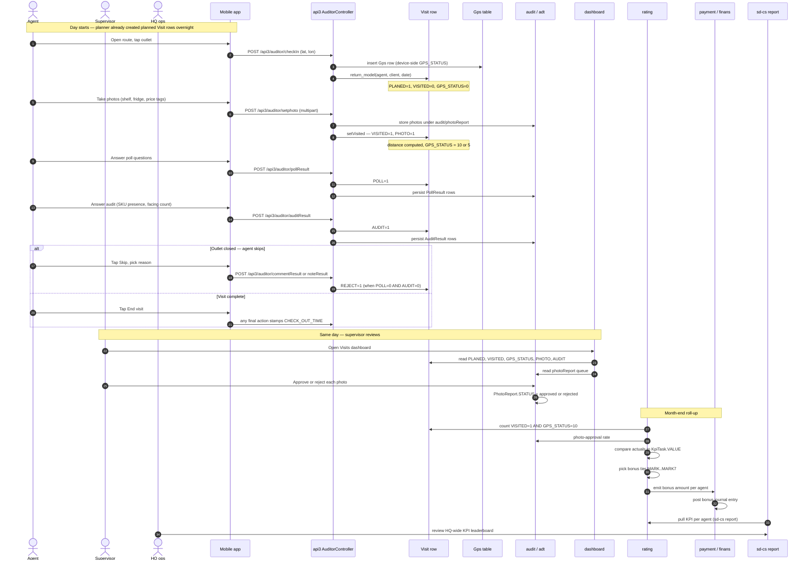

# Visit to KPI

This page traces one agent visit through every module that touches it, from the moment the agent taps "Start visit" on their phone to the moment the supervisor's KPI dashboard shows a green dot and the month's bonus calculation picks that visit up.

## Purpose

A field sales agent walks into an outlet. They tap **Start visit** in the mobile app, which captures GPS coordinates. They take audit photos (shelf, fridge, price tags), answer a poll about competitor SKUs, then tap **End visit** — or **Skip** with a reason if the outlet is closed. The visit row lands on the supervisor's dashboard. The supervisor reviews the photos, approves or rejects them. At month-end, the rating engine aggregates the visit counts, the AKB and OKB, the MML hit-rate and the photo-approval rate into each agent's KPI score. The score crosses one of seven bonus tiers and the payment module disburses the variable pay.

That is one user story; it touches six modules. This page maps every state change end-to-end.

## Modules involved

| Module | What it does in this flow | Key file path |
|---|---|---|
| api3 (Auditor) | Mobile endpoints for agent visit, audit, poll, photo upload | `protected/modules/api3/controllers/AuditorController.php` |
| Visit (model) | Per-day Visit row state machine, GPS_STATUS, outcome flags | `protected/models/Visit.php` |
| gps / gps2 / gps3 | Raw GPS pings, device-side GPS state on the Gps table | `protected/modules/gps/`, `protected/modules/gps2/`, `protected/modules/gps3/` |
| audit | Visit-audit forms, photo-report, poll-result web admin | `protected/modules/audit/controllers/` |
| adt | Auditor (supervisor) workspace, dashboards, store-check | `protected/modules/adt/controllers/` |
| dashboard | Supervisor live tiles and per-agent drill-down | `protected/modules/dashboard/` |
| rating | Per-month KPI templates, tasks and threshold tiers | `protected/modules/rating/` |
| payment / finans | Variable-pay calculation, bonus journal, settlement | `protected/modules/payment/`, `protected/modules/finans/` |
| sd-cs report | HQ-wide KPI roll-ups across all dealers | sd-cs `modules/report/` |

## End-to-end sequence

## Phase-by-phase narrative

### Phase 1 — Planner seeds the day (overnight cron)

Before the agent wakes up, `api/CronVisitController` has already walked the route plan and created one `Visit` row per agent and per planned client for today. Each row starts with `PLANED = 1`, `VISITED = 0`, `GPS_STATUS = 0`, no outcome flags. Auditor visits (role 11) get the same treatment from `VisitingAud`.

If the agent visits an outlet that wasn't on today's plan, `Visit::return_model` lazily creates an unplanned row (`PLANED = 0`) on first action.

### Phase 2 — Check-in (GPS captured)

Agent taps the outlet card. The mobile app calls `api3/AuditorController::actionCheckIn` with the device's lat/lon. This inserts a `Gps` row with the device-side state (0 off, 1 on, 2 denied, 3 bad network, 4 unknown, 5 not_accurate). It does **not** yet flip `VISITED` — that only happens when a productive action (photo, poll, audit, order) is submitted.

### Phase 3 — Photo upload (shelf, fridge, price tags)

Photos come in via `actionSetphoto`. Each photo lands in `audit/PhotoReport` storage with `STATUS = 0` (pending review). The first photo of the visit calls `setVisited`, which:

- Sets `VISITED = 1`.
- Sets `PHOTO = 1` on the visit row.
- Stamps `CHECK_IN_TIME` if empty.
- Writes the agent's `LON`/`LAT`.
- Computes `DISTANCE` from the outlet's pin.
- Sets `GPS_STATUS = 10` if distance is less than or equal to 100 m, otherwise `5`. (See [Visit lifecycle](/docs/concepts/visit-lifecycle) for the full GPS_STATUS table.)

This computation is sticky — once `DISTANCE` is non-empty, later actions do not re-compute it.

### Phase 4 — Poll and audit submission

The agent answers a poll (yes-or-no questions like "is competitor X on the shelf"). `actionPollResult` persists answers to `PollResult` and sets `POLL = 1` on the visit.

The agent then walks through the audit form (SKU presence per row in the MML, facings, price). `actionAuditResult` writes `AuditResult` rows and sets `AUDIT = 1`. The MML — the dealer's minimum-must-list — is the basis of the **MML hit-rate** KPI later.

### Phase 5 — Visit close or skip

The agent has two terminal moves:

- **End visit normally**: any subsequent payload updates `CHECK_OUT_TIME`. Nothing closes the row explicitly; "done" is just "no more actions".
- **Skip the outlet**: agent submits a reason via `actionCommentResult` or `actionNoteResult`. If `POLL = 0` AND `AUDIT = 0` at that moment, the code sets `REJECT = 1`. The visit still counts as "agent showed up" but produced no productive outcome.

`REJECT = 1` is not terminal — a later productive payload can clear it via `setVisited`.

### Phase 6 — Supervisor review (same day or next morning)

The supervisor opens the **adt Dashboard** (`adt/DashboardController`). The dashboard reads `PLANED`, `GPS_STATUS`, `AUDIT`, `PHOTO`, `REJECT` and renders a grid: green if `VISITED = 1 AND GPS_STATUS = 10`, amber if visited but distant, red if not visited.

Photos enter the **photo-report queue** (`audit/PhotoReportController::actionAjax`). For each photo the supervisor either approves (`STATUS = 1`) or rejects (`STATUS = 2`) with a reason. Rejected photos do not count toward the photo-approval rate.

Polls and audits with incorrect answers can be flagged via `audit/PollResultController` and `audit/AuditController`. These mark records but do not retract `VISITED`.

### Phase 7 — Daily and weekly roll-ups

`dashboard/` tiles and `adt/VisitReportController` join Visit to Audit and to PhotoReport to surface:

- visits planned vs visited vs not-visited
- AKB and OKB tiles (see [AKB](/docs/concepts/akb))
- MML hit-rate per agent
- photo-approval rate per agent and per outlet

These are live re-reads, not snapshots — they recompute on every page load.

### Phase 8 — Month-end KPI freeze (rating module)

At the end of the month, the supervisor opens the rating module. Each agent has a `Kpi` row plus several `KpiTask` rows (see [KPI](/docs/concepts/kpi)). For every task, rating reads the agent's actuals from the Visit-Audit join:

- Orders count, revenue
- AKB, OKB
- Visit %, GPS-trusted visit %
- MML hit-rate
- Photo-approval rate
- Defect %

Rating compares each actual to the seven thresholds on `KpiTaskTemplate` (`MARK..MARK7`), picks the matching bonus tier and writes the bonus amount.

Once the period is closed (see [Period close](/docs/concepts/period-close) and [`period-close.md`](./period-close.md)), KPI scores are locked.

### Phase 9 — Bonus payout (payment / finans)

Rating hands off to the **payment** module. Payment posts a bonus journal entry per agent, links it to a payroll batch, and finans reflects the cashbox movement on payout day.

### Phase 10 — HQ roll-up (sd-cs report)

The sd-cs read-replica pulls per-dealer KPI rows into HQ-wide leaderboards. HQ ops can drill from "Dealer X" to "Agent Y" to the underlying Visit-Audit join — but they cannot edit any of it, sd-cs is read-only.

## State changes

State of one Visit row as it moves through the day. Columns are the columns on the `Visit` table.

| Phase | PLANED | VISITED | GPS_STATUS | PHOTO | POLL | AUDIT | REJECT | Notes |
|---|---|---|---|---|---|---|---|---|
| 1 — planner seed | 1 | 0 | 0 | 0 | 0 | 0 | 0 | nightly cron |
| 2 — check-in (lat or lon only) | 1 | 0 | 0 | 0 | 0 | 0 | 0 | Gps row inserted, Visit unchanged |
| 3 — first photo | 1 | 1 | 10 or 5 | 1 | 0 | 0 | 0 | setVisited called; DISTANCE locked |
| 4a — poll submitted | 1 | 1 | 10 or 5 | 1 | 1 | 0 | 0 | POLL flag flips |
| 4b — audit submitted | 1 | 1 | 10 or 5 | 1 | 1 | 1 | 0 | AUDIT flag flips |
| 5a — normal end | 1 | 1 | 10 or 5 | 1 | 1 | 1 | 0 | CHECK_OUT_TIME stamped |
| 5b — skip with no poll or audit | 1 | 0 | 0 | 0 | 0 | 0 | 1 | REJECT flips |
| 6 — supervisor reviews | unchanged on Visit; PhotoReport.STATUS moves 0 to 1 or 2 |
| 8 — month-end freeze | unchanged on Visit; Kpi.STATUS may flip to locked, Closed row may cover the period |

Sibling-table states:

| Table | Phase | State |
|---|---|---|
| Gps | 2 | new row, device GPS_STATUS in 0..5 |
| PhotoReport | 3 | new row per photo, STATUS = 0 |
| PhotoReport | 6 | STATUS = 1 (approved) or 2 (rejected with reason) |
| PollResult | 4a | new rows per question |
| AuditResult | 4b | new rows per SKU |
| KpiTask | 8 | actual computed; bonus tier picked; row marked locked when period closes |
| payment journal | 9 | bonus journal posted |
| Closed | 8 | new row scopes the locked period (see Period close) |

## Failure modes and recovery

### KPI freeze runs before late-syncing agents upload their visits

A mobile device that lost connectivity mid-route uploads visits when it reconnects — possibly the next day. If the supervisor closes the period before that sync arrives, the late-arriving visits land on the *closed* month but are not counted for KPI.

Recovery options, in order of preference:

- Keep period close to a day or two after month-end so straggler sync has a window.
- If a visit lands on a closed period, file a manual KPI adjustment via the rating module's admin path (see [KPI](/docs/concepts/kpi)).
- Do not delete or re-post the visit; the original row is the audit trail.

### Distance gate flags a legitimate visit as untrusted (GPS_STATUS = 5)

`MIN_GPS_DISTANCE = 100 m` is hard-coded on `Visit.php`. Big-format outlets (warehouses, malls) routinely flag false positives. The supervisor cannot flip `GPS_STATUS` from 5 to 10 — there is no code path for it. Recovery is to adjust the client's lat or lon in the directory and wait for the next visit.

`isRequiredRadiusVisit` can *tighten* via per-agent `radius_visit`, but never widen.

### Photo rejected after the agent left the route

If a supervisor rejects a photo two days later, the agent cannot retake it from the closed visit. The visit's `PHOTO = 1` flag does not flip back to 0; only the photo-approval *rate* changes (rejected photos are excluded from the numerator). This is intentional — `VISITED` reflects "agent was there", `PhotoReport.STATUS` reflects "photo quality".

### REJECT racing a successful payload

`REJECT = 1` is not terminal. If a skip payload and a productive payload arrive in close succession, order matters. `setVisited` sets `REJECT = 0` on the productive path. If the productive payload is processed first and the skip arrives later, `REJECT` flips to 1 again. Recovery: re-submit any productive action; the supervisor sees the latest state.

### Period closed too early — settlement collides

If finance closes the period before the rating engine has run KPI, the bonus journal cannot post into the closed month. The payment module raises a validation error like "Order is in closed period — cannot edit" (similar pattern). Recovery: open the period (admin path), let rating complete, post the journal, close again.

### Supervisor approves a photo but did not check the metadata

Photos carry EXIF-stripped image data plus the visit's `CHECK_IN_TIME` and lat or lon. If the supervisor blindly approves without checking that lat or lon falls inside the outlet, an agent can game the photo-approval rate while staying far away (`GPS_STATUS = 5`). Mitigation is review process, not code — the `gps_visited` count on the dashboard separates trusted from suspect.

### KPI templates changed mid-month

If an admin edits a `KpiTaskTemplate` (changes a `MARK` threshold or a filter) mid-month, the change applies to all unevaluated agents immediately. There is no template versioning. Recovery: do not change templates mid-month; if it must happen, document the cut-over date in the rating notes.

### Auditor (role 11) visits a different table

Field auditors (`ROLE = 11` on `User`) are a separate population from sales agents (`ROLE = 4`). Their plan lives on `VisitingAud`, their visits get the same `Visit` row schema but with `ROLE = 11`. The supervisor's adt dashboard groups them separately. If an auditor visit gets misfiled under a sales agent (rare — happens when role flips mid-month), KPI counts double or zero on that agent. Recovery: re-stamp the visit's `ROLE` from the admin path; KPI re-runs after that.

### Photo upload races check-in

If the agent's device is offline at check-in but online at first photo, the photo upload is the one that runs `setVisited` and writes `DISTANCE`. The lat or lon on the photo upload payload is what the GPS-trust verdict is computed against — not the check-in lat or lon. If the agent moved between tap-check-in and first-photo (say, into the back of the store), the photo's pin may be a few metres different and the verdict may flip. There is no recovery path; the visit's `DISTANCE` is sticky after the first non-empty write.

### Audit form has no required-questions enforcement on the server

The mobile app validates that required questions are answered before submitting, but the server side accepts partial `AuditResult` rows. A jailbroken or out-of-date app can submit an audit with 1 of 30 questions filled in, set `AUDIT = 1`, and game the AUDIT outcome flag. The supervisor's audit review (`audit/AuditController::actionVisits`) is the catch — they read the `AuditResult` count per question. Mitigation: don't trust `AUDIT = 1` alone; KPI templates should also check `count(AuditResult) >= N`.

### Multiple supervisors approving photos

If two supervisors review the same photo queue concurrently, the last write wins. `PhotoReport.STATUS` is a single-row update with no optimistic locking. Recovery: assign one supervisor per outlet bucket, or accept the race. The audit trail (`UPDATE_BY`, `UPDATE_AT`) shows who decided last.

## Performance considerations

The Visit table grows by `agents × clients × days_per_month` rows per filial — for a mid-size dealer that is roughly 50 × 500 × 22 = 550 000 rows per month, plus PhotoReport at 5–10 photos per visit, plus AuditResult at 10–30 rows per visit. Reports that join Visit to AuditResult to PhotoReport must be indexed on `(DILER_ID, DATE)` and `(VISIT_ID)` respectively, otherwise the supervisor's daily dashboard times out by day 20 of the month. The rating engine's month-end run is the heaviest read in the system; schedule it overnight and serialize across filials.

## See also

- [Visit lifecycle](/docs/concepts/visit-lifecycle) — the GPS_STATUS state machine in detail.
- [Audit lifecycle](/docs/concepts/audit-lifecycle) — what a single audit form submission does inside a visit.
- [AKB](/docs/concepts/akb) — what counts as an active customer.
- [KPI](/docs/concepts/kpi) — the seven-tier bonus model.
- [Period close](/docs/concepts/period-close) — when the books lock.
- [Period close flow](./period-close.md) — month-end mechanics across modules.
- [audit and adt modules](/docs/modules/audit-adt)
- [rating module](/docs/modules/rating)
- [api3 mobile reference](/docs/api/api-v3-mobile/auditor)
- Source files:
  - `protected/modules/api3/controllers/AuditorController.php`
  - `protected/models/Visit.php`
  - `protected/modules/audit/controllers/PhotoReportController.php`
  - `protected/modules/adt/controllers/DashboardController.php`
  - `protected/modules/rating/`
  - `protected/modules/payment/`
