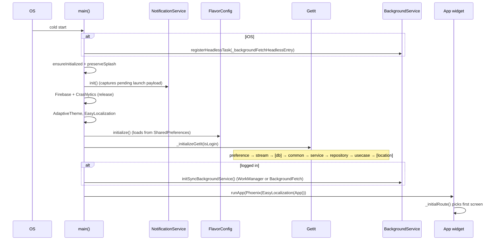
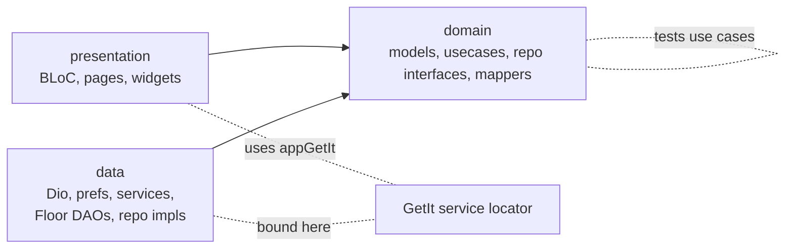

# Architecture

`app_salesdoctor_agent` is a Flutter mobile app for Sales Doctor's field agents. It follows **Clean Architecture** with three layers (`domain` ← `data`, `presentation` → `domain`) and a single, hand-wired `GetIt` service locator. This document covers the package layout, the DI module load order, the boot sequence, and runtime configuration (`FlavorConfig`).

## Package layout

```
lib/
├── core/                  # router, themes, notifications, future_handler, stream base
├── data/                  # Dio, prefs, services, Floor DB, repository_impls, errors
├── domain/                # models, repositories (interfaces), usecases, mappers, streams
├── presentation/          # BLoC-driven feature screens + widgets
│   ├── app.dart           # root widget, deep-link wiring, force-update flow
│   ├── application/di/    # all GetIt modules
│   ├── common/            # shared BLoC flows (search, selection, photo-view, bluetooth)
│   ├── features/          # 30+ feature modules
│   └── support/           # extensions, alert helpers, percentage calculator
├── utils/                 # standalone helpers
├── widgets/               # reusable widgets (133 files across 95 subfolders)
└── main.dart              # entry point
```

### Where new code goes

The CLAUDE.md orchestrator at the repo root has the authoritative table; the short version:

| What | Where |
|------|-------|
| New feature screens | `lib/presentation/features/<feature>/` |
| Business logic | `lib/domain/usecase/<feature>/` |
| API / DB calls | `lib/data/data_source/service/<feature>/` or `lib/data/repository_impls/<feature>/` |
| Domain models | `lib/domain/model/local/<feature>/` |
| Repository interface | `lib/domain/repositories/<feature>/` |
| Floor entity | `lib/data/data_source/database/entity/<feature>/` |
| Floor DAO | `lib/data/data_source/database/dao/<feature>/` |
| Mapper (entity → model) | `lib/domain/mapper/<feature>/` |

Layer rule: imports flow `presentation → domain ← data`. `domain` must not import `data` or `presentation`. `data` must not import `presentation`. Mappers in `domain/mapper/` are the one place that imports `data/.../entity/` to bridge the two — they belong to `domain` and convert entities **into** domain models.

## The DI container

GetIt is the only DI mechanism. The container is exposed as a top-level variable:

```dart
// lib/main.dart:28
GetIt appGetIt = GetIt.instance;
```

`appGetIt` is referenced from anywhere in the app (BLoCs, pages, services) as the single source of truth for object resolution. There is no `@injectable` codegen — every binding is hand-written in an extension method on `GetIt`.

### Module load order

`_initializeGetIt(bool isLoggedIn)` in `lib/main.dart:99-117` wires the modules in this strict order:

```dart
Future<void> _initializeGetIt(bool isLoggedIn) async {
  await appGetIt.preferenceModule();          // 1. SharedPreferences-backed wrappers
  await appGetIt.streamControllerModule();    // 2. cross-feature broadcast streams

  if (isLoggedIn) {
    await appGetIt.databaseModule();          // 3a. Floor SQLite + 90+ DAOs
    appGetIt
      ..commonModule()                        // 4a. DisplayErrorRepository
      ..serviceModule()                       // 5a. 4 Dio instances + 3 interceptors + 19 services
      ..repositoryModule()                    // 6a. 42 repository_impls
      ..useCaseModule()                       // 7a. 90+ use cases (factories)
      ..locationModule();                     // 8a. BackgroundLocationService, BackgroundGeoLocatorService
  } else {
    appGetIt
      ..commonModule()                        // 4b. (no DB, no location)
      ..serviceModule()
      ..repositoryModule()
      ..useCaseModule();
  }
}
```

The not-logged-in path skips `databaseModule()` and `locationModule()` — the database file may not exist yet (it's named per user, see `FlavorConfig.databaseName`), and location services would fail without a registered user.

### Module summary

| Module | File | Lifetime | Count | Notes |
|--------|------|----------|-------|-------|
| `preferenceModule()` | `di/data/preference/prefernce_module.dart` | `registerSingleton` | 15 prefs + `SharedPreferences` | Runs `UserDataMigration` mid-flight |
| `streamControllerModule()` | `di/presentation/stream_controller_module.dart` | `registerLazySingleton` | 14 controllers | Awaits `allReady()` at the end |
| `databaseModule()` | `di/data/database/database_module.dart` | `registerSingleton` for `AppDatabase`, `registerLazySingleton` for each DAO | 1 DB + ~90 DAOs | Calls `$FloorAppDatabase.databaseBuilder(...).addMigrations(...).build()` |
| `commonModule()` | `di/data/common/common_module.dart` | `registerLazySingleton` | 1 (`DisplayErrorRepository`) | |
| `serviceModule()` | `di/data/service/service_module.dart` | `registerSingleton` for Dio + interceptors, `registerLazySingleton` for services | 4 Dio + 3 interceptors + 19 services | Named-instance Dio (`local`, `server`, `printer`, `route`) |
| `repositoryModule()` | `di/data/repository/repository_module.dart` | `registerLazySingleton` | 42 | |
| `useCaseModule()` | `di/domain/usecase/use_case_module.dart` | `registerFactory` (one exception: `ReviseReportUseCase` is `registerLazySingleton`) | 90+ | Factories so each call site gets a fresh instance |
| `locationModule()` | `di/presentation/location_module.dart` | `registerLazySingleton` | 2 | `BackgroundLocationService`, `BackgroundGeoLocatorService` |

### Convention: when to use which lifetime

- **`registerSingleton`** — heavy objects with internal state that must be shared: `AppDatabase`, `SharedPreferences`, the four `Dio` instances, the three Dio interceptors, all `*Preference` classes.
- **`registerLazySingleton`** — stateless or repository-style objects whose first construction can be deferred: every `*Repository`, every DAO, every `*StreamController`, `DisplayErrorRepository`.
- **`registerFactory`** — use cases. Each consumer (a BLoC, typically) gets its own instance so accidental shared state between unrelated features is impossible.

## Boot sequence

`main()` in `lib/main.dart:39-93`:

1. **iOS-only**: `bg.BackgroundFetch.registerHeadlessTask(_backgroundFetchHeadlessEntry)` — `main.dart:39-43`. Wrapped in try/catch in case of double-registration.
2. `WidgetsFlutterBinding.ensureInitialized()` + `FlutterNativeSplash.preserve(...)` — keeps the splash up while we wire DI.
3. `NotificationService.instance.init()` — `main.dart:48`. Must happen before everything else so a cold-start notification tap is captured into `_pendingPayload`.
4. **Release-only**: `Firebase.initializeApp()` + `FlutterError.onError = FirebaseCrashlytics.instance.recordFlutterFatalError` — `main.dart:50-52`.
5. System UI styling — transparent status bar with dark icons.
6. `AdaptiveTheme.getThemeMode()` — preload the persisted theme.
7. `EasyLocalization.ensureInitialized()` — bootstraps the `assets/translations/` loader.
8. `SystemChrome.setPreferredOrientations([portraitUp])` — app is portrait-locked.
9. `FlavorConfig.initialize()` — loads from `SharedPreferences` (see below).
10. `initialiseApp(FlavorConfig.isLogin)` → `_initializeGetIt(isLoggedIn)`.
11. **Logged-in only**: `initSyncBackgroundService()` — `main.dart:70-74`. Schedules the periodic sync-reminder WorkManager task on Android / configures BackgroundFetch on iOS. See [07-synchronize](./07-synchronize.md).
12. `FlutterNativeSplash.remove()`.
13. `runApp(Phoenix(child: EasyLocalization(... child: App(savedAThemeMode))))` — the app tree.

### Sequence diagram



## `FlavorConfig` — runtime configuration

`lib/data/utils/flavor/flavor_config.dart` is the global runtime configuration façade. Despite the name, it is **not** a build-flavor mechanism (there is no `--flavor dev|staging|prod`). Instead, it loads dynamic values from `SharedPreferences` at startup and exposes them as static getters.

```dart
// lib/data/utils/flavor/flavor_config.dart:21-29
static Future<void> initialize() async {
  if (!_initialized) {
    final sharedPreferences = await SharedPreferences.getInstance();
    _flavorValues = await FlavorValues.fromEnvironment(sharedPreferences);
    baseUrlInterceptor = BaseUrlInterceptor(baseUrl: _flavorValues.apiBaseUrl);
    _initialized = true;
  }
}
```

Static getters available everywhere:

| Getter | Source | Used for |
|--------|--------|----------|
| `FlavorConfig.apiBaseUrl` | `AuthPreferenceKeys.baseUrl` | injected into the `local` Dio instance via `BaseUrlInterceptor` |
| `FlavorConfig.isLogin` | `AuthPreferenceKeys.isLogin` | gates DB/Location modules, gates background sync init, gates `_initialRoute()` |
| `FlavorConfig.isNewDay` | computed from `SyncPreferenceKeys.lastSyncTime` | forces a full sync on day boundary |
| `FlavorConfig.hasUsers` | `UserDataPreferenceKeys.userList` is non-empty | first-launch detection (sends user to `CheckSeverRoute`) |
| `FlavorConfig.databaseName` | `AuthPreferenceKeys.databaseName` | per-user Floor DB filename |
| `FlavorConfig.token` | `AuthPreferenceKeys.token` | injected by services that need an auth header |
| `FlavorConfig.langCode` | `LanguagePreferenceKeys.applicationLanguage` (default `ru`) | injected into `Accept-Language` by `LanguageInterceptor` |

Setters (`updateApiBaseUrl`, `updateDatabaseName`, `updateToken`, `updateIsLogin`, `updateLastSyncTime`, `updateLanguage`) write through to `SharedPreferences` and update the cached values; `updateApiBaseUrl` also updates the `BaseUrlInterceptor` instance so existing Dio clients pick up the change without re-registration.

### `FlavorConfig.isNewDay`

Computed in `lib/data/utils/flavor/flavor_values.dart:38-51` via `DateFormatter.isNewDay(lastSyncTime)`. Read at boot to decide whether `_initialRoute()` sends the user straight to `SynchronizeRoute` for a forced full sync. Updated by `updateLastSyncTime()` (called from `SynchronizeBloc` once a sync completes).

## What lives in `lib/core/`

Cross-cutting utilities used by all layers:

- `core/router/` — `AppRouter`, route guards, generated `app_router.gr.dart` (see [04-presentation-layer](./04-presentation-layer.md))
- `core/theme/` + `core/themes/` — `AppThemeData.lightTheme`, `darkTheme`, color palettes
- `core/handler/future_handler.dart` — the `.initFuture().onStart().onSuccess().onError().onFinished().executeFuture()` pipeline used by every BLoC (see [04-presentation-layer](./04-presentation-layer.md))
- `core/stream/controller/base_stream_controller.dart` — base class for the 14 cross-feature stream controllers (see [06-streams-and-cross-feature](./06-streams-and-cross-feature.md))
- `core/notification/notification_service.dart` — `NotificationService` singleton + `NotificationPayload` constants
- `core/notification/sync_reminder_worker.dart` — top-level WorkManager / BackgroundFetch entry points (see [07-synchronize](./07-synchronize.md))
- `core/assets/` — asset paths

## Layer cheat sheet



Reading order from here:

- For an HTTP/SharedPreferences/services tour → [02-data-layer](./02-data-layer.md)
- For business logic, models, use cases, mappers → [03-domain-layer](./03-domain-layer.md)
- For BLoC patterns, pages, AutoRoute, FutureHandler → [04-presentation-layer](./04-presentation-layer.md)
- For the Floor schema and migrations → [05-database](./05-database.md)
- For sync (the central feature) → [07-synchronize](./07-synchronize.md)
