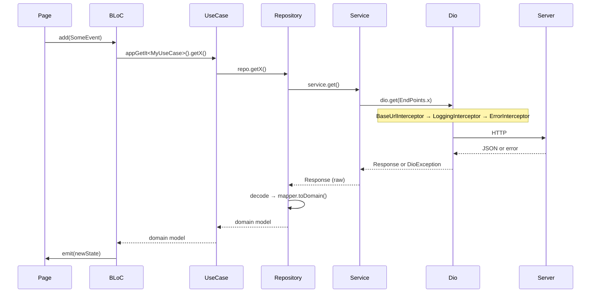

# Data layer

Everything under `lib/data/` is the data layer: HTTP clients (Dio), SharedPreferences wrappers, services, Floor DAOs, and repository implementations. The data layer has no knowledge of `presentation/`; it depends on `domain/` only to fulfill its abstract `Repository` contracts.

```
lib/data/
├── constants/         # 3 files: end_points.dart, rest_query_keys.dart, assets_app_icons.dart
├── data_source/
│   ├── database/      # Floor entities, DAOs, views, type converters, migrations
│   ├── error/         # base AppException types
│   ├── exception/     # client-specific exception types
│   ├── preference/    # 14 typed SharedPreferences wrappers + keys/
│   ├── provider/      # Dio factories + interceptors
│   └── service/       # 25 directories of pure Dio wrappers
├── error/             # network exception subtypes
├── repository_impls/  # 32 *RepositoryImpl files
├── service/           # additional non-Dio services (routing)
└── utils/             # extensions, flavor, logger, notification, parser
```

For the Floor database specifically, see [05-database](./05-database.md). This doc covers the rest.

## Dio: four named instances

`service_module.dart` registers four named Dio singletons, each pointing at a different backend. Consumers resolve them by name:

```dart
appGetIt<Dio>(instanceName: localDio)
```

Name constants live in `lib/presentation/application/di/data/service/service_module.dart:36-39`:

```dart
const String serverDio = "server";
const String localDio = "local";
const String printerDio = "printer";
const String routeDio = "route";
```

| Instance | Base URL source | Defined in | Used by |
|----------|-----------------|------------|---------|
| `localDio` | `FlavorConfig.apiBaseUrl` (mutable) | `lib/data/data_source/provider/dio/local_dio.dart:13-43` | almost every service (auth, client, order, payment, …) |
| `serverDio` | hardcoded `https://server.salesdoc.io/` | `lib/data/data_source/provider/dio/server_dio.dart:12-40` | `ServerService` (server discovery / first-run check) |
| `printerDio` | hardcoded `https://billing.salesdoc.io/` | `lib/data/data_source/provider/dio/printer_dio.dart:10-40` | `PrinterService` (thermal print receipts) |
| `routeDio` | hardcoded `https://api.routexl.com/` | `lib/data/data_source/provider/dio/route_dio.dart:10-37` | `RouteService` (RouteXL route optimization) |

### Interceptor stack

Every Dio gets the `ErrorInterceptor` (so HTTP errors become `AppNetworkException` subtypes uniformly across all backends). The other interceptors vary:

| Interceptor | localDio | serverDio | printerDio | routeDio |
|-------------|----------|-----------|------------|----------|
| `LogInterceptor` (Dio's built-in, debug only) | ✓ | ✓ | ✓ | ✓ |
| `BaseUrlInterceptor` | ✓ | ✗ | ✗ | ✗ |
| `LoggingInterceptor` (file-based) | ✓ | ✗ | ✓ | ✓ |
| `ChuckerDioInterceptor` (debug only) | ✓ | ✓ | ✓ | ✗ |
| `ErrorInterceptor` | ✓ | ✓ | ✓ | ✓ |

All four instances set 60-second timeouts (connect, send, receive).

### `BaseUrlInterceptor`

`lib/data/data_source/provider/dio/interceptor/base_url_interceptor.dart`

```dart
@override
void onRequest(RequestOptions options, RequestInterceptorHandler handler) {
  options.baseUrl = baseUrl;
  handler.next(options);
}

void updateBaseUrl(String newBaseUrl) {
  baseUrl = newBaseUrl;
}
```

Singleton stored on `FlavorConfig.baseUrlInterceptor`. `FlavorConfig.updateApiBaseUrl(...)` updates both the persisted preference and `interceptor.baseUrl`, so existing `Dio` clients pick up the new URL on the very next request — no re-registration needed. This is how the login flow swaps to the correct tenant server.

### `LanguageInterceptor`

`lib/data/data_source/provider/dio/interceptor/language_interceptor.dart`

```dart
@override
void onRequest(RequestOptions options, RequestInterceptorHandler handler) {
  options.headers['Accept-Language'] = langCode;
  handler.next(options);
}

void updateLangCode(String newLangCode) {
  langCode = newLangCode;
}
```

Note: `localDio` and `printerDio` set `Accept-language` in their default headers via `FlavorConfig.langCode` at construction time. `LanguageInterceptor` is the runtime-mutation path used when the user changes language without restarting.

### `ErrorInterceptor`

`lib/data/data_source/provider/dio/interceptor/error_interceptor.dart:50-144`

Three branches in `onError`:

1. **Connection errors** (`DioExceptionType.connectionError`, `connectionTimeout`, `sendTimeout`, `receiveTimeout`): wrap as `AppNetworkConnectionException` with `statusCode: 0`.
2. **HTTP errors** (any `response.statusCode`): map via `_getMessageForStatusCode(...)` → wrap as `AppNetworkHttpException`.
3. **Fallback**: `AppNetworkHttpException` with `statusCode: 0`.

For 401 and 402, the interceptor also fires global callbacks on `DisplayErrorRepository`:

```dart
case 401:
  displayErrorRepository.onUnauthorizedError('message_not_authorization'.tr());
  return 'message_not_authorization'.tr();
case 402:
  displayErrorRepository.onPaymentRequiredError('message_payment_required_error'.tr());
  return 'message_payment_required_error'.tr();
```

`App.setUpErrorListener` (in `lib/presentation/app.dart`) subscribes to those callbacks and forces a navigation to `CheckSeverRoute` after clearing local state. See [09-error-handling](./09-error-handling.md) for the full pipeline.

### `LoggingInterceptor`

`lib/data/data_source/provider/dio/interceptor/logging_interceptor.dart`

Writes plain-text logs to two daily files inside `getApplicationDocumentsDirectory()`:

- `network_logs_YYYY-MM-DD.txt` — every request/response
- `tracking_logs_YYYY-MM-DD.txt` — only requests whose path contains `api4/create/gps`

Each file gets a session header on first write of the day with timestamp, username (from `UserDataPreference`), and device model. Login requests are redacted (passwords never hit disk). FormData base64 payloads longer than 500 chars are replaced with a `[redacted, N bytes]` placeholder. On every startup the interceptor deletes log files older than 7 days.

Useful for field debugging — agents can pull the file off the device when something misbehaves offline. Live in production, not gated by `kDebugMode`.

## Preferences

Every `SharedPreferences` access goes through a typed wrapper. 14 wrappers live under `lib/data/data_source/preference/`, each in its own folder with a sibling `keys/<name>_preference_keys.dart` file holding the string keys.

Registered in `lib/presentation/application/di/data/preference/prefernce_module.dart`:

| Class | Stores |
|-------|--------|
| `AuthPreference` | `userName`, `baseUrl`, `token`, `isLogin`, `databaseName` |
| `UserDataPreference` | current user list + active user |
| `HomePreference` | home-screen filter state |
| `ConfigPreference` | server-driven feature config flags |
| `SyncPreference` | `lastSyncTime`, `syncRequiredHours`, `syncFromTime`, `syncToTime`, `syncBanned`, `syncOrdersLimitReached`, `lastSyncReminderTime` |
| `DiscountStatusPreference` | per-client discount-toggle state |
| `LanguagePreference` | `applicationLanguage` (`ru`/`uz`) |
| `ThemePreference` | light/dark/system |
| `VersionDataPreference` | last update-check timestamp + dismissed-recommend-version |
| `PrinterPreference` | last paired Bluetooth printer |
| `ProductFilterPreference` | product list filter state |
| `CheckInOutPreference` | active check-in/out session |
| `SettingsPreference` | misc user settings |
| `RoutePreference` | last calculated route |

### Wrapper pattern

`lib/data/data_source/preference/auth/auth_preference.dart`:

```dart
class AuthPreference {
  final SharedPreferences _prefs;
  AuthPreference(this._prefs);

  String getToken() => _prefs.getString(AuthPreferenceKeys.token) ?? "";
  void setToken(String token) => _prefs.setString(AuthPreferenceKeys.token, token);
  Future<void> changeToken(String token) async =>
      await _prefs.setString(AuthPreferenceKeys.token, token);

  Future<void> clear() async {
    final keys = [
      AuthPreferenceKeys.userName, AuthPreferenceKeys.baseUrl,
      AuthPreferenceKeys.token, AuthPreferenceKeys.isLogin,
      AuthPreferenceKeys.databaseName,
    ];
    for (var key in keys) {
      await _prefs.remove(key);
    }
  }
}
```

Keys live in a sibling file so no caller ever types a magic string:

```dart
// lib/data/data_source/preference/auth/keys/auth_preference_keys.dart
class AuthPreferenceKeys {
  static const String userName = "user_name";
  static const String baseUrl = "base_url";
  static const String token = "token";
  static const String isLogin = "is_login";
  static const String databaseName = "database_name";
}
```

Every preference class follows this shape: nullable getters with safe defaults, void setters, and sometimes an async `change*` variant for cases that need to await the disk write.

`prefernce_module.dart` also runs a one-shot `UserDataMigration(...).migrateUserData()` mid-registration — a historical fix to reshape an older preference layout.

## Services

`lib/data/data_source/service/` holds 25 service directories. Each service is a thin Dio wrapper — pure HTTP calls, no business logic, no caching, no state. The repository layer composes services + DAOs + mappers; services themselves do nothing fancy.

Service directories:

`auth`, `balance`, `client`, `common`, `debtor`, `exchange`, `inventor`, `kpi`, `location`, `oddment`, `order`, `payment`, `photo`, `pricetype`, `printer`, `product`, `refund_based_order`, `report`, `revise`, `route`, `server`, `tara`, `task`, `vsorder`, + a `client_check_in_out`.

Registered in `lib/presentation/application/di/data/service/service_module.dart:72-167` as `registerLazySingleton`. Each service constructor takes the correct Dio by name:

```dart
// service_module.dart:131-133
registerLazySingleton<OrderService>(
  () => OrderService(dio: get<Dio>(instanceName: localDio)),
);
```

### Service shape

`lib/data/data_source/service/auth/auth_service.dart`:

```dart
class AuthService {
  final Dio dio;
  AuthService({required this.dio});

  Future<Response> login({
    required String username,
    required String password,
    required String lang,
    required String deviceModel,
    required String deviceId,
  }) {
    LoginRequest loginRequest = LoginRequest(
      login: username, password: password,
      app: "agent", deviceModel: deviceModel, deviceId: deviceId,
    );

    return dio.post(
      EndPoints.login,
      data: loginRequest.toJson(),
      queryParameters: {RestQueryKeys.lang: lang},
    );
  }
}
```

Returns the raw `Future<Response>` from Dio. Status-code handling already happened in `ErrorInterceptor`. The calling repository decodes the JSON, validates fields, and converts to a domain model.

### Endpoints and query keys

All paths are centralized in `lib/data/constants/end_points.dart` (sealed class — uninstantiable):

```dart
sealed class EndPoints {
  static int apiVersion = 3;
  static int apiVersion2 = 2;

  static String checkServer = "https://server.salesdoc.io/api/add?code=";
  static String login = "/api4/login";
  static String discountInfo = "/api3/discount/?u=agent";
  static String photoCategoryInfo = "/api3/photo/category/?u=agent";
  static String priceTypes = "/api4/catalog/priceTypes";
  static String kpi = "/api4/kpi/agent?";
  static String imageUrl = "/api4/catalog/productImage?id=";
  // …
}
```

Multiple API versions coexist (`/api3/...` and `/api4/...`) — the backend kept the old paths live while migrating callers. Query parameter names live in `lib/data/constants/rest_query_keys.dart`.

## Repository implementations

`lib/data/repository_impls/` contains 32 directories of `*RepositoryImpl` classes. Each implements an interface from `lib/domain/repositories/...` and composes services + DAOs + preferences + mappers.

Registered in `lib/presentation/application/di/data/repository/repository_module.dart` (lines 85-544) as `registerLazySingleton`. 42 repositories in total — slightly more than the file count because some files declare more than one repository (e.g. `client/` has `ClientRepository`, `PendingClientRepository`, `ClientDetailRepository`, `ClientBalanceRepository`, `ClientCheckInOutRepository`).

### Composition

`lib/data/repository_impls/client/client_repository_impl.dart` is the heaviest in the codebase. Its constructor takes 36 dependencies:

- 1 service (`ClientService`)
- 4 preferences (`AuthPreference`, `UserDataPreference`, `SettingsPreference`, `ConfigPreference`)
- 31 DAOs covering client data, orders, payments, tasks, inventory, photos, oddments, tags, classes, config tables…

Streaming queries combine Floor's `Stream<EntityRelation?>` with mapper extensions via `.asyncMap`:

```dart
@override
Stream<Client> observeGetClient(String clientId) {
  return clientDao
      .observeGetClientInfoById(clientId)
      .asyncMap((event) => event != null ? event.toClient() : Client.empty());
}
```

`observe*` methods return `Stream<DomainModel>`. BLoCs subscribe to those streams for reactive UX — when any other code path inserts/updates the underlying entity row, the stream emits a fresh mapped model and the UI rebuilds.

Repositories may also expose `_cached*` in-memory lists for hot paths (e.g. `ClientRepositoryImpl._cachedClients`) — useful when the list page wants to filter without going back to SQLite on every keystroke.

### Sync flag

Many repositories expose `send*()` methods that follow the pattern:

```
get rows where is_sync = 0  →  POST to server  →  on success, mark is_sync = 1 (or delete)
```

`isSync` is a column on most write-side entities. See [05-database](./05-database.md) §"Sync contract" and [07-synchronize](./07-synchronize.md) for the full picture.

## Mappers

Mappers live in `lib/domain/mapper/` (one folder per feature, 37 in total). They're physically in `domain/` because they produce domain models — they sit at the layer boundary. Each is a Dart extension on an entity/relation/response class.

`lib/domain/mapper/client/client_mapper.dart` is representative:

```dart
extension ClientRelationExtension on ClientEntityRelation {
  Client toClient({double balance = 0}) {
    return Client(
      clientId: clientId,
      clientName: name,
      firmName: firmName,
      address: address,
      // …
      visitType: visitType ?? "",   // NULL → "" so Set.contains() filtering matches SQL NULL semantics
      salesCategoryNames: parsedSalesCategoryNames,
      // …
    );
  }
}
```

Things to notice:

- Method is named `to<Model>()` by convention.
- Optional named parameters let callers supply data not on the entity (e.g. `balance` from a join the call site already has).
- Null coercion at the mapper boundary, not in the domain model — the model keeps strict non-null types.
- The same file usually holds mappers for related entities (`ClientVisitDateEntity.toRequest()`, config entity mappers, etc.) so they live together.

The reverse direction (`Model.toEntity()`, `Request.toBody()`) lives in the same file.

## Error types

`lib/data/error/`:

- `app_exception.dart` — root marker interface, `abstract class AppException implements Exception {}`
- `app_network_exception.dart` — four subtypes: `AppNetworkConnectionException`, `AppNetworkDioException`, `AppNetworkHttpException`, `AppNetworkSslException`. Each carries `String message` and (where meaningful) `int statusCode`.
- `not_found_exception.dart`, `synchronize_exception.dart`, `incorrect_time_exception.dart`, `time_zone_exception.dart`, and a `location_exception.dart` for location-specific errors.

`lib/data/exception/` holds client-specific exception types (e.g. `AgentNotFoundException`).

The full handling pipeline — interceptor → exception → FutureHandler.onError → UI — is documented in [09-error-handling](./09-error-handling.md).

## Utilities under `lib/data/utils/`

- `flavor/flavor_config.dart` + `flavor/flavor_values.dart` — runtime config façade (see [01-architecture](./01-architecture.md))
- `notification/sync_config_cache.dart` — copies sync-config flags from the DB into `SharedPreferences` so the background isolate (which has no DI / no DB access) can read them
- `logger/` — formatting helpers for the file-based logger
- `parser/` — JSON / date / number parsers
- `extensions/` — String/DateTime/List extensions used by services and mappers

## Request lifecycle (the short version)



On any error, `ErrorInterceptor` converts the `DioException` into an `AppNetworkException` subtype before it ever reaches the service. The `FutureHandler.onError` callback in the BLoC catches it as a typed `AppException`.

Next:

- [03-domain-layer](./03-domain-layer.md) — models, use cases, repository interfaces
- [05-database](./05-database.md) — Floor schema and migrations
- [09-error-handling](./09-error-handling.md) — the error pipeline end-to-end
