# Database

The app stores its entire offline dataset in a single Floor (SQLite ORM) database. As of schema version **18** it contains **80 entities**, **25 views**, **~90 DAOs**, and **18 type converters**. The database file is per-user: `FlavorConfig.databaseName` becomes the SQLite filename, so two users on the same device get independent databases.

This doc covers the schema, the migration history, the conventions for adding new tables, and the `isSync` sync contract.

## Where it lives

```
lib/data/data_source/database/
├── persistant/
│   └── app_database.dart        # @Database annotation, DAO getters
├── entity/<feature>/            # @Entity classes
├── dao/<feature>/               # @dao abstract classes
├── relation/<feature>/          # @DatabaseView classes (joined-row models)
├── converter/<feature>/         # @TypeConverter classes
└── migration/
    └── migration_helper.dart    # every migration v1→v18
```

Generated Floor code lives next to `app_database.dart` as `app_database.g.dart` (created by `build_runner` — never edited by hand).

## `AppDatabase`

`lib/data/data_source/database/persistant/app_database.dart:269-389`

```dart
@Database(version: 18, entities: [
  ConfigClientEntity, ConfigClientUpdateRequirementEntity,
  ConfigClientAddRequirementEntity, ConfigGpsEntity,
  // … 80 entities total
  PendingClientEntity,
], views: [
  ClientEntityRelation, ProductCategoryEntityRelation,
  // … 25 views total
  ConfigClientEntityRelation,
])
@TypeConverters([
  DateTimeConverter, StringListConverter, IntListConverter,
  ConfigVisitTypeConverter, ProductPinnedTypeConverter,
  WeekDaysTypeConverter, VisitTypeConverter, OrderTypeConverter,
  ErrorTypeConverter, GpsStatusConverter, BonusTypeConverter,
  TaskStatusConverter, RefundTypeConverter, ReplaceTypeConverter,
  NetworkTypeConverter, OrderProductTypeConverter,
  TaskCategoryTypeConverter, ConfigClientCheckDuplicateTypeConverter,
])
abstract class AppDatabase extends FloorDatabase {
  ConfigClientDao get configClientDao;
  ClientDao get clientDao;
  OrderDao get orderDao;
  // … ~90 abstract getters
}
```

Every DAO is declared as an abstract getter; Floor codegen generates the implementation. To add a new DAO, append both the entity (or view) **and** the getter — forgetting either causes a generation error.

### DAO catalog (excerpt)

The full list lives in `app_database.dart:390-576`. Loosely grouped:

| Domain | DAOs |
|--------|------|
| Client | `ClientDao`, `PendingClientDao`, `ClientBalanceDao`, `ClientCheckInOutDao`, `ClientCityDao`, `ClientCategoryDao`, `ClientChannelDao`, `ClientClassDao`, `ClientTypeDao`, `ClientDayTransactionsDao`, `ClientInitBalanceDao`, `ClientPhotoDao`, `ClientPriceTypeDao`, `ClientSaleCategoryDao`, `ClientTaraDao`, `ClientVisitDateDao` |
| Client subdocs | `ClientOddmentDao`, `ClientOddmentProductDao`, `ClientConfigOrderDao`, `ClientConfigPaymentDao`, `ClientConfigTradeDao` |
| Config (server-driven) | `ConfigClientDao`, `ConfigClientAddRequirementDao`, `ConfigClientUpdateRequirementDao`, `ConfigGpsDao`, `ConfigOutletDao`, `ConfigProductDao`, `ConfigPhotoDao`, `ConfigOrderDao`, `ConfigAuditDao`, `ConfigSyncDao`, `ConfigAgentDao`, `ConfigBonusDao`, `ConfigServerDao`, `ConfigVisitDao`, `ConfigVanSellingDao`, `ConfigVisitingDao` |
| Product | `ProductDao`, `ProductUnitDao`, `ProductCategoryDao`, `ProductSubCategoryDao`, `ProductBrandDao`, `ProductPriceDao`, `PinnedProductDao`, `TradeDao`, `PriceTypeDao` |
| Order / Refund / Payment | `OrderDao`, `UnconfirmedOrderDao`, `UnconfirmedPaymentDao`, `OrderProductDao`, `OrderProductExpirationDateDao`, `OrderBonusProductDao`, `PaymentDao`, `PaymentBalanceDao`, `PaymentCurrencyDao`, `RefundDao`, `RefundProductDao`, `RefundBasedOrderDao`, `RefundBasedOrderDetailDao`, `DiscountManualDao` |
| Inventory & photo | `InventoryDao`, `InventoryTypeDao`, `InventoryReportDao`, `InventoryReportPhotoDao`, `InventoryPhotoDao`, `PhotoCategoryDao`, `PhotoReportDao` |
| Task | `TaskDao`, `TaskImageDao`, `TaskCategoryDao` |
| Outlet/KPI | `OutletDetailDao`, `OutletDetailCategoryDao`, `OutletMonthlyDao`, `OutletMonthlyDetailDao`, `KpiMonthlyPlannedDao`, `KpiMonthlyProductDao`, `KpiMonthlyPlanStateDao`, `KpiOutletMonthlyDao`, `KpiOutletMonthlyDetailsDao` |
| Reasons | `RejectionDao`, `RejectionReasonDao`, `DefectReasonDao` |
| Logistics | `WarehouseDao`, `StockDao`, `TaraDao`, `ReplaceDao`, `ReplaceProductDao`, `RevertedProductDao` |
| Other | `LocationDao`, `LocationActionDao`, `SelectedLocationDao`, `NoteDao`, `TagDao` |

## Entities

`lib/data/data_source/database/entity/` — one folder per feature, ~80 entity files total. Each is a Floor `@Entity`-annotated class with `@PrimaryKey` / `@ColumnInfo` annotations.

```dart
// lib/data/data_source/database/entity/client/client_entity.dart:6-180
@Entity(tableName: "client")
class ClientEntity {
  @PrimaryKey()
  @ColumnInfo(name: "client_id")
  final String clientId;

  @ColumnInfo(name: "firm_name")
  final String firmName;
  // … ~30 columns

  @ColumnInfo(name: "is_sync")
  final bool isSync;

  @ColumnInfo(name: "verify_status")
  final int verifyStatus;

  @ColumnInfo(name: "phones")
  final List<String> phones;

  ClientEntity({
    required this.clientId,
    // …
    this.isSync = true,
    this.verifyStatus = AppConst.CLIENT_VERIFY_STATUS_VERIFIED,
    this.phones = const [],
  });
}
```

Conventions:
- Table names use snake_case strings via `@Entity(tableName: ...)`.
- Column names use snake_case strings via `@ColumnInfo(name: ...)` — Floor would otherwise use the Dart field name verbatim.
- Optional sync-bearing columns default to `true` on write so locally-created rows aren't accidentally treated as unsynced until they really are.

## Views (`@DatabaseView`)

`lib/data/data_source/database/relation/` — 25 view classes used when a query joins multiple tables and you want the result deserialized into a single Dart class.

```dart
// lib/data/data_source/database/relation/client/client_entity_relation.dart
@DatabaseView('SELECT * FROM client')
class ClientEntityRelation {
  @ColumnInfo(name: "client_id")
  final String clientId;
  // … columns mirroring ClientEntity

  @ColumnInfo(name: "sales_category_names")
  final String? salesCategoryNames;

  List<String> get parsedSalesCategoryNames {
    final raw = salesCategoryNames;
    if (raw == null || raw.isEmpty) return const [];
    return raw.split(',').where((s) => s.isNotEmpty).toSet().toList();
  }

  List<WeekDays> get weekDays { /* parse comma-separated visit_dates */ }
}
```

Important gotcha: when a view `LEFT JOIN`s multiple 1-to-N tables (e.g. `client_visit_date` and `client_sale_category`), the result is a Cartesian product. `GROUP_CONCAT(...)` over those joined columns then emits duplicates — `parsedSalesCategoryNames` runs `.toSet()` to recover the original cardinality. If you write a new view of this shape, do the same.

## Type converters

`lib/data/data_source/database/converter/` — three primitive converters plus 15 domain-specific enum converters listed in the `@TypeConverters([...])` on `AppDatabase`. The primitive ones are illustrative:

```dart
// converter/date/date_time_converter.dart
class DateTimeConverter extends TypeConverter<DateTime, int> {
  @override
  DateTime decode(int databaseValue) =>
      DateTime.fromMillisecondsSinceEpoch(databaseValue);

  @override
  int encode(DateTime value) => value.millisecondsSinceEpoch;
}

// converter/string/string_list_converter.dart
class StringListConverter extends TypeConverter<List<String>, String> {
  @override
  List<String> decode(String databaseValue) =>
      (jsonDecode(databaseValue) as List<dynamic>).cast<String>();
  @override
  String encode(List<String> value) => jsonEncode(value);
}
```

Enum converters follow the same pattern with `.name` ↔ `enumValues.byName(...)`. Add a new converter to the `@TypeConverters` list **and** ship a migration that updates affected columns if the encoding changes for an existing column.

## DAO conventions

`lib/data/data_source/database/dao/client/client_dao.dart`:

```dart
@dao
abstract class ClientDao {
  @Insert(onConflict: OnConflictStrategy.ignore)
  Future<void> insertClientList(List<ClientEntity> clients);

  @Update(onConflict: OnConflictStrategy.ignore)
  Future<void> updateClient(ClientEntity clientEntity);

  @Query('SELECT * FROM client WHERE client_id = :clientId')
  Future<ClientEntity?> getClientById(String clientId);

  @Query('SELECT * FROM client WHERE is_sync = 0')
  Future<List<ClientEntity>> getNotSyncClientList();

  @Query('SELECT * FROM client WHERE is_sync = 0 AND verify_status = 0')
  Stream<List<ClientEntity>> observePendingVerificationClientList();

  @Query('UPDATE client SET lat = :latitude, lon = :longitude, is_sync = 0 '
         'WHERE client_id = :clientId')
  Future<void> updateClientLocation(
      String clientId, double latitude, double longitude);

  @delete
  Future<void> deleteClient(ClientEntity clientEntity);
}
```

Patterns to follow:
- `@dao` on the abstract class.
- `@Insert(onConflict: OnConflictStrategy.ignore)` on insert methods — large list inserts from sync are idempotent.
- `@Query` methods that mutate (`UPDATE … is_sync = 0`) flip the sync flag in the same statement so a subsequent `sendClient()` picks them up.
- `Stream<...>` return types power reactive UI (Floor re-emits whenever any row in the queried table changes).
- `@transaction` for multi-statement DAO methods.

## Migration history

`lib/data/data_source/database/migration/migration_helper.dart`

`MigrationHelper().resultMigration` is the ordered list of `Migration(N, N+1, ...)` objects passed to `databaseBuilder.addMigrations(...)`. Every transition adds DDL to evolve the schema in place. Below is a summary; the full SQL is in the file itself.

### v1 → v2 — rejection, replace, reverted_product, location, payment_currency restructure

- `CREATE TABLE rejection` — sync-bearing rejection records.
- `CREATE TABLE replace` and `replace_product` — partial replacement orders.
- `CREATE TABLE reverted_product` — items being returned in a replacement.
- `CREATE TABLE location` — periodic GPS pings with `is_sync` for batched upload.
- `ALTER TABLE order` — `bonus_ids`, `error_type`, `message`; drops `bonus_id`.
- `config_order` rebuilt via temp table to drop legacy columns.
- `CREATE TABLE payment_currency`, migrate from old `config_van_selling_payment_currency`.
- `DROP TABLE config_van_selling_payment_currency, config_agent_payment_currency`.

> **Bugfix annotation**: two `database.execute(...)` calls were originally missing `await` (replace_product, reverted_product). Without `await`, a CREATE TABLE that failed during a fresh install ran as a silent fire-and-forget Future — and the next migration crashed with "no such table". The fix added the `await`. **Rule**: every `database.execute(...)` in a migration **must** be awaited.

### v2 → v3 — location_id refactor + task rebuild

- `DROP TABLE task; CREATE TABLE task` with new shape: `status` as TEXT, deadline, photo, photo_result, client snapshot fields.
- `CREATE TABLE location_action`.
- `ALTER TABLE order / replace / rejection / refund`: drop `gps_status`, `latitude`, `longitude`; add `location_id` (FK into `location`). Centralizes GPS into one table.
- `payment_currency`: add `code`.

### v3 → v4 — refund.date_load + config_order.is_required_refund_photo + per-client trade config restructure

- `ALTER TABLE refund`: drop `shipment_date`, add `date_load`.
- `ALTER TABLE config_order`: add `is_required_refund_photo` default 1.
- `client_config_order` and `client_config_payment` rebuilt via temp tables to drop deprecated columns.

### v4 → v5 — order bonuses, inventory photos, expiration dates

- `CREATE TABLE order_bonus_product` — bonus items attached to an order.
- `ALTER TABLE inventory`: add `is_sync`.
- `CREATE TABLE inventory_photo`. (Same `await` bug as v1→v2 — also retroactively fixed.)
- `CREATE TABLE order_expiration_date`.
- `ALTER TABLE stock`: add `exp_date`.

### v5 → v6 — inventory_report tables + client.visit_type

- `ALTER TABLE config_client_add_requirement`: add `cities`.
- `CREATE TABLE inventory_report`, `inventory_report_photo`.
- `ALTER TABLE warehouse`: add `is_disable_check_warehouse`.
- `ALTER TABLE client`: add `visit_type` (`everyWeek`, `oddWeeks`, `evenWeeks`, `oncePerMonth`, `none`).

### v6 → v7 — minimal

- `ALTER TABLE order_bonus_product`: add `bonus_parent_id`.

### v7 → v8 — VS rename

- `config_van_selling`: drop `access_to_*_sex_change` columns, add `access_to_vs_exchange / access_to_vs_return` (+edit variants).

### v8 → v9 — client check-in/out

- `CREATE TABLE client_check_in_out` (`client_id`, `start_time`, `start_end`, `is_sync`).

### v9 → v10 — defensive column adds + column rename

Notable for using `PRAGMA table_info` to conditionally add columns:

```dart
final visitDateInfo = await database.rawQuery("PRAGMA table_info('client_visit_date')");
final hasSort = visitDateInfo.any((r) => r['name'] == 'sort');
if (!hasSort) {
  await database.execute('ALTER TABLE client_visit_date ADD COLUMN sort INTEGER NOT NULL DEFAULT 0');
}
```

This shape exists because at some point a hotfix patched device databases outside of Floor — the migration has to tolerate both already-patched and never-patched devices.

Also renames `client_check_in_out.start_end` to `end_time` (also guarded).

### v10 → v11 — product brand + unconfirmed_order/payment

- `CREATE TABLE product_brand`.
- `ALTER TABLE product`: add `brand_id`.
- `CREATE TABLE IF NOT EXISTS unconfirmed_order` and `unconfirmed_payment` — staging tables for posts the server hasn't acknowledged.

### v11 → v12 — fix unconfirmed_payment.currency_id type

- `DROP / CREATE` `unconfirmed_payment` with `currency_id TEXT` instead of `REAL`.

### v12 → v13 — refund-based-order, client_oddment, client_config_trade, contract_date

The largest of the early migrations.

- `ALTER TABLE client`: add `contract_date`.
- `config_client_update_requirement / add_requirement`: add `contract_date`; add `sales_category` (on add).
- `CREATE TABLE refund_based_order` (sync-bearing) and `refund_based_order_detail`.
- `ALTER TABLE config_order`: add `allow_to_choose_no_bonus`.
- `CREATE TABLE IF NOT EXISTS client_oddment` and `client_oddment_product` — see [12-feature-deep-dives/client-oddment](./12-feature-deep-dives/client-oddment.md).
- `ALTER TABLE payment`: add `is_old_order_payment`.
- `CREATE TABLE IF NOT EXISTS client_config_trade`.
- `ALTER TABLE client`: add `is_follow_visit_rules`.
- `ALTER TABLE price_type`: add `min_price_type_id`.

### v13 → v14 — minimal

- `ALTER TABLE config_order`: add `is_return_to_main_order`.

### v14 → v15 — agent payment currencies

- `ALTER TABLE config_agent`: add `agent_payment_currency_ids`, `van_selling_payment_currency_ids`.

### v15 → v16 — duplicate-client check, visiting config, tags

- `ALTER TABLE config_client`: add `check_duplicate_client`.
- `CREATE TABLE config_visiting` — per-step access flags for the visit funnel.
- `ALTER TABLE product`: add `is_power_sku`.
- `ALTER TABLE config_order`: add `is_visit_after_filling_required_fields`.
- `ALTER TABLE client_config_order`: add `max_order_qty_per_day`.
- `ALTER TABLE config_sync`: add `sync_orders_required`.
- `CREATE TABLE tag` (id, name, is_active).
- `ALTER TABLE order`: add `tag_ids`.

### v16 → v17 — biggest migration in the file

A grab-bag covering agent-id tracking on balances, task categories, duplicate-check types, and a `config_client` rebuild that uses reserved SQL keywords as column names — note the double-quoting:

```sql
CREATE TABLE config_client_new (
  id INTEGER PRIMARY KEY AUTOINCREMENT,
  "edit" INTEGER NOT NULL DEFAULT 0,
  "create" INTEGER NOT NULL DEFAULT 0,
  verify INTEGER NOT NULL DEFAULT 0,
  …
)
```

`order` and `class` are SQLite reserved words, so anywhere a column is named `order` it must be quoted as `"order"`. Forgetting the quotes is a frequent regression — `client_class` adds a column literally named `"order"` (sort order) and the migration doublе-quotes it as `"order"` everywhere it's referenced.

Highlights:
- `client_init_balance`, `client_balance`, `client_day_transactions`: add `agent_id`. `client_balance` additionally: `trade_id`, `payment_type_id`.
- `client_visit_date`: add `position`.
- `payment`: add nullable `task_id`.
- `task`: add `is_required`, `category_id`.
- `CREATE TABLE task_category`.
- `config_client`: add `check_duplicate_client_types`. UPDATE migrates the boolean `check_duplicate_client` into the new comma-separated list `'tin,firmName,pinfl'`.
- `config_client` rebuilt via temp table to drop legacy columns and replace with the new schema (including reserved-word columns).
- `client_balance`, `client_init_balance`: add `trade_id`, `payment_type_id` / `symbol`.
- `CREATE TABLE IF NOT EXISTS selected_location` — selected location remembered between sessions.
- `client`: add `route_sort`, `distance`, `arrival`, `class_id` (`NOT NULL DEFAULT ''` because existing rows need a value).
- `client_class`: add `id`, `name`, `is_active`, `"order"`.
- `config_client_update_requirement / add_requirement`: add `client_class`.
- `config_order`: add `ignore_client_location`.

### v17 → v18 — verify_status, pending_client, dealer_phone, client.phones

- `ALTER TABLE client`: add `verify_status` default 2.
- `CREATE TABLE IF NOT EXISTS pending_client` (id, name, firm_name, days) — staging for "registering" clients that haven't been verified by a supervisor yet.
- `ALTER TABLE config_server`: add `dealer_phone`.
- `ALTER TABLE client`: add `phones` (JSON-encoded list via `StringListConverter`).

### Migration list

`migration_helper.dart` ends with:

```dart
List<Migration> get resultMigration => [
  _migration1to2, _migration2to3, _migration3to4, _migration4to5,
  _migration5to6, _migration6to7, _migration7to8, _migration8to9,
  _migration9to10, _migration10to11, _migration11to12, _migration12to13,
  _migration13to14, _migration14to15, _migration15to16, _migration16to17,
  _migration17to18,
];
```

Each entry must be added when a new migration is created.

## Adding a new entity or column

The repo has the `/db-migration` skill for this exact task — invoke it from `claude code` (`/db-migration`) and it handles steps 2-4 automatically. Manually:

1. Add the new `@Entity` class under `lib/data/data_source/database/entity/<feature>/`.
2. Add it to the `entities: [...]` list on `@Database(...)` in `app_database.dart`.
3. Add the abstract `<Entity>Dao get <entity>Dao;` getter on `AppDatabase`.
4. Register the DAO in `database_module.dart`'s `_setupDaoLocator`:
   ```dart
   registerLazySingleton<MyDao>(() => database.myDao);
   ```
5. **Bump `@Database(version: 18)` → `19`.**
6. Append `_migration18to19` to `migration_helper.dart` with the `CREATE TABLE` / `ALTER TABLE` statements. **Every `database.execute(...)` MUST be `await`ed.**
7. Add `_migration18to19` to the `resultMigration` list.
8. Run `flutter pub run build_runner build --delete-conflicting-outputs` to regenerate `app_database.g.dart`.

For column additions on a table with existing rows, the new column must either be nullable or have a `DEFAULT` clause — otherwise the `ALTER TABLE ADD COLUMN` fails on existing devices.

For column names that are SQL reserved words (`order`, `class`, `create`, `edit`, …), double-quote them in every DDL statement and in `@ColumnInfo(name: "...")`.

## DI wiring

`lib/presentation/application/di/data/database/database_module.dart:99-110`:

```dart
extension DatabaseModule on GetIt {
  Future<void> databaseModule() async {
    final db = await $FloorAppDatabase
        .databaseBuilder(FlavorConfig.databaseName)
        .addMigrations(MigrationHelper().resultMigration)
        .build();

    registerSingleton<AppDatabase>(db);
    await _setupDaoLocator(db);
  }

  Future<void> _setupDaoLocator(AppDatabase database) async {
    registerLazySingleton<ConfigClientDao>(() => database.configClientDao);
    registerLazySingleton<ClientDao>(() => database.clientDao);
    // … one line per DAO
  }
}
```

`databaseModule()` only runs when `FlavorConfig.isLogin == true` (see [01-architecture](./01-architecture.md)). On a fresh install before login there is no DB.

## Sync contract — the `isSync` column

Most write-side entities carry an `is_sync INTEGER NOT NULL` column. The contract is:

- Locally-created or locally-modified rows have `is_sync = 0`.
- After the row is successfully POSTed to the server, the DAO flips it to `is_sync = 1` (or deletes the row, depending on the resource).
- Any DAO `UPDATE` that touches business fields also sets `is_sync = 0` in the same statement so the next sync picks it up:
  ```dart
  @Query('UPDATE client SET lat = :lat, lon = :lon, is_sync = 0 '
         'WHERE client_id = :clientId')
  Future<void> updateClientLocation(String clientId, double lat, double lon);
  ```
- Each DAO exposes a `getNotSynced*()` method that the sync use-case calls:
  ```dart
  @Query('SELECT * FROM client WHERE is_sync = 0')
  Future<List<ClientEntity>> getNotSyncClientList();
  ```

The orchestration of `getNotSynced → POST → mark synced` is in `SynchronizeBloc` and `SynchronizeUseCase` — see [07-synchronize](./07-synchronize.md). When you add a new entity that can be edited offline:

- Include `is_sync INTEGER NOT NULL DEFAULT 0` in the entity and the CREATE TABLE.
- Add a `getNotSyncedX()` DAO query.
- Add a `sendXAndClear()` method to the relevant repository.
- Wire it into `SynchronizeBloc`'s sync chain at the right position.

Don't break this contract — losing offline edits is the worst class of bug in this app.

## Schema-evolution diagram

```mermaid
graph TD
  v1[v1<br/>baseline] --> v2[v2<br/>rejection, replace,<br/>reverted_product, location,<br/>payment_currency]
  v2 --> v3[v3<br/>location_id refactor,<br/>task rebuild]
  v3 --> v4[v4<br/>config_order refund photo,<br/>client_config_* rebuild]
  v4 --> v5[v5<br/>order_bonus_product,<br/>inventory_photo, exp_date]
  v5 --> v6[v6<br/>inventory_report,<br/>client.visit_type]
  v6 --> v7[v7<br/>bonus_parent_id]
  v7 --> v8[v8<br/>VS exchange/return]
  v8 --> v9[v9<br/>client_check_in_out]
  v9 --> v10[v10<br/>defensive ADDs,<br/>start_end → end_time]
  v10 --> v11[v11<br/>product_brand,<br/>unconfirmed_*]
  v11 --> v12[v12<br/>unconfirmed_payment<br/>currency_id type fix]
  v12 --> v13[v13<br/>refund_based_order,<br/>client_oddment,<br/>client_config_trade]
  v13 --> v14[v14<br/>is_return_to_main_order]
  v14 --> v15[v15<br/>agent payment currencies]
  v15 --> v16[v16<br/>check_duplicate_client,<br/>config_visiting, tags]
  v16 --> v17[v17<br/>agent_id everywhere,<br/>config_client rebuild,<br/>client_class.order quoting]
  v17 --> v18[v18<br/>verify_status,<br/>pending_client,<br/>client.phones]
```



Next: [07-synchronize](./07-synchronize.md) for how the `is_sync` flag drives the sync pipeline.
