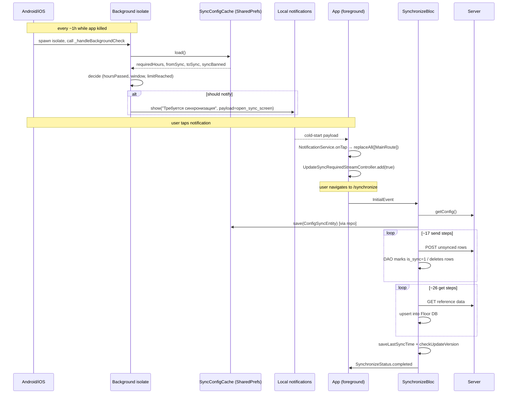

# Synchronize

Sync is the single most important feature of this app. Agents work in the field — frequently offline — and at the end of the day (or on demand) they synchronize: all locally-edited rows are POSTed to the server, then reference data (clients, products, prices, KPIs, configuration) is pulled back down. If sync breaks silently, the next day's work happens against stale data; if it loses data, an entire day of orders can vanish.

Two surfaces drive sync:

1. **Foreground**: `SynchronizeBloc` orchestrates the full 30-step pipeline on the `/synchronize` route.
2. **Background**: a WorkManager (Android) / BackgroundFetch (iOS) callback fires periodically while the app is killed, decides whether it's been "too long" since the last sync, and shows a local notification. Tapping the notification opens the sync screen.

## Foreground sync — the pipeline

`lib/presentation/features/synchronize/bloc/synchronize_bloc.dart` (1,430 lines) executes the chain in a chain of `.onSuccess(...) → next step` callbacks built on top of `FutureHandler`. Each handler emits state updates so the UI can show progress, then calls the next handler. There is no central loop; the chain is hard-coded in the source.

### State and events

```dart
// synchronize_state.dart
@immutable
class SynchronizeState {
  final int percentage;
  final String synchronizeName;       // localized current step name
  final String currentRequestName;    // localized last completed step
  final int current; final int total; // inner counters (used by photo report streaming)
  final SyncType type;                // identifies the step (for retry)
  final String lastSyncName;
  final bool forceUpdate;             // populated by checkUpdateVersion
  final bool recommendUpdate;
  final String appVersion;
  final SynchronizeStatus status;
  final String errorMessage;
  final bool checkingUpdateVersion;
  // const SynchronizeState({ … defaults })
  // copyWith({ … })
}

enum SynchronizeStatus {
  completed,
  error,
  hasForcedSyncInToday,
  timeZoneError,
  loading,
}

// synchronize_event.dart
sealed class SynchronizeEvent {}
class InitialEvent extends SynchronizeEvent {}
class RetryEvent extends SynchronizeEvent {
  final SyncType syncType;
  RetryEvent({required this.syncType});
}
```

Two events: kick off the whole pipeline (`InitialEvent`) or restart from a specific step that failed (`RetryEvent`). `SynchronizeStatus.timeZoneError` is raised when the device clock disagrees with the server time enough to risk data corruption (the user has to fix the clock before sync can proceed). `hasForcedSyncInToday` is raised by the server when the configured forced-sync window has already been used today.

### Progress: `PercentageCalculator(29)`

`lib/presentation/support/percentage/percentage_calculator.dart`

```dart
class PercentageCalculator {
  final int count;        // = 29
  int currentIndex = -1;
  List<int> percentages = [];
  int cumulativeSum = 0;

  PercentageCalculator(this.count) { _calculateInitialPercentages(); }

  int calculatePercentages() {
    if (currentIndex == -1) { currentIndex = 0; return 0; }
    if (currentIndex < count) {
      cumulativeSum += percentages[currentIndex];
      currentIndex++;
    }
    return cumulativeSum;
  }
}
```

`PercentageCalculator(29)` distributes 100% across 29 equal slices. The calculator is instantiated at `synchronize_bloc.dart:48`. The hardcoded `29` predates the current step count — there are actually ~44 distinct handlers in the chain today (see the table below), so the bar visually completes before sync actually finishes if every step emits a tick. In practice not every handler bumps the calculator, so it lines up close enough. **If you add a new step that emits a percentage update, decrement `29` accordingly (or refactor to track step count automatically).**

### The chain, in order

Each row below is one `FutureHandler` call invoked from `synchronize_bloc.dart`. Approximate line numbers refer to the entry point of each private handler method.

| # | Phase | Handler | UseCase call | Line |
|---|-------|---------|--------------|------|
| 0 | bootstrap | `_getConfig()` | `getConfig()` | 55 |
| 1 | send | `_sendClient()` | `sendClientAndClear()` | 87 |
| 2 | send | `_sendClientCheckInOut()` | `sendClientCheckInOutAndClear()` | 108 |
| 3 | send | `_sendOrder()` | `sendOrderAndClear()` | 129 |
| 4 | send | `_sendRefund()` | `sendRefundAndClear()` | 150 |
| 5 | send | `_sendRefundBasedOrder()` | `sendRefundBasedOrderAndClear()` | 170 |
| 6 | send | `_sendReplace()` | `sendReplaceAndClear()` | 191 |
| 7 | send | `_sendClientOddments()` | `sendClientOddmentsAndClear()` | 212 |
| 8 | send | `_sendTask()` | `sendTaskAndClear()` | 233 |
| 9 | send | `_sendPayment()` | `sendPaymentAndClear()` | 254 |
| 10 | send | `_sendClientPhoto()` | `sendClientPhotoAndClear()` | 275 |
| 11 | send (streamed) | `_sendPhotoReport()` | `sendAndClearPhotoReports()` (uses `await for`) | 298 |
| 12 | send | `_sendPhotoReportTgNotify(ids)` | `sendPhotoReportTgNotify(ids)` | 327 |
| 13 | send | `_sendRejections()` | `sendAndClearRejections()` | 348 |
| 14 | send | `_sendInventoryList()` | `sendInventoryList()` | 369 |
| 15 | send | `_sendInventoryPhotoList()` | `sendInventorPhotoList()` | 393 |
| 16 | send | `_sendInventoryReportList()` | `sendAndClearInventoryReportList()` | 417 |
| 17 | send | `_sendInventoryReportPhotoList()` | `sendAndClearInventoryReportPhotoList()` | 441 |
| 18 | get | `_getClientInfo()` | `getClientInfo()` | 466 |
| 19 | get (conditional) | `_getPendingClients()` | `getPendingClients()` | 493 |
| 20 | get | `_getProductList()` | `getProductList()` | 514 |
| 21 | get | `_getProductUnitList()` | `getProductUnitList()` | 535 |
| 22 | get | `_getProductCategoryList()` | `getProductCategoryList()` | 556 |
| 23 | get | `_getProductSubCategoryList()` | `getProductSubCategoryList()` | 577 |
| 24 | get | `_getTradeList()` | `getTradeList()` | 598 |
| 25 | get | `_getProductPriceList()` | `getProductPriceList()` | 619 |
| 26 | get | `_getProductBrandList()` | `getProductBandList()` | 639 |
| 27 | get | `_getDiscountInfo()` | `getDiscountInfo()` | 660 |
| 28 | get | `_getPriceTypes()` | `getPriceTypes()` | 681 |
| 29 | get | `_getPaymentTypes()` | `getPaymentTypes()` | 702 |
| 30 | get | `_getPhotoCategory()` | `getPhotoCategory()` | 723 |
| 31 | get | `_getClientDirectionList()` | `getClientDirectionList()` | 744 |
| 32 | get | `_getRejectionReasonList()` | `getRejectionReasonList()` | 765 |
| 33 | get | `_getTaskInfo()` | `getTaskInfo()` | 828 |
| 34 | get | `_getTaskCategoryList()` | `getTaskCategoryList()` | 849 |
| 35 | get | `_getPaymentBalanceList()` | `getPaymentBalanceList()` | 912 |
| 36 | get | `_getDefectReasonList()` | `getDefectReasonList()` | 956 |
| 37 | get | `_getTaraList()` | `getTaraList()` | 1021 |
| 38 | get | `_getWarehouseList()` | `getWarehouseList()` | 1042 |
| 39 | get | `_getStockList()` | `getStockList()` | 1063 |
| 40 | get | `_getOutlet()` | `getOutlet()` | 1084 |
| 41 | get | `_getInventoryList()` | `getInventoryList()` | 1105 |
| 42 | get | `_getInventoryTypeList()` | `getInventoryTypeList()` | 1127 |
| 43 | get | `_getNoteList()` | `getNoteList()` | 1151 |
| 44 | get | `_getDayTransactions()` | `getDayTransactions()` | 1176 |
| — | finalize | `_saveLastSyncTime()` | `saveLastSyncTime()` | 1187 |
| — | finalize | `_checkUpdateVersion()` | `checkUpdateVersion()` | 1245 |

Step 19 (`_getPendingClients`) is conditional: it only runs if `synchronizeUseCase.isVerifyEnabled()` returns true (i.e. the server has enabled the supervisor-verification feature for this tenant). That gate is at line 470 immediately after `_getClientInfo`.

Step 11 (`_sendPhotoReport`) is the only one that doesn't use `FutureHandler` — it iterates a stream so the UI can show "uploading photo 3 of 17" type progress. After it finishes, it calls `_sendPhotoReportTgNotify(ids)` with the list of photo report IDs that were successfully uploaded so the server can fan out a Telegram notification.

### Naming convention on `SynchronizeUseCase`

`lib/domain/usecase/synchronize/synchronize_usecase.dart` groups methods by prefix:

| Prefix | Means |
|--------|-------|
| `getX()` | pull from server → upsert into local DB |
| `sendX()` | POST unsynced rows; **leave** them in the DB and mark `is_sync = 1` |
| `sendXAndClear()` | POST unsynced rows and **delete** them on success — used for once-and-done write-only resources (rejections, oddments, reports, etc.) |
| `sendAndClearX()` | variant spelling — same contract as `sendXAndClear` (used for `sendAndClearPhotoReports`, `sendAndClearRejections`, `sendAndClearInventoryReportList`, `sendAndClearInventoryReportPhotoList`) |
| `checkX()` / `saveX()` | finalization helpers (update version check, save last-sync timestamp) |

The implementation in `synchronize_usecase_impl.dart` delegates each method to the matching repository.

### Error handling

Each handler uses `FutureHandler.onError`:

```dart
.onError((error) {
  _emitErrorState(
    SyncType.sendClientList,
    'clients'.tr(),
    error.getErrorMessage(),
  );
})
```

`_emitErrorState` (line 1276) emits a state with `SynchronizeStatus.error`, the localized step name, and the current `SyncType` so the UI's retry button can pass it back via `RetryEvent`.

Special cases:
- `TimeZoneException` raised by the config step (line 69) becomes `SynchronizeStatus.timeZoneError`.
- The server can answer `getConfig()` with a "forced sync already done today" signal — handled at line 59 as `SynchronizeStatus.hasForcedSyncInToday`.

### Retry

`_retryData(SyncType)` (line 1285) is one giant switch that maps every `SyncType` enum value to its private handler:

```dart
void _retryData(SyncType type) {
  switch (type) {
    case SyncType.config:           _getConfig(isNeedSyncConfig); break;
    case SyncType.sendClientList:   _sendClient(); break;
    case SyncType.sendOrderList:    _sendOrder(); break;
    // … 46 total cases
  }
}
```

`SyncType` enum is in `lib/domain/model/local/sync/sync_type.dart` — it's the source of truth for "the set of resumable steps in the pipeline". When you add a new step to the chain, append a `SyncType` value **and** a `_retryData` case, otherwise retry from that step does nothing.

### Finalize

After step 44 (`_getDayTransactions`):

1. `_saveLastSyncTime()` writes `now` to `SyncPreference.lastSyncTime` (this also clears `FlavorConfig.isNewDay` for the rest of the day).
2. `_checkUpdateVersion()` calls `synchronizeUseCase.checkUpdateVersion()` and stores `forceUpdate`/`recommendUpdate`/`appVersion` on state.
3. State emits `SynchronizeStatus.completed`.

`SynchronizePage` listens for `SynchronizeStatus.completed`, navigates to `MainRoute`, and (if `forceUpdate || recommendUpdate`) shows the update dialog from there. The same dialog can also be triggered from `App._checkForceUpdate` (see [08-navigation-and-shell](./08-navigation-and-shell.md)).

## Background sync — reminder notifications

The background path does **not** sync data. Its only job is to detect "the user hasn't synced in too long" while the app is killed and to nudge them with a local notification. Actual sync still requires the user to tap the notification, return to the app, and run the foreground pipeline.

### Top-level entry points

`lib/core/notification/sync_reminder_worker.dart:12-57`

**Android (WorkManager)** — top-level function registered as the WorkManager dispatcher:

```dart
const String kSyncReminderTaskName = 'syncReminderCheck';
const String kSyncReminderUniqueId = 'io.salesdoctor.syncReminder';

@pragma('vm:entry-point')
void syncReminderCallbackDispatcher() {
  wm.Workmanager().executeTask((taskName, inputData) async {
    if (taskName != kSyncReminderTaskName) return true;
    try { await _handleBackgroundCheck(); } catch (e) {}
    return true;
  });
}
```

**iOS (background_fetch)** — top-level headless function:

```dart
@pragma('vm:entry-point')
Future<void> backgroundFetchHeadlessTask(bg.HeadlessTask task) async {
  final taskId = task.taskId;
  if (task.timeout) { bg.BackgroundFetch.finish(taskId); return; }
  try { await _handleBackgroundCheck(); } catch (e) {}
  bg.BackgroundFetch.finish(taskId);
}
```

Both functions are marked `@pragma('vm:entry-point')` because they run in an isolated Dart isolate spawned by the platform's background-execution framework — Dart's tree-shaker would otherwise strip them.

In `main.dart:30-32`, the iOS variant is wrapped in a forwarding entry-point so `BackgroundFetch.registerHeadlessTask` can hold a top-level function reference:

```dart
@pragma('vm:entry-point')
void _backgroundFetchHeadlessEntry(bg.HeadlessTask task) =>
    backgroundFetchHeadlessTask(task);
```

And the platform's framework is wired up early in `main()` so a notification can fire even before the user opens the app:

```dart
// main.dart:39-43
if (Platform.isIOS) {
  try {
    bg.BackgroundFetch.registerHeadlessTask(_backgroundFetchHeadlessEntry);
  } catch (e) {}
}
```

### `_handleBackgroundCheck()`

The shared decision logic for both platforms (`sync_reminder_worker.dart:62-130`):

```dart
Future<void> _handleBackgroundCheck() async {
  final prefs = await SharedPreferences.getInstance();

  final isLoggedIn = prefs.getBool('is_login') ?? false;
  if (!isLoggedIn) return;

  final config = await SyncConfigCache.load();
  if (config.syncBanned) return;

  final isLimitReached =
      prefs.getBool(SyncPreferenceKeys.syncOrdersLimitReached) ?? false;
  final lastSyncTs = prefs.getInt(SyncPreferenceKeys.lastSyncTime) ?? 0;
  if (lastSyncTs == 0 && !isLimitReached) return;

  final now = DateTime.now();
  final hoursPassed = lastSyncTs == 0
      ? 0
      : now.difference(DateTime.fromMillisecondsSinceEpoch(lastSyncTs)).inHours;

  bool shouldNotify = false;
  String title = 'Требуется синхронизация';
  String body = 'Давно не было синхронизации. Выполните синхронизацию, чтобы данные были актуальны.';

  if (hoursPassed >= config.requiredHours &&
      SyncWindowHelper.isWithinSyncWindow(config.fromSync, config.toSync)) {
    shouldNotify = true;
  }

  if (isLimitReached) {
    shouldNotify = true;
    title = 'Необходимо сделать синхронизацию!';
    body = 'У вас есть несинхронизированные заказы, для продолжения работы сделайте синхронизацию или обратитесь к оператору!';
  }

  if (!shouldNotify) return;

  // Spam protection
  final lastReminderTs = prefs.getInt(SyncPreferenceKeys.lastSyncReminderTime) ?? 0;
  if (lastReminderTs != 0) {
    final sinceLastReminder = now.difference(DateTime.fromMillisecondsSinceEpoch(lastReminderTs));
    final minInterval = isLimitReached
        ? const Duration(hours: 1)
        : Duration(hours: config.requiredHours);
    if (sinceLastReminder < minInterval) return;
  }

  await _showNotification(title: title, body: body);
  await prefs.setInt(SyncPreferenceKeys.lastSyncReminderTime, now.millisecondsSinceEpoch);
}
```

Notice what's **not** available in this function: GetIt, the database, the BLoC tree, EasyLocalization. The background isolate is a separate Dart VM — none of the in-app state crosses over. That's why everything it reads must be in `SharedPreferences`, and the reminder text is hardcoded Russian (not localized via `.tr()`).

### `SyncConfigCache`

`lib/data/utils/notification/sync_config_cache.dart` exists precisely to bridge the DB-only `ConfigSyncEntity` to `SharedPreferences` so the background isolate can read it:

```dart
class SyncConfigCache {
  static Future<void> save(ConfigSyncEntity config) async {
    final prefs = await SharedPreferences.getInstance();
    final requiredHours = int.tryParse(config.requiredHours) ?? 24;
    await prefs.setInt(SyncPreferenceKeys.syncRequiredHours, requiredHours);
    await prefs.setString(SyncPreferenceKeys.syncFromTime, config.fromSync);
    await prefs.setString(SyncPreferenceKeys.syncToTime, config.toSync);
    await prefs.setBool(SyncPreferenceKeys.syncBanned, config.syncBanned);
  }

  static Future<CachedSyncConfig> load() async { … }
}
```

`save` is called from the foreground every time the config is refreshed (typically inside the `_getConfig` step at the start of sync, via `CommonRepository.getConfig()`). The background then `load`s the cached values without touching the DB.

### Notification display from the background

`_showNotification` re-initializes its own `FlutterLocalNotificationsPlugin` instance because the foreground `NotificationService` singleton doesn't exist in the background isolate:

```dart
Future<void> _showNotification({String? title, String? body}) async {
  final plugin = FlutterLocalNotificationsPlugin();
  await plugin.initialize(const InitializationSettings(
    android: AndroidInitializationSettings('@mipmap/ic_launcher'),
    iOS: DarwinInitializationSettings(),
  ));
  await plugin.show(
    1001, title ?? 'Требуется синхронизация',
    body ?? '…', const NotificationDetails(…),
    payload: 'open_sync_screen',
  );
}
```

The `payload: 'open_sync_screen'` matches the `NotificationPayload.openSyncScreen` constant used by the foreground tap handler.

### Periodic schedule

`initSyncBackgroundService()` is called from `main()` (logged-in only). Per platform:

**Android** (`sync_reminder_worker.dart:181-211`):

```dart
await wm.Workmanager().initialize(syncReminderCallbackDispatcher, isInDebugMode: kDebugMode);
await wm.Workmanager().registerPeriodicTask(
  kSyncReminderUniqueId,
  kSyncReminderTaskName,
  frequency: const Duration(hours: 1),
  constraints: wm.Constraints(networkType: wm.NetworkType.notRequired),
  existingWorkPolicy: wm.ExistingPeriodicWorkPolicy.keep,
  initialDelay: const Duration(minutes: 15),
);
```

WorkManager fires the dispatcher roughly every hour (Android batches; the actual cadence varies). `existingWorkPolicy: keep` means re-installs do not reset the schedule.

**iOS** (`sync_reminder_worker.dart:212-231`):

```dart
await bg.BackgroundFetch.configure(
  bg.BackgroundFetchConfig(
    minimumFetchInterval: 60,  // minutes; iOS enforces a 15-min floor
    stopOnTerminate: false,    // continue running after app is killed
    enableHeadless: true,
    requiresBatteryNotLow: false,
    requiresCharging: false,
    requiresStorageNotLow: false,
    requiresDeviceIdle: false,
  ),
  (taskId) async {
    await backgroundFetchHeadlessTask(bg.HeadlessTask(taskId, false));
  },
  (taskId) async { bg.BackgroundFetch.finish(taskId); },
);
```

On iOS the OS may further reduce frequency based on battery and app-usage patterns; `minimumFetchInterval: 60` is a lower bound, not a guarantee.

## Deep-link from notification tap

`lib/presentation/app.dart:77-88`:

```dart
NotificationService.instance.onTap = (payload) {
  if (payload == NotificationPayload.openSyncScreen) {
    _appRouter.replaceAll([const MainRoute()]);
    appGetIt<UpdateSyncRequiredStreamController>().add(true);
  }
};

WidgetsBinding.instance.addPostFrameCallback((_) {
  NotificationService.instance.flushPendingLaunchPayload();
});
```

The flow:

1. User taps the notification.
2. App opens; `NotificationService.onTap` fires with `payload == 'open_sync_screen'`.
3. Router replaces the stack with `MainRoute`.
4. `UpdateSyncRequiredStreamController.add(true)` is emitted.
5. `HomePage` (the home tab inside `MainPage`) subscribes to that controller and shows a "sync required" banner / triggers navigation to `SynchronizeRoute`.

For cold-start taps (the notification opens the app from killed state), `NotificationService.init` captures the launch payload into `_pendingPayload`; `flushPendingLaunchPayload()` re-fires it after the first frame so the `onTap` handler can run with the router fully attached.

## `UpdateSyncRequiredStreamController`

`lib/domain/common/stream/sync/update_sync_required_stream_controller.dart`:

```dart
class UpdateSyncRequiredStreamController extends BaseStreamController<bool> {
  UpdateSyncRequiredStreamController({super.isBroadcast = true});
}
```

Registered as a lazy singleton (see [06-streams-and-cross-feature](./06-streams-and-cross-feature.md)). Emitters and listeners:

| Direction | Where | Why |
|-----------|-------|-----|
| `add(true)` | `app.dart:81` | notification tap |
| `add(true)` | `client_detail_bloc.dart:1123` (approx) | after a successful per-client sync inside the detail screen — tells the home dashboard to refresh its "pending count" |
| `listen` | `home_page.dart` | show the sync banner, refresh counts |
| `listen` | `client_detail_page.dart` | refresh shown data after the per-client sync |

## Full picture



## When you change the sync pipeline

Things to remember (these are the `.claude/agents/sync-agent.md` rules):

- **Never break the `is_sync` contract.** Entities with `is_sync` must include a `getNotSynced*` DAO query and a `send*` repository method. Sync POSTs them and flips the flag (or deletes).
- **`sendX` vs `sendXAndClear`**: use `*AndClear` for once-and-done payloads (rejections, photo reports). Use plain `sendX` for "the server now owns it but we still need it locally" (most reference-like writes).
- **Add to `SyncType` AND `_retryData`** when you add a new step. Retry-by-type is a switch over the enum; an unmatched value silently does nothing.
- **Add the step to the chain in `SynchronizeBloc`** (a `.onSuccess(...) → _nextHandler(...)` call from the previous step). Sends run before gets so reference data updates don't trample local edits.
- **Update `SyncConfigCache.save(...)`** if you add a sync-config column the background isolate needs to read.
- **The `PercentageCalculator(29)` constant is stale.** Update it (or refactor) when you add a step that emits a percentage tick.
- **Background isolate has no `.tr()`, no DI, no DB, no `NotificationService` singleton.** Anything it needs lives in `SharedPreferences` and is read via `SyncConfigCache.load()` (or directly).
