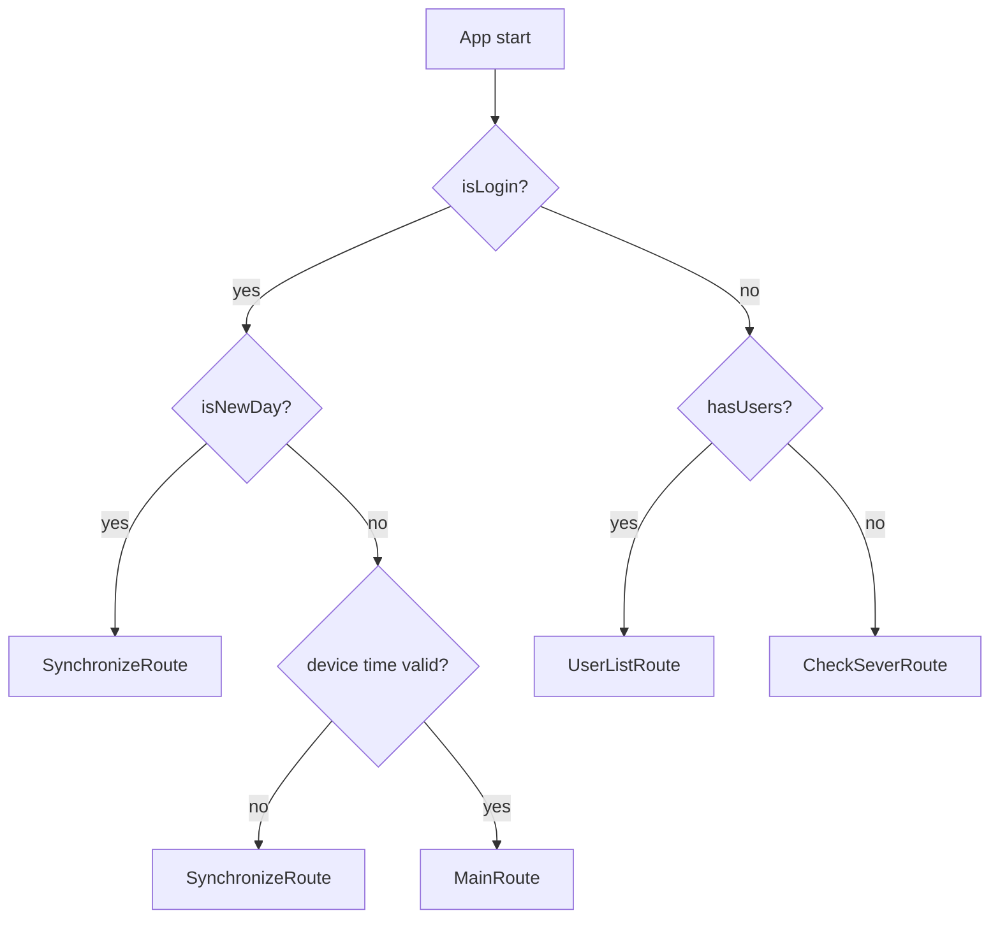
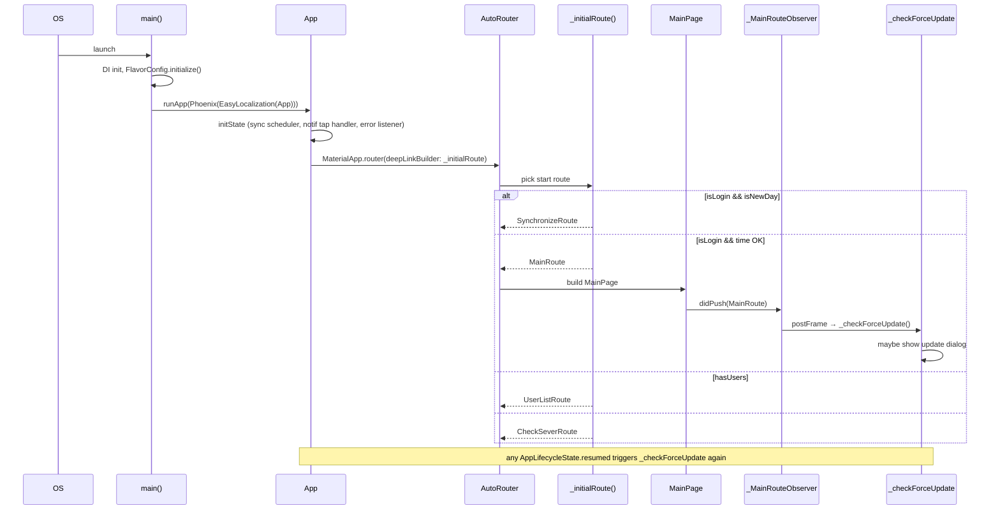

# Navigation & shell

This doc covers the app boot path — from `main()` through `App` widget through the first visible route — plus the four-tab `MainPage` shell and the force-update flow that piggybacks on it.

For the BLoC/page/`@RoutePage`/`AutoRoute` mechanics in isolation see [04-presentation-layer](./04-presentation-layer.md). For boot-time DI wiring see [01-architecture](./01-architecture.md).

## Widget tree

`lib/presentation/app.dart` is the root widget. The build tree is:

```
runApp
└── Phoenix                                (lib/main.dart:81 — full-app rebirth wrapper)
    └── EasyLocalization                   (lib/main.dart:82-91 — locale provider)
        └── App (StatefulWidget)
            └── AdaptiveTheme              (lib/presentation/app.dart:122 — light/dark switching)
                └── MaterialApp.router     (lib/presentation/app.dart:126)
                    └── AppRouter (auto_route delegate)
                        └── <initial route from _initialRoute()>
```

The `MaterialApp.router` block:

```dart
// lib/presentation/app.dart:121-144
return AdaptiveTheme(
  light: AppThemeData.lightTheme,
  dark: AppThemeData.darkTheme,
  initial: AdaptiveThemeMode.system,
  builder: (theme, darkTheme) => MaterialApp.router(
    scaffoldMessengerKey: _scaffoldMessengerKey,
    routerDelegate: _appRouter.delegate(
      deepLinkBuilder: (_) => DeepLink([_initialRoute()]),
      navigatorObservers: () => [
        ChuckerFlutter.navigatorObserver,
        _MainRouteObserver(onMainRoute: _checkForceUpdate),
      ],
    ),
    routeInformationParser: _appRouter.defaultRouteParser(),
    localizationsDelegates: context.localizationDelegates,
    supportedLocales: context.supportedLocales,
    locale: context.locale,
    theme: theme,
    darkTheme: darkTheme,
    debugShowCheckedModeBanner: false,
  ),
);
```

Two non-obvious bits:

- **`deepLinkBuilder` calls `_initialRoute()`**. AutoRoute's deep-link mechanism is repurposed here as the cold-start route picker. Whatever `_initialRoute()` returns becomes the first route on the stack.
- **`_MainRouteObserver` watches the stack** and runs `_checkForceUpdate` every time `MainRoute` is pushed or replaced — used by the force-update flow below.

## `_initialRoute()` — picking the first screen

`lib/presentation/app.dart:319-342`:

```dart
PageRouteInfo _initialRoute() {
  final bool isLogin = FlavorConfig.isLogin;
  final bool isNewDay = FlavorConfig.isNewDay;
  final bool hasUsers = FlavorConfig.hasUsers;

  if (isLogin) {
    if (isNewDay) {
      return SynchronizeRoute();
    } else {
      final checkDeviceTimeAndOffset = _appRepository.isDeviceTimeChanged();
      if (!checkDeviceTimeAndOffset) {
        return SynchronizeRoute();
      }
      return const MainRoute();
    }
  } else {
    if (hasUsers) {
      return const UserListRoute();
    } else {
      return const CheckSeverRoute();
    }
  }
}
```

Decision tree:



Why each branch matters:

- **`isNewDay` → SynchronizeRoute**: on day boundary the user must do a full sync before any new work, so reference data (clients, products, prices) reflects today's server state.
- **device time changed → SynchronizeRoute**: `_appRepository.isDeviceTimeChanged()` detects clock tampering or accidental zone changes that would corrupt order timestamps. Force a sync (which includes a server-time check) before continuing.
- **`hasUsers` → UserListRoute**: not logged in, but at least one user is cached locally — show the picker (multi-account support).
- **no users → CheckSeverRoute**: first-launch screen, the user types a tenant code which sets `FlavorConfig.apiBaseUrl` and ultimately leads into `LoginRoute`.

`isLogin`, `isNewDay`, `hasUsers` are all on `FlavorConfig` (`lib/data/utils/flavor/flavor_config.dart`) and resolve against `SharedPreferences`. See [01-architecture §FlavorConfig](./01-architecture.md#flavorconfig--runtime-configuration).

## `App` lifecycle

`App` extends `WidgetsBindingObserver` so it can react to OS lifecycle changes (background/resume).

```dart
// lib/presentation/app.dart:65-89
@override
void initState() {
  super.initState();
  WidgetsBinding.instance.addObserver(this);
  _initDisplayErrorRepository();

  if (FlavorConfig.isLogin &&
      appGetIt.isRegistered<SyncNotificationRepository>()) {
    appGetIt<SyncNotificationRepository>().startScheduler();
  }

  NotificationService.instance.onTap = (payload) {
    if (payload == NotificationPayload.openSyncScreen) {
      _appRouter.replaceAll([const MainRoute()]);
      appGetIt<UpdateSyncRequiredStreamController>().add(true);
    }
  };

  WidgetsBinding.instance.addPostFrameCallback((_) {
    NotificationService.instance.flushPendingLaunchPayload();
  });
}
```

Step-by-step:

1. **`addObserver(this)`** registers for lifecycle callbacks.
2. **`_initDisplayErrorRepository()`** wires the global 401/402 listener (see [09-error-handling](./09-error-handling.md)).
3. **Start sync scheduler** (logged-in only) — `SyncNotificationRepository.startScheduler()` periodically refreshes the sync status banner.
4. **Register the notification tap handler** — payload `openSyncScreen` routes to MainRoute and signals `UpdateSyncRequiredStreamController`. See [07-synchronize](./07-synchronize.md).
5. **Flush pending launch payload** after the first frame — if the app was launched cold by tapping a notification, `NotificationService.init()` cached the payload; replay it once the router is mounted.

```dart
// lib/presentation/app.dart:92-99
@override
void dispose() {
  _depsResetSub?.cancel();
  WidgetsBinding.instance.removeObserver(this);
  if (appGetIt.isRegistered<SyncNotificationRepository>()) {
    appGetIt<SyncNotificationRepository>().stopScheduler();
  }
  super.dispose();
}
```

### `didChangeAppLifecycleState`

```dart
// lib/presentation/app.dart:102-118
@override
void didChangeAppLifecycleState(AppLifecycleState state) {
  super.didChangeAppLifecycleState(state);

  if (state == AppLifecycleState.paused) {
    _updateDialogShown = false;
  }

  if (state == AppLifecycleState.resumed) {
    _checkLastUpdateDate();
    if (FlavorConfig.isLogin &&
        appGetIt.isRegistered<SyncNotificationRepository>()) {
      appGetIt<SyncNotificationRepository>().checkSyncStatus();
    }
    _checkForceUpdate();
  }
}
```

- **On pause** — reset the recommend-update suppression flag so a critical update prompt can re-appear on next resume.
- **On resume** — re-check device time, refresh the sync-required status, and run a force-update check.

## Force / recommend update flow

The mechanism has two trigger points:

1. **`_MainRouteObserver`** — fires `_checkForceUpdate` whenever the router pushes or replaces `MainRoute`.
2. **`didChangeAppLifecycleState`** — fires `_checkForceUpdate` on every `resumed`.

So: on first reach of `MainRoute` after boot, and on every app-foreground after that, the version is checked.

### `_MainRouteObserver`

```dart
// lib/presentation/app.dart:345-363
class _MainRouteObserver extends AutoRouterObserver {
  final VoidCallback onMainRoute;
  _MainRouteObserver({required this.onMainRoute});

  @override
  void didPush(Route route, Route? previousRoute) {
    if (route.data?.name == MainRoute.name) {
      WidgetsBinding.instance.addPostFrameCallback((_) => onMainRoute());
    }
  }

  @override
  void didReplace({Route? newRoute, Route? oldRoute}) {
    if (newRoute?.data?.name == MainRoute.name) {
      WidgetsBinding.instance.addPostFrameCallback((_) => onMainRoute());
    }
  }
}
```

The `addPostFrameCallback` defers the check until the route is fully mounted — otherwise `_appRouter.navigatorKey.currentContext` would be null.

### `_isUpdateCheckDue()` — 24-hour cache

```dart
// lib/presentation/app.dart:184-190
bool _isUpdateCheckDue() {
  final versionPref = appGetIt<VersionDataPreference>();
  final lastCheckTime = versionPref.getLastUpdateCheckTime();
  if (lastCheckTime == 0) return true;
  const twentyFourHours = 24 * 60 * 60 * 1000;
  return (DateTime.now().millisecondsSinceEpoch - lastCheckTime) >= twentyFourHours;
}
```

24 hours of cache to avoid hammering the version-check endpoint on every navigation. `isNewDay` bypasses the cache (the next branch always wins).

### `_checkForceUpdate()`

```dart
// lib/presentation/app.dart:192-279 — abridged
Future<void> _checkForceUpdate() async {
  if (!FlavorConfig.isLogin) return;
  if (!appGetIt.isRegistered<SynchronizeUseCase>()) return;
  if (_isCheckingUpdate) return;
  _isCheckingUpdate = true;

  ScaffoldFeatureController? snackBarController;
  if (_isUpdateCheckDue() || FlavorConfig.isNewDay) {
    snackBarController = _scaffoldMessengerKey.currentState?.showSnackBar(
      SnackBar(
        content: Row(children: [
          Text('checking_update_version'.tr(), …),
          const Spacer(),
          const SizedBox(
            width: 22, height: 22,
            child: CircularProgressIndicator(strokeWidth: 2.5, color: Colors.white),
          ),
        ]),
        duration: const Duration(seconds: 30),
      ),
    );
  }

  try {
    final result = await appGetIt<SynchronizeUseCase>().checkUpdateVersion();
    snackBarController?.close();

    if (FlavorConfig.isNewDay) return;

    final context = _appRouter.navigatorKey.currentContext;
    if (context == null || !context.mounted) return;

    final currentVersion = AppVersionManager().getVersion();
    if (!_isNewerVersion(result.appVersion, currentVersion)) return;

    final versionPref = appGetIt<VersionDataPreference>();

    if (result.forceUpdate) {
      context.showUpdateVersionDialog(
        () => Platform.isAndroid
            ? _launchInAppUpdate(immediate: true)
            : _openStore(),
        forceUpdate: true,
      );
    } else if (result.recommendUpdate) {
      if (_updateDialogShown) return;
      if (versionPref.getDismissedRecommendVersion() == result.appVersion) return;
      _updateDialogShown = true;
      context.showUpdateVersionDialog(
        () => Platform.isAndroid
            ? _launchInAppUpdate(immediate: false)
            : _openStore(),
        onDismiss: () => versionPref.saveDismissedRecommendVersion(result.appVersion),
      );
    }
  } on DioException catch (_) {
    // Silent fail — retry on next launch
  } catch (_) {
    // Silent fail
  } finally {
    snackBarController?.close();
    _isCheckingUpdate = false;
  }
}
```

Highlights:

- **Guards**: `!isLogin`, missing `SynchronizeUseCase`, or `_isCheckingUpdate` all short-circuit.
- **Progress snackbar** shows only when the check is going to make a real network call (cache miss or new day).
- **Skip dialog on new day** — `SynchronizePage._handleUpdateDialog` will show it once sync completes (see [12-feature-deep-dives/sync](./12-feature-deep-dives/sync.md)).
- **Version comparison**: only prompt if `result.appVersion > currentVersion`. Stops the dialog from firing if the server returns an old version (e.g. during staged rollout).
- **Force update** — blocking dialog, no dismiss. Android uses `InAppUpdate.performImmediateUpdate()`; iOS launches the App Store.
- **Recommend update** — dismissible. Per-version suppression: once the user dismisses for version X, `VersionDataPreference.saveDismissedRecommendVersion(X)` makes sure that version doesn't pop again until the server advertises a new one.

The same flow can also fire from `SynchronizePage` at the end of sync (when `_checkForceUpdate` is suppressed for `isNewDay` boot, the sync page picks up the relay). Same dialog, same per-version suppression.

### Update paths

```dart
// lib/presentation/app.dart — _launchInAppUpdate(immediate: bool) / _openStore()
```

- **Android** uses the `in_app_update` package — `performImmediateUpdate()` for force, `startFlexibleUpdate()` for recommend.
- **iOS** uses `url_launcher` to send the user to the app's App Store page.

## `MainPage` — the 4-tab shell

`lib/presentation/features/main/main_page.dart` (143 lines). Once `_initialRoute()` returns `MainRoute`, this is what the user sees.

```dart
@RoutePage()
class MainPage extends StatefulWidget { ... }
```

The body is `AutoTabsRouter`:

```dart
AutoTabsRouter(
  routes: const [
    HomeRoute(),
    DailyClientsRoute(),
    OddmentsRoute(),
    MoreMenuRoute(),
  ],
  builder: (context, child) {
    final tabsRouter = AutoTabsRouter.of(context);
    return Scaffold( /* child + bottom bar */ );
  },
);
```

The shell registers a `MainBloc` eagerly:

```dart
late final MainBloc _bloc = MainBloc(mainUseCase: appGetIt());

@override
void initState() {
  super.initState();
  _bloc.add(MainInitialEvent());
}

@override
void dispose() {
  _bloc.close();
  super.dispose();
}
```

### Custom bottom navigation

The bottom bar is a `Column` with two layers:

1. **Top layer** — a 4-segment selection indicator (the underline above the active tab):
   ```dart
   Row(
     children: List.generate(4, (index) {
       return Expanded(
         child: Container(
           height: 2.0,
           color: tabsRouter.activeIndex == index
               ? context.textPrimary
               : context.border,
         ),
       );
     }),
   ),
   ```
2. **Bottom layer** — a standard `BottomNavigationBar` with 4 items:

| Index | Label | Icon | Route |
|-------|-------|------|-------|
| 0 | `'visits'.tr()` | `SvgIcons.icCompass` | `HomeRoute` |
| 1 | `'clients'.tr()` | `SvgIcons.icShopStore` | `DailyClientsRoute` |
| 2 | `'oddments'.tr()` | `SvgIcons.icBoxProduct` | `OddmentsRoute` |
| 3 | `'more'.tr()` | `SvgIcons.icMenuHamburger` | `MoreMenuRoute` |

Each item's icon is themed via `ColorFilter.mode(...)`:

```dart
SvgPicture.asset(
  icon,
  colorFilter: ColorFilter.mode(
    isSelected ? context.textPrimary : context.neutral500,
    BlendMode.srcIn,
  ),
)
```

## The four tabs

### `HomeRoute` → `HomePage` (`features/main/features/home/home_page.dart`)

The dashboard, with sync-status banners, a sync dialog, and tabbed sub-views (Visits / Results). Drives `HomeBloc` (345 lines). See [12-feature-deep-dives/main-shell](./12-feature-deep-dives/main-shell.md) for the full event surface.

### `DailyClientsRoute` → `DailyClientsPage` (`features/main/features/daily/daily_clients_page.dart`)

Day-grouped client list with 8 tabs (All + Mon–Sun). Each tab renders a `ClientListPage` with a different `ClientDaySelection`. Has its own 4 `StreamSubscription` fields (`_updateClientListSub, _updateOrderSub, _updateRejectionSub, _updatePhotoReportSub`) to refresh badge counts.

### `OddmentsRoute` → `OddmentsPage`

Container/stock dashboard for the agent's own inventory. See [12-feature-deep-dives/client-oddment](./12-feature-deep-dives/client-oddment.md) for the related per-client flow.

### `MoreMenuRoute` → `MoreMenuPage` (`features/main/features/more/more_menu_page.dart`)

Profile + multi-account switcher + menu (debtors, KPI, settings, tasks, support, reports, …). Switching accounts goes through `Phoenix.rebirth(context)` (see below).

## `Phoenix.rebirth(context)` — full restart

Two callers in the app:

1. **`UserListPage`** (`features/user/user_list_page.dart`) — when the user switches account.
2. **`MoreMenuPage`** (`features/main/features/more/more_menu_page.dart`) — when the user logs out.

```dart
case UserListStatus.hideFullLoadingDialog:
  _hideFullLoadingDialog(context);
  Phoenix.rebirth(context);
  WidgetsBinding.instance.addPostFrameCallback((_) {
    context.router.replaceAll([SynchronizeRoute(isNeedSyncConfig: true)]);
  });
  break;
```

`Phoenix.rebirth` discards the entire widget tree and re-runs the app from `Phoenix` downward. Why this is needed:

- BLoCs hold references to `appGetIt`-resolved singletons, including the per-user `AppDatabase`. Switching the user means recreating the database against a different file name. Restarting cleanly avoids dangling references.
- A surgical reset of every BLoC, controller, and cached repository in the right order is essentially impossible to get right by hand. `Phoenix.rebirth` is the safer hammer.

After rebirth the post-frame callback routes back into the right initial screen — `SynchronizeRoute` for account switch (`isNeedSyncConfig: true` triggers a full config reload), `CheckSeverRoute` for logout (handled by `_initialRoute()` on the next boot).

## `HomeSynchronizeBloc` — partial sync inside the home tab

`lib/presentation/features/main/features/home/features/synchronize/bloc/home_synchronize_bloc.dart` is a sibling of the main `SynchronizeBloc` ([07-synchronize](./07-synchronize.md)).

| | `SynchronizeBloc` | `HomeSynchronizeBloc` |
|--|--|--|
| Location | `features/synchronize/` | `features/main/features/home/features/synchronize/` |
| Entry route | `SynchronizeRoute` (full-screen) | Triggered from home dialog (no separate route) |
| Scope | The full 44-step pipeline | Subset chosen by `HomeSyncType.fullSync` / `partialSync` / `photoOnly` / `orderOnly` |
| Used when | Boot, isNewDay, deep-link tap, manual "Sync" page | User taps the home sync banner to refresh part of the dataset |
| Emits to | `UpdateOrderStreamController`, `UpdateRejectionStreamController`, `UpdatePhotoReportStreamController` | Same controllers |

Same chained-FutureHandler pattern, same SyncType retry mechanism, same percentage calculator. The split exists so the home tab can offer "sync only photos" / "sync only orders" buttons without forcing the user through every step.

## Boot diagram



## Adding a navigation flow

For a new top-level route:

1. Create the page widget with `@RoutePage()` on the class.
2. Add `AutoRoute(page: MyFeatureRoute.page)` to `lib/core/router/app_router.dart`.
3. Run `flutter pub run build_runner build --delete-conflicting-outputs` to regenerate `app_router.gr.dart`.
4. Push it from anywhere with `context.router.push(const MyFeatureRoute())`.

For a new tab inside `MainPage`, also add `MyFeatureRoute()` to the `AutoTabsRouter.routes` list and add a `BottomNavigationBarItem` to the bottom bar. Most additions to the app's surface area are top-level routes, not new tabs — the 4-tab shell is intentional.

Next:

- [12-feature-deep-dives/main-shell](./12-feature-deep-dives/main-shell.md) for `HomeBloc`'s 14 events and the sync dialog UX.
- [11-features-catalog](./11-features-catalog.md) for the route-by-route map of every feature.
