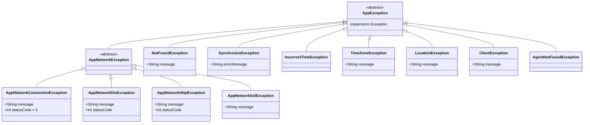
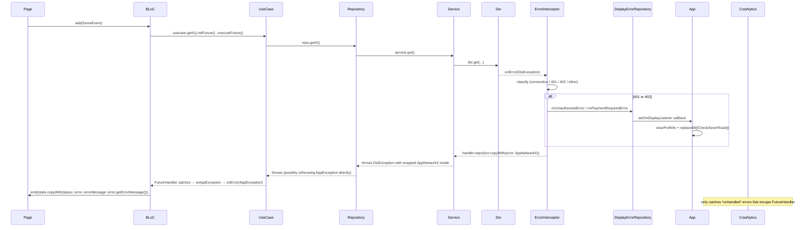

# Error handling

Three layers; one type contract.

1. **Network**: `ErrorInterceptor` in Dio converts every `DioException` into a typed `AppNetworkException` subtype. 401/402 also fire callbacks on `DisplayErrorRepository` so the global listener can clear state and bounce to login.
2. **Domain**: `AppException` is the root marker interface. Subtypes cover network, sync, time, location, client-state, and not-found cases.
3. **Presentation**: every use-case call goes through `FutureHandler.onError((AppException e) { … })`. Pages and BLoCs never see raw Dio or SQL exceptions. The `App` widget also subscribes to `DisplayErrorRepository` and reacts to global 401/402 by clearing prefs and navigating to `CheckSeverRoute`. Fatal Flutter errors are recorded by Crashlytics in release builds.

## Exception type hierarchy



### `AppException`

`lib/data/error/app_exception.dart`:

```dart
abstract class AppException implements Exception {}
```

A pure marker interface. Every other exception in this list implements it (directly or transitively), so `catch (AppException e)` will catch them all — and **only** them.

### Network exceptions

`lib/data/error/app_network_exception.dart`:

```dart
abstract class AppNetworkException implements AppException {}

class AppNetworkConnectionException implements AppNetworkException {
  final String message;
  final int statusCode;        // always 0 — there was no HTTP response
  AppNetworkConnectionException({required this.message, required this.statusCode});
  @override String toString() => "$message (Status code: $statusCode)";
}

class AppNetworkDioException implements AppNetworkException {
  final String message;
  final int statusCode;
  AppNetworkDioException({required this.message, required this.statusCode});
  @override String toString() => "$message (Status code: $statusCode)";
}

class AppNetworkHttpException implements AppNetworkException {
  final String message;        // already localized by ErrorInterceptor
  final int statusCode;        // 400, 401, 403, 404, 409, 422, 429, 500, 502, 503, …
  AppNetworkHttpException({required this.message, required this.statusCode});
  @override String toString() => "$message (Status code: $statusCode)";
}

class AppNetworkSslException implements AppNetworkException {
  final String message;
  AppNetworkSslException({required this.message});
  @override String toString() => message;
}
```

Four subtypes, one for each kind of network failure:

| Subtype | Trigger |
|---------|---------|
| `AppNetworkConnectionException` | Connect/send/receive timeouts; `DioExceptionType.connectionError`; no socket at all. `statusCode == 0`. |
| `AppNetworkSslException` | The underlying `HandshakeException` — TLS validation failed. |
| `AppNetworkHttpException` | The server replied; status code says "not OK". Message is already a localized `.tr()`-style string. |
| `AppNetworkDioException` | Catch-all when none of the above match (e.g. `DioExceptionType.cancel`, `unknown`). |

### Domain-specific exceptions

| File | Class | Used by |
|------|-------|---------|
| `lib/data/error/not_found_exception.dart` | `NotFoundException` | repos when a row that should exist doesn't (defaults to `'message_not_found'.tr()`) |
| `lib/data/error/synchronize_exception.dart` | `SynchronizeException` | sync chain when the server's response is unparseable / signals a partial failure (defaults to `'message_connection_error'.tr()`) |
| `lib/data/error/incorrect_time_exception.dart` | `IncorrectTimeException` | order/payment flows when the device clock is wildly out of sync |
| `lib/data/error/location/location_exception.dart` | `LocationException` | GPS permission denied / GPS off / no location after timeout |
| `lib/data/error/client/client_exception.dart` | `ClientException` | client-state validation failures (e.g. trying to delete a client that has linked orders) |
| `lib/data/data_source/exception/agent/agent_not_found_exception.dart` | `AgentNotFoundException` | bootstrap when the local agent record can't be loaded |
| `lib/data/data_source/exception/config/time/zone/time_zone_exception.dart` | `TimeZoneException` | sync when the server reports a tenant-vs-device time-zone mismatch |

All implement `AppException` so `FutureHandler.onError` can catch them uniformly.

## The conversion layer

Two extension methods normalize anything into an `AppException`.

### `DioException.toAppNetworkException()`

`lib/data/data_source/exception/exception_exts.dart`:

```dart
extension DioExceptionExts on DioException {
  AppNetworkException toAppNetworkException() {
    if (error is AppNetworkException) {
      return error as AppNetworkException;
    }
    if (error is HandshakeException) {
      return AppNetworkSslException(message: error.toString());
    }
    return response != null
        ? response?.toAppNetworkException() ??
            AppNetworkDioException(
              message: response?.statusMessage ?? "Unknown error",
              statusCode: response?.statusCode ?? 0,
            )
        : AppNetworkConnectionException(
            message: message ?? "",
            statusCode: 0,
          );
  }
}

extension DioResponseExts on Response {
  AppNetworkException toAppNetworkException() => AppNetworkHttpException(
    message: statusMessage ?? "Unknown error",
    statusCode: statusCode ?? 0,
  );
}
```

This method is **not** called directly by the interceptor (the interceptor builds its own exceptions with localized messages). It's used by `Object.toAppException(...)` below, and as a safety net by anything that catches a `DioException` outside the interceptor.

### `Object.toAppException(StackTrace?)`

`lib/presentation/support/error/error_message_exts.dart`:

```dart
extension ObjectExceptionExts on Object {
  AppException toAppException(StackTrace? stackTrace) {
    if (this is AppException) {
      return this as AppException;
    } else if (this is DioException) {
      return (this as DioException).toAppNetworkException();
    } else {
      return AppNetworkDioException(
        message: stackTrace.toString(),
        statusCode: 1,
      );
    }
  }
}
```

Called by `FutureHandler.executeFuture`'s `catch` block (below). The chain is:

- Already an `AppException`? Pass through.
- A raw `DioException`? Convert via `.toAppNetworkException()`.
- Anything else? Wrap as `AppNetworkDioException` with the stack trace as the message and `statusCode: 1` as a sentinel. This last branch should be rare; it's there so the type guarantee never breaks.

## `ErrorInterceptor`

`lib/data/data_source/provider/dio/interceptor/error_interceptor.dart`. Attached to all four Dio instances (see [02-data-layer §Interceptor stack](./02-data-layer.md#interceptor-stack)).

```dart
@override
void onError(DioException err, ErrorInterceptorHandler handler) {
  final response = err.response;

  if (_isConnectionError(err.type)) {
    final exception = AppNetworkConnectionException(
      message: _getDefaultErrorMessage(err),
      statusCode: 0,
    );
    handler.reject(err.copyWith(error: exception));
    return;
  }

  final statusCode = response?.statusCode;
  if (statusCode != null) {
    final message = _getMessageForStatusCode(statusCode, err);
    final exception = AppNetworkHttpException(message: message, statusCode: statusCode);
    handler.reject(err.copyWith(error: exception));
    return;
  }

  final exception = AppNetworkHttpException(
    message: _getDefaultErrorMessage(err),
    statusCode: 0,
  );
  handler.reject(err.copyWith(error: exception));
}
```

Three branches: connection error → `AppNetworkConnectionException`; HTTP status known → `AppNetworkHttpException` with localized message; fallback → `AppNetworkHttpException` with `statusCode: 0`. The `err.copyWith(error: exception)` replaces `DioException.error` with the wrapped exception so downstream `catch (e)` can pattern-match.

### Status-code → localized message

```dart
String _getMessageForStatusCode(int statusCode, DioException err) {
  switch (statusCode) {
    case 400: return 'message_bad_request_error'.tr();
    case 401:
      displayErrorRepository.onUnauthorizedError('message_not_authorization'.tr());
      return 'message_not_authorization'.tr();
    case 402:
      displayErrorRepository.onPaymentRequiredError('message_payment_required_error'.tr());
      return 'message_payment_required_error'.tr();
    case 403: return 'message_forbidden_error'.tr();
    case 404: return 'message_not_found_error'.tr();
    case 409: return 'message_conflict_error'.tr();
    case 422: return 'message_validation_error'.tr();
    case 429: return 'message_too_many_requests_error'.tr();
    case 500: return 'message_internal_server_error'.tr();
    case 502: return 'message_bad_gateway_error'.tr();
    case 503: return 'message_service_unavailable_error'.tr();
    default:  return 'message_unknown_error'.tr();
  }
}
```

Notable:

- **401 and 402 have side effects**. They notify `DisplayErrorRepository`, which fans out to the global listener in `App` (next section). The status-code switch still returns the localized message, so the screen-local error display still works while the global listener is also bouncing the user.
- **All messages are `.tr()`** so they come back in the user's language. Source strings are in `assets/translations/ru.json` and `uz.json`.

## `DisplayErrorRepository`

`lib/data/data_source/error/display_error_repository.dart`:

```dart
abstract class DisplayErrorRepository {
  void setOnDisplayListener(
      void Function(String message, GlobalErrorType type) onDisplay);
  void onUnauthorizedError(String message);
  void onPaymentRequiredError(String message);
}
```

`lib/data/data_source/error/display_error_repository_impl.dart`:

```dart
class DisplayErrorRepositoryImpl extends DisplayErrorRepository {
  void Function(String message, GlobalErrorType type)? _onDisplay;

  @override
  void onUnauthorizedError(String message) {
    _onDisplay?.call(message, GlobalErrorType.unauthorized);
  }

  @override
  void onPaymentRequiredError(String message) {
    _onDisplay?.call(message, GlobalErrorType.paymentRequired);
  }

  @override
  void setOnDisplayListener(
      void Function(String message, GlobalErrorType type) onDisplay) {
    _onDisplay = onDisplay;
  }
}
```

```dart
// lib/domain/model/local/error/global_error_type.dart
enum GlobalErrorType {
  accountBlocked,
  paymentRequired,
  unauthorized,
  forceUpdate,
  none,
}
```

The impl is just a callback holder; one listener is registered at app boot. Registered as a `registerLazySingleton` in `commonModule`.

## Global listener in `App`

`lib/presentation/app.dart`:

```dart
void setUpErrorListener() {
  _displayErrorRepository.setOnDisplayListener((message, type) {
    if (type == GlobalErrorType.unauthorized) {
      _appRepository.clearPrefInfo();
      _appRouter.replaceAll([const CheckSeverRoute()]);
    }
    if (type == GlobalErrorType.paymentRequired) {
      _appRepository.clearPrefInfo();
      _appRouter.replaceAll([const CheckSeverRoute()]);
    }
  });
}

void _initDisplayErrorRepository() {
  setUpErrorListener();
  _depsResetSub = DependenciesResetNotifier.instance.stream.listen((_) {
    _displayErrorRepository = appGetIt();
    setUpErrorListener();
  });
}
```

Called from `App.initState`. The DependenciesResetNotifier subscription re-fetches the repository if DI is rebuilt mid-session (e.g. after a user switch), since `appGetIt`-resolved singletons may have changed identity.

The end result: any 401 or 402 from any endpoint **clears local prefs and forces the user back to `CheckSeverRoute`** (the first-launch screen) regardless of where they were in the app. Hard, but correct — once auth is invalid, every subsequent request would 401 too.

## `FutureHandler` — where exceptions land in BLoCs

`lib/core/handler/future_handler.dart`:

```dart
class FutureHandler<T> {
  final Future<T> future;
  Function? _onStart;
  Function(T data)? _onSuccess;
  Function(AppException error)? _onError;
  Function? _onFinished;

  FutureHandler(this.future);

  FutureHandler<T> onStart(Function callback)            { _onStart = callback;    return this; }
  FutureHandler<T> onSuccess(Function(T data) callback)  { _onSuccess = callback;  return this; }
  FutureHandler<T> onError(Function(AppException) cb)    { _onError = cb;          return this; }
  FutureHandler<T> onFinished(Function callback)         { _onFinished = callback; return this; }

  Future<void> executeFuture() async {
    try {
      _onStart?.call();
      final result = await future;
      _onSuccess?.call(result);
    } catch (e, stackTrace) {
      _onError?.call(e.toAppException(stackTrace));
    } finally {
      _onFinished?.call();
    }
  }
}
```

Two things to note:

1. `catch (e, stackTrace)` is bare `catch` so it gets **everything**, then `.toAppException(stackTrace)` normalizes. The `onError` callback's parameter type is `AppException`, not `dynamic` — no caller has to type-check.
2. `finally { _onFinished?.call(); }` always runs — use it for hide-loading-dialog and similar cleanup, regardless of success or failure.

### Usage

```dart
Future<void> _getUserList(Emitter<UserListState> emit) async {
  await usecase
      .getUserList()
      .initFuture()
      .onStart(() {})
      .onSuccess((data) {
        emit(UserListState(userList: data, status: UserListStatus.success));
      })
      .onError((error) {})           // ← error is AppException
      .onFinished(() {})
      .executeFuture();
}
```

And when the handler cares about a specific subtype:

```dart
.onError((error) {
  if (error is IncorrectTimeException) {
    emit(state.copyWith(status: OrderOverviewStatus.timeError));
  }
  emit(state.copyWith(
    status: OrderOverviewStatus.error,
    lastOrderType: event.orderType,
  ));
})
```

## Turning exceptions into user-facing strings

When a BLoC emits an error state, the page typically shows a snackbar/alert with the message. Two extensions help:

```dart
// lib/presentation/support/error/error_message_exts.dart
extension AppNetworkExceptionMessageExts on AppNetworkException {
  String get localizedMessage {
    if (this is AppNetworkSslException)        return (this as AppNetworkSslException).message;
    if (this is AppNetworkConnectionException) return (this as AppNetworkConnectionException).message;
    if (this is AppNetworkDioException)        return (this as AppNetworkDioException).message;
    if (this is AppNetworkHttpException)       return (this as AppNetworkHttpException).message;
    return 'message_unknown_error'.tr();
  }
}
```

```dart
// lib/presentation/support/extensions/exception/exception_error_message_exts.dart
extension ErrorMessageExtension on AppException {
  String getErrorMessage() {
    if (this is TimeZoneException)        return (this as TimeZoneException).message;
    if (this is AppNetworkHttpException)  return (this as AppNetworkHttpException).localizedMessage;
    if (this is SynchronizeException)     return (this as SynchronizeException).errorMessage;
    if (this is AppNetworkException)      return (this as AppNetworkException).localizedMessage;
    if (this is LocationException)        return (this as LocationException).message;
    if (this is ClientException)          return (this as ClientException).message;
    if (this is NotFoundException)        return (this as NotFoundException).message;
    return 'message_synchronize_completed'.tr();
  }
}
```

Use `error.getErrorMessage()` inside a BLoC handler when you need a single localized string for the UI to show.

## Crashlytics

`lib/main.dart`:

```dart
if (!kDebugMode) {
  await Firebase.initializeApp();
  FlutterError.onError = FirebaseCrashlytics.instance.recordFlutterFatalError;
}
```

Only enabled in release builds. **Catches Flutter framework errors** (build/layout/paint failures, async errors that escape `FutureHandler`, etc.). Errors that `FutureHandler.onError` consumes are not sent to Crashlytics — they're already handled.

If you want a specific caught exception to also surface in Crashlytics, call it explicitly:

```dart
.onError((error) {
  if (!kDebugMode) {
    FirebaseCrashlytics.instance.recordError(error, StackTrace.current);
  }
  emit(state.copyWith(status: …));
})
```

No widespread pattern exists for this in the codebase; add sparingly when a specific recoverable error is worth tracking.

## End-to-end flow



## Adding a new exception type

1. Create the class under `lib/data/error/<area>/<name>_exception.dart`:
   ```dart
   class MyFeatureException implements AppException {
     final String message;
     MyFeatureException({required this.message});
   }
   ```
2. Optionally add it to `ErrorMessageExtension.getErrorMessage()` if you want a custom string mapping (otherwise it falls through to the generic `'message_synchronize_completed'.tr()` — replace that fallback if it doesn't match your semantics).
3. Throw it from the repository or use case at the right point.
4. In the BLoC, type-check inside `.onError`:
   ```dart
   .onError((error) {
     if (error is MyFeatureException) {
       emit(state.copyWith(status: MyStatus.myError));
       return;
     }
     emit(state.copyWith(status: MyStatus.error));
   })
   ```

Don't reach for raw `throw Exception(...)` — keep everything under `AppException` so `FutureHandler.onError` keeps its type guarantee.
