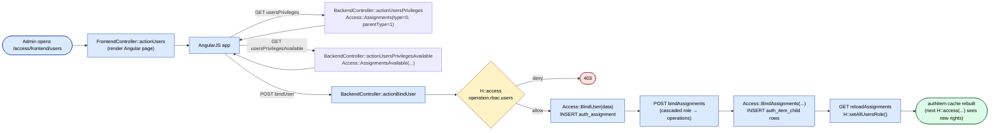
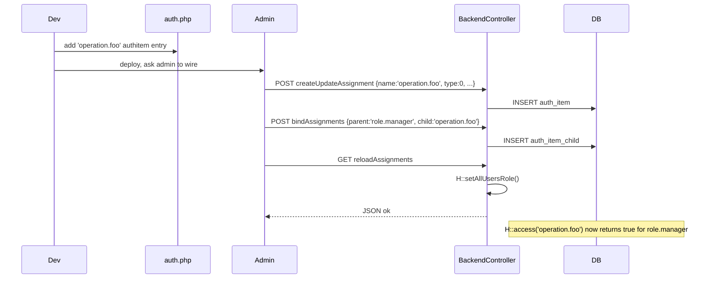

# `access` module

`access` is the back-office RBAC editor. It is the **only** place in
sd-main where the `auth_assignment` and `auth_item_child` tables get
mutated at runtime. Every other module just **reads** the result of
those tables via `H::access('operation.<...>')`.

The module is split into two controllers under one URL namespace:

- **`FrontendController`** — renders the four AngularJS pages
  (Users / Roles / Tasks / Operations) plus a handful of partial
  templates used by the page's directives.
- **`BackendController`** — JSON-only API used by the AngularJS app to
  list, mutate, bind, and unbind assignments. **No HTML; no views.**

The role hierarchy itself (operations → tasks → roles) is **declared
statically** in `protected/config/auth.php`. The access module only
edits the **assignments** (user→role, role→operation, task→operation
links) on top of that hierarchy.

## Key features

| Feature | What it does | Owner role(s) |
|---------|--------------|---------------|
| User-to-role assignment | Bind / unbind users to roles via the Users page | 1, 2 |
| Per-user privilege grid | List all roles + direct operations a user already has, plus the available ones to add | 1, 2 |
| Per-role privilege grid | Edit the operations a role grants (gated by `showAllRbacFunctions` param) | 1 |
| Per-task privilege grid | Edit the operations a task grants (gated by `showAllRbacFunctions` param) | 1 |
| Operations list | Browse the declared operation catalogue | 1 |
| Create / update assignment | Add a new operation/task/role row at runtime | 1 |
| Bind / unbind | Wire an assignment to a parent (role → operation, task → role, etc.) | 1 |
| Cache rebuild | Force `H::setAllUsersRole()` to repopulate the in-memory authitem cache | 1 |
| Filial visibility | (Configured upstream — `access` itself does not write `FILIAL_ID`; see `staff`) | – |

## Folder

```
protected/modules/access/
├── controllers/
│   ├── BackendController.php   # 17 actions — JSON-only API
│   └── FrontendController.php  # 9 actions — Angular pages + partials
└── views/
    └── frontend/               # users, roles, tasks, operations + _* partials
```

## Key entities

| Entity | Model | Notes |
|--------|-------|-------|
| User | `User` | Login record; `ROLE` integer matches an authitem name |
| Operation | (authitem, `type = 0`) | Atomic permission e.g. `operation.rbac.users` |
| Task | (authitem, `type = 1`) | Group of operations |
| Role | (authitem, `type = 2`) | Group of tasks / operations |
| Assignment | (auth_assignment row) | Links a user to an authitem |
| Hierarchy link | (auth_item_child row) | Links a parent authitem to a child authitem |
| Authitem catalogue | `Access` (component) | Static helper around the four tables; see `protected/components/Access.php` |

## Controllers

| Controller | Purpose | # actions |
|------------|---------|-----------|
| `FrontendController` | Renders Angular pages and modal/directive partials | 9 |
| `BackendController` | JSON CRUD over assignments + cache reload | 17 |

## Routes

### Frontend (HTML)

| Route | RBAC | Render | Purpose |
|-------|------|--------|---------|
| `/access/frontend/users` | `operation.rbac.users` | `users` | User → role assignment page (default action) |
| `/access/frontend/roles` | `operation.rbac.roles` + `showAllRbacFunctions` | `roles` | Role catalogue + per-role operation grid |
| `/access/frontend/tasks` | `operation.rbac.tasks` + `showAllRbacFunctions` | `tasks` | Task catalogue + per-task operation grid |
| `/access/frontend/operations` | `operation.rbac.operations` + `showAllRbacFunctions` | `operations` | Read-only operation catalogue |
| `/access/frontend/directiveSideList` | – | `_sideList` | AngularJS directive — side list partial |
| `/access/frontend/directiveGroupList` | – | `_groupList` | AngularJS directive — group list partial |
| `/access/frontend/directiveAccessTable` | – | `_accessTable` | AngularJS directive — privileges table partial |
| `/access/frontend/directiveModalForm` | – | `_modalForm` | AngularJS directive — modal form partial |
| `/access/frontend/directiveCrudBtns` | – | `_crudBtns` | AngularJS directive — CRUD button row |

### Backend (JSON)

| Route | RBAC | Method | Purpose |
|-------|------|--------|---------|
| `/access/backend/users` | `operation.rbac.users` | GET | List all users — `Access::Users()` |
| `/access/backend/usersPrivileges?userId=` | `operation.rbac.users` | GET | List operations already granted to a user |
| `/access/backend/usersPrivilegesAvailable?userId=` | `operation.rbac.users` | GET | List roles + operations still available to grant |
| `/access/backend/roles` | `operation.rbac.roles` + `showAllRbacFunctions` | GET | List all roles |
| `/access/backend/rolesPrivileges?roleId=` | same | GET | Operations granted to a role |
| `/access/backend/rolesPrivilegesAvailable?roleId=` | same | GET | Operations available to add to a role |
| `/access/backend/tasks` | `operation.rbac.tasks` + `showAllRbacFunctions` | GET | List all tasks |
| `/access/backend/tasksPrivileges?taskId=` | same | GET | Operations under a task |
| `/access/backend/tasksPrivilegesAvailable?taskId=` | same | GET | Operations available to add to a task |
| `/access/backend/operations` | `operation.rbac.operations` + `showAllRbacFunctions` | GET | List all operations |
| `/access/backend/createUpdateAssignment` | – | POST (JSON body) | `Access::CreateUpdateAssignment(...)` — upsert an authitem row |
| `/access/backend/removeAssignments` | – | POST (JSON body, array of names) | Delete authitem rows |
| `/access/backend/bindAssignments` | – | POST (JSON body) | Link role → operation / task → role (writes `auth_item_child`) |
| `/access/backend/unBindAssignments` | – | POST (JSON body) | Unlink role → operation |
| `/access/backend/bindUser` | `operation.rbac.users` | POST (JSON body) | Assign user → role/operation (writes `auth_assignment`) |
| `/access/backend/unBindUser` | `operation.rbac.users` | POST (JSON body) | Remove user → role/operation |
| `/access/backend/reloadAssignments` | – | GET | Run `H::setAllUsersRole()` to rebuild the in-memory authitem cache |

> The `createUpdateAssignment`, `removeAssignments`, `bindAssignments`,
> and `unBindAssignments` actions have **no `H::access()` guard** —
> they rely on the controller-level access rules / front-door protection
> at the URL layer. Direct POSTs from a low-privilege session will
> succeed if those rules are not enforced. See **Gotchas** below.

## Workflow 1 — Bind user to role (RBAC mutation + cache reload)

This is the canonical end-to-end RBAC flow. An admin opens the Users
page, picks a user, ticks a role in the available-roles list, hits
"save"; the AngularJS app calls `bindUser`, then `bindAssignments` for
any cascaded operations, then `reloadAssignments` to force every
running PHP worker to pick up the new rights.



## Workflow 2 — Author a new operation

A developer adds a new operation name to `protected/config/auth.php`,
then exposes it in the Operations page so an admin can wire it into a
role.



## Cross-module touchpoints

- **Reads** by **every** module — `H::access('operation.<...>')` is the
  fundamental authorization check. Consumers include `orders`,
  `clients`, `warehouse`, `inventory`, `settings`, `staff`, `team`,
  `agents`, `audit`, `report`, the entire `api*` family — basically
  every controller action that gates write or sensitive-read paths.
- **`staff` module** — internal employee CRUD; depends on `access` for
  the role half of "create user + assign role". `staff` itself does
  not call the `access` controllers — it writes `User` rows directly
  and lets the post-create `bindUser` happen from the UI.
- **`team` module** — auditor / supervisor / agent CRUD. Same dynamic
  as `staff` — `team` does not call the access module API; the UI
  wires assignments separately via `/access/backend/bindUser`.
- **`settings` module** — many of its controllers gate on
  `operation.settings.*`; those checks are evaluated against the
  cache that this module rebuilds.
- **`protected/config/auth.php`** — static declaration of the role
  hierarchy; the access module **does not** write to this file.

For the conceptual model see [`security/rbac.md`](../security/rbac.md).

## Permissions

| Action | RBAC operation |
|--------|----------------|
| Open Users page / call users / bindUser / unBindUser | `operation.rbac.users` |
| Open Roles page or rolesPrivileges API | `operation.rbac.roles` **and** `showAllRbacFunctions` param true |
| Open Tasks page or tasksPrivileges API | `operation.rbac.tasks` **and** `showAllRbacFunctions` param true |
| Open Operations page or operations API | `operation.rbac.operations` **and** `showAllRbacFunctions` param true |
| `createUpdateAssignment`, `bindAssignments`, `unBindAssignments`, `removeAssignments` | **no explicit guard** — relies on session + URL-level rules |
| `reloadAssignments` | **no explicit guard** (commented-out check in source) |

The `showAllRbacFunctions` server param is the master toggle that hides
the Roles / Tasks / Operations editor from non-development tenants —
it is configured in `protected/config/params.json` (see
[`settings.md`](./settings.md) Workflow 1.3).

## Gotchas

- **No `H::access()` on `createUpdateAssignment`,
  `bindAssignments`, `unBindAssignments`, `removeAssignments`,
  `reloadAssignments`.** These actions check nothing in code — the
  source explicitly comments out the guard on `reloadAssignments`.
  They rely on session + URL-level rules. **Do not expose the
  `/access/backend/*` namespace to non-admin sessions.**
- **`reloadAssignments` rebuilds globally.** Calling it on a busy
  tenant briefly stalls every PHP worker while `H::setAllUsersRole()`
  walks the authitem tables. Avoid calling in a tight loop.
- **`bindAssignments` accepts a raw JSON body.** It reads
  `php://input` and forwards to `Access::BindAssignments` without
  shape validation in the controller; bad payloads bubble up as PHP
  warnings rather than 400s.
- **`showAllRbacFunctions` is a per-tenant param.** If it is `false`
  the Roles / Tasks / Operations pages 403 even for super-admins. To
  edit the hierarchy you must first flip the param via the dynamic
  params API.
- **The role hierarchy is in `auth.php`, not in the DB.** Adding a
  brand-new operation requires a deploy of `protected/config/auth.php`
  followed by an `access`-module wire-up step; you cannot do it
  entirely from the UI.
- **Cache is in-process.** Each PHP worker caches `authitem` rows in
  memory. `reloadAssignments` flushes the **caller's** worker; other
  workers pick up the change on their next request. Don't rely on
  read-after-write across workers without a small delay.

## See also

- [Security / RBAC](../security/rbac.md) — conceptual model + role catalogue
- [`staff`](./staff.md) — internal employee CRUD that pairs with `access`
- [`team`](./team.md) — trading-team admin (auditor / supervisor / agent CRUD)
- [`settings`](./settings.md) — tenant-wide configuration including dynamic params
