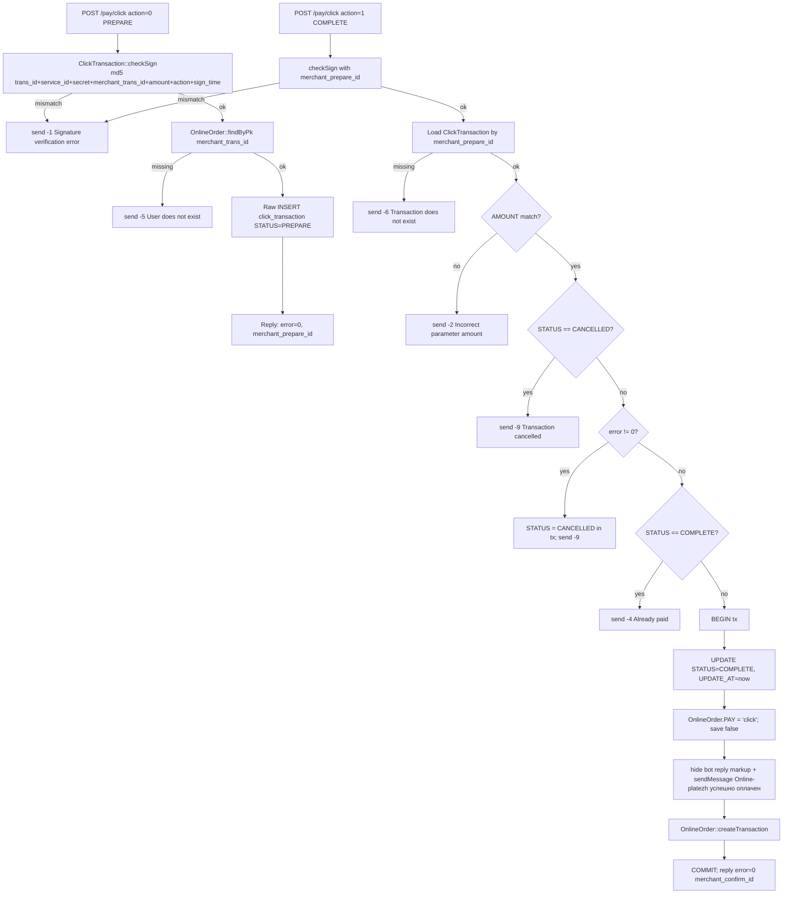

# `pay` module

`pay` is the **dealer-side payment-gateway accept layer**. Three
controllers expose three webhook entry points, one per Uzbek card
gateway:

| Gateway | URL prefix | Protocol |
|---|---|---|
| Payme (Paycom) | `/pay/payme` | JSON-RPC 2.0 over HTTPS |
| Click | `/pay/click` | x-www-form-urlencoded (HTTP GET/POST) |
| Apelsin | `/pay/apelsin` | REST JSON |

Each webhook authenticates the inbound request with the gateway's
documented signature scheme, looks up the originating
`OnlineOrder` row, writes/updates a transaction model
(`PaymeTransaction` / `ClickTransaction` / `ApelsinTransaction`), and
on success flips the order's `PAY` field, hides the Telegram bot
keyboard, sends a "payment successful" message, and calls
`OnlineOrder::createTransaction()` to mirror the payment into the
internal cashier ledger.

> **Not the same as the `payment` module.** `payment` is the internal
> cashier — operators manually post cash/bank receipts against orders.
> `pay` is the inbound webhook that receives a card-gateway callback
> after a customer pays via Payme / Click / Apelsin from the Telegram
> bot or website. **Also distinct from `sd-billing`'s payment-gateways**
> — that flow accepts cards for SaaS subscription invoices to
> SalesDoctor itself; `pay` accepts cards from a dealer's
> **end-customers** against the dealer's own orders.

## Key features

| Feature | What it does | Owner role(s) |
|---------|--------------|---------------|
| Payme JSON-RPC webhook | Implements the six Paycom merchant methods (`CheckPerformTransaction`, `CreateTransaction`, `PerformTransaction`, `CancelTransaction`, `CheckTransaction`, `GetStatement`) | system |
| Click form-encoded webhook | Implements the two Click stages (`PREPARE`, `COMPLETE`) with MD5 sign check | system |
| Apelsin REST webhook | Records inbound transaction + flips order PAY | system |
| HMAC / signature verification | Basic-auth + sha1 (Payme), MD5 sign string (Click), implicit per-merchant secret (Apelsin) | system |
| Idempotency | `ORDER_ID` ↔ `TRANS_ID` uniqueness; repeated `PerformTransaction` returns the original `perform_time` | system |
| Order-side post-payment hooks | Update `OnlineOrder.PAY`, hide bot reply markup, send Telegram confirmation, mirror to cashier via `OnlineOrder::createTransaction()` | system |
| Telegram audit log | Every request and response is forwarded to a hardcoded Telegram chat via `LogHelper::write` | system |
| File log | Each request body is written to `upload/` as `{unix-time}-{gateway}` via `Distr::saveFile` | system |

## Folder

```
protected/modules/pay/
├── PayModule.php
├── controllers/
│   ├── PaymeController.php       # 1 action — actionIndex (delegates to PaymeHelper)
│   ├── ClickController.php       # 1 action + send/raw/getModel helpers
│   └── ApelsinController.php     # 1 action — actionIndex
├── components/
│   ├── PaymeHelper.php           # JSON-RPC dispatcher + 6 method handlers
│   ├── ApelsinHelper.php         # transaction insert + getUrl()
│   └── LogHelper.php             # Telegram audit forwarder
└── models/
    ├── PaymeTransaction.php      # state machine: CREATED, COMPLETED, CANCELLED, CANCELLED_AFTER_COMPLETE
    ├── ClickTransaction.php      # state machine: PREPARE, COMPLETE, CANCELLED + checkSign + getUrl
    └── ApelsinTransaction.php    # plain insert + getAmount
```

## Key entities

| Entity | Model | Notes |
|--------|-------|-------|
| Order being paid | `OnlineOrder` (in `application.models`) | The dealer-side order placed via Telegram bot or website |
| Payme transaction | `PaymeTransaction` | Stores `TRANS_ID`, `TRANS_CREATE_TIME`, `TRANS_PERFORM_TIME`, `TRANS_CANCEL_TIME`, `STATUS`, `AMOUNT`, `REASON` |
| Click transaction | `ClickTransaction` | Stores `TRANS_ID`, `PAYDOC_ID`, `ORDER_ID`, `STATUS`, `AMOUNT`, `CREATE_AT`, `UPDATE_AT` |
| Apelsin transaction | `ApelsinTransaction` | Stores `ORDER_ID`, `TRANS_ID`, `TRANS_TYPE`, `AMOUNT` |
| Gateway config | `Config::getConfig('Client bot')` | Holds merchant keys: `payme_merchant_key`, `payme_password`, `click_merchant_id`, `click_service_id`, `click_secret_key`, `apelsin_cash`, `apelsin_desc` |
| Cashier mirror | `OnlineOrder::createTransaction()` | Posts a corresponding entry into the internal `payment` ledger after a successful gateway callback |

## Controllers

| Controller | Purpose | Actions |
|------------|---------|---------|
| `PaymeController` | JSON-RPC entry point — auth-Basic check, then dispatch via `PaymeHelper::run()` | `actionIndex` |
| `ClickController` | Click `PREPARE` / `COMPLETE` callback handler with MD5 sign verification | `actionIndex` (+ `send`, `raw`, `getModel` non-action helpers) |
| `ApelsinController` | Apelsin REST callback — records transaction + flips order | `actionIndex` |

Each `actionIndex` is the gateway's webhook URL. Auth is **per-gateway**,
not via Yii sessions: Payme uses HTTP Basic, Click uses sign-string,
Apelsin uses implicit-trust by merchant URL.

## Routes

| Route | Method | Auth | Purpose |
|-------|--------|------|---------|
| `/pay/payme` | POST (JSON-RPC) | HTTP Basic (`Paycom:{password}`) — sha1 compared | Single entry for all six Paycom methods |
| `/pay/click` | POST/GET (form-encoded) | MD5 sign string check on every request | Two stages: `action=0` (PREPARE), `action=1` (COMPLETE) |
| `/pay/apelsin` | POST (JSON) | Implicit per-merchant URL trust + key in body | Inbound transaction notification |

## Workflow 1 — Payme: CreateTransaction → PerformTransaction

```mermaid
sequenceDiagram
  participant Payme
  participant PaymeController
  participant Helper as PaymeHelper
  participant DB
  participant Order as OnlineOrder
  participant Cashier as payment ledger

  Payme->>PaymeController: POST /pay/payme JSON-RPC CreateTransaction
  PaymeController->>Helper: run()
  Helper->>Helper: login() — sha1(base64-decode(Basic)) vs sha1('Paycom:'+password)
  alt auth fail
    Helper-->>Payme: error -32504 Incorrect login
  end
  Helper->>Helper: setRequest() — read php://input
  Helper->>Helper: getOrder() — OnlineOrder::findByPk(params.account.order_id)
  Helper->>Helper: amount check (50_000 <= amount <= 9_999_999_900)
  Helper->>Helper: amount == order.SUMMA * 100
  Helper->>DB: SELECT payme_transaction WHERE ORDER_ID
  alt existing TRANS_ID mismatch
    Helper-->>Payme: error -31099 order-not-found
  end
  Helper->>DB: INSERT/UPDATE payme_transaction STATUS=CREATED
  Helper-->>Payme: {create_time, transaction, state:1}

  Payme->>PaymeController: POST PerformTransaction {id}
  PaymeController->>Helper: run()
  Helper->>DB: findByAttributes TRANS_ID
  Helper->>DB: BEGIN
  Helper->>DB: UPDATE STATUS=COMPLETED, TRANS_PERFORM_TIME
  Helper->>Order: order.PAY = 'payme'; save(false)
  Helper->>Order: createTransaction() — mirror to cashier
  Order->>Cashier: INSERT payment ledger row
  Helper->>DB: COMMIT
  Helper-->>Payme: {perform_time, transaction, state:2}
```

## Workflow 2 — Click: PREPARE → COMPLETE



## Workflow 3 — Apelsin: single-shot transaction record

```mermaid
sequenceDiagram
  participant Apelsin
  participant ApelsinController
  participant Helper as ApelsinHelper
  participant DB
  participant Order as OnlineOrder

  Apelsin->>ApelsinController: POST /pay/apelsin {userid,transactionId,transaction_type,amount}
  ApelsinController->>Helper: createTransaction(data)
  Helper->>DB: INSERT apelsin_transaction ORDER_ID/TRANS_ID/TRANS_TYPE/AMOUNT
  alt save fails
    Helper-->>ApelsinController: null
    ApelsinController-->>Apelsin: {status:false}
  end
  Helper-->>ApelsinController: model
  ApelsinController->>Order: findByPk(trans.ORDER_ID); PAY='apelsin'; save()
  ApelsinController->>Order: hide bot markup + sendMessage
  ApelsinController->>Order: createTransaction() — mirror to cashier
  ApelsinController-->>Apelsin: {status:true}
```

## Cross-module touchpoints

- **`onlineOrder`** — every successful callback flips `OnlineOrder.PAY`
  to `'payme' | 'click' | 'apelsin'` and calls
  `OnlineOrder::createTransaction()` to push a matching row into the
  internal cashier ledger.
- **`api.OnlineOrder3Controller`** — `pay` controllers import this
  controller imperatively (`Yii::import`, `new
  OnlineOrder3Controller(...)`) just to call `hideMessageReplyMarkup`
  and `send('sendMessage', ...)`. There is **no proper service
  abstraction** for the bot side effect.
- **`payment` module (cashier ledger)** — receives the mirrored
  payment via `OnlineOrder::createTransaction()`. The cashier sees the
  paid amount but **not** the gateway transaction id.
- **`User` table** — both `payme` and `click` log in a service user
  (`User` row with `LOGIN='payme'` / `LOGIN='click'`) before mutating
  data, so that downstream audit logging attributes writes to a
  named system user.
- **Telegram** — `LogHelper::write` forwards every request body and
  every outbound response to a **hardcoded chat id `122420625`** via
  a **hardcoded bot token** (in `LogHelper.php`).

## Permissions

| Action | Auth |
|--------|------|
| `/pay/payme` | HTTP Basic — `sha1('Paycom:' + $merchant_password)` must equal `sha1(base64_decode(Authorization header))` |
| `/pay/click` | MD5 sign string check on every payload (in `ClickTransaction::checkSign`) |
| `/pay/apelsin` | Implicit — no signature check in source; relies on URL secrecy and `Distr::saveFile` log |

None of the three actions go through `H::access()`. They are public
webhook URLs.

## Gotchas

- **Hard-coded Telegram bot token and chat id in `LogHelper.php`.**
  Every payment notification is forwarded to a single developer chat.
  Rotate or you bleed payment payloads.
- **Service users `'payme'` and `'click'` log in via plaintext
  password equal to the login name.** `new UserIdentity('payme',
  'payme')` and `new UserIdentity('click', 'click')` in the
  controllers; if those `User` rows are missing or the password
  scheme changes, callbacks 500.
- **`PaymeController::actionIndex` does not check method/HTTP.** Any
  GET to `/pay/payme` runs `PaymeHelper::run`, which then 400s on
  empty body — but it still does the Telegram log first.
- **`ClickController::actionIndex` uses `$_REQUEST`** (`getData()`
  returns `$_REQUEST`), not the JSON body. Don't switch to a body
  parser without coordinating with Click's docs — they post form-encoded.
- **`ApelsinController` does not verify the signature.** The
  controller imports the data, writes the transaction, flips the
  order. There is no HMAC step in source. Confirm with your Apelsin
  contract before exposing the URL publicly.
- **Idempotency is by `TRANS_ID`, not `ORDER_ID`.** Payme can issue a
  second `TRANS_ID` against the same `ORDER_ID`; the helper returns
  `-31099 order-not-found` to force the gateway to retry with the
  original id. This is **intentional** — do not "fix" it.
- **`ClickController::actionIndex` writes via a raw SQL `INSERT`** —
  the active-record save was commented out by the original author
  ("I don't understand this model doesn't work"). Schema changes to
  `click_transaction` must be reflected in the raw SQL string.
- **Amount unit differs.** Payme expects `tiyin` (so `amount *
  100`); Click expects `so'm`; Apelsin expects `tiyin`. The helpers
  divide/multiply by 100 inconsistently — see each
  `getAmount()` accessor before trusting a raw `AMOUNT` field.
- **`Distr::saveFile` writes every request to `upload/`** with the
  unix-timestamped filename. This grows unbounded — clean it
  periodically.
- **No retry / dead-letter.** A 500 inside `PerformTransaction`
  leaves the gateway to retry; if the post-payment Telegram bot send
  500s the transaction is still committed (it's outside the DB
  transaction) — so a paid order may not get a confirmation message.

## See also

- [`payment`](./payment.md) — internal cashier ledger that receives the
  mirrored card payments
- [`onlineOrder`](./onlineOrder.md) — order entity that owns `PAY` and
  `createTransaction()`
- [`integration`](./integration.md) — outbound integration patterns
- sd-billing payment-gateways docs — distinct flow for subscription
  invoices
