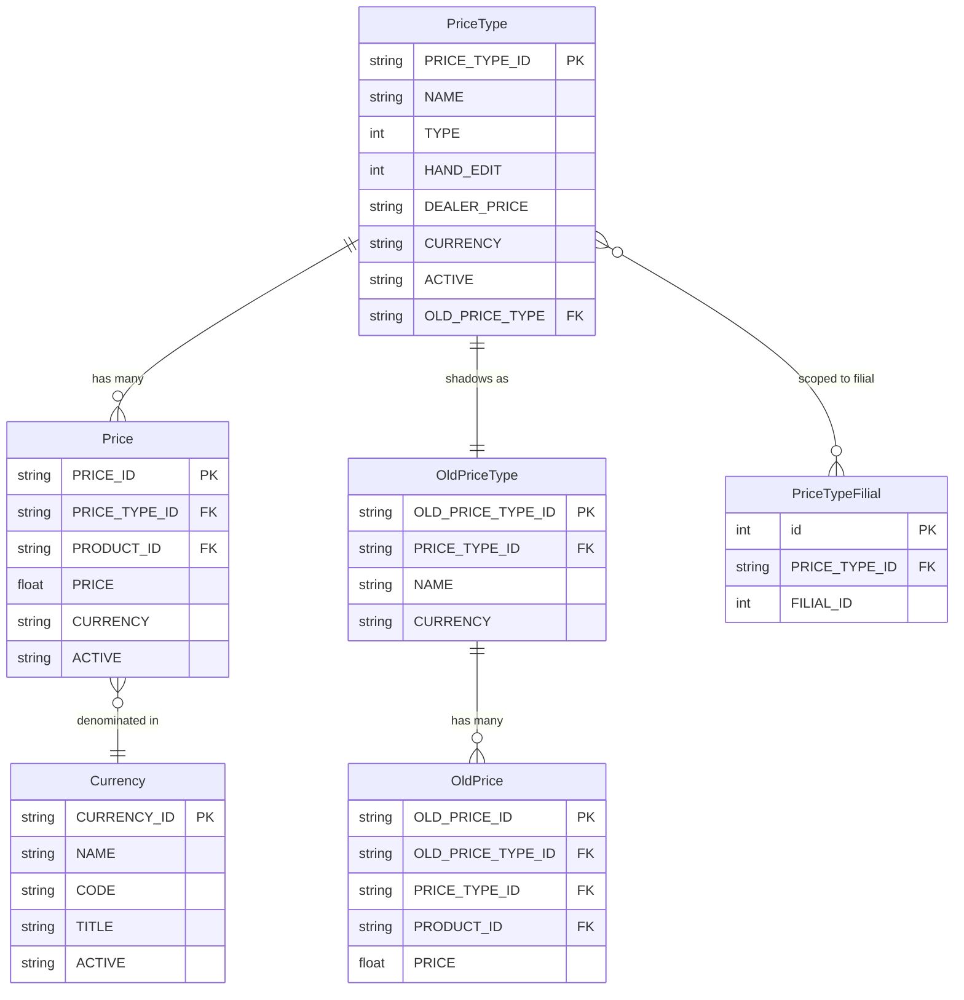
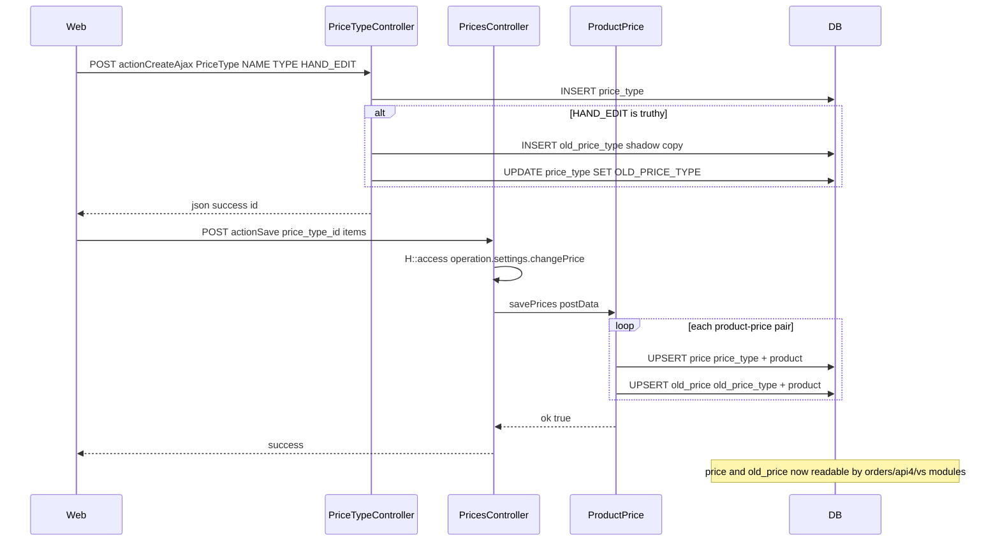
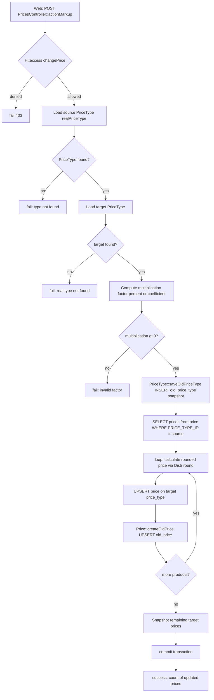
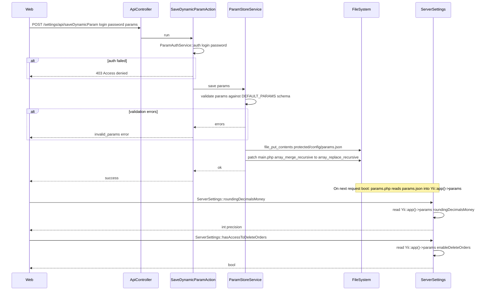

# `settings` module

`settings` is the catch-all admin namespace for **everything that is
configured once per tenant and read everywhere**: pricing, currencies,
master data (products / brands / categories / regions / units), dynamic
feature flags, integrations, Telegram bots, license, backup, and the
system log viewer. It has ~50 controllers grouped by area below.

The high-value flows — price types, bulk markup, and dynamic params —
are documented as full workflows further down (Workflows 1.1–1.3); the
other controllers follow the standard `AjaxCrudBehavior` list/create/
update pattern and are listed for cross-referencing.

## Key features

| Feature | What it does | Owner role(s) |
|---------|--------------|---------------|
| Price types + per-product prices | `PriceTypeController`, `PricesController` — define price types, edit grids, bulk markup, Excel import | 1 / Finance |
| Currencies | `CurrencyController` — multi-currency catalogue + exchange rate | 1 / Finance |
| Dynamic params (feature flags) | `ApiController` + `ParamsController` — JSON-RPC and UI for `params.json` | 1 |
| Master data — products | `ProductController`, `BrandController`, `ProducerController`, `ProductCategoryController`, `ProductGroupController`, `ProductCaseTypeController`, `TaraController`, `UnitController` | 1 |
| Master data — clients | `ClientCategoryController`, `ClientClassController`, `ClientFirmController`, `ClientTypeController`, `ChannelController`, `SegmentController` | 1 |
| Geography | `RegionController`, `CityController` | 1 |
| Discount & loyalty | `SkidkaController`, `SkidkaManualController`, `BonusController`, `RlpBonusController`, `LoyaltyController` | 1 / Finance |
| Inventory | `InventoryGroupController`, `InventoryTypeController` | 1 |
| Order workflow | `OrderCommentController`, `RejectController`, `RejectDefectController`, `ClosedController`, `WorkingDaysController` | 1 |
| Tasks / planning | `TaskTypeController`, `PhotoReportCategoryController`, `TagController`, `TradeDirectionController` | 1 |
| Integrations & ERP | `IntegrationController`, `Smartup5xController`, `SmartUpController`, `DilerController`, `RoyaltyController` | 1 |
| Telegram bots | `TgBotController`, `TgBot2Controller`, `TgBot3Controller`, `TelegramReportController` | 1 |
| Permissions UI | `PermissionController` (subset of access; tenant-side toggle) | 1 |
| Knowledge base | `KnowledgeCategoryController`, `KnowledgePostController` | 1 |
| System admin | `BackupController`, `LicenseController`, `SystemLogController`, `PrinterController` | 1 |
| Datatable prefs + cache truncate | `SettingsController` — saves per-user column/filter prefs and truncates `cache` | – / 1 |
| Generic catalog API | `ApiController` (under `/settings/api/*`) — dynamic param save / get + substatus get | tenant-side automation |
| Bonus / royalty / applications | `BonusController`, `RoyaltyController`, `ApplicationsController` | 1 / Finance |

## Folder

```
protected/modules/settings/
├── controllers/             # ~50 active controllers (see Controllers table below)
├── components/
├── views/                   # one folder per controller
└── widgets/
```

## Key entities (pricing core)

| Entity | Model | Notes |
|--------|-------|-------|
| Price type | `PriceType` | `TYPE`, `HAND_EDIT`, `DEALER_PRICE`, `CURRENCY`, `OLD_PRICE_TYPE` FK |
| Shadow price type | `OldPriceType` | History snapshot tied to a `PriceType` |
| Price | `Price` | Per-product, per-price-type selling price |
| Old price | `OldPrice` | Snapshot price for diff at delivery |
| Filial-scoped price type | `PriceTypeFilial` | Which filials can see / use a given price type |
| Currency | `Currency` | Multi-currency catalogue |
| Dynamic params | `params.json` (file) | Tenant-wide feature flags / numeric settings — read at boot into `Yii::app()->params` |
| Order sub-statuses | `upload/status_config.txt` (file) | Per-tenant sub-status labels |

## Controllers (grouped by area)

### Pricing & currency

| Controller | Purpose |
|------------|---------|
| `PriceTypeController` | CRUD over `PriceType` (+ `OldPriceType` shadow when `HAND_EDIT=1`) — gated by `operation.settings.priceType` |
| `PricesController` | Per-product price grids, bulk markup, Excel import — gated by `operation.settings.changePrice` |
| `CurrencyController` | CRUD over `Currency` |

### Dynamic params, API, knobs

| Controller | Purpose |
|------------|---------|
| `ApiController` | Backend API: `SaveDynamicParamAction`, `GetDynamicParamAction`, `GetSubstatusesAction` |
| `ParamsController` | Render the params editor UI |
| `SettingsController` | Per-user datatable prefs (`actionSaveSettings`, `actionSaveHeaderOrders`), cache truncate (`actionTruncateCache`) |
| `PermissionController` | Tenant-side simple permission grid (subset of `access` module) |

### Products, brands, categories, units, packaging

| Controller | Purpose |
|------------|---------|
| `ProductController` | Product master CRUD |
| `BrandController` | Brand master CRUD |
| `ProducerController` | Producer/manufacturer master CRUD |
| `ProductCategoryController` | Product category tree CRUD |
| `ProductGroupController` | Product group CRUD |
| `ProductCaseTypeController` | Packaging/case-type catalogue |
| `TaraController` | Returnable packaging (tara) catalogue |
| `UnitController` | Unit-of-measure catalogue |
| `BonusController` | Bonus rules (multi-buy, gift) |
| `RlpBonusController` | RLP-style bonus / discount rules |

### Clients, segmentation, geography

| Controller | Purpose |
|------------|---------|
| `ClientCategoryController` | Client category catalogue |
| `ClientClassController` | Client class catalogue |
| `ClientFirmController` | Client firm/legal-entity catalogue |
| `ClientTypeController` | Client type catalogue |
| `ChannelController` | Sales channel catalogue (HoReCa, retail, etc.) |
| `SegmentController` | Customer segment catalogue |
| `RegionController` | Region catalogue (sub-national) |
| `CityController` | City catalogue |

### Order workflow

| Controller | Purpose |
|------------|---------|
| `OrderCommentController` | Standardised order-comment catalogue |
| `RejectController` | Order reject reasons |
| `RejectDefectController` | Defect reject reasons |
| `ClosedController` | Closed-day / blackout day catalogue |
| `WorkingDaysController` | Working day calendar |
| `LoyaltyController` | Loyalty programme settings |
| `SkidkaController` | Discount catalogue |
| `SkidkaManualController` | Manual discount overrides |

### Inventory, planning, tasks

| Controller | Purpose |
|------------|---------|
| `InventoryGroupController` | Inventory group catalogue |
| `InventoryTypeController` | Inventory type catalogue |
| `TaskTypeController` | Task type catalogue (used by planning) |
| `PhotoReportCategoryController` | Photo-report category catalogue |
| `TagController` | Tag catalogue |
| `TradeDirectionController` | Trade direction catalogue |

### Integrations, ERP, dealer

| Controller | Purpose |
|------------|---------|
| `IntegrationController` | Outbound integration registry |
| `SmartUpController` | SmartUp ERP integration |
| `Smartup5xController` | SmartUp 5.x variant integration |
| `DilerController` | Dealer / sub-distributor catalogue |
| `RoyaltyController` | Royalty / partner-fee config |
| `ApplicationsController` | Tenant-installed applications registry |

### Telegram bots

| Controller | Purpose |
|------------|---------|
| `TgBotController` | Telegram bot v1 config |
| `TgBot2Controller` | Telegram bot v2 config |
| `TgBot3Controller` | Telegram bot v3 config |
| `TelegramReportController` | Scheduled Telegram report config |

### Knowledge base

| Controller | Purpose |
|------------|---------|
| `KnowledgeCategoryController` | KB category CRUD |
| `KnowledgePostController` | KB post CRUD |

### System admin

| Controller | Purpose |
|------------|---------|
| `BackupController` | DB backup trigger + listing |
| `LicenseController` | License key view + status |
| `SystemLogController` | Browse runtime logs |
| `PrinterController` | Print template config |
| `ViewController` | Misc render endpoints |
| `UserController` | Misc user list endpoint (avoids the `staff` module's CRUD) |

> `AdminpriceController`, `AkbCategoryController`,
> `InventoryController`, `PlanController`, `PriceController`,
> `SubProductCategoryController` are present as `*.obsolete` files
> — routed only via legacy URL aliases (if any) and slated for
> deletion.

## Workflow entry points (pricing + params core)

| Trigger | Controller / Action / Job | Notes |
|---|---|---|
| Web (admin) | `PriceTypeController::actionIndex` | List / create / update price types; guarded by `operation.settings.priceType` |
| Web (admin) | `PriceTypeController::actionCreateAjax` | Create a new `PriceType`; also bootstraps an `OldPriceType` shadow when `HAND_EDIT=1` |
| Web (admin) | `PriceTypeController::actionUpdateAjax` | Update an existing `PriceType`; filial-only guard via `FilialComponent::isOnlyFilial()` |
| Web (admin) | `PricesController::actionIndex` | Render per-product price grid for a given price type |
| Web (admin) | `PricesController::actionSave` | Save a single product-price batch; calls `ProductPrice::savePrices`; guarded by `operation.settings.changePrice` |
| Web (admin) | `PricesController::actionMultiSave` | Bulk-save prices for all dealer price types assigned to the current filial |
| Web (admin) | `PricesController::actionSaveWithout` | Manual per-item price override on a non-HAND\_EDIT price type; writes `price` + `old_price` rows |
| Web (admin) | `PricesController::actionMarkup` | Compute and apply a percentage or coefficient markup across a category; guarded by `operation.settings.changePrice` |
| Web (admin) | `PricesController::actionImportExcel` | Upload an Excel file to bulk-import prices (`Price::ImportExcel`) |
| Web (admin) | `CurrencyController::actionIndex` | List / create / update currency records |
| Web (admin) | `CurrencyController::actionUpdateAjax` | Update a `Currency` record in-place |
| Web (admin) | `ParamsController::actionIndex` | Render the dynamic params configuration UI |
| API (authenticated) | `ApiController` → `SaveDynamicParamAction` | POST: validate and persist dynamic params to `protected/config/params.json`; also patches `main.php` `array_merge_recursive` → `array_replace_recursive` |
| API (authenticated) | `ApiController` → `GetDynamicParamAction` | POST: return current dynamic params + default schema |
| API (authenticated) | `ApiController` → `GetSubstatusesAction` | POST: return current order sub-status configuration |
| Web — save substatus | `ApiController` → `SaveDynamicParamAction` (substatus branch) | Sub-status saving handled by a branch inside `SaveDynamicParamAction::run()` (lines 27–43) |
| Web (admin) | `SettingsController::actionSaveSettings` | Persist per-user datatable column/filter preferences to `tableControl` |
| Web (admin) | `SettingsController::actionSaveHeaderOrders` | Persist per-user datatable column order to `tableControl` |
| Web (admin) | `SettingsController::actionTruncateCache` | Truncate the `cache` table and redirect |

## Domain entities (pricing ER)



## Workflow 1.1 — Price type and per-product price setup

An admin defines a price type (e.g., "Retail", "Dealer"), then sets the
selling price for each product under that type. The saved prices are
immediately visible to order creation and the mobile agent stock view.



## Workflow 1.2 — Bulk markup recalculation

An admin applies a percentage or coefficient markup to a source price
type, writing computed prices into a target price type. All affected
products get both a `price` row and an `old_price` snapshot for
historical diffing.



## Workflow 1.3 — Dynamic params configuration

An admin (or an inter-server automation) writes a validated JSON bag
of tenant-wide feature flags and numeric settings to `params.json`.
The file is merged into `Yii::app()->params` at boot time and consumed
everywhere via `ServerSettings` helper methods.



## Cross-module touchpoints

- Reads: `settings.PriceType` — consumed by `orders.CreateOrderController`, `orders.ImportOrderController`, `vs.CreateOrderController` (order line pricing)
- Reads: `settings.Price` — consumed by `api4.CreateVsReturnAction`, `api4.CreateReplaceAction`, `api4.CreateDefectAction`, `PriceService::getPrices` (mobile agent stock price lookup)
- Reads: `settings.OldPrice` — consumed by `vs.CreateOrderController` (historical price diff), `clients.FinansController` (debt calculation at delivery)
- Reads: `settings.PriceType` + `settings.OldPriceType` — consumed by `orders.RecoveryOrderController` (order recovery pricing)
- Reads: `settings.Currency` — consumed by `PricesController::actionConfig` (format block), `PriceTypeController::actionCreateAjax` (currency assignment)
- Reads: `settings.PriceTypeFilial` — consumed by `PricesController::actionMultiSave` (filter price types to current filial's dealer types)
- Writes: `Yii::app()->params` (via `params.json`) — consumed by `models.Order` (`debtNewOrder` flag), `models.ServerSettings` (`roundingDecimalsMoney`, `visitDistance`, `enableDeleteOrders`, `hasNotAccessToEditPurchase`, etc.), `components.Formatter` (money/qty rounding throughout the app)
- Writes: `upload/status_config.txt` — consumed by `ServerSettings::substatuses()` (order sub-status labels on order views)
- Writes: `tableControl` — consumed by `SettingsController::actionSaveSettings` / `actionSaveHeaderOrders` (per-user datatable preferences, read back by all datatable pages)
- Master data reads — `Product`, `Brand`, `ProductCategory`, `Region`, `City`, `Unit`, `Tara`, `ClientCategory`, `Segment`, `Channel`, `Skidka`, `Bonus`, `TaskType`, `OrderComment`, `Reject` etc. are read by virtually every operational module.

## Gotchas

- `PricesController::actionSaveWithout` only operates on price types where `HAND_EDIT = 0`; if the price type is already in manual-edit mode the method silently no-ops without an error response.
- `PricesController::actionMultiSave` filters to filial-scoped dealer price types via a raw SQL join on `price_type_filial`; if `FilialComponent::isOnlyFilial()` returns false (super-admin context) the filter is skipped and all price types are processed.
- `ParamStoreService::save` also patches `protected/config/main.php` in place (replacing `array_merge_recursive` with `array_replace_recursive`) to ensure dynamic params take precedence over static config. This is a filesystem mutation on the app config and requires write permission on `main.php` at runtime.
- `SaveDynamicParamAction` uses a bespoke `ParamAuthService::auth` credential check on top of the standard Yii session auth; a missing or wrong credential returns 403 even for a logged-in admin.
- Sub-statuses are stored as a plain text JSON file at `upload/status_config.txt` (outside `protected/`). After a save, `ServerSettings::$_substatuses` is cleared via PHP `ReflectionClass` because the static cache is not reset by the normal request lifecycle.
- The `OldPrice` / `OldPriceType` shadow tables exist for price-history diffing in orders. Every bulk markup run calls `PriceType::saveOldPriceType()` first; skipping or partially-completing a markup transaction can leave the shadow in an inconsistent state if the transaction rolls back mid-loop.
- `PriceType` rows with `DEALER_PRICE = 1` are the only ones pushed to the mobile app via `api4`; non-dealer price types are invisible to field agents.
- `BackupController` writes backup files to a path that may not be cleaned automatically — monitor disk; `SystemLogController` reads logs straight from the filesystem without rotation.
- Telegram-bot controllers store secrets in `Config::getConfig('Client bot')` — rotate at the same time as the gateway credentials in [`pay`](./pay.md). The four `Tg*Controller` flavours coexist for historical reasons; new tenants only need v3.

## See also

- [`access`](./access.md), [`staff`](./staff.md), [`team`](./team.md), [`pay`](./pay.md), [Security / RBAC](../security/rbac.md)
