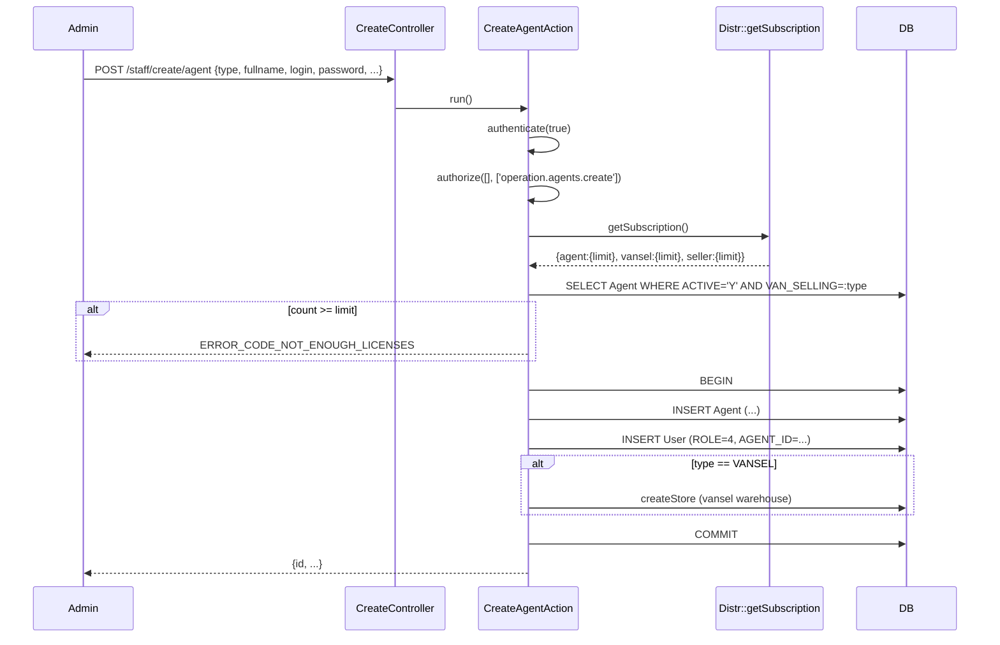
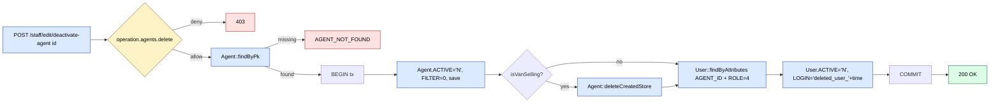
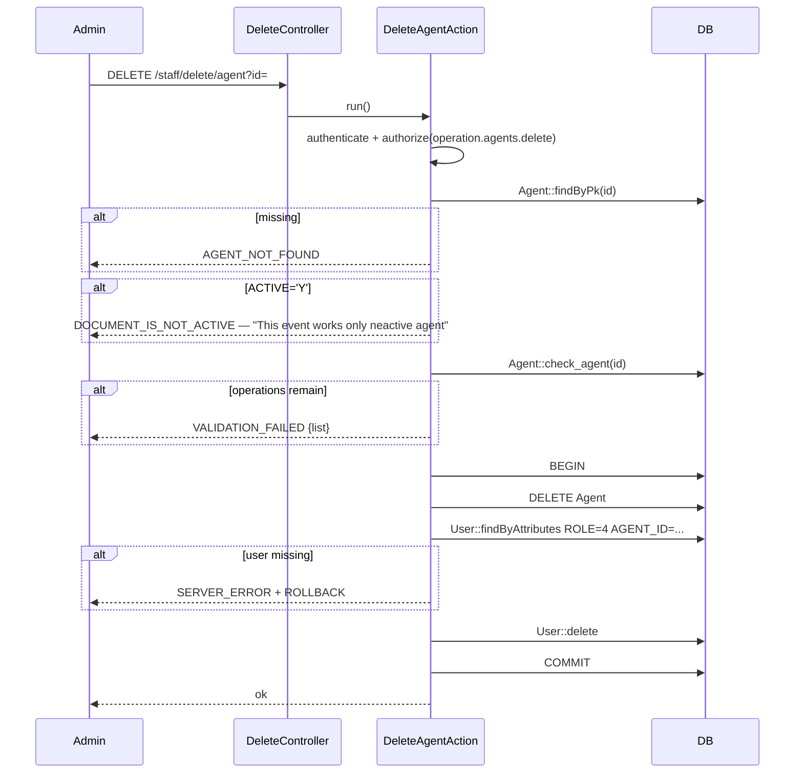

# `staff` module

`staff` is the **internal HR module for the field force**. Despite the
generic name it is **scoped to agents, supervisors, and expeditors**
— not to back-office employees (those are managed in `team` and via
the `access` module's user CRUD).

Unlike most legacy modules in sd-main, `staff` is structured **REST-ish**
— five controllers (`Create`, `Edit`, `Delete`, `List`, `View`) each
expose a flat list of named actions that delegate to a dedicated
`*Action` class under `protected/modules/staff/actions/{agent,
supervisor, expeditor}/`. Each action class extends `ApiAction` and
returns JSON via `sendResult` / `sendError`.

This is the **new-style** sd-main module pattern — closer to the
`api4` flow than to the `AjaxCrudBehavior` used by `team` and
`settings`.

| Relationship | Distinct from |
|---|---|
| `staff` | Field-force CRUD (agent, supervisor, expeditor) |
| [`agents`](./agents.md) | Field-force **runtime** — daily plans, KPI, GPS, mobile sync |
| [`team`](./team.md) | Trading-team admin shell (auditor, agent, supervisor, generic user) |
| [`access`](./access.md) | RBAC binding (`bindUser`, `bindAssignments`) for the user side of `staff`'s create flow |

## Key features

| Feature | What it does | Owner role(s) |
|---------|--------------|---------------|
| Create agent / vansel / seller | `CreateController::agent` — license-checked CRUD with `Agent::TYPE_AGENT / TYPE_VANSEL / TYPE_SELLER` | 1 / 2 |
| Edit agent + filter flag | `EditController::agent` / `agent-filter` | 1 / 2 |
| Deactivate / reestablish agent | Soft-disable (`ACTIVE='N'`) without losing history; matching `User` row is also deactivated and `LOGIN` is suffixed with `deleted_user_{ts}` | 1 / 2 |
| Hard delete agent | `DeleteController::agent` — only allowed if `ACTIVE='N'` **and** no open documents (`Agent::check_agent`) | 1 |
| Agent config (paket) | `EditController::agent-config` — per-company / per-group / per-agent settings package | 1 / 2 |
| Agent limit (subscription license) | `CreateController::agent-limit` / `agent-limit-partial` + paired delete | 1 |
| Create / edit / delete supervisor | `Create/Edit/DeleteController::supervisor` | 1 / 2 |
| Create / edit expeditor + config + filter | `Create/Edit/DeleteController::expeditor` family | 1 / 2 |
| Catalogue listing (paket) | `ListController::agent-paket` / `expeditor-paket` | 1 / 2 |
| Pre-delete / pre-deactivate checks | `ListController::before-delete-agent` / `before-deactivate-agent` | – |
| View pages (HTML) | `ViewController` — renders Angular pages for agents / supervisors / expeditors / agent-limitation | 1 / 2 |

## Folder

```
protected/modules/staff/
├── StaffModule.php        # registers staff.* + agents.* imports
├── README.md              # the original REST contract; this doc supersedes it
├── controllers/
│   ├── CreateController.php   # 5 actions, all delegate to *Action classes
│   ├── EditController.php     # 9 actions
│   ├── DeleteController.php   # 6 actions
│   ├── ListController.php     # 4 actions
│   └── ViewController.php     # 4 actions (HTML render only)
├── actions/
│   ├── agent/                 # 15 ApiAction classes
│   ├── supervisor/            # 3 ApiAction classes
│   └── expeditor/             # 6 ApiAction classes
└── views/
    ├── agents/
    ├── supervisor/
    └── expeditor/
```

## Key entities

| Entity | Model | Notes |
|--------|-------|-------|
| Field agent | `Agent` (in `agents` module) | `VAN_SELLING` int = `TYPE_AGENT (0) / TYPE_VANSEL (1) / TYPE_SELLER (2)`; `ACTIVE = Y/N` |
| Paired user | `User` (`ROLE = 4`) | Created alongside `Agent`; on deactivate `LOGIN` is suffixed `deleted_user_{ts}` to free the login string |
| Supervisor | `Supervayzer` (in `agents` module) | `ACTIVE = Y/N` |
| Expeditor | `Ekspeditor` (in `agents` module) | Pairs with a `User` of expeditor role |
| Agent config | `AgentPaket` | Per-company / per-group / per-agent settings package — see `EditAgentConfigAction` |
| Subscription limits | `Distr::getSubscription()` | License caps for agent / vansel / seller |
| VanSelling warehouse | `Warehouse` (`TYPE = vansel`) | Each `vansel` agent owns a warehouse; on delete `Agent::deleteCreatedStore` cleans up |

## Controllers

| Controller | Style | # actions |
|------------|-------|-----------|
| `CreateController` | Action map → `application.modules.staff.actions.*` classes | 5 |
| `EditController` | Action map → `application.modules.staff.actions.*` classes | 9 |
| `DeleteController` | Action map → `application.modules.staff.actions.*` classes | 6 |
| `ListController` | Action map → `application.modules.staff.actions.*` classes | 4 |
| `ViewController` | Direct `Controller` with `H::access` + `render` | 4 |

## Routes

### View (HTML)

| Route | RBAC | Render |
|-------|------|--------|
| `/staff/view/agent` | `operation.agents.list` | `agents/index` |
| `/staff/view/limitation-agent` | `operation.agents.list` | `agents/limitation/index` |
| `/staff/view/expeditor` | `operation.expeditor.list` | `expeditor/index` |
| `/staff/view/supervisor` | `operation.supervayzer.list` | `supervisor/index` |

### Agent (JSON)

| Route | Method | RBAC | Action class |
|-------|--------|------|--------------|
| `/staff/create/agent` | POST | `operation.agents.create` | `CreateAgentAction` |
| `/staff/create/agent-limit` | POST | – | `CreateAgentLimitAction` |
| `/staff/create/agent-limit-partial` | POST | – | `CreateAgentLimitPartialAction` |
| `/staff/edit/agent` | POST | `operation.agents.update` | `EditAgentAction` |
| `/staff/edit/deactivate-agent` | POST | `operation.agents.delete` | `EditDeactivateAgentAction` |
| `/staff/edit/reestablish-agent` | POST | – | `EditReestablishAgentAction` |
| `/staff/edit/agent-filter` | POST | – | `EditAgentFilterAction` |
| `/staff/edit/agent-config` | POST | `operation.agents.paket` | `EditAgentConfigAction` |
| `/staff/delete/agent` | DELETE | `operation.agents.delete` | `DeleteAgentAction` |
| `/staff/delete/agent-config` | DELETE | – | `DeleteAgentConfigAction` |
| `/staff/delete/agent-limit` | DELETE | – | `DeleteAgentLimitAction` |
| `/staff/delete/agent-limit-partial` | DELETE | – | `DeleteAgentLimitPartialAction` |
| `/staff/list/before-delete-agent` | GET | – | `ListBeforeDeleteAgentAction` |
| `/staff/list/before-deactivate-agent` | GET | – | `ListBeforeDeactivateAgentAction` |
| `/staff/list/agent-paket` | POST | – | `ListAgentPaketAction` |

### Supervisor (JSON)

| Route | Method | Action class |
|-------|--------|--------------|
| `/staff/create/supervisor` | POST | `CreateSupervisorAction` |
| `/staff/edit/supervisor` | POST | `EditSupervisorAction` |
| `/staff/delete/supervisor` | DELETE | `DeleteSupervisorAction` |

### Expeditor (JSON)

| Route | Method | Action class |
|-------|--------|--------------|
| `/staff/create/expeditor` | POST | `CreateExpeditorAction` |
| `/staff/edit/expeditor` | POST | `EditExpeditorAction` |
| `/staff/edit/expeditor-config` | POST | `EditExpeditorConfigAction` |
| `/staff/edit/expeditor-filter` | POST | `EditExpeditorFilterAction` |
| `/staff/delete/expeditor-config` | DELETE | `DeleteExpeditorConfigAction` |
| `/staff/list/expeditor-paket` | POST | `ListExpeditorPaketAction` |

## Workflow 1 — Create agent (license-checked, paired user)

`CreateAgentAction` enforces the per-type subscription cap before
inserting either the `Agent` row, or the paired `User` row. If the
agent type is `TYPE_VANSEL` the action also creates the vansel
warehouse via `Agent::createStore` (omitted here for brevity).



## Workflow 2 — Soft-deactivate agent (with paired user lockout)

Deactivating an agent **does not** delete the row — it sets
`ACTIVE='N'`, drops the `FILTER` flag, removes the vansel-warehouse
link if applicable, and **renames the paired user's `LOGIN`** so the
slot can be re-used.



## Workflow 3 — Hard-delete agent (only after deactivation)

`DeleteAgentAction` refuses to delete an active agent and refuses to
delete an inactive agent who still has open documents (the
`Agent::check_agent` business check). Once both conditions pass it
deletes the `Agent`, the paired `User`, and runs cleanup helpers.



## Cross-module touchpoints

- **`agents` module.** `staff` is the **admin write surface** for
  `Agent`, `Supervayzer`, `Ekspeditor` rows; the `agents` module
  itself is the runtime that reads those rows for KPI, GPS, daily
  plan, mobile sync. The `StaffModule::init()` explicitly imports
  `agents.models.*` so action classes can `new Agent(...)`.
- **`access` module.** Every `staff` create action also writes a
  `User` row with the appropriate `ROLE`. The actual RBAC
  assignment (user → operation grants beyond the role default) is
  done in the UI via `/access/backend/bindUser`. `staff` itself
  does not call the `access` API.
- **`warehouse` module.** Creating a `TYPE_VANSEL` agent provisions a
  vansel warehouse; deactivating one unlinks it via
  `Agent::deleteCreatedStore`.
- **`Distr::getSubscription`.** The license-limit check on agent
  create reads the subscription contract — this is the gate that
  rejects new agents past your purchased seat count.
- **`Report::getSpravochnik('Agent', ...)`.** Used to count active
  agents per type for the license check.

## Permissions

| Action | RBAC operation |
|--------|----------------|
| View agent list | `operation.agents.list` |
| Create agent | `operation.agents.create` |
| Update agent | `operation.agents.update` |
| Deactivate / delete agent | `operation.agents.delete` |
| Edit agent paket config | `operation.agents.paket` |
| View supervisor list | `operation.supervayzer.list` |
| View expeditor list | `operation.expeditor.list` |
| The remaining JSON actions (`agent-limit`, `agent-filter`, `before-deactivate-agent`, etc.) | guarded only by `authenticate(true)` — any authenticated user can call them |

## Gotchas

- **REST-style but routed as Yii actions.** `/staff/edit/agent` is a
  POST; `/staff/delete/agent` is a DELETE. The action map uses Yii
  dash-name resolution (`edit/agent-filter` → `EditAgentFilterAction`).
  Do not assume `/staff/agent/edit` — the controller is named **first**.
- **Paired-user trick on deactivate.** Deactivating an agent renames
  the user's `LOGIN` to `deleted_user_{unix-ts}`. This is intentional
  so the original login can be reused immediately, but it means audit
  trails against the old login string lose their FK target.
- **`DeleteAgentAction` requires `ACTIVE='N'`.** You cannot delete an
  active agent — you must deactivate first.
- **`DeleteAgentAction` fails open on missing paired user.** If the
  `User` row is absent the action rolls back and returns
  `SERVER_ERROR`. There is no "orphan agent" cleanup path.
- **License check uses `Report::getSpravochnik('Agent', ...)` —
  this is a cached reference-data accessor.** A freshly deactivated
  agent may still be counted as active for a short window.
- **`actions/` not `controllers/`.** Linting rules and codegen scripts
  that scan `controllers/*.php` will miss the business logic; the
  controller files only declare the action map.
- **No `staff/agent/index` route.** The HTML page is mounted under
  `/staff/view/agent` and renders an Angular SPA that calls the
  `/staff/list/*` and `/staff/edit/*` JSON endpoints.
- **`StaffModule::init` imports `agents.models.*`** — circular if a
  consumer of `agents` already imports `staff.models.*`. Treat
  `staff` as the parent of `agents` for module-loading order.
- **No `before-delete-supervisor` / `before-delete-expeditor`
  list action.** The matching helper exists only for agents; the
  supervisor / expeditor delete flows skip the business-check step.

## See also

- [`agents`](./agents.md) — runtime for the rows created here
- [`team`](./team.md) — trading-team admin shell (auditor / supervisor / agent CRUD)
- [`access`](./access.md) — RBAC binding for the paired `User` row
- [`warehouse`](./warehouse.md) — vansel warehouses provisioned during agent create
- [Concepts / RBAC roles](../security/rbac.md)
- Team QA workflows: see the `quality/team` section of the QA sidebar
