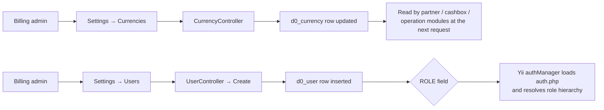
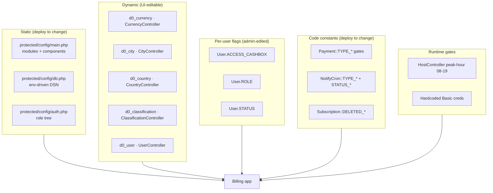

# sd-billing — settings catalog

The billing platform (`sd-billing`) is the vendor-side admin app — it manages tenants, licenses, payments, subscriptions, and inter-tenant distributions. Unlike sd-main, it has **no `params.json` runtime store** and no `ServerSettings` table. Behaviour is shaped by four layers instead:

1. **Static config files** under `protected/config/` — changing them requires a redeploy.
2. **Dynamic settings** edited through the `setting` module CRUD UI — currencies, classifications, cities, system log.
3. **Per-user flags** on the `User` row — most importantly `ACCESS_CASHBOX`, the global cashbox override.
4. **Hardcoded type-constants** on key models — `Payment::TYPE_*`, `NotifyCron::TYPE_*`, `Subscription::DELETED_*` — that act as enums but also as feature gates.

Plus one notable runtime knob: **`HostController` refuses every non-auth API call during peak hours (08:00-19:00 server time)** to keep that endpoint off the path during the working day.

## How to read this page

If you came here asking…

| Question | Go to |
|----------|-------|
| "Where do I change the currency rate?" | [Dynamic settings — the `setting` module](#dynamic-settings--the-setting-module) (`CurrencyController`) |
| "Why can this user see every cashbox?" | [Per-user flags](#per-user-flags) (`ACCESS_CASHBOX`) |
| "Why is the analytics aggregator getting 403s?" | [Operational toggles — peak-hour](#peak-hour-cutoff-in-hostcontroller) |
| "What's the difference between a license payment and a service payment?" | [Hardcoded type-constants — Payment](#payment-protectedmodelspaymentphp) |
| "Why does this role inherit from that role?" | [Role tree](#role-tree-authphp) |
| "Where does the DB connection string come from?" | [Static config — `protected/config/`](#static-config--protectedconfig) (`db.php`) |
| "Which cron handles license-delete?" | [Hardcoded type-constants — NotifyCron](#notifycron-protectedmodelsnotifycronphp) (`TYPE_LICENSE_DELETE`) |

## Static config — `protected/config/`

Each file is a Yii 1 array merged into the application bootstrap. Changes require redeploying the container.

| File | Purpose | What changing it affects |
|------|---------|--------------------------|
| `main.php` | Web app bootstrap — modules, components, URL rules, log routes, default params | Module registration list (`api`, `sms`, `bonus`, `access`, `report`, `partner`, `cashbox`, `setting`, `dashboard`, `operation`, `notification`, `directory`, `dbservice`). Adding or removing a module from this list disables every controller under it. |
| `console.php` | CLI bootstrap — same components, plus the `MigrateCommand` mapping | Cron jobs and `yiic` commands. The console app reads `db-console.php` instead of `db.php`. |
| `db.php` | Web DB connection. Reads every value from env vars: `MYSQL_HOST`, `MYSQL_PORT`, `MYSQL_DATABASE`, `MYSQL_USER`, `MYSQL_PASSWORD`. Fallbacks: `mysql:3306/billing`, user `root`, empty password. `tablePrefix` is `d0_`. | Everything. The legacy hardcoded local-dev creds are commented out at the bottom of the file. |
| `db-console.php` | Console DB connection | Cron-only database access. Usually identical to `db.php` in production. |
| `_db.php` | Disabled template | Nothing. Kept for reference. |
| `auth.php` | The full Yii RBAC role tree — roles 1 through 10 with their inheritance | Who-inherits-from-whom for billing roles. See the role table below. Used only by `PhpAuthManager`. |

### `params` in main.php

The application params at the bottom of `main.php` are minimal:

| Key | Default | Read where |
|-----|---------|-----------|
| `adminEmail` | `sherzod.usmon.91@gmail.com` | error / cron failure notifications |
| `dbPrefix` | `d0_` | helpers that build raw SQL against tenant DBs |
| `dbName` | `billing` | logging context |

These are static — there is no UI to edit them.

### Role tree (`auth.php`)

| Role ID | Name | Inherits from |
|---------|------|---------------|
| `1` | Super Administrator | `2` |
| `2` | Administrator Filial | `3` |
| `3` | Администратор (Admin) | `4` |
| `4` | Менеджер (Manager) | guest |
| `5` | Оператор (Operator) | guest |
| `6` | API | guest |
| `7` | Продавец (Sale) | guest |
| `8` | Ментор (Mentor) | `7` |
| `9` | Ключевой менеджер (Key account) | `4` |
| `10` | Партнер (Partner) | guest |

These IDs are matched against `User.ROLE` (constants `ROLE_ADMIN = 3`, `ROLE_MANAGER = 4`, `ROLE_OPERATOR = 5`, `ROLE_API = 6`, `ROLE_SALE = 7`, `ROLE_MENTOR = 8`, `ROLE_KEY_ACCOUNT = 9`, `ROLE_PARTNER = 10` in `protected/models/User.php`).

## Dynamic settings — the `setting` module

The `setting` module exposes CRUD pages for reference data the billing admin edits at runtime. Source: `protected/modules/setting/controllers/`. Permissions are checked via `Access::check('operation.<name>', Access::SHOW|CREATE|UPDATE|DELETE)` — see [Security / RBAC](/docs/security/rbac).

| Controller | UI label | Underlying table | What it controls | RBAC operation |
|------------|----------|------------------|------------------|----------------|
| `CityController` | Cities | `d0_city` | City reference list used by tenants when creating addresses and routing receipts | `operation.setting.city` |
| `CountryController` | Countries | `d0_country` | Country list joined to currencies and tax modes | `operation.setting.country` |
| `CurrencyController` | Currencies | `d0_currency` | Currency reference table — code, symbol, rate vs base. Edits here flow to every tenant via the directory sync | `operation.setting.currency` |
| `ClassificationController` | Classifications | `d0_classification` | Tenant classification labels used by partner-side reporting | `operation.setting.classification` |
| `SystemLogController` | System log | `d0_system_log` | Read-only viewer over the audit log. No write actions exposed | `operation.setting.systemLog` |
| `UserController` | Users (catalog) | `d0_user` | Billing-side user list — create, update, delete tokens, assign roles | `operation.setting.user` |
| `ViewController` | View shell | — | Layout host for the section's tab navigation; not a setting itself | — |

The `setting` module also has five sub-actions under `actions/user/`:
`GetUsersAction`, `GetRolesAction`, `CreateUserAction`, `UpdateUserAction`, `CreateTokenAction`. The token action issues the API key returned to a billing user — there is no rotation policy beyond manually deleting and recreating.



## Per-user flags

These live on the `User` row (`protected/models/User.php`) and act as feature gates the admin flips per individual.

| Field | Type | Effect |
|-------|------|--------|
| `ACCESS_CASHBOX` | int 0/1 | **Global cashbox override.** When `1`, the user can see and operate every cashbox regardless of ownership. Read in `protected/modules/operation/controllers/PaymentController.php` at lines 36 and 168 — either the user owns the cashbox (`$user->USER_ID == $cashbox["ownerId"]`) or this flag is set, otherwise the cashbox is filtered out. The helper `User::hasFullCashboxAccess()` wraps the check (line 121 of `User.php`). |
| `ROLE` | int | Pointer into `auth.php` role IDs. Drives Yii's authManager inheritance. |
| `STATUS` | int | Active / inactive — inactive users cannot log in. |

There is no toggle for "block specific cashboxes" — the model is allow-list-by-ownership with `ACCESS_CASHBOX = 1` as the master bypass. Use it sparingly; auditors flag it.

## Hardcoded type-constants

These are class constants on key models. They are not editable from the UI — code changes require a deploy. But they behave like settings because several controllers special-case specific values.

### `Payment` (`protected/models/Payment.php`)

| Constant | Value | Meaning | Behaviour |
|----------|-------|---------|-----------|
| `TYPE_CASH` | `1` | Нал (cash) | Standard cash receipt |
| `TYPE_CASHLESS` | `2` | Безнал (bank transfer) | Standard cashless receipt |
| `TYPE_P2PCLICK` | `3` | P2P Click | Card-to-card transfer via Click |
| `TYPE_LICENSE` | `10` | Лицензия (license) | Stripped from `Payment::getTypes()` for the operator UI — only the partner / system can create license payments. Excluded in `Payment.php` line 273. |
| `TYPE_DISTRIBUTE` | `11` | Распределение (distribution) | Inter-tenant balance transfer. Stripped from the operator type list (line 274) and from the cashbox list (line 303). |
| `TYPE_PAYMEONLINE` | `12` | Online Payme | Provider webhook only |
| `TYPE_CLICKONLINE` | `13` | Online Click | Provider webhook only |
| `TYPE_SERVICE` | `14` | Услуга (service fee) | Stripped from the operator list (line 275). Used by the system to record support / service charges. |
| `TYPE_PAYNETONLINE` | `15` | Online Paynet | Provider webhook only |
| `TYPE_MBANK` | `16` | MBANK (KG) | Kyrgyzstan-specific online provider |

**Why this matters as a setting:** types 10, 11, and 14 are gated. Even if a UI bug allowed posting one of them, the underlying type lists hide them — adding a new license-style payment requires editing the `unset()` calls in `Payment::getTypes()`. Conversely, switching an existing tenant's UI to expose distribute payments requires removing the `unset` for `TYPE_DISTRIBUTE`.

### `NotifyCron` (`protected/models/NotifyCron.php`)

| Constant | Value | Used for |
|----------|-------|----------|
| `STATUS_DEFAULT` | `0` | Cron row queued, not running |
| `STATUS_RUN` | `1` | Cron row currently executing — used as a lock against concurrent runs |
| `TYPE_TELEGRAM` | `'telegram'` | Outbound Telegram bot notification (license expiry warnings) |
| `TYPE_LICENSE_DELETE` | `'license_delete'` | Scheduled tenant deletion after license expiry grace period |
| `TYPE_VISIT_WRITE` | `'visit_write'` | Cron that writes back visit aggregates from tenant DBs |

The cron dispatcher reads rows by `type` and dispatches to the matching handler. Adding a new cron type means editing `NotifyCron` plus the dispatcher in `commands/`.

**Lock protocol:** the dispatcher flips `STATUS_DEFAULT` to `STATUS_RUN` before invoking the handler and back to `STATUS_DEFAULT` (or deletes the row) when done. A row stuck at `STATUS_RUN` indicates a crashed prior run — manually flipping it back is safe if the handler has finished externally.

### `Subscription` (`protected/models/Subscription.php`)

| Constant | Value | Meaning |
|----------|-------|---------|
| `DELETED_DEFAULT` | `0` | Subscription is logically deleted / inactive |
| `DELETED_ACTIVE` | `1` | Subscription is active and counted toward the tenant's license usage |

Soft-delete pattern: rows are flipped, never removed. License-counting queries filter on `DELETED = 1`.

**Operational note:** the `Subscription` table grows monotonically. A tenant that has cycled through many license tiers leaves behind a row per cycle with `DELETED = 0`. The license-overview UI groups by tenant + tier and shows only the active row, but the underlying table is a complete history. Useful for billing audits; expect it to be large on long-lived installs.

## Operational toggles — peak-hour and hardcoded creds

### Peak-hour cutoff in `HostController`

`protected/modules/api/controllers/HostController.php` overrides `beforeAction()`. For any action **except** `auth`, it calls `checkPeakHours()`, which rejects the request with HTTP 403 and message `"This API is not available during peak hours (08:00-19:00)"` when the server hour is between 8 and 19.

```php
protected function checkPeakHours() {
    $currentHour = (int)date('H');
    if ($currentHour >= 8 && $currentHour < 19) {
        $this->response([
            "success" => false,
            "message" => "This API is not available during peak hours (08:00-19:00)"
        ], 403);
    }
}
```

**Implications:**

- Server timezone matters — this uses PHP's `date('H')`, which respects the container's `TZ` env. Misconfigure `TZ` and the cutoff shifts.
- The `auth` action is exempt, so clients can still acquire tokens during the day. They just cannot call `activeHosts`, `activities`, etc.
- There is no UI toggle. To disable the cutoff, comment out the `checkPeakHours()` call in `beforeAction()` and redeploy.
- The cutoff applies only to the `api/host/*` actions. Other modules (`operation`, `partner`, `cashbox`, etc.) ignore it. Inter-tenant payment posts and partner-distribution syncs still run during the day.
- Affected actions include `activeHosts`, `activities`, `analyticsReport`, and any future HostController action that does not explicitly opt out.

### Hardcoded HTTP Basic creds in `actionActivities`

The same controller's `actionActivities` does multi-curl fan-out across every active dealer and passes a hardcoded Basic auth header:

```
CURLOPT_USERPWD => "billing:F0X86tLDJ6OgD6nDZx07SLOzQf5MqgQ8"
```

Source: line 80 of `HostController.php`. Every tenant API must accept exactly these creds for the analytics aggregator to work. Rotating them means coordinating a deploy across every tenant.

**Defence in depth is essentially nil here** — the creds are in the repo, the auth scheme is Basic over whatever transport the tenant exposes (HTTPS in production, HTTP in lab installs), and there is no rotation cadence. Treat the analytics endpoint on each tenant as roughly equivalent to "world-readable" and never put sensitive raw data there. The aggregator is meant to fetch only summary metrics.

### Other call-outs in the same controller

| Concern | Where | Notes |
|---------|-------|-------|
| `curl_multi_exec` timeout | `CURLOPT_TIMEOUT => 300` per handle | Five-minute per-host ceiling. Slow tenants stall the aggregator. |
| Empty-domain skip | early in the loop | Hosts with no `DOMAIN` value are silently skipped. Useful for staging dealers. |
| Token validation | `validateToken()` is called on every non-auth action before the peak-hour gate | The token model is JWT-style — see `User::getToken()`. There is no refresh flow; tokens expire when the User row's secret rotates. |

## Gotchas

- **No `params.json`** — every "is feature X on?" question in sd-billing is answered by either (a) an `if` over a `Payment::TYPE_*` / `User::ACCESS_CASHBOX` flag, or (b) the presence/absence of a row in a reference table. There is no central JSON file like sd-main has.
- **The `setting` module is admin-only.** All five CRUD controllers gate on `operation.setting.<name>` operations. A user without those operation rows assigned via `AccessUser` sees no menu entries.
- **`ACCESS_CASHBOX = 1` is silently powerful.** It is the only flag that lets a non-admin enumerate every cashbox in the billing DB. Auditors should sample for non-zero values periodically.
- **Distribute payments (`TYPE_DISTRIBUTE = 11`) never appear in the operator UI.** If a partner reports "I cannot record a distribution," confirm they have admin rights — the manual route goes through a separate distribution endpoint, not the cashbox payment screen.
- **Peak hours break the analytics aggregator.** If sd-main's HQ cron tries to call sd-billing's `activeHosts` between 08:00 and 19:00 server time, it gets HTTP 403. Schedule it after hours.
- **Hardcoded Basic creds are a tenant onboarding step.** A new tenant whose API rejects `billing:F0X86tLDJ6OgD6nDZx07SLOzQf5MqgQ8` is invisible to the analytics aggregator. Verify by hitting `/api/analytics` directly with curl.
- **`d0_` table prefix is hardcoded in two places** — both `main.php` params and `db.php` `tablePrefix`. Changing one without the other leaves raw-SQL queries in `Access::like()` and elsewhere pointed at the wrong tables.
- **`auth.php` role IDs are integers, but stored as strings in the array.** The keys are `'1'` through `'10'`, not `1` through `10`. PHP's loose comparison hides this, but a strict-mode authManager extension would not.
- **`Subscription::DELETED_*` is inverted from `Payment::DELETED`** in some tenant DBs — billing uses `1 = active, 0 = deleted` while older tenant tables sometimes use the opposite. Always confirm with the model constants, not your gut.
- **No version stamp on currency rates.** Editing `d0_currency.rate` overwrites in place — there is no history. The sd-billing system log only records the fact of an update, not the before/after value. Capture before/after in a side script if a rate change is contentious.
- **The `setting/view` controller serves layout, not data.** Hitting its URLs directly will render an empty shell. Always go through the named tabs (`/setting/currency`, `/setting/city`, etc.).
- **`PhpAuthManager` reads `auth.php` at every request** — there is no cache. Changing role inheritance requires only a file edit (no clear-cache step), but it also means a misedit takes effect immediately and can lock out admins. Keep a checked-in copy in version control and never edit on the live box.
- **`enableProfiling` and `enableParamLogging` are `false` in `db.php`.** Turning either on for diagnostics is safe but verbose — Yii will write every query into the framework log and the response time becomes the slower of "DB query" or "log flush." Turn them off again before walking away.
- **The `defaultRoles` on `PhpAuthManager` is `['guest']`.** Any user whose `ROLE` is `null`, `0`, or anything not in `auth.php` is treated as a guest and silently blocked from every gated action. Diagnose "user can see no menus" by inspecting `User.ROLE` first.

## Cross-walk: by symptom

| Symptom | First place to look | Then |
|---------|---------------------|------|
| "Currency rate is wrong on a tenant" | `d0_currency` row via `CurrencyController` | Confirm the tenant's directory sync ran since the edit |
| "Cashbox listing is empty for a user" | `User.ACCESS_CASHBOX` + ownership of any cashbox | Then the user's `operation.operation.payment.*` grants |
| "License-delete cron didn't fire" | `d0_notify_cron` rows with `type = 'license_delete'` and `status = 0` | Then the cron worker logs; check for stuck `status = 1` rows from a crashed prior run |
| "Distribution payment vanished" | Whether the operator's UI exposed `TYPE_DISTRIBUTE` (it shouldn't) | Then the partner module's distribution log |
| "Analytics aggregator returns 0 hosts" | `Diler::STATUS = ACTIVE` filter | Then each tenant's response to `billing:F0X...` Basic auth |
| "Subscription count is wrong" | `Subscription.DELETED` is `1` for active, not `0` | Confirm the count query filters on `DELETED = 1` |
| "Role inheritance behaves oddly" | `auth.php` array structure — keys are strings, not ints | Then user's `ROLE` value type-coercion |

## Layer-by-layer mental model



## See also

- [`sd-billing` modules / setting](/docs/sd-billing) — module-level descriptions and screenshots
- [`sd-main` server settings](./sd-main-server-settings.md) — the much larger settings layer on the tenant side
- [Security / RBAC](/docs/security/rbac) — operation strings that gate every `setting` action
- [Architecture / configuration](/docs/project/configuration) — full file-by-file config breakdown across all three projects
- [License → tenant lifecycle](/docs/concepts/license-lifecycle) — how `Subscription::DELETED_*` interacts with the license-delete cron
- [Settings catalog index](./index.md)
