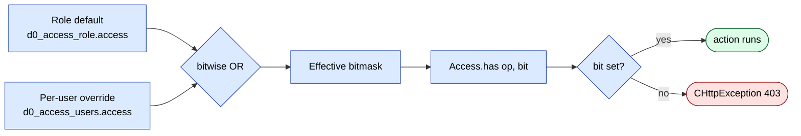

# sd-billing `access` module

The `access` module is the editor for sd-billing's per-user permission overrides. It owns the UI and AJAX endpoints that read and write `d0_access_users` — the table that supplements the role default in `d0_access_role` (one row per role) with per-user grants on individual operations.

Permissions in sd-billing are evaluated as a four-bit flag against a key like `operation.dealer.payment`. The bits are:

```
DELETE = 8
SHOW   = 4
UPDATE = 2
CREATE = 1
```

`Access::has($operation, $type_access)` reads the effective bitmask (role default OR per-user override) and bit-ANDs it with the requested action. `Access::check()` does the same and throws `CHttpException(403)` when the bit is clear. Admins (`ROLE_ADMIN = 3` or `User.IS_ADMIN = 1`) short-circuit to allow.

## Key features

| Feature | What it does | Owner role(s) |
|---|---|---|
| Operations grid | Lists every operation key, every user (minus the calling user and API/admin accounts) and their current per-user grants | admin, manager, key-account |
| Per-user toggle | Add or remove one bit (SHOW, CREATE, UPDATE, DELETE) on one operation for one user | admin, manager |
| Country scoping | Non-admin operators only see users whose `d0_user_country` overlaps their own | admin, manager, key-account |
| Bitmask normalization | Clamps the resulting bitmask to `[0, 15]` so corruption from concurrent toggles cannot leak | admin |

## Folder

```
protected/modules/access/
  AccessModule.php
  controllers/
    UserController.php       (4 actions)
  models/
    AccessOperation.php      # d0_access_operations
    AccessRelation.php       # role-to-operation defaults
    AccessUser.php           # d0_access_users (per-user grants)
  views/
    user/                    # operations grid view
```

## Controllers

| Controller | Purpose | Actions | Auth |
|---|---|---|---|
| `UserController` | Per-user permission editor | `index`, `getData`, `userOperation`, `userAccess` | `Access::check('operation.access.index', Access::SHOW)` on `index`; the AJAX actions return an empty payload (or `success: false`) when the SHOW bit is clear, and `userAccess` additionally checks CREATE for grants and DELETE for revokes |

### `UserController` actions

| Action | Method | Permission gate | What it does |
|---|---|---|---|
| `actionIndex` | GET | `operation.access.index` SHOW | Renders the operations grid view (`views/user/index.php`) |
| `actionGetData` | POST/XHR | `operation.access.index` SHOW | Returns three arrays: `users` (active, non-API, non-admin, not self, country-scoped), `operations` (every row in `d0_access_operations` where `type='operation'`), and `roles` (the role defaults map from `Access::permissions()`) |
| `actionUserOperation` | POST/XHR | `operation.access.index` SHOW | Given a `user_id`, returns the per-user override rows from `d0_access_users` for that user, exploded into `show`, `create`, `update`, `delete` booleans by bit-ANDing the stored `access` integer |
| `actionUserAccess` | POST/XHR | CREATE to grant, DELETE to revoke | Toggles one bit on one operation for one user. Body fields: `id`, `operation`, `method` (one of `show` / `create` / `update` / `delete`), `access` (bool). Adds or subtracts the matching bit value (4, 1, 2, 8), creating the `AccessUser` row if missing |

## Interplay with the role default

The four-bit `access` integer in `d0_access_users` is a delta on top of the role default in `d0_access_role`. Effective permissions at request time:



`actionUserAccess` does not OR the bit in — it does `+= $bit` when granting and `-= $bit` when revoking, then clamps the result to `[0, 15]`. This is safe because the UI always reflects the persisted value before posting back, and double-grants are clamped at 15.

## Role IDs in sd-billing

For context, the user IDs the grid manipulates have these roles (constants in `protected/models/User.php`):

| Role ID | Constant | Display name |
|---|---|---|
| 3 | `ROLE_ADMIN` | Администратор — bypasses all checks |
| 4 | `ROLE_MANAGER` | Менеджер |
| 5 | `ROLE_OPERATOR` | Оператор |
| 6 | `ROLE_API` | API — filtered out of the grid |
| 7 | `ROLE_SALE` | Продавец |
| 8 | `ROLE_MENTOR` | Ментор |
| 9 | `ROLE_KEY_ACCOUNT` | Ключевой менеджер |
| 10 | `ROLE_PARTNER` | Партнер |

Admin and API roles are excluded from `actionGetData` by SQL (`u.ROLE NOT IN (ROLE_API, ROLE_ADMIN)`). The acting user is also filtered out (`u.USER_ID <> $selfUserId`) so an operator cannot edit their own grants from the grid.

## Cross-module touchpoints

- **Every other sd-billing module** calls `Access::check('<module>.<controller>.<action>', Access::SHOW|CREATE|UPDATE|DELETE)` in action handlers. The operation keys this grid edits are exactly those strings.
- **`operation.dealer.payment`** is the canonical example — see [Payment recording workflow](../workflows/operation-payment.md). Operators with cashbox-scoped access depend on a per-user grant of CREATE/UPDATE/DELETE on this operation plus a non-null `Cashbox.USER_ID` mapping.
- **`User.ACCESS_CASHBOX`** is a separate column-level flag (not edited here) that broadens cashbox visibility regardless of grants. See the operation-payment doc for details.
- **`d0_access_operations`** is the source-of-truth list of grant-able operation keys. Adding a new operation key in code without inserting a row here means the grid will not list it.

## Gotchas

- **`actionUserAccess` mutates by add/subtract, not by OR/AND.** If the UI somehow re-submits an already-granted bit, the integer will exceed 15 and be clamped. Re-submitting a revoke on an already-revoked bit drives it negative and clamps to 0. Both are recoverable, but neither is idempotent in the strict sense.
- **The error message for a denied toggle is hard-coded Russian.** `actionUserAccess` returns `"К сожалению, у вас нет доступа к этому действию"` literally — there is no i18n layer on this response.
- **`actionGetData` always returns the full operations and roles arrays**, even when there are no users matching the country scope. The grid renders empty rows; verify country mappings if you see no users.
- **Country scoping uses `d0_user_country`**, not the user's primary country column. A user with no `d0_user_country` rows will be invisible to non-admin editors regardless of their `COUNTRY_ID`.
- **The denial check in `actionUserAccess` runs after `getData()` is parsed.** Malformed POSTs will throw before the access check fires.
- **No audit trail.** Toggles do not write a log row. To track who granted what, enable DB-level binlog or wrap the `AccessUser::save()` call.

## See also

- [auth and access](../auth-and-access.md) — role IDs, role defaults, `Access::check` semantics
- [Payment recording workflow](../workflows/operation-payment.md) — concrete example of `Access::check` and the `ACCESS_CASHBOX` flag interplay
- [Security landmines](../security-landmines.md) — known gaps in the permission editor
- Source: `protected/modules/access/controllers/UserController.php`
