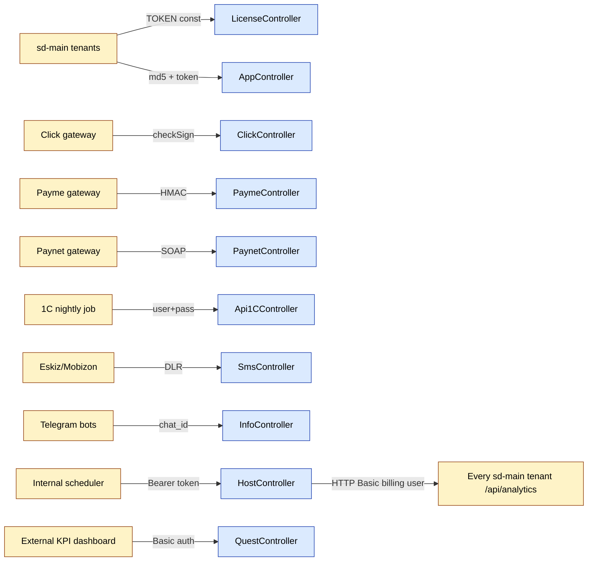

# sd-billing `api` module

The `api` module is sd-billing's outward-facing entrypoint. Every system that needs to push data into billing - payment gateways, 1C, the sd-app mobile client, the SMS provider, the host heartbeat collector, and the Telegram bots - lands here. Each controller picks its own auth scheme, so the module is best read as eleven independent endpoint families that happen to live under `/api/`.

Eleven controllers, forty-three actions. Auth varies per controller: hard-coded `TOKEN` constant for license endpoints, gateway signature verification for payments, fixed-user `UserIdentity("sd","sd")` for the SMS gateway, HTTP Basic for the Quest panel, and bearer-token for host operations.

## Key features

| Feature | What it does | Caller |
|---|---|---|
| License queries and mutations | 15 read/write endpoints used by every sd-main tenant for licence sync, package buy, package change, payment list, distributor revise | sd-main `LicenseService` |
| Mobile app auth and SQL execute | Login by `LOGIN`/`PASSWORD` (md5), issue a TOKEN, run free-form SQL against billing DB | sd-app desktop client |
| 1C cashless settlement upload | Bulk-insert `Payment` rows by INN, validate currency and date, return per-row errors | 1C nightly job |
| 1C subscription export | Return all subscriptions for a date range, used by accountants to reconcile against bank statements | 1C reporting |
| Click webhook | Prepare/Confirm pair, `checkSign` against gateway secret, post a `Payment` and call `Diler::deleteLicense` | Click gateway |
| Payme webhook | JSON-RPC dispatched to `PaymeHelper::run()` from the `api.helpers` namespace | Payme gateway |
| Paynet webhook | SOAP server bound to `paynetuz/services/PaynetService`, WSDL at `PAYNET_WSDL_URL` | Paynet gateway |
| SMS gateway adapter | Bridge to Eskiz/Mobizon - template CRUD, batch send, delivery callback (DLR) | SMS dashboard + Eskiz |
| Host heartbeat | Bearer-token API. Auth, list active hosts, fan-out activity collector across every tenant, per-host detail | internal scheduler |
| Quest panel | HTTP Basic auth, computes KPI panels (price, idokon, ibox, NP, churn, net-sale, golden) for an exec dashboard | external dashboard tool |
| Info endpoint | Dealer lookup by ID or host, plus two long-running Telegram-bot handlers (SD-token issue, password reset) | sd-main tenants + Telegram |

## Folder

```
protected/modules/api/
  controllers/
    AppController.php          (3 actions)  - sd-app login + SQL exec
    Api1CController.php        (4 actions)  - 1C cashless + subscriptions
    LicenseController.php      (15 actions) - licence sync to sd-main
    ClickController.php        (1 action)   - Click prepare/confirm
    PaymeController.php        (1 action)   - Payme JSON-RPC
    PaynetController.php       (1 action)   - Paynet SOAP
    SmsController.php          (9 actions)  - SMS templates + delivery
    HostController.php         (4 actions)  - host heartbeat
    QuestController.php        (2 actions)  - KPI panels
    InfoController.php         (3 actions)  - dealer info + Telegram bots
    MaintenanceController.php.absolute        - disabled / archived
  helpers/
    PaymeHelper.php                          - Payme JSON-RPC dispatcher
  components/
    sendSuccessResponse / sendFailResponse helpers
```

The `.absolute` suffix on `MaintenanceController.php.absolute` means the file is excluded from Yii's class autoload - it's archived, not live.

## Controllers

| Controller | Purpose | Actions | Auth |
|---|---|---|---|
| `AppController` | sd-app desktop client | `actionAuth`, `actionGetPrinters`, `actionExecute` | md5 password to issue TOKEN, then TOKEN on every call |
| `Api1CController` | 1C accounting integration | `actionIndex`, `actionAddCashless`, `actionGetSubscriptionsOld`, `actionGetSubscriptions` | Basic-style login+password, validated through `UserIdentity` |
| `LicenseController` | License sync, distrubuted across all sd-main tenants | 15 actions - see [license-push workflow](../workflows/license-push.md) | hard-coded `const TOKEN = "2Mhoba9PjqmBBY7srSrRciAvdbAB3ALG"` |
| `ClickController` | Click gateway webhook | `actionIndex` (handles both `ACTION_PREPARE` and confirm) | `ClickTransaction::checkSign` plus fixed `UserIdentity("click")` |
| `PaymeController` | Payme JSON-RPC webhook | `actionIndex` (delegates to `PaymeHelper::run`) | Payme HMAC, verified inside helper |
| `PaynetController` | Paynet SOAP webhook | `actionIndex` (binds `PaynetService` to SoapServer) | fixed `UserIdentity("paynet")`; signature inside SOAP body |
| `SmsController` | SMS gateway control plane | 9 actions for templates, packages, send, callback | `init()` logs in as fixed `UserIdentity("sd","sd")` |
| `HostController` | Cross-tenant host telemetry | `actionAuth`, `actionActiveHosts`, `actionActivities`, `actionActivityByHost` | bearer token issued by `actionAuth`, validated by `validateToken()` |
| `QuestController` | KPI panel feed | `actionIndex`, `actionDetail` | HTTP Basic, username + `User.TOKEN` |
| `InfoController` | Dealer info + Telegram bots | `actionIndex`, `actionSdToken`, `actionChangePassword` | unauthenticated; Telegram bots gate by chat membership and `User.PHONE_NUMBER` |

### `LicenseController` actions

15 actions, each protected by a single shared `const TOKEN`. This is the workhorse of the module - every tenant in the sd-main fleet calls these endpoints to sync licence state. The full payload schemas, ordering, and side-effects live in the dedicated workflow page; this table is just an index.

| Action | Method | Used for |
|---|---|---|
| `actionIndex` | POST | Return licence rows for one dealer |
| `actionIndexBatch` | POST | Return licence rows for many dealers in one call |
| `actionPackages` | POST | List packages available to a dealer |
| `actionBotPackages` | POST | Bot-only package list (subset for Telegram-bought packages) |
| `actionHalfPackages` | POST | Half-priced upgrade packages |
| `actionBuyPackages` | POST | Apply a package purchase. Logs in as `UserIdentity("sd","sd")` to write Subscription |
| `actionChangePackage` | POST | Change current package on existing subscription |
| `actionRevise` | POST | Reconcile balance after manual intervention |
| `actionPayments` | POST | List payments for a dealer |
| `actionCheckMin` | POST | Check minimum-balance compliance |
| `actionBonusPackages` | POST | List bonus packages |
| `actionExchangeable` | POST | List exchangeable subscription pairs |
| `actionExchange` | POST | Apply a subscription exchange. Logs in as `UserIdentity("sd","sd")` |
| `actionDistrRevise` | POST | Distributor-wide reconcile |
| `actionDeleteOne` | POST | Delete a single licence row |

See [license-push workflow](../workflows/license-push.md) for the full call sequence, retry semantics, and the role of the `TOKEN` constant.

### `HostController` actions

The host-telemetry surface. Bearer-token auth, plus a hard cutoff that blocks every action except `actionAuth` during peak hours (08:00 - 19:00 server time). The cutoff is enforced by `beforeAction` calling `checkPeakHours()` which returns HTTP 403 if the current hour is inside the window.

| Action | Method | What it does |
|---|---|---|
| `actionAuth` | POST | Login by `LOGIN`/`PASSWORD` (md5), generate a fresh token via `User::generateToken`, return it. Bypasses the peak-hour gate |
| `actionActiveHosts` | GET | List every `Diler` with `STATUS = STATUS_ACTIVE`. Returns `[id, host, domain]` per row |
| `actionActivities` | GET | Fan-out collector. For every active host with a domain, calls `{$host->DOMAIN}/api/analytics?date_from&date_to` using `curl_multi_*`, HTTP Basic with `billing:F0X86tLD...`. Collects results and per-host errors |
| `actionActivityByHost` | GET | Per-host detail. Routes to `/api/analytics/ordersByDay` or `/api/analytics/ordersByCategory` based on `by` parameter |

Auth detail: the token is `User.TOKEN` matched out of `Authorization: Bearer <token>`. The same column is reused by `AppController::actionExecute`, `QuestController::validateCredentials`, and elsewhere - rotate one and the others break.

### `AppController` actions

Three actions used by the legacy sd-app desktop client.

| Action | Method | What it does |
|---|---|---|
| `actionAuth` | POST | Login by `LOGIN`/`PASSWORD` (md5 compared against `User.PASSWORD`). On success generates a fresh token via `User.generateToken`. POST-only |
| `actionGetPrinters` | GET | Returns the full `d0_printers` table as JSON - id, model, dpi, width, char_per_line, char_encoding, charset_id. No auth. Kept "because agent app still uses it" per inline comment |
| `actionExecute` | POST | Accepts free-form `sql` and a `token`. Validates token against `User.TOKEN`, then runs the SQL via `Yii::app()->db->createCommand`. Returns rows or the exception message. Security landmine - see below |

### `Api1CController` actions

| Action | Method | What it does |
|---|---|---|
| `actionIndex` | POST | Health probe. Calls `checkAuth` then returns success |
| `actionAddCashless` | POST | Bulk-insert cashless payments. Body is an array of `{inn, payment_1c, amount, currency, date, comment}`. Per-row validation (inn non-empty, amount > 0, valid date). Inserts a `Payment` per row with `TYPE = TYPE_CASHLESS`. Returns per-row errors |
| `actionGetSubscriptionsOld` | POST | Legacy subscription export by date |
| `actionGetSubscriptions` | POST | Current subscription export by date. Returns flat `Subscription` rows used for accountant reconciliation |

`checkAuth` reads `login`/`password` from headers or body, looks the user up, calls `UserIdentity` to start a session, and `_sendFailResponse(401, ...)` on miss.

### `ClickController`, `PaymeController`, `PaynetController` actions

Each gateway exposes a single `actionIndex` and dispatches internally. The deep flows live in [payment-gateways](../payment-gateways.md). Summary:

| Controller | What `actionIndex` does |
|---|---|
| `ClickController` | Reads `$_REQUEST`. Calls `ClickTransaction::checkSign` against the merchant key. Branches on `data['action']` - prepare creates `ClickTransaction(STATUS=PREPARE)`, confirm flips it to `COMPLETE`, posts a `Payment(TYPE=CLICKONLINE)`, calls `Diler::deleteLicense()`. Sends error codes -1, -2, -4, -5, -6, -8, -9 by JSON-RPC convention |
| `PaymeController` | Imports `api.helpers.PaymeHelper` and calls `(new PaymeHelper())->run()`. The helper parses JSON-RPC, dispatches `CheckPerformTransaction`, `CreateTransaction`, `PerformTransaction`, `CancelTransaction`, etc. HMAC is verified inside the helper |
| `PaynetController` | Sets `Content-Type: text/xml`, logs in as `UserIdentity("paynet")`, instantiates `SoapServer(PAYNET_WSDL_URL)` and binds `PaynetService` from `extensions/paynetuz` |

### `SmsController` actions

`init()` runs before every action - it logs in as the fixed `sd` user. So every action effectively runs with admin privileges, and there is no per-caller auth. Whoever can reach the URL can call these.

| Action | Method | What it does |
|---|---|---|
| `actionPackages` | POST | List `SmsPackage` rows joined with currency. Filter by `currency` |
| `actionCreateTemplate` | POST | Create an `SmsTemplate` for a dealer |
| `actionCheckingTemplates` | POST | Verify templates against provider catalog |
| `actionBuySmsPackage` | POST | Sell an SMS package - decrement balance, increment `Diler.SMS_COUNT` |
| `actionOne` | POST | Send a single SMS now |
| `actionSend` | POST | Schedule a batch send |
| `actionSendingForward` | POST | Forward already-sent SMS records to provider for resend |
| `actionBoughtSmsPackages` | POST | List packages a dealer has bought |
| `actionCallback` | POST | DLR webhook - provider calls this with delivery status per SMS |

### `QuestController` actions

| Action | Method | What it does |
|---|---|---|
| `actionIndex` | GET | Returns KPI bundle `{price, idokon, ibox, np, churn, up-sall, net-sale, golden}`. Each calculator is a private method on the controller |
| `actionDetail` | POST | Drill-down for a specific KPI type. Currently implements `type=net-sale` only |

Auth is HTTP Basic - the `Authorization: Basic <base64>` header is decoded to `username:token`. `username` matches `User.LOGIN`, `token` matches `User.TOKEN` exactly (no hashing). User must be active.

### `InfoController` actions

| Action | Method | What it does |
|---|---|---|
| `actionIndex` | POST | Dealer lookup. Body `{dealer_id, host}`. Falls back to host if `dealer_id` is empty. Returns `{id, host, domain, is_demo, status, db_name, db_status}` plus `{max_id, min_id}` across all dealers |
| `actionSdToken` | POST | Telegram bot webhook for the "Get Token" bot. Reads `php://input` as Telegram update, dispatches `/start`, `/mychatid`, `Get Token`, contact-share, and dealer-name commands. On success, issues a one-hour SD-token via `Distr::getSdToken` and replies with a deep-link |
| `actionChangePassword` | POST | Telegram bot webhook for the password-reset bot. Identifies the user by contact-share, generates a fresh 10-char password, writes it to `User.PASSWORD` (md5), replies with the plaintext password in a spoiler. Logs the reply payload to `/log/password/<USER_ID>.txt` |

Both Telegram handlers carry hard-coded bot tokens in the controller body - see [security landmines](../security-landmines.md).

## Cross-module touchpoints



- **`operation` module** is the data writer behind most license calls. `LicenseController::actionBuyPackages` opens a Yii session as `sd` then dispatches via `Subscription`, `Payment`, `Tariff` models. See [operation-payment](../workflows/operation-payment.md).
- **`Diler::deleteLicense`** is called from Click, Payme, and Paynet handlers on confirm - it forces sd-main to pick up the new balance on next licence-check.
- **`notification` module's `NotifyCron`** consumes the `notification` table that this module never writes to directly - but `LicenseController::actionBuyPackages` does fire instant notifications.
- **`Logger::writeLog2`** is the standard request/response log used by `ClickController`, `PaymeController` (indirectly), and `Api1CController` for compliance audits.

## Gotchas

- **`AppController::actionExecute` runs arbitrary SQL.** It accepts `sql` and `token` as POST fields and executes against the billing DB. Token validity is the only gate. Anyone who steals a `User.TOKEN` can dump or mutate the entire billing database. See [security landmines](../security-landmines.md).
- **`actionGetPrinters` has no auth at all.** Returns the full `d0_printers` table to anyone who can hit the URL. Treat the URL as public.
- **`LicenseController::TOKEN` is a public-domain constant.** It is embedded in the `LicenseController.php` source file in plain text. Any leak of the repo leaks the token. Rotating it requires updating every sd-main tenant's `LicenseService` config.
- **`HostController` peak-hour cutoff.** Every action except `actionAuth` returns HTTP 403 between 08:00 and 19:00 server time. Calls scheduled outside that window will succeed; calls scheduled inside it will silently fail with `"This API is not available during peak hours"`.
- **`HostController::actionActivities` carries a hard-coded HTTP Basic credential** `billing:F0X86tLDJ6OgD6nDZx07SLOzQf5MqgQ8` used to call `/api/analytics` on every tenant. Rotating it means updating sd-main's `analytics` controller auth too.
- **`SmsController::init` logs the request in as `sd`.** Every action runs with admin privileges. There is no per-action auth. The only gate is reachability of the URL.
- **`InfoController::actionChangePassword` writes plaintext-derived passwords to disk** at `/log/password/<USER_ID>.txt`. Anyone with shell access can read recent password reset events.
- **`MaintenanceController.php.absolute` is intentionally inert.** The `.absolute` suffix excludes it from autoload. Renaming it to `.php` activates whatever cleanup logic it carries - check the source before doing that.
- **Payment-gateway controllers do not throw exceptions.** They swallow errors and return gateway-specific JSON codes. Failures show up in `Logger::writeLog2` output, not in the application log.

## See also

- [License push workflow](../workflows/license-push.md) - full `LicenseController` flow
- [Payment gateways](../payment-gateways.md) - Click, Payme, Paynet deep flows
- [Operation payment workflow](../workflows/operation-payment.md) - payment lifecycle behind `Payment` writes
- [Auth and access](../auth-and-access.md) - how `UserIdentity` and `User.TOKEN` are issued
- [Security landmines](../security-landmines.md) - the SQL exec endpoint, hard-coded tokens, plaintext password log
- [Notifications](../notifications.md) - the in-app and queued notification system
- [access module](./access.md) - permission grid that gates the few operations called from these handlers
