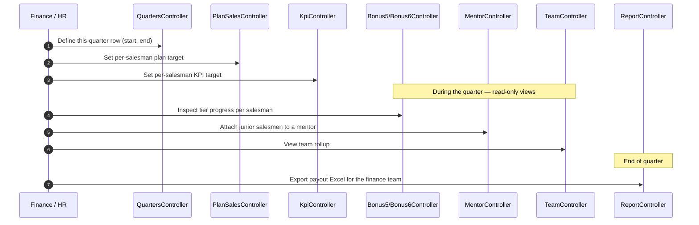

# `bonus` module

`sd-billing/protected/modules/bonus/` is the **internal commission
ledger** for SalesDoctor's own sales staff. It is not a customer-facing
feature — dealers do not see this module. It exists so HR and finance
can calculate each quarter's payout to the people who sold licences to
those dealers.

Two parallel tier schemes (`Bonus5` and `Bonus6`) run side-by-side
because the formula changed once and the older tier survives for
back-compat on legacy quarters. A mentor bonus rides on top for senior
staff who supervise juniors. A KPI table sets the per-quarter target.
A leaderboard ranks salesmen. A team rollup aggregates everything for
managers. A separate `Quarters` table holds the period definitions and
`PlanSales` holds the per-salesman targets used by all of the above.

## Why two tier controllers (Bonus5 + Bonus6)

| | `Bonus5Controller` | `Bonus6Controller` |
|---|---|---|
| Origin | Original tier scheme (5-step ladder) | Revised tier scheme (6-step ladder) |
| Activation window | Pre-2024 quarters | 2024-onward quarters |
| Action shape | `actionIndex` + `actionGetDetail` | `actionIndex` + `actionGetDetail` |
| Access constant | `operation.bonus.index3` | `operation.bonus.index4` |
| Detail render | 9-month rolling window from `2022-08` | 9-month rolling window from a later anchor |

The two controllers are intentionally near-identical — they branch on
a tier formula constant inside `actionGetDetail`. Old quarters keep
running through `Bonus5` so historical payouts reconcile against the
formula they were paid under at the time.

## Controller catalog

10 controllers, 32 actions total. Sorted by action count:

| Controller | Purpose | # actions |
|---|---|---:|
| `MentorController` | Mentor-bonus admin — attach / detach junior salesmen to a mentor, compute the override per mentor per quarter. | 6 |
| `PlanSalesController` | Target setting — per-salesman, per-quarter plan rows (`amount`, `country`). Full CRUD. | 5 |
| `QuartersController` | Period table — defines quarter rows (start, end, status). Full CRUD via Ajax forms. | 5 |
| `TeamController` | Team-level rollup — manager view of all subordinates in one quarter. CRUD on team membership. | 4 |
| `KpiController` | KPI targets per salesman per quarter — the goal column the tier formulas read. | 3 |
| `Bonus5Controller` | Legacy 5-tier bonus ladder — older quarters' payouts. | 2 |
| `Bonus6Controller` | Current 6-tier bonus ladder — current quarter payouts. | 2 |
| `KpiLeaderController` | KPI leaderboard — ranking salesmen by KPI achievement %. | 2 |
| `MentorKpiController` | Mentor KPI leaderboard — same shape, scoped to mentors only. | 2 |
| `ReportController` | End-quarter payout report — single `actionCustomerSalesReport` Excel export. | 1 |

Source: `protected/modules/bonus/controllers/*Controller.php`. Action
totals from `grep -c "public function action"`.

## Where the data flows

The data feed for every view is the `d0_payment` ledger filtered by
`SALE_ID` (the salesman owning the dealer). The tier formula in
`Bonus5Controller::actionGetDetail` and `Bonus6Controller::actionGetDetail`
joins `Payment` against `Diler.SALE_ID` and bins amounts into the 9
rolling months the UI displays.

## Top 3 controllers in detail

### `MentorController` (6 actions)

Backs the mentor-bonus admin. A mentor (`User.ROLE = 8`) gets a
percentage override on the bonus earned by every junior salesman
attached to them, per quarter.

| Action | Purpose |
|---|---|
| `actionIndex` | Render the mentor admin Vue shell (`indexUpdate` view). |
| `actionFilter` | Returns the mentor dropdown — `User` rows where `ROLE = 8 AND ACTIVE = 1`. |
| `actionGetData` | Main data feed — joins `Payment`, `Diler`, `MonthMentor` for the chosen mentor + month range. |
| `actionAttach` | Attach a single junior salesman to a mentor for a given month. |
| `actionDetach` | Reverse — drop a junior from a mentor's roster for a month. |
| `actionMultiAttach` | Bulk attach — many juniors to one mentor in one round-trip. |

Access constant: `operation.month.mentor`. The model that owns the
mapping is `MonthMentor` — keyed by `(MENTOR_ID, SALESMAN_ID, MONTH)`.

### `PlanSalesController` (5 actions)

Target-setting screen. Finance enters the expected sales volume each
salesman should book in a given quarter. The tier formulas in
`Bonus5/Bonus6` read these rows to compute achievement %.

| Action | Purpose |
|---|---|
| `actionIndex` | Vue shell. |
| `actionGetData` | List plan rows for the chosen quarter / country filter. |
| `actionGetDataForForm` | Dropdown sources for the edit form (salesman, currency, country). |
| `actionCreateOrUpdate` | Upsert a single plan row — keyed by `(salesman, quarter, country)`. |
| `actionDelete` | Soft-delete a plan row. |

`PlanSales` model rows are `(SALESMAN_ID, QUARTER_ID, COUNTRY_ID,
AMOUNT)`. There is no per-month plan — the quarter is the smallest
plan unit. Per-month achievement is derived by linear interpolation in
the tier formula.

### `QuartersController` (5 actions)

The period table. Every other controller in this module reads
`Quarters` to know what "this quarter" means.

| Action | Purpose |
|---|---|
| `actionIndex` | List all quarter rows. |
| `actionReturnAjaxForm` | Render the create / edit modal partial. |
| `actionCreateAjax` | Create a new quarter row. |
| `actionUpdateAjax` | Edit an existing quarter — start, end, status. |
| `actionDelete` | Remove a quarter (only if no `PlanSales` or `Payment` references it). |

The model is `Quarter` (table `d0_quarter`). Fields: `ID`, `NAME`,
`DATE_START`, `DATE_END`, `STATUS`. Status drives whether the
leaderboards / tier views show the row in the dropdown.

## Cross-module touchpoints

### Reads (sd-billing default DB)

| Controller family | Tables read |
|---|---|
| `Bonus5`, `Bonus6`, `KpiLeader`, `MentorKpi` | `d0_payment`, `d0_diler`, `d0_user`, `d0_quarter`, `d0_plan_sales`, `d0_kpi` |
| `Mentor` | `d0_month_mentor`, `d0_payment`, `d0_diler`, `d0_user` |
| `Team` | `d0_team`, `d0_user`, `d0_payment` |
| `Kpi`, `PlanSales`, `Quarters` | their own master tables only |
| `Report` | `d0_payment`, `d0_diler`, `d0_user`, `d0_quarter`, `d0_plan_sales` — joined into the Excel writer |

### Writes

| Controller | Writes to |
|---|---|
| `PlanSalesController` | `d0_plan_sales` |
| `QuartersController` | `d0_quarter` |
| `TeamController` | `d0_team` |
| `MentorController` | `d0_month_mentor` |
| `KpiController` | `d0_kpi` |

None of these controllers write to `d0_payment` — payments come from
the `operation.payment` flow. The bonus module is read-mostly against
the payment ledger and write-only against its own config tables.

### Touchpoints elsewhere

- `DilerController::actionGetBonus` / `actionSaveBonus` in `dashboard`
  attaches a per-dealer bonus override (e.g. a 5% discount on a
  specific quarter) that the tier formula respects.
- `DealerController::actionBonus` / `actionSaveBonus` in `dashboard`
  is the equivalent screen for the Vue-based dealer admin.
- `sd-cs` has its own `Bonus`, `BonusSale`, and `SummaryBonus`
  reporting controllers — those are HQ rollups across dealers and are
  separate from this internal-payout module. See the
  [sd-cs report module](/docs/sd-cs/modules/report).

## Gotchas

- **Two tier controllers, one URL family.** Pre-2024 quarters resolve
  through `Bonus5Controller` (URL `/bonus/bonus5/*`), current quarters
  through `Bonus6Controller` (URL `/bonus/bonus6/*`). The UI hides
  the inactive one based on the quarter dropdown. Direct deep-links
  to the wrong controller for the chosen quarter render zeros.
- **Tier formulas read `Diler.SALE_ID`, not `Payment.SALE_ID`.** A
  payment's salesman attribution comes from the dealer it credits.
  Reassigning a dealer to a new salesman retroactively shifts every
  past payment's bonus attribution — including closed quarters.
  Finance keeps a manual log of `SALE_ID` changes outside the app.
- **`MonthMentor` is per-month, not per-quarter.** The mentor mapping
  is keyed by month, so a junior can be attached to mentor A in
  January and mentor B in February inside the same quarter. The
  leaderboard sums across the quarter — both mentors get a slice.
- **`PlanSales.AMOUNT` is in the salesman's local currency.** Mixing
  USD and UZS plans in one country filter produces a meaningless
  total. The UI does not warn — the filter drop-down silently
  combines them.
- **`ReportController::actionCustomerSalesReport` is the only Excel
  export in this module.** It re-computes the tier ladder in PHP from
  scratch per request — no cached values. For a closed quarter the
  numbers can drift if a back-dated payment lands after the original
  payout was made. The export always reflects the current state of
  `d0_payment`, not the state at quarter-close.
- **`KpiLeader` and `MentorKpi` look identical but are not.**
  `KpiLeader` ranks every salesman; `MentorKpi` ranks only `ROLE = 8`
  mentors. Don't confuse them in the route map.
- **Access constants are inconsistent across controllers.** Bonus5
  uses `operation.bonus.index3`, Bonus6 uses `operation.bonus.index4`,
  Mentor uses `operation.month.mentor`. There is no single
  `operation.bonus.*` grant that opens the whole module. Each tier
  needs its own row in `d0_access_operation`.

## See also

- [`operation.payment` workflow](../workflows/operation-payment.md) — the
  ledger the tier formulas read.
- [Domain model](../domain-model.md) — `Quarter`, `PlanSales`, `Kpi`,
  `MonthMentor`, `Team` schemas.
- [Balance & money math](../balance-and-money-math.md) — how
  `Diler.BALANS` (the input to the tier formulas) is maintained.
- Source: `protected/modules/bonus/controllers/`.
