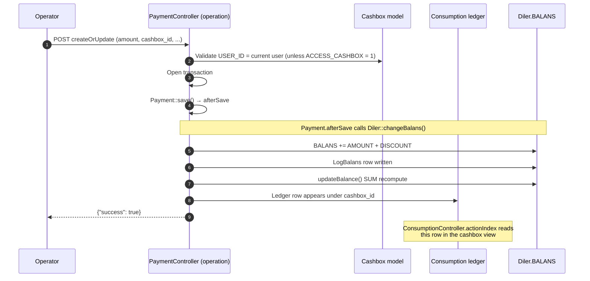

# `cashbox` module

`sd-billing/protected/modules/cashbox/` is the **dealer-side cashbox
ledger**. It is the place inside sd-billing where individual money
movements are typed, owned by a user, and reconciled against the
master `d0_payment` ledger and the `d0_diler.BALANS` recompute.

This is **not** the same module as `sd-main`'s `cashbox` — the
sd-main cashbox is per-tenant and tracks the dealer's own field-level
cash collection from clients. This sd-billing cashbox tracks the
opposite direction: which SalesDoctor cash desk the dealer's payment
landed on when they paid SalesDoctor for their licence.

## Five typed flows

Every row in `d0_consumption` (the central ledger table this module
owns) carries a flow tag that determines how the row is treated by
downstream consumers:

| Flow tag | What it means | Set by |
|---|---|---|
| `cash` | Physical cash payment received at a desk | Manual entry via `ConsumptionController` |
| `cashless` | Bank transfer / card payment | Manual entry — usually batched from a statement |
| `license` | Auto-generated row when an active subscription consumes balance | `SettlementCommand` (see [Cron & settlement](../cron-and-settlement.md)) |
| `distribute` | Distributor payout row — when SalesDoctor pays a partner / distributor their share | `DistrPaymentController` in `dashboard` |
| `service` | Service-fee row — manual charge for setup / training / migration work | Manual entry |

The flow tag also feeds the real-vs-offline split: `cash` and
`cashless` are *real* money flows; `license`, `distribute` and
`service` are *internal* re-allocations of already-received money.
Real-vs-offline matters for finance because only real rows reconcile
to a bank statement.

## Controller catalog

6 controllers, 27 actions total:

| Controller | Purpose | # actions |
|---|---|---:|
| `TransferController` | Money transfers between cash desks — index + add + CRUD on transfer rows. | 6 |
| `CashboxController` | Cash desk master table — the desks themselves. CRUD via Ajax forms. | 5 |
| `ComingTypeController` | Income type dictionary — sub-classifies what income rows count as. | 5 |
| `ConsumptionController` | The central ledger — every income / outcome row. The biggest data feed. | 5 |
| `FlowTypeController` | Outcome type dictionary — sub-classifies what consumption rows count as. | 5 |
| `CashDeskController` | Read-only cash-desk dashboard view. | 1 |

Source: `protected/modules/cashbox/controllers/*Controller.php`.
Action totals from `grep -c "public function action"`.

All write actions in this module are admin-only — `accessRules`
restricts each controller to `roles => array(3)` (admin).

## How a payment flows into a cashbox

The Cashbox model itself is owned by `USER_ID`. A user with
`ACCESS_CASHBOX = 1` bypasses that ownership check and acts on all
desks. See [`operation.payment` workflow](../workflows/operation-payment.md)
for the full chain on the payment side.

## Top 3 controllers in detail

### `ConsumptionController` (5 actions)

The central ledger view. Every income / outcome row that lives outside
the `d0_payment` flow surfaces here. Two row types share the table:

- `CONSUM_TYPE = Consumption::TYPE_INCOME` — joins `ComingType` for
  the income classification.
- `CONSUM_TYPE = Consumption::TYPE_OUTCOME` — joins `FlowType` for
  the outcome classification.

| Action | Purpose |
|---|---|
| `actionIndex` | Render the ledger view — filter form + grouped totals (income by ComingType, outcome by FlowType). |
| `actionReturnAjaxForm` | Render the create / edit modal partial. |
| `actionCreateAjax` | Insert a new ledger row. |
| `actionUpdateAjax` | Edit an existing row. |
| `actionDelete` | Soft-delete a row. |

The index filter accepts `currency_id`, `cashbox[]`, `consum[]`
(FlowType), `flow_types[]` (ConsumType), `payment_types[]` (payment
classification), and `users[]`. The page also computes per-type
totals server-side and passes them to the view as `$details`.

### `TransferController` (6 actions)

Moves money between two cash desks. A transfer is two-sided — it
writes an outcome row on the source desk and an income row on the
target, atomically.

| Action | Purpose |
|---|---|
| `actionIndex` | List existing transfer rows. |
| `actionAdd` | The form-driven create flow (multi-step). |
| `actionReturnAjaxForm` | Modal-form partial. |
| `actionCreateAjax` | Persist a new transfer pair. |
| `actionUpdateAjax` | Edit an existing transfer. |
| `actionDelete` | Reverse the transfer — soft-deletes both legs. |

The two-leg atomic write happens inside `Transfer::save()`. If either
leg fails the transaction rolls back.

### `CashboxController` (5 actions)

The cash desk master table — CRUD on the desks themselves. Each
`Cashbox` row carries:

- `CODE` — short label.
- `NAME` — human name.
- `USER_ID` — the operator who owns this desk. Used by the payment
  controller's ownership check.
- `CURRENCY_ID` — the desk's local currency. Payments routed to this
  desk must match the dealer's currency.

| Action | Purpose |
|---|---|
| `actionIndex` | Render the desk list. |
| `actionReturnAjaxForm` | Modal-form partial. |
| `actionCreateAjax` | Create a new desk — uniqueness checked on `CODE`. |
| `actionUpdateAjax` | Edit an existing desk. |
| `actionDelete` | Soft-delete a desk — only allowed if no open `Consumption` rows reference it. |

## Cross-module touchpoints

### Reads

| Controller | Tables read |
|---|---|
| `ConsumptionController` | `d0_consumption`, `d0_cashbox`, `d0_flow_type`, `d0_coming_type`, `d0_currency`, `d0_user` |
| `TransferController` | `d0_consumption` (both legs), `d0_cashbox`, `d0_currency` |
| `CashboxController` | `d0_cashbox`, `d0_user`, `d0_currency` |
| `ComingTypeController` | `d0_coming_type` |
| `FlowTypeController` | `d0_flow_type` |
| `CashDeskController` | `d0_cashbox`, `d0_consumption` (read-only aggregate) |

### Writes

Every write touches `d0_consumption` directly or via the
`AjaxCrudBehavior` (which delegates to the model class). Transfers
write two rows; everything else writes one.

### Touchpoints elsewhere

- `operation/PaymentController` is the main upstream producer. Every
  payment row implicitly carries a `cashbox_id` and so contributes to
  the desk totals this module displays.
- `Cashbox.USER_ID` is checked by `operation/PaymentController` for
  per-row edit / delete gating. See the
  [`operation.payment` workflow](../workflows/operation-payment.md) for
  the exact rules.
- `User.ACCESS_CASHBOX = 1` bypasses the per-desk ownership check in
  both this module and `operation/Payment`. It is not a role — it is
  a column-level flag on `d0_user`.

## Gotchas

- **Cashbox here is not Cashbox in sd-main.** sd-main has its own
  `Cashbox` model that tracks dealer-side field cash collection from
  end clients. The two are unrelated — same model name, different
  tables in different databases. Do not assume queries / migrations
  carry over.
- **All controllers are admin-only.** `accessRules` on every
  controller in this module hard-codes `roles => array(3)` (admin).
  Non-admin users cannot reach any URL under `/cashbox/*`, even if
  they own a desk. Operators see desk totals only indirectly through
  the `operation/payment` index page.
- **`USER_ID` ownership is per-desk, not per-row.** A consumption row
  inherits ownership from the desk it sits on, not from the user who
  created it. Reassigning `Cashbox.USER_ID` retroactively shifts
  every historical row's ownership.
- **Transfers are two-row, single-transaction.** Re-running a failed
  transfer must go through the same controller flow, not raw SQL —
  otherwise the two-leg invariant breaks.
- **No `consum_type` is the same as no row.** The index page filters
  by `consum_type` (income / outcome). A row missing this column
  (legacy migration data) renders neither under income nor outcome
  totals but still affects the cashbox balance — silently. Always
  backfill `CONSUM_TYPE` on imports.
- **`license`, `distribute`, `service` rows are auto-generated.**
  Don't try to "fix" a `license` row by editing it — the cron will
  rewrite it next tick. To correct a settlement error, edit the
  upstream subscription or distributor instead.
- **`d0_cashbox.CODE` is the join key, not the ID.** Some legacy
  reports join on `CODE` (a short label) instead of `ID`. Renaming a
  desk's `CODE` after rows exist orphans those reports without
  failing the foreign key.

## See also

- [`operation.payment` workflow](../workflows/operation-payment.md) — the
  upstream payment chain that produces ledger rows here.
- [Cron & settlement](../cron-and-settlement.md) — `SettlementCommand`
  is the producer of `license` and `distribute` rows.
- [Balance & money math](../balance-and-money-math.md) — how
  `Diler.BALANS` and the `d0_consumption` totals stay in sync.
- [Domain model](../domain-model.md) — `Cashbox`, `Consumption`,
  `Transfer`, `FlowType`, `ComingType` schemas.
- Source: `protected/modules/cashbox/controllers/`.
