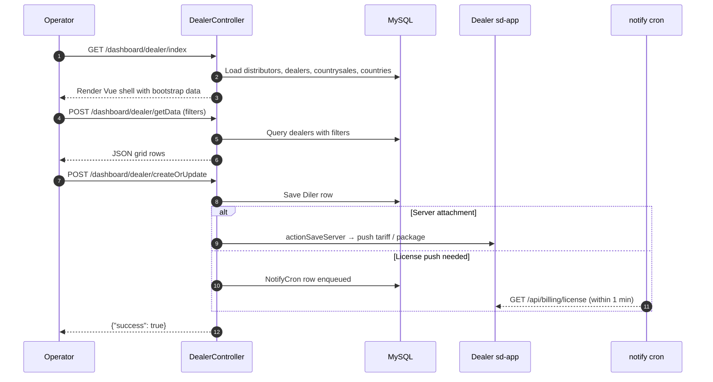

# `dashboard` module

`sd-billing/protected/modules/dashboard/` is the **internal admin UI**
for SalesDoctor staff. Operators, country managers, and admins use it
to inspect every dealer in the system, register payments, attach
tariffs, push licences, manage distributors, and run ad-hoc one-shot
fix scripts when production drifts.

It is the biggest module in sd-billing by both controller count and
action count. Three sub-families warrant special caution before you
touch them:

1. **`DealerController`** — the Vue-based dealer admin (17 actions).
   The primary screen for everything dealer-related.
2. **`FixController`** — ad-hoc one-shot scripts (12 actions). These
   are recovery tools, not feature endpoints. Each action solves a
   different historical problem.
3. **`ResetController`** — destructive ops (5 actions). Wipes data.
   **Never run in production without a verified backup.**

## Controller catalog

17 controllers, 116 actions total. Sorted by action count:

| Controller | Purpose | # actions |
|---|---|---:|
| `DealerController` | Vue-based dealer admin — the primary internal screen. List, search, edit dealer rows, attach tariffs, change subscriptions, import contacts, sync to server. | 17 |
| `FixController` | Ad-hoc one-shot scripts. Each action is a historical recovery tool. | 12 |
| `DistrController` | Distributor admin — distributors, distribute payments, import via Excel, reconciliation. | 11 |
| `DilerController` | Legacy (non-Vue) dealer admin — full CRUD on `Diler` rows, bonus attach, history, Excel import. | 10 |
| `NotificationController` | In-app notification admin. | 8 |
| `ComputationController` | Computation runs — dealer-side compute jobs. | 6 |
| `DashboardController` | Top-level dashboard — license stats, bot updates, deletion, balance-fix triggers. | 6 |
| `DistrComputationController` | Distributor computation runs. | 6 |
| `SettingController` | Module-scoped settings. | 6 |
| `SubscripController` | Subscription admin. | 6 |
| `PaymentController` | Internal payment admin — date patches, create / update flows. | 5 |
| `ResetController` | Destructive wipes — delete a dealer's history, reset balances, fix or delete servers. | 5 |
| `ServiceController` | Service-fee admin. | 5 |
| `CountrysaleController` | Country-sale rollup admin. | 4 |
| `DistrPaymentController` | Distributor payments admin. | 4 |
| `ChartController` | Charts feed for the dashboard. | 3 |
| `ServerController` | Server-side push triggers (admin shortcuts). | 2 |

Source: `protected/modules/dashboard/controllers/*Controller.php`.
Action totals from `grep -c "public function action"`.

## How the dealer admin loads

Most write actions resolve through `actionCreateOrUpdate`, which both
inserts and updates dealer rows. Server-side sync (the Vue
*Push to server* button) routes through `actionServer` / `actionSaveServer`
which talks directly to the dealer's sd-app over HTTP — not through
the `notify` cron queue. Licence-related changes go through the queue.

## Top 3 controllers in detail

### `DealerController` (17 actions)

The single largest controller in the module. Vue-based dealer admin
for everything you can do with a dealer.

| Action | Purpose |
|---|---|
| `actionIndex` | Render the Vue shell with distributors, dealers, countrysales, countries. |
| `actionGetData` | Main grid feed — paginated dealer rows with filter applied. |
| `actionGetOne` | Single dealer load — the edit-form data feed. |
| `actionCreateOrUpdate` | Insert / update a `Diler` row. |
| `actionServer` | Read the current server-attached tariff / package state. |
| `actionBonus` | Read dealer bonus override row. |
| `actionSaveBonus` | Write dealer bonus override row. |
| `actionSaveServer` | Push tariff / package to the dealer's sd-app server. |
| `actionDbUsers` | List the dealer's sd-app user accounts (read-through). |
| `actionMonthly` | Monthly billing summary for the dealer. |
| `actionContacts` | List dealer contact rows. |
| `actionMigrate` | Trigger a one-shot migration on the dealer's server. |
| `actionImportContacts` | Bulk-import contacts from Excel. |
| `actionExportContactTemplate` | Download the contact-import Excel template. |
| `actionChangeTariff` | Switch the dealer's active tariff mid-subscription. |
| `actionAttachTariff` | First-time tariff attachment for a new dealer. |
| `actionUpdateMinLicense` | Patch the minimum-licences-required floor. |

Auth: `accessRules` allows `@` (authenticated) for the core actions;
country-scope filtering inside each action via `getUserCountryIds()`
narrows the result set for non-admins.

### `FixController` (12 actions)

Ad-hoc one-shot recovery tools. Each `action*` here exists because
something went wrong in production at some point. These are **not**
general-purpose endpoints — read the source for the action you're
about to invoke before clicking it.

| Action | Purpose | Notes |
|---|---|---|
| `actionIndex` | List of available fix commands. | Access: `operation.fix.index` SHOW |
| `actionGiveDiscount` | Bulk-apply a discount to many dealers across many months. | Paginated 5 dealers per request via `actionGdProgress`. |
| `actionGdProgress` | The actual loop for `actionGiveDiscount`. | Offset / limit driven. |
| `actionWriteServer` | Re-push server attachments for a batch of dealers. | |
| `actionCheckServer` | Diagnostic — server reachability for a batch. | |
| `actionCheckStatusServer` | Diagnostic — server status for a batch. | |
| `actionWriteVisit` | One-shot — write back visit records. | |
| `actionRunAction` | Execute a Yii action by name on the dealer's server. | Effectively eval-by-route. |
| `actionAddOperation` | Insert a missing `Operation` row. | |
| `actionAddTypes` | Insert missing types. | |
| `actionRemoveAccessBillingAllUsers` | Strip billing access from every user. | Destructive — admins lose access too unless re-granted. |
| `actionRun` | Generic runner — invoked by other fix flows. | |

All actions gate on `operation.fix.*` access constants. Most are
admin-only by ACL in practice.

### `ResetController` (5 actions)

**Destructive.** Every action here deletes rows from production
tables. The controller protects itself with a date-as-password gate
(`$_GET["pass"] == date("md")`) — but that gate is by design weak.
The real protection is the `accessRules` admin role check and the
fact that the URLs are not linked from any normal screen.

| Action | Purpose | What it deletes |
|---|---|---|
| `actionIndex` | Wipe a dealer's history — keeps the `Diler` row, drops everything attached. | `d0_log_balans`, `d0_payment`, `d0_services`, `d0_subscription`, `d0_diler_bonus`, `d0_diler_package`, `d0_distr_payment` (type 11), `d0_report_comment`, `d0_active_record_log` (model=Diler), `d0_bot_statistic`, `d0_comp_details`. Then resets `BALANS = 0` and calls `deleteLicense()`. |
| `actionDelete` | Full dealer deletion — also drops the `Diler` row itself. | Everything in `actionIndex` plus the dealer row. |
| `actionFixServer` | Reset the server-attachment state to a known-good shape. | Touches `d0_server` rows. |
| `actionDeleteServer` | Drop server rows from `d0_server` for the dealer. | `d0_server`. |
| `actionDoneServer` | Mark server rows as done / inactive. | `d0_server.STATUS` patch. |

The `pass` gate is `date("md")` — today's month-day digits.
A 4-character per-day rotating "password" with **365 distinct values
across the year**. It is intentionally trivial; the real lock is the
admin role check and the URL obscurity.

## Cross-module touchpoints

### Reads

| Controller family | Tables read |
|---|---|
| `Dealer`, `Diler`, `DistrController` | `d0_diler`, `d0_distributor`, `d0_country`, `d0_countrysale`, `d0_currency`, `d0_user` |
| `Payment`, `DistrPayment` | `d0_payment`, `d0_distr_payment`, `d0_cashbox` |
| `Subscrip`, `Computation`, `Service` | `d0_subscription`, `d0_diler_package`, `d0_services`, `d0_tariff` |
| `Fix`, `Reset` | All of the above plus `d0_log_balans`, `d0_server`, `d0_report_comment`, `d0_active_record_log`, `d0_bot_statistic`, `d0_comp_details`, `d0_notify_cron` |
| `Chart`, `Dashboard` | Aggregate reads across `d0_payment` and `d0_diler` |
| `Notification`, `Setting` | Their own master tables |

### Writes

| Controller | Writes / destructive ops |
|---|---|
| `DealerController` | `d0_diler` (CRUD), `d0_diler_bonus` (saveBonus), `d0_contact` (importContacts), server-side push via HTTP |
| `DilerController` | `d0_diler` (CRUD), `d0_diler_bonus`, Excel import |
| `DistrController` | `d0_distributor`, `d0_distr_payment` (distribute) |
| `PaymentController` | `d0_payment` (createAjax / updateAjax / updateDate) |
| `SubscripController` | `d0_subscription` |
| `FixController` | Many tables — depends on the action |
| `ResetController` | **Destructive deletes** — see the action table above |
| `DashboardController` | `d0_notify_cron` (deleteLicense), `d0_diler.BALANS` (fixBalance) |

### Cross-module

- `operation/PaymentController` shares much of its read schema with
  `dashboard/PaymentController`. The dashboard one is intended for
  admin maintenance flows (date patches, batch operations) while the
  operation one is the day-to-day data entry surface.
- `bonus/MentorController` reads `Payment` rows attributed to dealers
  via `Diler.SALE_ID`. Bulk-changing SALE_ID via `DealerController`
  shifts past bonus attribution — see the bonus module's gotchas.
- `cashbox/ConsumptionController` consumes the same ledger this
  module helps maintain.

## Gotchas

- **`ResetController` is one CSRF away from data loss.** The
  `date("md")` "password" is per-day and trivially guessable. Admin
  role is the real gate. If admin credentials leak, `/dashboard/reset/index`
  with `pass=` today's `md` permanently deletes a dealer's history.
  **Never run in production without a verified backup taken in the
  last hour.**
- **`FixController` actions are one-shots, not features.** Don't link
  to them from menus. Don't add new fix actions for recurring needs —
  the right place is `operation` or a cron command.
- **`actionRunAction` in `FixController` is eval-by-route.** It
  invokes a Yii action by name on the dealer's server. Treat it as a
  remote-code-execution primitive and gate it accordingly.
- **`DealerController` and `DilerController` overlap.**
  `DealerController` is the Vue-based newer screen; `DilerController`
  is the legacy non-Vue screen. Both write to `d0_diler`. Some fields
  (`HOST`, `NAME`, `IS_DEMO`) are editable in both — concurrent edits
  produce last-write-wins.
- **`actionSaveServer` is synchronous HTTP to the dealer's sd-app.**
  Unlike `deleteLicense()` which queues to `d0_notify_cron`,
  `saveServer` calls the dealer's host directly. If the dealer's
  server is unreachable the operator sees the timeout in the UI.
- **`actionImportContacts` runs unbatched.** Large Excel files (>1k
  rows) can exceed PHP `max_execution_time`. Split into smaller
  files before importing.
- **`actionMigrate` triggers a server-side migration.** It is not
  reversible from this UI. Confirm the migration name before
  clicking — it executes whatever the dealer's sd-app has registered
  under that name.
- **`actionRemoveAccessBillingAllUsers` in `FixController` strips
  every user including admins.** Recovery requires direct DB access.
  Never click without a recovery plan.
- **`accessRules` shapes differ across controllers.** Some return
  `roles => array(3)` (admin only); some return `users => array('@')`
  (any authenticated). Don't assume one controller's gating from
  another's.

## See also

- [`operation.payment` workflow](../workflows/operation-payment.md) — the
  customer-facing payment screen; dashboard's `PaymentController` is
  the admin-side counterpart.
- [`bonus` module](./bonus.md) — `DealerController` and `DilerController`
  carry the `*Bonus` actions that drive the bonus tier formula.
- [`cashbox` module](./cashbox.md) — ledger destination for payment
  rows registered here.
- [Cron & settlement](../cron-and-settlement.md) — the `notify` cron
  that processes `d0_notify_cron` rows enqueued by this module's
  `deleteLicense()` calls.
- [Security landmines](../security-landmines.md) — the auth flaws
  this module's destructive endpoints rely on.
- Source: `protected/modules/dashboard/controllers/`.
