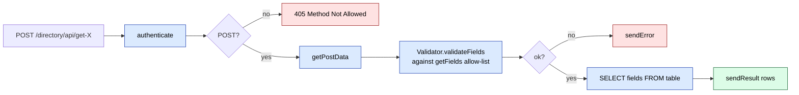

# sd-billing `directory` module

The `directory` module is sd-billing's public read-side for reference data. Eight lookup endpoints sit behind a single `ApiController` that uses Yii's `actions()` map to delegate every route to a dedicated action class. Each action authenticates the caller, validates the requested fields against an allow-list, builds a `SELECT` over the underlying table, and returns JSON.

This module is the contract surface partner systems use to mirror sd-billing's master data into their own stores — currency lists, country lists, package tariffs, dealer rosters. The shape is consistent across every endpoint: the caller passes a `fields` array, the action filters that list against its `getFields()` allow-list, and only allow-listed columns make it into the response.

## Key features

| Feature | What it does | Owner role(s) |
|---|---|---|
| Dealer lookup | Returns the `d0_diler` roster — id, name, domain, balance, country, city, currency, status, responsible user | api (ROLE 6), admin |
| Distributor lookup | Returns `d0_distributor` rows for partner reporting | api, admin |
| Currency / country / city lookups | Master geographical and monetary reference data | api, admin |
| Package lookup | Tariff package catalog (`d0_package`) used by the SD-app to render the buy-licence screen | api, admin |
| User lookup | sd-billing operator/manager directory (excluding API and partner accounts) | api, admin |
| Country-sales lookup | Sales-by-country aggregation for partner dashboards | api, admin |
| Field allow-listing | Each endpoint declares its own `getFields()` allow-list; unknown fields are stripped before SQL builds | n/a |

## Folder

```
protected/modules/directory/
  DirectoryModule.php
  controllers/
    ApiController.php           (1 thin controller; actions() maps to 8 action classes)
  actions/
    CityAction.php
    CountryAction.php
    CountrysaleAction.php
    CurrencyAction.php
    DealerAction.php
    DistributorAction.php
    PackageAction.php
    UserAction.php
```

## Controllers

| Controller | Purpose | Actions | Auth |
|---|---|---|---|
| `ApiController` | Single dispatcher for the eight lookup endpoints | `get-dealers`, `get-distributors`, `get-currencies`, `get-countries`, `get-cities`, `get-packages`, `get-users`, `get-countrysales` | Each action calls `$this->authenticate()` in its own `run()` — the base `ApiAction` class implements the auth check (token-based, partner-key or operator session) |

### `actions()` map

`ApiController` has no inline action methods. Yii's `actions()` returns the map:

| Route | Action class | Path |
|---|---|---|
| `directory/api/get-dealers` | `DealerAction` | `actions/DealerAction.php` |
| `directory/api/get-distributors` | `DistributorAction` | `actions/DistributorAction.php` |
| `directory/api/get-currencies` | `CurrencyAction` | `actions/CurrencyAction.php` |
| `directory/api/get-countries` | `CountryAction` | `actions/CountryAction.php` |
| `directory/api/get-cities` | `CityAction` | `actions/CityAction.php` |
| `directory/api/get-packages` | `PackageAction` | `actions/PackageAction.php` |
| `directory/api/get-users` | `UserAction` | `actions/UserAction.php` |
| `directory/api/get-countrysales` | `CountrysaleAction` | `actions/CountrysaleAction.php` |

## Action contract

Every action extends `ApiAction` and follows the same five-step recipe (see `DealerAction.php` as the canonical example):



### Request

```
POST /directory/api/get-dealers
Headers: Authorization: Bearer :token:
Content-Type: application/json
Body: { "fields": ["id", "name", "domain"] }
```

### Response

```json
{
  "success": true,
  "data": [
    { "id": 12, "name": "Dealer Inc", "domain": "dealer.example.com" }
  ]
}
```

### Field allow-list (DealerAction example)

| Field key | SQL expression |
|---|---|
| `id` | `dil.ID AS id` |
| `name` | `dil.NAME AS name` |
| `domain` | `dil.DOMAIN AS domain` |
| `balance` | `dil.BALANS AS balance` |
| `country_id` | `dil.COUNTRY_ID AS country_id` |
| `city_id` | `dil.CITY_ID AS city_id` |
| `currency_id` | `dil.CURRENCY_ID AS currency_id` |
| `group_id` | `dil.GROUP_ID AS group_id` |
| `active_to` | `dil.ACTIVE_TO AS active_to` |
| `status` | `CASE dil.STATUS WHEN 10 THEN "active" WHEN 20 THEN "deleted" WHEN 30 THEN "archive" ELSE "unknown" END AS status` |
| `responsible_id` | `dil.USER_ID AS responsible_id` |
| `created_at` | `dil.CREATED_AT AS created_at` |
| `updated_at` | `dil.UPDATED_AT AS updated_at` |

Each other action declares its own `getFields()` matching its source table. A request asking for a key not in the allow-list either falls through silently or returns an error with `details` listing the unknown keys — depending on `Validator::validateFields` policy.

## Cross-module touchpoints

- **`api` module** has its own License/Click/Payme endpoints with different auth (TOKEN constant, gateway sign verification). `directory` is the only module designed for partner-system polling with the standard `ApiAction` auth chain.
- **`partner` module** consumes these endpoints internally — the partner self-service portal renders dealer/distributor lists by calling `directory` actions, not by hitting the underlying models directly.
- **`d0_diler.STATUS`** values in the dealer response are CASE-mapped to strings (`active`/`deleted`/`archive`). Consumers should treat status as an enum string, not the integer.
- **`d0_package`** package definitions returned here are the canonical source for tariff names and prices shown in the SD-app's buy-licence flow.

## Gotchas

- **`POST` only.** Each action checks `$this->method !== 'POST'` and returns `405 Method Not Allowed` for GET. Callers used to REST conventions may be surprised — these are JSON-RPC-style "get-X" endpoints.
- **No pagination.** The actions issue `SELECT * FROM ...` without a `LIMIT` clause. A `d0_diler` with 10,000 rows returns 10,000 rows. Add a `LIMIT` filter on the caller side or accept a full table scan.
- **No deleted-row filter on most actions.** `DealerAction` does not exclude `STATUS = 20` (deleted) dealers — it returns them with `status: "deleted"`. Consumers must filter explicitly.
- **Field allow-list is the only column-level security.** A new column added to `d0_diler` will not leak into responses until someone adds it to `getFields()`. This is a feature, not a bug — but it means new columns require code changes to expose.
- **`authenticate()` semantics live in the base `ApiAction`.** Adding a new directory action means inheriting that auth automatically, but renaming or relocating the base class will break every endpoint silently if the inheritance breaks.
- **Status string mapping is duplicated in CASE expressions.** Editing the `d0_diler.STATUS` integer values requires updating the `CASE` in `DealerAction::getFields()` too.
- **`getPostData()` returns whatever the client sent.** No schema validation beyond the field allow-list — a malformed `fields` array can cause `validateFields` to return `{message: ..., details: ...}` which the action does forward, but other malformed bodies pass through.

## See also

- [api module](./api.md) — Click/Payme/Paynet endpoints with gateway-specific auth
- [partner module](./partner.md) — internal consumer of the directory endpoints
- [Domain model](../domain-model.md) — `d0_diler`, `d0_package`, `d0_currency`, `d0_country` schemas
- Source: `protected/modules/directory/controllers/ApiController.php` and `protected/modules/directory/actions/`
