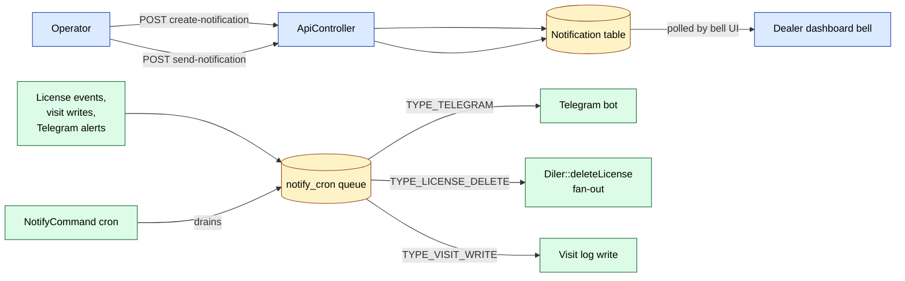

# sd-billing `notification` module

The `notification` module owns the in-app bell shown in the operations dashboard - the broadcast channel HQ uses to push news, alerts, warnings, and surveys to every dealer logged into the operator UI. Two controllers expose the surface: `ApiController` is the AJAX backend wired to nine action classes, `ViewController` renders the four legacy server-side pages.

This module does not own the asynchronous side-channel that the rest of sd-billing uses for outbound messaging - that lives in `models/NotifyCron.php` and is drained by `commands/NotifyCommand.php`. Both surfaces share the same name "notification" in the codebase, so this page covers both and explains where each draws the line.

## Key features

| Feature | What it does | Storage |
|---|---|---|
| Operator broadcast | Create a notification (news, alert, warning) targeted by dealer IDs, currencies, distributors, or roles | `Notification` rows with `TYPE` in `{1,2,3}` |
| In-app bell delivery | Dealers pull unread notifications via the read endpoint; counter decrements as they open | `Notification` joined per-recipient |
| Survey (tally) campaigns | A "tally" is an external survey URL pushed to a target audience and tracked separately | `Notification` rows with `TYPE = TYPE_TALLY = 4` |
| Auto-fire dispatch | The `is_auto` flag lets a notification dispatch immediately on save, instead of waiting for manual `send-notification` | `Notification.AUTO` |
| Edit and delete | Pre-send mutation via `EditNotificationAction` and `DeleteNotificationAction`; sent notifications are soft-deleted via `IS_DELETED` | `Notification.IS_DELETED` |
| Async outbound queue | A separate table `notify_cron` carries Telegram messages, license-delete signals, and visit-write triggers - drained by the `notify` console command | `notify_cron` table |

## Folder

```
protected/modules/notification/
  NotificationModule.php
  controllers/
    ApiController.php          # 9 actions registered via actions() (no inline action methods)
    ViewController.php         # 4 inline actions
  actions/
    notification/
      GetNotificationsAction.php
      CreateNotificationAction.php
      EditNotificationAction.php
      SendNotificationAction.php
      DeleteNotificationAction.php
      GetNotificationInfoAction.php
    tally/
      GetTallyAction.php
      CreateTallyAction.php
      UpdateTallyAction.php
  views/
    view/index.php             # bell list
    view/tally.php             # tally list
    view/send.php              # tally launch confirm
    view/delete.php            # tally delete confirm

# Out of module but related
protected/models/Notification.php       # the row model
protected/models/NotifyCron.php         # async outbound queue model
protected/commands/NotifyCommand.php    # cron worker that drains notify_cron
```

## Controllers

| Controller | Purpose | Actions | Auth |
|---|---|---|---|
| `ApiController` | AJAX backend. Returns JSON. All endpoints are mapped through `actions()` to standalone action classes that extend `ApiAction` | 9 routes via `actions()` map | each action calls `$this->authorize([], ['operation.notification.index', Access::<flag>])` against the access grid |
| `ViewController` | Server-rendered pages. Just renders views; mutation happens via JS calling `ApiController` | `actionNotification`, `actionTally`, `actionSend`, `actionDelete` | `Access::check('operation.notification.index'` or `'operation.tally.index')` per action |

### `ApiController` routes

The controller has no `actionX` methods - every route is declared in `actions()` and resolved to a class under `application.modules.notification.actions.*`. Routes are kebab-case, not camelCase.

| Route | Action class | Permission | What it does |
|---|---|---|---|
| `/notification/api/get-notifications` | `GetNotificationsAction` | `operation.notification.index` SHOW | Returns the paged notification list, filterable by type, status, date range |
| `/notification/api/create-notification` | `CreateNotificationAction` | `operation.notification.index` CREATE | Insert a `Notification` row. Type maps from string `news/alert/warning` to constants 1/2/3. Targets: explicit `dealer_ids`, or all dealers in given `currency_ids` and `distributor_ids`. Optional `roles` and `is_auto` flag |
| `/notification/api/edit-notification` | `EditNotificationAction` | `operation.notification.index` UPDATE | Update title, preview, content, targets pre-send |
| `/notification/api/send-notification` | `SendNotificationAction` | `operation.notification.index` UPDATE | Flip `STATUS` to dispatched; expand audience filter into per-recipient delivery rows |
| `/notification/api/delete-notification` | `DeleteNotificationAction` | `operation.notification.index` DELETE | Soft delete by setting `IS_DELETED = 1` |
| `/notification/api/notification-info` | `GetNotificationInfoAction` | `operation.notification.index` SHOW | One-notification detail incl. delivery counter |
| `/notification/api/get-tally` | `GetTallyAction` | `operation.tally.index` SHOW | List tallies (`Notification.TYPE = TYPE_TALLY`) |
| `/notification/api/create-tally` | `CreateTallyAction` | `operation.tally.index` CREATE | Create a tally. Stores survey URL in `DETAIL`, external API key in `PREVIEW` |
| `/notification/api/edit-tally` | `UpdateTallyAction` | `operation.tally.index` UPDATE | Edit a tally |

`is_auto` semantics: when set to 1, the notification is meant to dispatch on save without an explicit `send-notification` call. The flag is persisted; the actual auto-dispatch is wired in the post-save hook on `Notification` (not in the action class).

### `ViewController` actions

| Action | What it does | Permission |
|---|---|---|
| `actionNotification` | Renders the notification list view. JS hits `ApiController` endpoints | `operation.notification.index` SHOW |
| `actionTally` | Renders the tally list view | `operation.tally.index` SHOW |
| `actionSend` | Renders the per-tally send confirm page. Validates that the tally exists, has `TYPE = TYPE_TALLY`, and is not soft-deleted. Loads a stub progress block (`completed: 0, total: 0`) | `operation.tally.index` SHOW |
| `actionDelete` | Renders the per-tally delete confirm page | `operation.tally.index` DELETE |

Both `actionSend` and `actionDelete` throw `CHttpException(404)` if the row is missing, not a tally, or already soft-deleted.

## In-app bell vs the async NotifyCron queue



The two systems do not share a table:

- **`Notification`** is pull-based. The dealer dashboard polls it. Created and managed by this module's controllers.
- **`NotifyCron`** is push-based. The cron worker calls out to Telegram, sd-main, etc. Created by callers anywhere in the codebase via `NotifyCron::create($chat_id, $text, ...)` for Telegram, and by dedicated factory methods for `TYPE_LICENSE_DELETE` and `TYPE_VISIT_WRITE`. Drained by `NotifyCommand` (a Yii console command).

The three `NotifyCron` types:

| Type constant | Value | Producer | Consumer effect |
|---|---|---|---|
| `TYPE_TELEGRAM` | `"telegram"` | `NotifyCron::create(...)` from any module - license expiry warnings, payment receipts, manual operator pings | Sends a Telegram message via `Telegram::sendNow` |
| `TYPE_LICENSE_DELETE` | `"license_delete"` | License-change events from `LicenseController` and `Diler::deleteLicense` | Calls back to the affected sd-main tenant to force a licence-cache flush |
| `TYPE_VISIT_WRITE` | `"visit_write"` | Visit-related triggers, typically from operations | Writes a visit log entry on the tenant side |

`NotifyCommand` (in `protected/commands/NotifyCommand.php`) is the worker. It polls `notify_cron` rows, dispatches per `type`, and on success marks the row as processed.

## Cross-module touchpoints

- **`access` module** is the permission backstop. Every `ApiController` route gates on `operation.notification.index` or `operation.tally.index`. See [access module](./access.md).
- **`operation` module** is where the operator UI for managing notifications lives - the views and JS that call this module's endpoints are part of the operations dashboard.
- **`api/LicenseController`** is one of the larger producers into `notify_cron` with `TYPE_LICENSE_DELETE` and `TYPE_TELEGRAM` payloads. See [license push workflow](../workflows/license-push.md).
- **`operation/notification` rules** are the firing side that turns balance and licence events into `notify_cron` rows. See [operation-notification-rules](../workflows/operation-notification-rules.md).
- **`Telegram` component** (`protected/components/Telegram.php`) is the actual HTTP wrapper. `NotifyCron` posts a `Telegram::sendNow` for every drained row.

## Gotchas

- **Tally is `Notification` with a different TYPE.** There is no separate `tally` table. `Notification.TYPE = 4` flips a row from a broadcast into a survey, and the `PREVIEW`/`DETAIL` columns get reused as `api_key` and `url`. Queries on `Notification` without a TYPE filter mix broadcasts and surveys.
- **`actionSend` on `ViewController` only renders a confirm page.** The actual send is the JS POST to `/notification/api/send-notification`. The page does not perform the action by itself.
- **`is_auto` does not fire from `CreateNotificationAction`.** The action persists the flag but does not call the send pipeline inline. The auto-dispatch behavior lives in `Notification` model hooks - verify in `protected/models/Notification.php` before relying on it.
- **`ApiController` has no inline actions.** Grepping for `actionGetNotifications` in the controller returns nothing. The routes are declared in `actions()` and resolved to standalone classes - this is the standard sd-billing pattern for the AJAX modules but trips up greps.
- **The two notification systems use the word "notification" interchangeably.** When a ticket says "notification not sent", clarify which: the in-app bell row (`Notification` table) or the async out-bound message (`notify_cron` row). The pages and the storage are independent.
- **`NotifyCron` rows survive on retry but do not idempotency-key.** If the cron worker dispatches a `TYPE_TELEGRAM` row and Telegram rate-limits, the next worker tick re-sends. There is no `attempts` cap visible in `NotifyCron` - check `NotifyCommand.php` before assuming retry is bounded.
- **Soft-delete via `IS_DELETED`.** Sent notifications cannot be hard-deleted from the UI. The bell endpoint must filter `IS_DELETED = 0`, otherwise stale rows appear.

## See also

- [Notifications overview](../notifications.md) - producer side of the bell channel
- [Operation notification rules](../workflows/operation-notification-rules.md) - the rule-firing engine that creates `notify_cron` rows
- [License push workflow](../workflows/license-push.md) - the largest source of `TYPE_LICENSE_DELETE` traffic
- [access module](./access.md) - permissions checked by every endpoint here
- [Cron and settlement](../cron-and-settlement.md) - the broader cron landscape that `NotifyCommand` is part of
