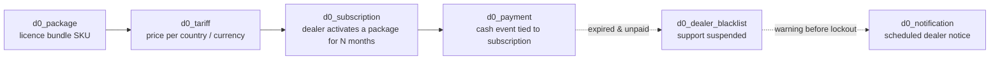

# `operation` module

`sd-billing/protected/modules/operation/` is the **HQ-admin surface**
of sd-billing. Almost every keyboard shortcut a SalesDoctor ops user
hits lives here — defining what a dealer is paying for (Package,
Tariff), recording that they paid (Payment, Subscription), pulling
them off support (Blacklist), and scheduling the dunning notices that
warn them before they get blacklisted (Notification).

This page is the **roll-up** — see the per-controller workflow pages
for filter forms, SQL, screenshots and edge cases.

## Controllers catalog

10 controllers. Six of them already have a dedicated workflow page;
the remaining four — `PackageSMPro`, `SubscriptionSMPro`, `Relation`
and `View` — are documented inline below.

| Controller | Purpose | Actions | Workflow page |
|---|---|---:|---|
| `PaymentController` | Dealer-facing payment ledger CRUD (the cash-in side). | 4 | [operation-payment](/docs/sd-billing/workflows/operation-payment) |
| `SubscriptionController` | Active subscriptions per dealer — create, exchange, calculate bonus, delete. | 7 | [operation-subscription](/docs/sd-billing/workflows/operation-subscription) |
| `PackageController` | Package catalog (licence bundles, durations, addons). | 4 | [operation-package](/docs/sd-billing/workflows/operation-package) |
| `TariffController` | Tariff matrix — what each package costs per country/currency. | 4 | [operation-tariff](/docs/sd-billing/workflows/operation-tariff) |
| `BlacklistController` | Dealer blacklist add/remove/list — gates licence renewal. | 3 | [operation-blacklist](/docs/sd-billing/workflows/operation-blacklist) |
| `NotificationController` | Dealer notification rules + sender (dunning, expiry warnings). | 10 | [operation-notification-rules](/docs/sd-billing/workflows/operation-notification-rules) |
| `PackageSMProController` | SMPro / chatbot package catalog (carved out from Package). | 4 | — (see below) |
| `SubscriptionSMProController` | SMPro / chatbot subscription ledger. | 4 | — (see below) |
| `RelationController` | Dealer-to-package assignment ("which packages a dealer is offered"). | 5 | — (see below) |
| `ViewController` | Thin landing pages — tariff index, blacklist index. | 2 | — (see below) |

Total: 47 entries counting both `actionFoo` methods and `actions()`-mapped action classes. Source: `protected/modules/operation/controllers/*Controller.php` and `protected/modules/operation/actions/*/`.

## Common mechanics

The operation module reads/writes the **HQ ledger DB** — the
`d0_payment`, `d0_subscription`, `d0_package`, `d0_diler`,
`d0_dealer_blacklist`, `d0_notification` tables. There is no
per-tenant fan-out here — sd-billing IS the tenant for these tables.

Every controller follows the same Yii-1 shape:

1. `actionIndex` renders the filter/list page. Dropdown data is
   gathered with `QueryBuilder::selectAll()` against `Country`,
   `City`, `Currency`, `Diler`, `Distributor`, `Package`, `User`.
2. The Vue table hits `actionGetData` over POST with a filter JSON.
3. Mutations go through `actionCreateOrUpdate` (upsert) and
   `actionDelete` / `actionDeleteOne`.
4. Access is checked at the top of every action with
   `Access::check('operation.<area>.<key>', Access::SHOW|CREATE|UPDATE|DELETE)`.
5. `VController` (Vue-base) handles JSON envelope; legacy controllers
   extend plain `Controller` and render twig/PHP views directly.

```mermaid
sequenceDiagram
  autonumber
  participant U as HQ user
  participant W as operation controller
  participant DB as d0_ ledger DB
  participant N as Notification cron

  U->>W: GET /operation/<ctrl>/index
  W->>DB: dropdown data (Country, Currency, Diler, ...)
  W-->>U: HTML + Vue shell
  U->>W: POST /operation/<ctrl>/getData (filters)
  W->>DB: SQL through QueryBuilder
  W-->>U: JSON rows
  U->>W: POST /operation/<ctrl>/createOrUpdate
  W->>DB: BEGIN; INSERT/UPDATE; COMMIT
  W-->>U: {success, message}
  N->>DB: SELECT d0_notification WHERE due
  N->>DB: send + mark COMPLETED
```

## Package → Tariff → Subscription → Payment cascade

The four core tables form a strict left-to-right cascade:



- **Package** rows are immutable catalog SKUs created in
  `PackageController::actionCreateOrUpdate`. A package locked into an
  active Subscription cannot be edited — the `changeable` flag in the
  list SQL is `NOT EXISTS (SELECT 1 FROM d0_subscription ...)`.
- **Tariff** rows price a Package for a `(country, currency)` pair.
  Stored as separate rows in `d0_tariff`; managed via `TariffController`
  action classes (`TariffCreateAction`, `TariffUpdateAction`).
- **Subscription** rows are issued when a dealer pays for a Package.
  `SubscriptionCreateAction` writes `d0_subscription`, then
  `PaymentController::actionCreateOrUpdate` (or the cashbox flow)
  writes the matching `d0_payment` row.
- **Payment** with `TYPE = 10` is the licence payment that "feeds"
  the subscription's `ACTIVE_TO` date. Other types (cash-in,
  cashless, distributor settlement) flow through the same table.
- **Blacklist** is added by hand from `BlacklistController` but is
  also auto-suggested by the `operation/report/Catchers` report.
- **Notification** schedules a future dealer-facing message. The
  sender lives in `NotificationController::actionSend` (cron) and
  marks rows `COMPLETED` after delivery.

## Top controllers (detailed)

### `PaymentController` (4 actions)

The cash-in ledger. Lists every `d0_payment` row with type filters
(licence, service, manual settlement, distributor settlement) and a
date range. Workflow detail: [operation-payment](/docs/sd-billing/workflows/operation-payment).

| Action | Purpose |
|---|---|
| `actionIndex` | Render the payment list page. Loads distributors, dealers, cashboxes, currencies, payment types, and the dealer's own cashboxes (filtered by `ACCESS_CASHBOX` or ownership). |
| `actionGetData` | Paginated rows for the Vue table. Filters by type, dealer, date, cashbox. |
| `actionCreateOrUpdate` | Upsert a payment row. Also writes the matching cashbox movement. |
| `actionDelete` | Soft-delete (`IS_DELETED = 1`); cashbox row is reversed in the same transaction. |

Access: `operation.dealer.payment` (SHOW / CREATE / UPDATE / DELETE).

### `SubscriptionController` (7 sub-actions)

Plain `Controller` that delegates everything to action classes in
`actions/subscription/`. Workflow detail: [operation-subscription](/docs/sd-billing/workflows/operation-subscription).

| Action key | Action class | Purpose |
|---|---|---|
| `list` | `SubscriptionListAction` | Paginated subscription list per dealer. |
| `info` | `SubscriptionInfoAction` | Detail panel (dates, count, package, paid amount). |
| `create` | `SubscriptionCreateAction` | Issue a new subscription row. Computes `ACTIVE_TO` from `COUNT` (months) × tariff. |
| `update` | `SubscriptionUpdateAction` | Edit an existing subscription (count, dates, package). |
| `delete` | `SubscriptionDeleteAction` | Soft-delete a subscription. |
| `calculate-bonus` | `SubscriptionCalculateBonusAction` | Compute the renewal bonus for a dealer. |
| `exchange` | `SubscriptionExchangeAction` | Swap a dealer's current package mid-cycle (pro-rated). |

### `PackageController` (4 actions)

Licence-bundle catalog. The "non-SMPro" packages — SalesDoctor app
licences, chatbot tariff plans, service bundles. Access:
`operation.package.index`. `actionIndex` page-shells loads
currencies, package/client/subscription types and supports `?view=old`.
`actionGetData` exposes a `changeable` flag = `NOT EXISTS (SELECT 1
FROM d0_subscription WHERE PACKAGE_ID = p.ID)`. `actionCreateOrUpdate`
validates against `Package::model()->getTypes()` etc.
`actionDeleteOne` hard-deletes only when no Subscription points at it.
SMPro packages are in `PackageSMProController`.

### `TariffController` (4 sub-actions)

Plain `Controller`. Maps to `actions/tariff/*` — `TariffListAction`
(matrix per package/country), `TariffCreateAction` (add a `(package,
country, currency, amount)` tuple), `TariffUpdateAction`,
`TariffDeleteAction`. Render shell is `ViewController::actionTariff`.
Workflow detail: [operation-tariff](/docs/sd-billing/workflows/operation-tariff).

### `BlacklistController` (3 sub-actions)

Plain `Controller` mapping to `actions/blacklist/*` —
`BlacklistListAction` (paginated with reason / salesman / date),
`BlacklistAddAction` (reason code + comment + optional
support-suspension), `BlacklistRemoveAction`. Render shell is
`ViewController::actionBlacklist`, which preloads reasons,
distributors, countries, cities, currencies and salesmen. Workflow
detail: [operation-blacklist](/docs/sd-billing/workflows/operation-blacklist).

### `NotificationController` (10 actions)

The dunning / expiry-warning scheduler. Workflow detail:
[operation-notification-rules](/docs/sd-billing/workflows/operation-notification-rules).

| Action | Purpose |
|---|---|
| `actionIndex` | Legacy single-page list view (`IndexOld`). |
| `actionIndexNew` | Vue-table list with form-page mode flag. |
| `actionForm` | Standalone form page (`formPage`) for create/edit. Loads `editItem` when `?id=` is set. |
| `actionGetData` | Paginated notifications list. |
| `actionCreateOrUpdate` | Upsert a scheduled notification rule. |
| `actionSend` | Dispatch a row through the configured channel (TG / SMS / Email). Used by the operator and by cron. |
| `actionPost` | Mark a draft notification as "ready to send". |
| `actionDelete` | Bulk-delete drafts. |
| `actionDeleteOne` | Delete a single notification (refused if it was already sent). |
| `actionCompleted` | List historical / sent notifications. |

## Controllers without a workflow page (documented here)

### `PackageSMProController` (4 actions)

Same shape as `PackageController` but scoped to the SMPro packages —
`SUBSCRIP_SMPRO_USER` and `SUBSCRIP_SMPRO_BOT`. Carved out so the
SMPro tariff team can curate their own catalog without touching the
main licence catalog.

| Action | Purpose |
|---|---|
| `actionIndex` | Render SMPro package list. Loads currencies, SMPro types, SMPro subscription types. |
| `actionGetData` | Lists only packages with `SUBSCRIP_TYPE IN (SMPRO_USER, SMPRO_BOT)`. |
| `actionCreateOrUpdate` | Upsert. Validates against the SMPro-only enums. Default `PACKAGE_TYPE = PAID`, `CLIENT_TYPE = PRIVATE`. |
| `actionDeleteOne` | Hard-delete with no-subscription check. |

Access key: `operation.package.smpro`.

### `SubscriptionSMProController` (4 actions)

The cash-in view for SMPro subscriptions. Unlike
`SubscriptionController`, this controller is direct `actionX` methods
(not delegated to action classes) and only reads — it joins
`d0_subscription` to `d0_payment` (TYPE = 10), filtered to SMPro
packages.

| Action | Purpose |
|---|---|
| `actionIndex` | List page. Loads packages, dealers, SMPro subscription types. |
| `actionGetData` | Paginated SMPro subscription rows for a date window. |
| `actionCreate` | Issue an SMPro subscription. |
| `actionDelete` | Soft-delete. |

Access key: `operation.subscription.smpro`.

### `RelationController` (5 actions)

Manages the **dealer-to-package assignment** — which packages each
dealer is offered in their cabinet. Without a row in `d0_diler_package`
a dealer cannot pick that package when renewing.

| Action | Purpose |
|---|---|
| `actionIndex` | Render the relation manager. Loads packages, dealers, distributors, package types, subscription types. |
| `actionGetData` | List rows from `d0_diler_package` joined to `d0_diler` and `d0_package`. |
| `actionCreateOrUpdate` | Bulk-assign a package to multiple dealers in one transaction. Skips dealers that already have the relation. |
| `actionDeleteOne` | Remove a `(dealer, package)` link. |
| `actionShare` | Share a saved relation set with another HQ user (used to copy package offerings between countries). |

Access key: `operation.dealer.package.index`.

### `ViewController` (2 actions)

Thin landing-page renderer for two areas whose data lives in action
classes (Tariff, Blacklist). Exists so the Yii URL rules don't have
to round-trip through `TariffController::list` just to render an HTML
shell.

| Action | Purpose |
|---|---|
| `actionTariff` | Renders the tariff-matrix Vue shell. Access: `operation.tariff.index`. |
| `actionBlacklist` | Renders the blacklist Vue shell. Preloads reasons, distributors, countries, cities, currencies, salesmen. Access: `operation.dealer.blacklist`. |

## Cross-module touchpoints

| Reads from | Used by |
|---|---|
| `cashbox` module (`Cashbox`, `CashboxMovement`) | `PaymentController::actionIndex` filters to the user's own cashboxes; `actionCreateOrUpdate` writes the matching cashbox movement. |
| `setting` module (`Country`, `City`, `Currency`) | All controllers — dropdown data. See [setting module](/docs/sd-billing/modules/setting). |
| `directory` module (`Diler`, `Distributor`, `DealerBlacklist`) | Dealer/distributor catalogs and blacklist storage. |
| `notification` module (channel adapters) | `NotificationController::actionSend` delegates to the TG/SMS/Email sender. See [notifications](/docs/sd-billing/notifications). |
| `report.Catchers` | The "potential blacklist" report suggests dealers to add via `BlacklistAddAction`. |
| `report.ActiveCustomers` | Counts active subscriptions issued through this module. |

## Gotchas

- **`PackageController` vs `PackageSMProController` are separate
  catalogs.** They share `d0_package` but partition by `SUBSCRIP_TYPE`.
  Editing the wrong controller will surface a "subscription type is
  not found" validation error from `Package::model()->getSubscripTypes()`.
- **Edit lock via `changeable` flag.** A Package or Tariff with at
  least one Subscription pointing at it cannot be edited. The list
  SQL exposes `changeable = NOT EXISTS (SELECT 1 FROM d0_subscription
  WHERE PACKAGE_ID = p.ID)`. Front-end greys the edit button — the
  back-end re-checks before write.
- **Payment soft-delete is not just `IS_DELETED = 1`.** The cashbox
  movement created alongside the payment must be reversed in the same
  transaction, otherwise the dealer's cash balance drifts. See
  [balance-and-money-math](/docs/sd-billing/balance-and-money-math).
- **Notification `actionSend` is cron-callable.** It accepts no auth
  when invoked from the in-process scheduler. Don't expose it on a
  public route — it will send to whatever rows are due regardless of
  the caller.
- **`SubscriptionExchangeAction` does pro-ration.** It does not just
  swap `PACKAGE_ID`; it closes the old subscription on the exchange
  date, computes the unused portion as a credit, and issues a new
  subscription for the remaining months. The payment side stays the
  same — no new `d0_payment` row.
- **`RelationController::actionShare` is one-way.** Sharing copies the
  relation set into the target user's view; later edits on the source
  side do not propagate. Re-share to re-sync.
- **`ViewController` actions are pure render — no data writes.** Any
  state mutation has to go through the matching domain controller.
  Don't add SQL to ViewController.
- **`actionForm` vs `actionIndexNew` in Notification.** They share the
  same model but render different layouts. The `formPage` flag tells
  the Vue shell whether to mount the list grid or the editor.
  Mismatched flag = blank page.

## See also

Workflow deep-dives: [operation-payment](/docs/sd-billing/workflows/operation-payment), [operation-subscription](/docs/sd-billing/workflows/operation-subscription), [operation-package](/docs/sd-billing/workflows/operation-package), [operation-tariff](/docs/sd-billing/workflows/operation-tariff), [operation-blacklist](/docs/sd-billing/workflows/operation-blacklist), [operation-notification-rules](/docs/sd-billing/workflows/operation-notification-rules).

Sibling reference pages:

- [report module](/docs/sd-billing/modules/report) — internal reports
- [setting module](/docs/sd-billing/modules/setting) — reference data
- [subscription-flow](/docs/sd-billing/subscription-flow) — lifecycle
- [payment-gateways](/docs/sd-billing/payment-gateways) — wire-in side
- [balance-and-money-math](/docs/sd-billing/balance-and-money-math) — money
- [notifications](/docs/sd-billing/notifications) — sender plumbing
