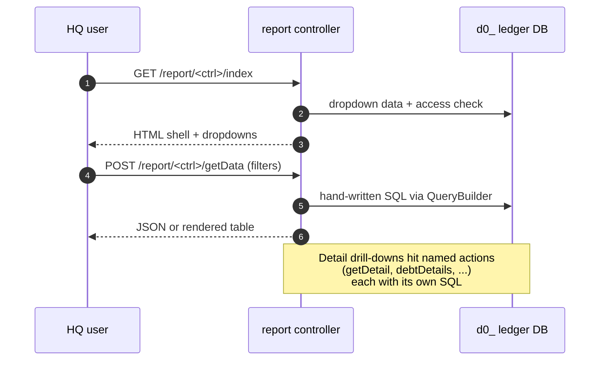

# `report` module

`sd-billing/protected/modules/report/` is the **internal reporting
surface** for SalesDoctor staff. It answers HQ questions:

- *which dealers paid us this month and which churned?*
- *what's the revenue and P&L per country / per package?*
- *who's about to lapse — pull them into the catchers report?*
- *how is each key-account manager performing on their dealer book?*

Nothing here is dealer-facing. The reports a dealer sees about their
own data live in [sd-main `report` module](/docs/modules/report); the
cross-dealer ops reports live in [sd-cs `report` module](/docs/sd-cs/modules/report).

## Controllers catalog

19 controllers. Top five (Report, Pivot, ActiveCustomers, KeyAccount,
Churn) get the detailed treatment below. The rest are one-liners.

| Controller | Purpose | Actions | Notes |
|---|---|---:|---|
| `ReportController` | The summary dashboard — paid amount by month, debt details, cashless split, debt by dealer, service detail. The legacy "home" report. | 11 | Detailed below |
| `PivotController` | Cross-dimensional pivot of payments — save/load layouts. | 6 | Detailed below |
| `ActiveCustomersController` | Active subscription headcount per country / per tariff. | 7 | Detailed below |
| `KeyAccountController` | KA-manager performance — dealers under each KA, distributor split. | 5 | Detailed below |
| `ChurnController` | Month-on-month churn with comments. | 5 | Detailed below |
| `PlanSalesController` | Plan-vs-fact for the sales team (not for dealers). | 4 | Filter form + drill-down. |
| `CatchersController` | "Dealers about to lapse" — feeds the Blacklist add flow. | 3 | Sets first-sub date when a churned dealer comes back. |
| `KeyAccountReriodController` | KA performance over a `(from, to)` month window. | 2 | Sibling of `KeyAccount`, period-scoped. |
| `RegionController` | City-level revenue rollup. | 3 | Used by sales leadership. |
| `RevenueController` | Daily revenue dashboard — country slice. | 2 | Renders chart + data feed. |
| `DilerReportController` | Per-dealer monthly summary (distributor → dealer → month → SKUs paid). | 3 | Includes `actionRun` background job. |
| `ClientReportController` | Per-client subscription rollup. | 2 | Sales-admin view. |
| `PollReportController` | NPS-style internal poll results. | 3 | Roles 3/4/5/7/9 only. |
| `FeedbackController` | Dealer feedback log (Yii AJAX-CRUD behaviour). | 4 | Returns AJAX form. |
| `TgBotController` | Telegram-bot revenue per dealer, per month. | 2 | `actionRun` recomputes monthly stat. |
| `PLController` | P&L page shell (legacy access rules, role 3 only). | 1 | Pure render. |
| `QuestController` | Tactical up-sell prompts for KA managers. | 1 sub-action | `actions()`-mapped — `TacticalUpSellAction`. |
| `StatisticController` | Potential-churn statistic feed (background-computed). | 1 sub-action | `actions()`-mapped — `PotentialChurnAction`. |
| `ViewController` | Landing pages for `QuestController` / `StatisticController`. | 2 | Pure render. |

Source: `protected/modules/report/controllers/*Controller.php` and `protected/modules/report/actions/*/`. Action totals taken from `grep -c "public function action"` plus the keys in `actions()` maps.

## Common mechanics

Unlike sd-cs, this module does **not fan-out across dealer
filials** — every query is a direct SELECT against the HQ ledger DB
(`d0_payment`, `d0_subscription`, `d0_diler`, etc).

Recipe:

1. `actionIndex` renders a Vue/Twig filter shell. Dropdowns are
   gathered with `QueryBuilder::selectAll()` against `Country`, `City`,
   `Currency`, `Diler`, `Distributor`, `User`, `Package`.
2. Filters POST to `actionGetData` (or a named action like
   `actionDebtDetails`, `actionCashless`).
3. Each controller writes its own SQL — there's no shared report
   builder. Many of them use `QueryBuilder::params(...)` to build
   `WHERE` clauses safely from `$_REQUEST` arrays.
4. Excel exports re-run the same SQL into PHPExcel/PhpSpreadsheet
   (the controllers that have an export endpoint).
5. Access is checked with `Access::check('operation.report.<key>', ...)`
   — note the **`operation.report.*`** prefix (not `report.*`), a
   historical wart from when this module lived under `operation`.

## Top 5 controllers in detail

### `ReportController` (11 actions)

The legacy "home" report — the highest-traffic page in this module.
Multiple report types are all hosted in one controller for historical
reasons. Access: `operation.report.summa`.

| Action | Purpose |
|---|---|
| `actionIndex` | Paid-amount rollup by month, sliced by country/city/key-account. Date range, currency, KA filter. |
| `actionIndex2` | Alternate layout of the same report (kept for users used to the old grid). |
| `actionDebtDetails` | Per-subscription debt drill-down. |
| `actionDebtWithMonth` | Debt aged by month. |
| `actionCashless` | Cashless-only payment slice (bank wires, card). |
| `actionDetailsByDiler` | Drill-down per dealer (orders, payments, subscriptions, debt). |
| `actionDebtByDiler` | Per-dealer outstanding debt rollup. |
| `actionDetailService` | Service-fee detail (non-licence payment types). |
| `actionAmountOfSubscribtionByMonth` | Subscription headcount × amount per month. (Yes, "Subscribtion" — typo preserved in the URL.) |
| `actionAddComment` | Attaches a manager comment to a row (debt explanation). |
| `actionReportByType` | Generic by-type pivot (filter from the front-end picks the dimension). |

### `PivotController` (6 actions)

Cross-dimensional pivot of payment data. Saves/loads named layouts
per user. Access: `operation.report.pivot`.

| Action | Purpose |
|---|---|
| `actionIndex` | Render `indexUpdate` view — Vue pivot shell. |
| `actionFilter` | Returns the dropdown bundle (countrysales, countries, cities, currencies). |
| `actionGetData` | Aggregates payment rows by the chosen dimension set. |
| `actionList` | Lists the user's saved pivot layouts. |
| `actionSave` | Persist a `(name, filters, layout)` triple. |
| `actionDelete` | Remove a saved layout. |

### `ActiveCustomersController` (7 actions)

Active-subscription headcount. The KPI that the SaaS/CS team
optimises. Access: `operation.report.active.customers` for the main
view, `operation.report.clients.by.packages` for the per-tariff view.

| Action | Purpose |
|---|---|
| `actionIndex` | Main page — active-customers count by country + currency filter. |
| `actionDetail` | Drill-down to dealer level (filterable by licence type — `Package::getSubscripTypes("all")`). |
| `actionTariff` | "Clients by package" view (separate access key). |
| `actionGetData` | Rollup feed for `index`. |
| `actionGetDetail` | Detail feed for `detail`. |
| `actionGetTariff` | Per-tariff feed for `tariff`. |
| `actionGetReport` | Combined report — exports active-customer counts by `(country, tariff, month)`. |

### `KeyAccountController` (5 actions)

KA-manager performance. Shows each KA's book of dealers + the
distributor split underneath them. Access: `operation.report.key_account`.

| Action | Purpose |
|---|---|
| `actionIndex` | Render `indexUpdate` — KA leaderboard shell. |
| `actionFilter` | Returns the list of managers (`User WHERE ROLE = 9 AND ACTIVE = 1`). |
| `actionGetData` | KA-level totals — paid, subscribers, churn delta. |
| `actionGetDataOfDisrtibutor` | (sic) Per-distributor split for the selected KA. |
| `actionGetDataOfDealer` | Per-dealer drill-down within a distributor. |

Sister: `KeyAccountReriodController` (sic — typo preserved in the
class name) reports the same KPIs over a `(fromDate, toDate)` window
instead of "as of now".

### `ChurnController` (5 actions)

Month-on-month churn comparator. For a chosen month it lists dealers
that paid in `prev_month` but not in `this_month` (or a chosen
subscription type — agent / supervisor / driver / kpi). Access:
`operation.report.churn.index`.

| Action | Purpose |
|---|---|
| `actionIndex` | Renders the churn table — dealers + counts + reasons. |
| `actionDetail` | Per-dealer drill into the churn (which subscriptions dropped). |
| `actionGetData` | JSON feed for the table. |
| `actionAddComment` | Attach a manager note to a churn row. |
| `actionGetComment` | Read existing comments. |

The default SQL joins `d0_payment`, `d0_subscription`, `d0_package`,
`d0_diler`, filtered to `pay.TYPE = 10 AND pay.IS_DELETED = 0 AND
dil.IS_DEMO = 0 AND pay.AMOUNT <> 0`.

## Other controllers (one-liners)

- **`PlanSalesController`** (4) — plan-vs-fact for the salesman role. Filters by city, competitor, salesman. Has a detail drill-down (`actionGetDetail`).
- **`CatchersController`** (3) — "dealers about to lapse" report. `actionSetFirstSubDate` updates `d0_diler.FIRST_SUB_DATE` when a churned dealer returns.
- **`KeyAccountReriodController`** (2) — same model as `KeyAccount` but over a `(from_date, to_date)` month window.
- **`RegionController`** (3) — city-level revenue rollup. `actionGetData` paginated; `actionGetDetail` per-city drill.
- **`RevenueController`** (2) — daily revenue dashboard for the country slice. Uses `operation.chart.table` access key (legacy).
- **`DilerReportController`** (3) — per-dealer monthly summary. `actionRun` triggers a background rebuild of the underlying materialised table.
- **`ClientReportController`** (2) — per-client subscription rollup keyed by month.
- **`PollReportController`** (3) — internal poll results. Hard-coded role allowlist (3, 4, 5, 7, 9).
- **`FeedbackController`** (4) — dealer feedback log. Uses `ajaxCrudBehavior`. `actionReturnAjaxForm` is the inline-edit form.
- **`TgBotController`** (2) — Telegram-bot revenue stats. `actionRun` recomputes `BotStatistic` for the chosen month.
- **`PLController`** (1) — P&L page shell. Pure render — data is loaded client-side from a tableau-style sheet. Role 3 only.
- **`QuestController`** (1 sub-action) — `tactical-up-sell` action class, returns the upsell suggestion list for the logged-in KA.
- **`StatisticController`** (1 sub-action) — `potential-churn` action class. Reads from a pre-computed materialised table.
- **`ViewController`** (2) — landing pages for the two `actions()`-mapped controllers above (`actionTacticalUpSell`, `actionStatistic`).

## Cross-module touchpoints

| Reads from | Used by |
|---|---|
| `operation` (`d0_payment`, `d0_subscription`, `d0_package`) | Every report reads these tables. See [operation module](/docs/sd-billing/modules/operation). |
| `directory` (`d0_diler`, `d0_distributor`, `d0_dealer_key_account`) | KA mapping and dealer master. |
| `setting` (`d0_country`, `d0_city`, `d0_currency`) | Filter dropdowns. See [setting module](/docs/sd-billing/modules/setting). |
| `partner` / `bonus` modules | KA performance KPIs include bonus accruals from `d0_kpi`. |
| `operation/Blacklist` | `CatchersController` feeds dealers to the blacklist-add flow. |

This module does **not write** to any dealer / ledger table — only to
its own `d0_report_*` config tables (saved pivots, comments) and to
`d0_diler.FIRST_SUB_DATE` (a single-column update from `Catchers`).

## Gotchas

- **Access keys use `operation.report.*`, not `report.*`.** Historical
  wart from when this module was nested under `operation`. Adding a
  new action under a fresh `report.*` key will silently 403 because
  no RBAC row points to it.
- **`actionAmountOfSubscribtionByMonth` is a typo.** URL is wired up
  with the misspelling. Front-end links must match exactly.
- **`Reriod` is a typo, not "period".** `KeyAccountReriodController`
  is the spelling in the controller class and the URL — don't rename
  without a migration of the access-control rows.
- **`PollReportController` uses old-style `accessRules()`.** It
  bypasses `Access::check` and trusts the Yii role-id list (3, 4, 5,
  7, 9). Adding a new role needs the array updated by hand.
- **No caching.** Every page-load re-runs the SQL. The biggest
  reports (`ActiveCustomers` per-tariff, `Pivot`) can take 5-10s on a
  loaded HQ DB. Tune indexes, not the controller.
- **`actionRun` on `DilerReportController` and `TgBotController` is
  expensive.** They rebuild materialised summary tables. Don't expose
  them on public routes; gate behind admin and run from the operator
  console.
- **`QuestController` and `StatisticController` only have one action
  each.** They live in their own controllers (instead of being on
  `ReportController`) because they back full-screen Vue apps with
  their own JS bundle. Don't merge them.
- **`PLController` is a render-only shell.** All data is loaded
  client-side. If the page is blank, look in the browser network tab
  — it's a JS fetch, not a server-side issue.
- **`CatchersController` mutates `d0_diler`.** `actionSetFirstSubDate`
  is the only write in the module — it updates a single column on the
  dealer row. Other writes (saved pivot, comments) hit `d0_report_*`.

## See also

- [operation module](/docs/sd-billing/modules/operation) — the source of every paid-amount row this module reports on
- [setting module](/docs/sd-billing/modules/setting) — country / currency reference data
- [subscription-flow](/docs/sd-billing/subscription-flow) — lifecycle these reports observe
- [balance-and-money-math](/docs/sd-billing/balance-and-money-math) — how the amounts are normalised
- [dashboard](/docs/sd-billing/dashboard) — the high-level dashboard built on top of these reports
- [sd-main `report` module](/docs/modules/report) — per-tenant dealer-facing reports (different scope)
- [sd-cs `report` module](/docs/sd-cs/modules/report) — cross-dealer ops reports at HQ
