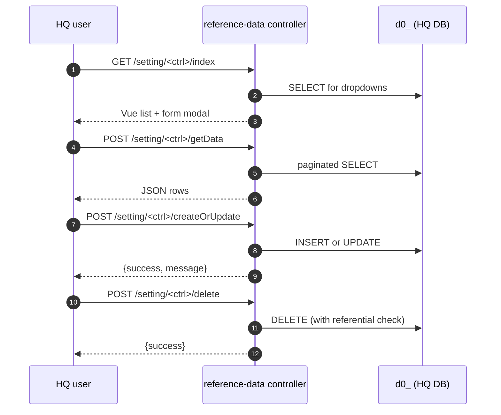

# `setting` module

`sd-billing/protected/modules/setting/` is the **reference-data
module**. Almost every page in sd-billing reads from it — country,
city, currency, user roles. It also hosts the system-action log
viewer and the user / role / API-token admin.

Lightweight (7 controllers, 19 actions) but load-bearing — break a
seed table here and most of the operation and report modules surface
broken dropdowns.

## Controllers catalog

| Controller | Purpose | Actions | Persistence |
|---|---|---:|---|
| `CityController` | City catalog CRUD scoped to a country. | 4 | `d0_city` |
| `CountryController` | Country catalog CRUD. | 4 | `d0_country` |
| `CurrencyController` | Currency catalog CRUD + FX-rate reload from CBU/CBR/NBKR. | 4 | `d0_currency` |
| `ClassificationController` | Generic "classification" lookup (dealer segmentation tags). | 4 | `d0_classification` |
| `UserController` | HQ user, role, and API-token admin. Delegates to action classes. | 5 sub-actions | `d0_user`, `d0_user_role`, `d0_api_token` |
| `SystemLogController` | Read-only system-action log viewer. | 1 | `d0_system_log` |
| `ViewController` | Landing-page renderer for `UserController`. | 1 | none |

Total: 19 entries counting `actionFoo` methods and `actions()`-mapped action classes. Source: `protected/modules/setting/controllers/*Controller.php` and `protected/modules/setting/actions/user/*`.

## Common mechanics

Every reference-data controller is a 4-action CRUD: `Index`,
`GetData`, `CreateOrUpdate`, `Delete`. The CRUD shape is identical
enough that this section is the spec for all four (City, Country,
Currency, Classification).

Access keys all live under `operation.setting.*`:

| Controller | Access key |
|---|---|
| `CityController` | `operation.setting.city` |
| `CountryController` | `operation.setting.country` |
| `CurrencyController` | `operation.setting.currency` |
| `ClassificationController` | `operation.setting.classification` |
| `UserController` | `operation.setting.user` |
| `SystemLogController` | `operation.setting.systemlog` |
| `ViewController::actionUser` | `operation.setting.user` |

## Controllers in detail

### `CountryController` (4 actions)

The base of the address hierarchy. Country rows are referenced by
City, by every Diler, by Tariff and by HQ-user `COUNTRY_IDS`
(country-level RBAC scope). Deleting a country with dependents is
refused.

| Action | Purpose |
|---|---|
| `actionIndex` | Render the country list page. |
| `actionGetData` | Paginated country rows. |
| `actionCreateOrUpdate` | Upsert `(name, short_code, currency_id, default_city_id?)`. |
| `actionDelete` | Delete a country. Refuses if any `City`, `Diler` or `Tariff` row references it. |

### `CityController` (4 actions)

City rows scoped to a `(country, region?)` pair. Used by every dealer
row, by region-level reports, by the dealer-blacklist filter.

| Action | Purpose |
|---|---|
| `actionIndex` | List page — filter by country. |
| `actionGetData` | Paginated city rows joined to country name. |
| `actionCreateOrUpdate` | Upsert `(name, country_id, region?, lat?, lng?)`. |
| `actionDelete` | Delete a city. Refuses if any `Diler` row references it. |

### `CurrencyController` (4 actions)

Currency catalog + FX-rate refresh. `actionReload` is the only
non-CRUD action in this controller — it scrapes today's rate from
the central-bank API for the country attached to each currency
(UZS → CBU, RUB → CBR, KGS → NBKR, KZT → NBK).

| Action | Purpose |
|---|---|
| `actionIndex` | Currency list page. |
| `actionGetData` | Paginated currency rows with today's FX rate. |
| `actionCreateOrUpdate` | Upsert `(name, short, country_id, decimals?)`. |
| `actionReload` | Fetch today's FX rate from the central-bank API and update `d0_currency.RATE`. Cron-friendly — accepts no auth when invoked from the in-process scheduler. |

See [balance-and-money-math](/docs/sd-billing/balance-and-money-math)
for how the FX rate is applied to multi-currency dealer payments.

### `ClassificationController` (4 actions)

Generic classification table — a tag dictionary used by sales-admin
to segment dealers (e.g. "VIP", "At-risk", "Strategic", "Pilot").
Free-form: a Classification row is just `(id, name, code, type?,
color?)`. The applied-to-dealer relation is in `d0_diler_classification`.

| Action | Purpose |
|---|---|
| `actionIndex` | List page. |
| `actionGetData` | Paginated classification rows. |
| `actionCreateOrUpdate` | Upsert a classification tag. |
| `actionDelete` | Delete a tag. Refuses if any dealer is tagged with it. |

### `UserController` (5 sub-actions)

HQ user, role, and API-token admin. Plain `Controller` that maps to
five action classes in `actions/user/`. No `actionIndex` — the
render shell lives in `ViewController::actionUser`.

| Action key | Class | Purpose |
|---|---|---|
| `get-users` | `GetUsersAction` | Paginated user list with role + active flag. |
| `create-user` | `CreateUserAction` | Add an HQ user. Hashes password, optionally scopes by `COUNTRY_IDS`. |
| `update-user` | `UpdateUserAction` | Edit user, role, scopes. |
| `get-roles` | `GetRolesAction` | Returns the role dictionary (`d0_role`). |
| `create-token` | `CreateTokenAction` | Issue an API token for the user. Used by the [API module](/docs/sd-billing/modules/api) (license push). |

URL shape uses dashes (`/setting/user/create-user`) because the
action keys in the `actions()` map use dashes.

### `SystemLogController` (1 action)

Read-only system-action log viewer. Logs are written by other
controllers via `SystemLog::log(...)` at sensitive write points
(payment delete, blacklist add, package edit on an active
subscription, etc).

| Action | Purpose |
|---|---|
| `actionIndex` | Renders the log table. Filters: `(from_date, to_date, users[])`. Default range = today only. Ordered by `id DESC`. |

No write actions — the log is only appended internally. There's no
delete endpoint; old rows are cleaned by a separate retention cron
(not in this module).

### `ViewController` (1 action)

Pure render shell.

| Action | Purpose |
|---|---|
| `actionUser` | Renders the user-admin Vue shell. Loads no data — the front-end calls `UserController::get-users` on mount. |

## Cross-module touchpoints

Reads from `setting/*` come from almost every module:

| Reader | What it reads |
|---|---|
| `operation/PaymentController`, `operation/PackageController`, `operation/RelationController`, etc. | `Country`, `City`, `Currency` dropdowns. |
| `operation/ViewController::actionBlacklist` | `Country`, `City`, `Currency`, salesmen (from `User`). |
| `report/*` | Country/city filter dropdowns; `User` for KA-manager list. |
| `directory/Diler` | FK to `Country`, `City`, `Currency`. |
| `api` module | `CreateTokenAction` issues the bearer used by api/v1 license push. |
| `dashboard` | Country / currency filter selectors. |

Writes from this module are confined to `d0_country`, `d0_city`,
`d0_currency`, `d0_classification`, `d0_user`, `d0_user_role`,
`d0_api_token` — no cross-module writes.

## Gotchas

- **`CurrencyController::actionReload` is cron-callable.** When
  invoked from the in-process scheduler it accepts no auth — don't
  expose it on a public route. It also blocks for the duration of
  the central-bank HTTP call; throttle the cron, don't batch it.
- **Delete is refused, not soft.** Country / City / Currency /
  Classification all hard-delete with a referential check. Trying to
  delete a country with dealers attached returns `{success: false}`
  with a message — there is no `IS_DELETED` flag on these tables.
- **`SystemLogController` has no pagination cap.** A wide date range
  with no user filter pulls all matching rows into PHP memory. For a
  busy HQ, scope by user or use a 1-day window — there's no
  back-end limit.
- **`UserController::create-token` returns the token plaintext once.**
  After the response, the token is hashed in `d0_api_token` and can
  no longer be retrieved. If lost, issue a new one.
- **`get-roles` is read from `d0_role`, not from a constant.** Adding
  a new role means inserting a row in `d0_role` + writing access keys
  for that role in the RBAC matrix. There's no enum to update.
- **Country `short_code` is the FX-source key.** When `CurrencyReload`
  picks the central-bank to scrape from, it routes by the country's
  `short_code` (UZ→CBU, RU→CBR, KG→NBKR, KZ→NBK). A mistyped short
  code silently picks the wrong bank — or none.
- **City latitude/longitude are nullable.** Some reports group by
  city map-pin; rows with NULL coordinates drop out of those reports
  rather than failing them. Front-end must guard.
- **`Classification` is a free-form tag dictionary.** There's no
  hierarchy — sub-classifications must be implemented client-side.
  Don't add a `parent_id` column without auditing every reader.
- **`ViewController::actionUser` has no data load.** All admin reads
  go through `UserController::get-users`. Look for empty pages in the
  front-end's network panel, not in the View shell.

## See also

- [operation module](/docs/sd-billing/modules/operation) — the heaviest reader of country/currency dropdowns
- [report module](/docs/sd-billing/modules/report) — uses Country/City/User as filter sources
- [balance-and-money-math](/docs/sd-billing/balance-and-money-math) — how currency rates are applied
- [auth-and-access](/docs/sd-billing/auth-and-access) — how `d0_user`, `d0_role` and `d0_api_token` interact with RBAC
- [api-reference](/docs/sd-billing/api-reference) — endpoints that authenticate via `d0_api_token`
- [subscription-flow](/docs/sd-billing/subscription-flow) — relies on Currency for tariff math
