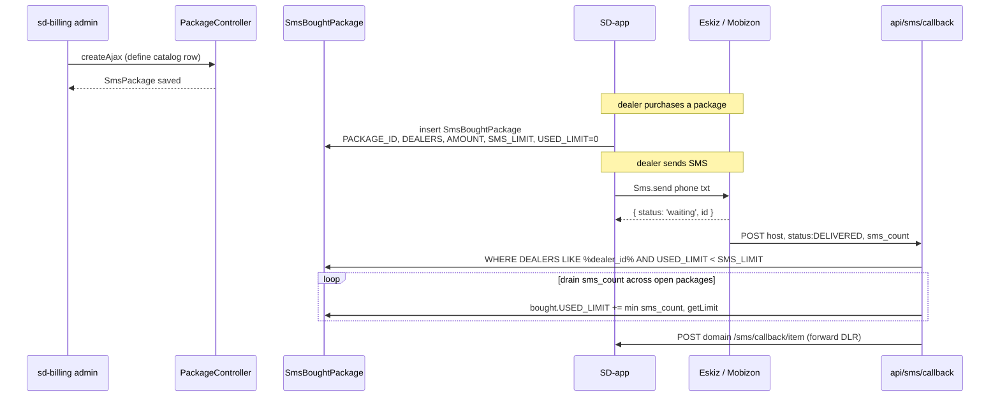

# sd-billing `sms` module

The `sms` module is the management UI for sd-billing's SMS quota system. Dealers buy bundles of SMS credits from a catalog of `SmsPackage` rows, the purchase produces an `SmsBoughtPackage` row that pins price and limit at purchase time, and as the SD-app sends messages those rows' `USED_LIMIT` counters increment based on delivery-receipts (DLRs) from the upstream provider.

This module owns the catalog and the purchased-ledger CRUD. The actual send-and-DLR path lives in the `api/SmsController` (inbound webhooks from Eskiz/Mobizon) and `protected/components/Sms.php` (outbound provider client). Both are referenced below.

## Key features

| Feature | What it does | Owner role(s) |
|---|---|---|
| Package catalog CRUD | Create, edit, delete `SmsPackage` rows (name, currency, SMS limit, price) | role 3 admin |
| Purchased-package ledger | List and soft-delete `SmsBoughtPackage` rows (one per dealer purchase) | role 3 admin |
| Eskiz balance display | The catalog index page calls `Sms::userInfo()` and renders the live Eskiz account balance in the page header | role 3 admin |
| Eskiz token caching | `Sms` component caches the bearer token to `upload/sms_token.txt` for 30 days; a cron rotates it at 08:00 daily | system |
| Provider routing | UZ traffic → Eskiz (`notify.eskiz.uz`); KZ traffic → Mobizon (`api.mobizon.kz`) — chosen per-call based on dealer country, not by the dealer | engineering |
| DLR reconciliation | `api/sms/callback` consumes DELIVERED status callbacks, decrements `SmsBoughtPackage.USED_LIMIT` against a `LIKE %dealer_id%` match | system |

## Folder

```
protected/modules/sms/
  SmsModule.php
  controllers/
    PackageController.php       (5 actions: index, returnAjaxForm, createAjax, updateAjax, delete)
    BoughtController.php        (2 actions: index, delete)
  models/
    SmsPackage.php              # d0_sms_packages catalog
    SmsBoughtPackage.php        # d0_sms_bought_packages purchased ledger
    BoughtPackage.php           # legacy alias
  views/
    package/                    # catalog UI (_form.php + index.php)
    bought/                     # purchased ledger UI

# elsewhere, but referenced:
protected/components/
  Sms.php                       # Eskiz / Mobizon provider client + token cache
protected/modules/api/controllers/
  SmsController.php             # inbound DLR webhook (actionCallback) + outbound send proxies
```

## Controllers

| Controller | Purpose | Actions | Auth |
|---|---|---|---|
| `PackageController` | Catalog CRUD for `SmsPackage` | `index`, `returnAjaxForm`, `createAjax`, `updateAjax`, `delete` | Yii `accessControl` filter; `roles => [3]` (admin) only on `index`. Other actions inherit the same allow rule via `accessRules()` |
| `BoughtController` | Purchased-ledger management | `index`, `delete` | Same — `accessControl` with `roles => [3]` on `index` |

### `PackageController` actions

| Action | Method | What it does |
|---|---|---|
| `actionIndex` | GET, POST | GET renders `views/package/index.php` with the package list, currencies filter, and the live Eskiz balance from `Sms::userInfo()`. POST with `name=delete` and `delete_id` soft-deletes one `SmsPackage` |
| `actionReturnAjaxForm` | XHR | Returns the partial `_form.php` for create or update. With `update_id` set, loads the existing row; otherwise serves an empty new model |
| `actionCreateAjax` | POST/XHR | Validates a new `SmsPackage`, stamps `CREATED_BY`, saves. Returns `{success: true, id}` or `{success: false, errors}` |
| `actionUpdateAjax` | POST/XHR | Loads via `loadModel`, sets `UPDATED_BY`, saves. Same response shape |
| `actionDelete` | POST | Bulk soft-delete: explodes `ids` CSV, calls `SmsPackage::deletePackage()` on each, redirects |

The controller's `init()` calls `$this->ajaxCrudBehavior->register_Js_Css()` and the `behaviors()` map registers the standard sd-billing `AjaxCrudBehavior` against `SmsPackage` with form alias `_form` and 10 rows per page.

### `BoughtController` actions

| Action | Method | What it does |
|---|---|---|
| `actionIndex` | GET, POST | GET renders the purchased ledger filtered by currency. POST with `name=delete` and `delete_id` soft-deletes one `SmsBoughtPackage` via `model->deletePackage()` |
| `actionDelete` | POST | Bulk soft-delete from CSV `ids`, redirect to `redirect` POST field |

## Provider integration

`protected/components/Sms.php` is the outbound client. It exposes:

| Method | Provider | Endpoint | Auth |
|---|---|---|---|
| `userInfo()` | Eskiz | `GET notify.eskiz.uz/api/auth/user` | `Authorization: Bearer :token:` |
| `send($phone, $txt)` | Eskiz | `POST notify.eskiz.uz/api/message/sms/send` (from `4546`) | Bearer token |
| `sendKz($phone, $txt)` | Mobizon | `POST api.mobizon.kz/service/Message/SendSmsMessage` | API key in URL |
| `multy($messages, $host)` | Eskiz | `POST notify.eskiz.uz/api/message/sms/send-batch` (multi-recipient) | Bearer token |
| `deleteToken()` | n/a | Removes the cached token file | n/a |

The Eskiz token lives at `upload/sms_token.txt` and is refreshed on construction when missing. A cron job at 08:00 daily calls `deleteToken()` to force rotation before the 30-day expiry. Credentials are hard-coded constants in `Sms.php`:

```
const EMAIL    = "a.bozorov@gmail.com"
const PASSWORD = ":redacted-eskiz-password:"
```

The Mobizon API key is hard-coded in the `sendKz` method body. Both are flagged in [Security landmines](../security-landmines.md).

## Purchase, send, and DLR reconciliation



The DLR callback path:

1. `api/sms/callback` writes the raw payload to `log/sms-callback-all.json` for audit.
2. Matches `host` to a `Diler` row.
3. On `status: DELIVERED`, finds all the dealer's not-fully-consumed `SmsBoughtPackage` rows and drains the `sms_count` across them oldest-first.
4. On `DELIVERED` or `REJECTED`, forwards the callback to the dealer's SD-app at `{DOMAIN}/sms/callback/item` for downstream processing.

## Cross-module touchpoints

- **`api/sms/callback`** writes `SmsBoughtPackage.USED_LIMIT`. The `sms` module owns the model but the writes happen in the `api` module.
- **`d0_diler.HOST`** is the lookup key for matching DLRs to dealers. Renaming a host without updating the SD-app's outbound callback URL silently breaks reconciliation.
- **`Currency`** is the dropdown source on both the catalog and ledger pages — packages are priced in a specific currency and only purchases in that currency draw down the package.
- **`operation` module** — purchases happen through the operation/dealer flow, which inserts the `SmsBoughtPackage` row. This module is the read-and-clean-up side.

## Gotchas

- **The DEALERS column is a comma-separated string, matched with `LIKE %dealer_id%`.** A dealer with id `12` will match a bought package whose `DEALERS = "1,123,5"` (id 12 is not in it, but `12` is a substring of `123`). This is a known soft bug — wrap ids in commas (`,12,`) before matching to mitigate.
- **Eskiz credentials are hard-coded.** `protected/components/Sms.php` ships with literal EMAIL/PASSWORD constants. Rotating them requires a redeploy. See [Security landmines](../security-landmines.md).
- **Mobizon API key is in the URL.** `Sms::sendKz` builds the URL with `apiKey=...` inline. The key leaks into any HTTP debug log that records full URLs.
- **`Sms::send` always sends `from: '4546'`.** No per-tenant nickname yet — every Uzbekistan SMS appears from `4546`. Adjust when registering custom nicknames with Eskiz.
- **`actionIndex` of `PackageController` hits Eskiz on every render.** Slow Eskiz responses delay the page. There is a `deleteToken()` fallback if the token expired but no caching of the `userInfo` payload itself.
- **`accessControl` `roles => [3]`** is the only authorization. There is no `Access::check('sms.package.index')` integration with the operation grid — adding sms permissions to non-admin roles requires extending the controller's `accessRules()`, not the access UI.
- **`deletePackage()` is a soft delete.** Both models set `IS_DELETED = 1` instead of removing the row. List queries include `IS_DELETED = 0`; ad-hoc SQL must filter explicitly.
- **DLR forwarding is fire-and-forget.** The forward to `{DOMAIN}/sms/callback/item` is a synchronous `Curl::run` whose response is discarded. SD-app downtime drops the DLR for the dealer side; the sd-billing counter still increments.

## See also

- [api module](./api.md) — `SmsController::actionCallback` inbound DLR
- [Cron and settlement](../cron-and-settlement.md) — 08:00 Eskiz token rotation
- [Security landmines](../security-landmines.md) — hard-coded Eskiz and Mobizon credentials
- Source: `protected/modules/sms/controllers/PackageController.php`, `protected/modules/sms/controllers/BoughtController.php`, `protected/components/Sms.php`
