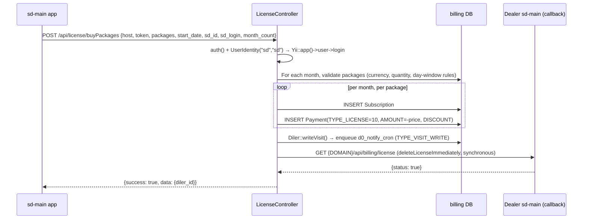

# api · License push to sd-main

## 1. Purpose

This page documents the **license-delivery half** of the sd-billing ↔
sd-main ecosystem: how billing data (subscriptions, packages, balance,
distributor revise) reaches a dealer's sd-main instance, and how
sd-main writes back into sd-billing via the same controller. The
`LicenseController` is the TOKEN-protected JSON API that sd-main calls
at login, at package-purchase, at license-exchange, and on every dealer
cache-invalidation. It is also the entry-point for sd-billing's own
"push the license to sd-main now" code path, which is structured as a
synchronous best-effort HTTP call layered on top of the async
`d0_notify_cron` outbox.

If you've read [Subscription lifecycle](./operation-subscription.md)
and [Payment recording](./operation-payment.md), this is the page that
explains where `Diler::deleteLicense()` actually ends up.

---

## 2. Who uses it

| Caller | Auth | Direction |
|--------|------|-----------|
| sd-main instances | Shared `LicenseController::TOKEN` constant in POST `token` field | sd-main → sd-billing (read prices, subscriptions; write package purchases / exchanges / deletions) |
| sd-billing → dealer sd-main | URL path `{dealer.DOMAIN}/api/billing/license`, no token | sd-billing → sd-main (cache invalidation only) |
| Internal "sd" user | `UserIdentity("sd", "sd")` upgraded via `Yii::app()->user->login` inside write actions | Bypass session check for write paths |

The constant is `LicenseController::TOKEN = "2Mhoba9PjqmBBY7srSrRciAvdbAB3ALG"` (hard-coded). The `auth()` private method compares it case-sensitively against `$_POST['token']`; on mismatch the request short-circuits with `success: false`. There is no per-tenant token, no per-action ACL, and no IP allowlist.

---

## 3. Where it lives

| Item | Path |
|------|------|
| Controller | `protected/modules/api/controllers/LicenseController.php` |
| Diler model (enqueue + balance) | `protected/models/Diler.php` (`deleteLicense`, `writeVisit`, `refresh`) |
| Async outbox model | `protected/models/NotifyCron.php` (`createLicenseDelete`) |
| Cron drainer | `protected/commands/NotifyCommand.php` (`sendLicenseDelete`) |
| HTTP helper | `protected/components/Distr.php` (`Distr::sendPost`) |

Actions exposed (all POST, all under `/api/license/`):

| Action | What it does |
|--------|--------------|
| `actionIndex` | Read snapshot: balance, currency, credit limit, distributor balance, all subscriptions for the next 13 months. Legacy; superseded by `actionIndexBatch`. |
| `actionIndexBatch` | Same as `actionIndex` but batch-loads subscriptions + payments in one query. The new default. |
| `actionPackages` | List sellable license-type packages (`agent`, `merchant`, `dastavchik`, `supervisor`, `vansel`, `seller`) per available duration. |
| `actionBotPackages` | List `bot_order` and `bot_report` packages (the SaaS bots), including the tiered price table for `bot_report`. |
| `actionHalfPackages` | List license-type packages for a specific `TYPE` (10/20-day variants). |
| `actionBuyPackages` | **WRITE**: create `Subscription` + `Payment(TYPE=10)` rows for one or more months; rewrite-visit; synchronous license invalidation. |
| `actionChangePackage` | **WRITE**: change a subscription's quantity in-place (within day 1-5 of the month); soft-deletes old payment, creates replacement. |
| `actionRevise` | Read: dealer's revise sheet over a date range (`Diler::getRevise`). |
| `actionPayments` | Read: dealer's non-deleted positive-amount payments, newest first. |
| `actionCheckMin` | Validate that the dealer meets `MIN_LICENSE` or `MIN_SUMMA` before allowing a purchase. |
| `actionBonusPackages` | List bonus packages the dealer still has bonus quota for (per type). |
| `actionExchangeable` | List packages a subscription can be exchanged into (same `AMOUNT`, different `SUBSCRIP_TYPE`). |
| `actionExchange` | **WRITE**: swap one subscription's `PACKAGE_ID` for another with equal price; rebuilds `Payment` rows for the affected window. |
| `actionDistrRevise` | Read: distributor-level revise including per-dealer subscription rollup. |
| `actionDeleteOne` | **WRITE**: soft-delete a `bot_order` or `bot_report` subscription (only within day 1-5 of the month). |

---

## 4. Workflow

### 4a. sd-main reads the license at login

```mermaid
sequenceDiagram
  participant SD as sd-main app
  participant L as LicenseController
  participant DB as billing DB

  SD->>L: POST /api/license/indexBatch {host, token, date}
  L->>L: auth() checks $_POST['token'] === TOKEN
  L->>DB: SELECT Diler WHERE HOST=:host (with currency, bonusLimit, distr)
  L->>DB: SELECT Subscription with package WHERE DILER_ID = …
  L->>DB: SELECT Payment WHERE SUBSCRIPTION_ID IN (…)
  L-->>SD: {balance, credit_limit, types, subscriptions: [13 months]}
  SD->>SD: Cache license file; serve dealer
```

The dealer is identified by `HOST` (subdomain prefix, not domain). The date stored on `$_POST['date']` (validated as `Y-m-d`) is used to anchor the 13-month window; if missing, today's date in the billing server's timezone is used.

### 4b. sd-main writes a purchase back to sd-billing



`deleteLicenseImmediately` is the synchronous variant. It executes a 60-second-timeout cURL GET to `{Diler.DOMAIN}/api/billing/license` and parses the JSON response, expecting `{status: true}`. Failures are logged to `log/LOG_BUG_…` or `log/delete_license_immediately_…` and swallowed — the API response always succeeds if the writes did.

### 4c. sd-billing back-office triggers an async invalidation

```mermaid
sequenceDiagram
  participant Op as Operator (back office)
  participant W as SubscriptionUpdateAction / PaymentController / …
  participant DB as billing DB
  participant Cron as NotifyCommand (php cron.php notify)
  participant ND as Dealer sd-main

  Op->>W: Save subscription / payment
  W->>DB: Write entity; on commit call Diler::deleteLicense()
  W->>DB: INSERT NotifyCron(type=license_delete, text={DOMAIN}/api/billing/license, status=0)
  W-->>Op: success (no HTTP push yet!)
  Cron->>DB: SELECT * FROM notify_cron WHERE status = 0
  Cron->>ND: GET {DOMAIN}/api/billing/license
  ND-->>Cron: {status: true}
  Cron->>DB: UPDATE notify_cron SET status = 1
```

The cron tick is one minute. So back-office writes propagate to sd-main with up-to-60-second latency. The `LicenseController` writes do **not** use this path — they use the synchronous `deleteLicenseImmediately` private method (see 4b) because the SD-app is waiting on the response and needs the cache invalidated before it returns.

### 4d. The synchronous vs queued split

| Initiator | Latency | Implementation | Failure mode |
|-----------|---------|----------------|--------------|
| `LicenseController` write action (e.g. `actionBuyPackages`) | Synchronous (in-request) | `deleteLicenseImmediately($diler)` private method in the controller | Logged, response still succeeds |
| Back-office write (Subscription editor, Payment editor, settlement) | Async, up to 60s | `Diler::deleteLicense()` → `NotifyCron::createLicenseDelete` → `NotifyCommand::sendLicenseDelete` | Retried indefinitely until cron sees `{status: true}` |

The two paths share the same target URL (`{DOMAIN}/api/billing/license`), parse the same response shape (`{status: true/false}`), and use the same connection timeout (20s) and request timeout (60s). The duplication exists because the synchronous path must not depend on cron availability.

---

## 5. Rules

- All requests authenticate via `LicenseController::TOKEN` as a literal POST field named `token`. There is no Bearer header, no signature, no nonce. The token is a string baked into the controller source.
- Write actions (`actionBuyPackages`, `actionChangePackage`, `actionExchange`, `actionDeleteOne`) additionally upgrade the session to the synthetic `sd` user via `UserIdentity("sd", "sd")` so audit columns (`CREATED_BY`, `UPDATED_BY`) can be stamped.
- The dealer is identified by `Diler.HOST` (the subdomain prefix). The full domain is stored separately in `Diler.DOMAIN` and is used only as the callback target for license invalidation.
- `actionBuyPackages` enforces currency match (`Diler.CURRENCY_ID === Package.CURRENCY_ID`), positive quantity, start-date ≥ first of current month, and per-package-type day-window rules (e.g. `TYPE_ONE` requires `today > 20`; `TYPE_THREE+` paid packages require `today <= 10` for current-month purchases).
- `actionChangePackage` and `actionDeleteOne` enforce `day <= 5` of the current month. Outside that window they reject with HTTP 200 + `success: false`.
- `actionExchange` requires the new package to have the same `AMOUNT` as the old package's `AMOUNT`. Cross-price exchanges are not supported by this endpoint.
- `actionBuyPackages` skips packages whose `SUBSCRIP_TYPE` is in `ignoredTypes() = [admin, bot_order, bot_report]` if the dealer already has an active subscription of that type for the same month. The intent is: never double-book admin or bot subscriptions in the same calendar month.
- `bot_report` package price is resolved at sell-time. If a `DilerPackage` override exists for the dealer + package, the flat `Package.AMOUNT` is used. Otherwise `Package::getBotPackages($diler, $amount, $type)` returns a tiered table keyed by quantity range, country code, and duration; the matching tier's amount is the price.
- `actionDeleteOne` only accepts subscriptions of type `bot_order` or `bot_report`. Regular license subscriptions are not deletable via this endpoint — they must be deleted from the back-office Subscription editor.
- The `deleteLicenseImmediately` path swallows all failures. The API response is decoupled from whether sd-main actually picked up the invalidation.
- `Diler::deleteLicense()` returns early without enqueuing if `DOMAIN` is empty. Dealers without a `DOMAIN` cannot receive any license-cache invalidation push, sync or async.

---

## 6. Data sources

| Table | DB / connection | Why read/written |
|-------|-----------------|------------------|
| `d0_diler` | sd-billing default DB | Dealer lookup by `HOST`; balance and credit state in read snapshots; `DOMAIN` for callback target |
| `d0_package` | sd-billing default DB | Package catalog; type / currency / amount validation; `getBotPackages` tier table for `bot_report` pricing |
| `d0_diler_package` | sd-billing default DB | Per-dealer private package override (`CLIENT_TYPE = 1`) and flat-rate `bot_report` price override |
| `d0_subscription` | sd-billing default DB | Read in batch for the 13-month snapshot; written by `buyPackages`, `changePackage`, `exchange`, `deleteOne` |
| `d0_payment` | sd-billing default DB | Linked 1:1 to each subscription via `SUBSCRIPTION_ID`; carries the negative `AMOUNT` for license consumption (`TYPE = 10`) |
| `d0_distributor` | sd-billing default DB | Distributor balance and revise for `actionIndex` / `actionDistrRevise` |
| `d0_countrysale` | sd-billing default DB | Fallback distributor lookup by `HOST` in `actionDistrRevise` |
| `d0_notify_cron` | sd-billing default DB | Async outbox written by `Diler::deleteLicense()` from back-office writes (not by this controller) |

---

## 7. Gotchas

**The TOKEN is a plaintext constant.** `LicenseController::TOKEN = "2Mhoba9PjqmBBY7srSrRciAvdbAB3ALG"` is checked verbatim against `$_POST['token']`. Anyone with read access to the sd-billing source has all the credentials needed to forge any sd-main → sd-billing call. There is no IP filter, no rate limit, no per-tenant rotation. Treat the token as a shared secret known to every sd-main deployment and every developer with repo access.

**Two parallel paths, same URL.** `deleteLicenseImmediately()` (sync, inside `LicenseController`) and `Diler::deleteLicense()` (async via `NotifyCron`) both target `{DOMAIN}/api/billing/license`. The same dealer may receive multiple invalidations for one logical change — e.g. operator edits a subscription in the back office (async enqueue) while the dealer simultaneously buys a package via `actionBuyPackages` (sync push). Both eventually fire; sd-main must be idempotent on `/api/billing/license`.

**`HOST` and `DOMAIN` are different fields.** `HOST` is the subdomain prefix used to identify the dealer in API lookups (`Diler::findByAttributes(['HOST' => $host])`). `DOMAIN` is the full URL root used as the callback target. They are not derived from each other and must be kept consistent manually when migrating tenants.

**The internal `sd` user is real.** Write actions call `new UserIdentity("sd", "sd")` and `Yii::app()->user->login($identity)`. There must be an active `User` row with `LOGIN = "sd"` and a working password hash, or every write action returns "Auth is failed". This user is the audit-trail owner for all sd-main-originated writes.

**`actionExchange` mutates many subscriptions in one go.** The exchange logic finds all sibling subscriptions in the same `[START_FROM, ACTIVE_TO]` window with the same per-license price, soft-deletes them, and creates two replacement rows (one for the old type at the unchanged quantity, one for the new type at the requested quantity). This is intentional — it consolidates multiple historical line-items into a single "post-exchange" pair — but it means the response `subscription_id: 200` is **not** a real subscription id, it's a literal `200` constant. Callers must re-fetch to see the new state.

**`actionDistrRevise` falls back to `Countrysale.HOST`.** If `distr_id` isn't found, it looks up `Countrysale::findByAttributes(['HOST' => lower($_POST['host'])])` and then queries `Distributor::findByAttributes(['COUNTRYSALE_ID' => …])`. This is how country-sale aggregations end up in the distributor revise view.

**`deleteLicenseImmediately` failure is invisible.** It logs to `log/LOG_BUG_…` or `log/delete_license_immediately_…` and returns. The sd-main caller will never see the failure in its response and the dealer's cache may stay stale until the next user-triggered invalidation. The back-office (`NotifyCron`) path is the only one with retry semantics.

---

## 8. See also

- [Subscription lifecycle](./operation-subscription.md) — back-office writes that call `Diler::deleteLicense()` (the async-only path).
- [Payment recording](./operation-payment.md) — same async enqueue on successful payment save.
- [Notification rules](./operation-notification-rules.md) — the broader `NotifyCron` queue model and the `NotifyCommand` cron.
- [Subscription & licensing flow](../subscription-flow.md) — end-to-end view of how a dealer's license is consumed and renewed.
- [Cross-project integration](../integration.md) — the wider sd-billing ↔ sd-main contract beyond license push.
- Source: `protected/modules/api/controllers/LicenseController.php`
