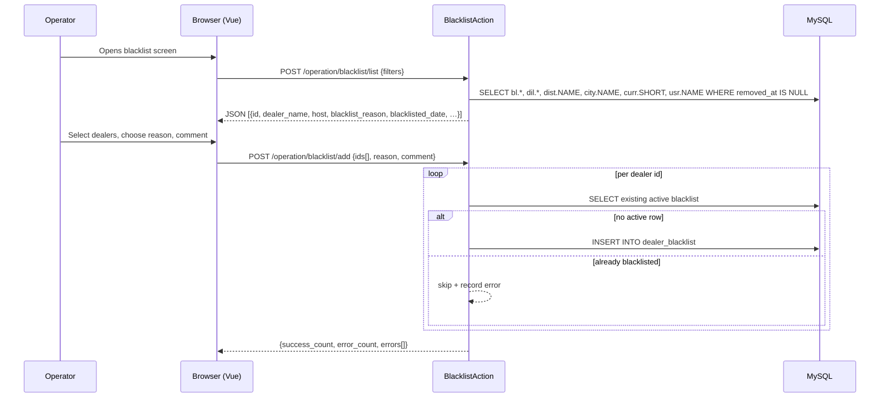

# operation · Dealer blacklist

## 1. Purpose

The blacklist marks a dealer as "in trouble" — typically because they
haven't paid their license invoices. It is a soft, audit-friendly
flag (`d0_dealer_blacklist` row with `removed_at IS NULL`) that
operators and managers attach to a dealer with a reason and an optional
free-text comment. The blacklist is **advisory** in current code: it
shows up in the dashboard dealer list, surfaces in reports, and gives
the sales team a single canonical place to track non-payers. It does
not, by itself, block license push, settlement, or the dealer's login
to sd-main — those guards are handled by the underlying
`Diler.STATUS` and balance-math fields.

---

## 2. Who uses it

| Role | Access key | Capability |
|------|-----------|------------|
| Admin (`IS_ADMIN = 1`) | `operation.dealer.blacklist` | SHOW / CREATE / DELETE |
| Manager (ROLE = 4) | `operation.dealer.blacklist` | Country-scoped SHOW; CRUD by bitmask |
| Operator (ROLE = 5) | `operation.dealer.blacklist` | Country-scoped SHOW; CRUD by bitmask |
| Key-account (ROLE = 9) | `operation.dealer.blacklist` | Country-scoped SHOW |

Access is checked via `$this->authorize([], ['operation.dealer.blacklist', $type])` where `$type` is `Access::SHOW` for `list`, `Access::CREATE` for `add`, `Access::DELETE` for `remove`. Non-admin lists are scoped to the acting user's country IDs (`User::getCountryIds()`); admins and super-admins skip the scope filter entirely.

---

## 3. Where it lives

| Item | Path |
|------|------|
| Controller | `protected/modules/operation/controllers/BlacklistController.php` |
| Action classes | `protected/modules/operation/actions/blacklist/` |
| Model | `protected/modules/operation/models/DealerBlacklist.php` |
| Dashboard consumer | `protected/modules/dashboard/controllers/DealerController.php` → `getBlacklists()` |
| Operation view shell | `protected/modules/operation/views/view/blacklist.php` |

URL pattern (Yii `operation` module routes):

```
POST   /operation/blacklist/list
POST   /operation/blacklist/add
POST   /operation/blacklist/remove
```

Actions exposed:

| Action | Class | Method | Access |
|--------|-------|--------|--------|
| `list` | `BlacklistListAction` | POST | SHOW |
| `add` | `BlacklistAddAction` | POST | CREATE |
| `remove` | `BlacklistRemoveAction` | POST | DELETE |

---

## 4. Workflow



### 4a. List (`POST /operation/blacklist/list`)

1. Caller POSTs filter fields: `distributor`, `country`, `city`, `salesman` (all optional).
2. Controller resolves the acting user's country scope. Admins and super-admins get an empty array (no scope filter); other users get their `User::getCountryIds()` list.
3. SQL joins `dealer_blacklist` against `Diler` plus distributor / city / currency / user reference tables. The hard filter is `WHERE bl.removed_at IS NULL` — only currently-active blacklist entries appear. Old removed entries are kept in the table for audit but never shown.
4. Result rows include the dealer's `host`, `domain`, distributor name, city, currency, salesman, reason, comment, blacklist date, and the name of the user who created the entry.

### 4b. Add (`POST /operation/blacklist/add`)

1. Caller POSTs `ids[]` (array of `Diler.ID`) plus a `reason` and optional `comment`.
2. `reason` must match one of the two enum values in `DealerBlacklist::getReasons()`:
   - `not_paid_licenses` — "Не оплатил лицензии"
   - `another` — "Другая причина"
3. Inside a single transaction the action loops per dealer id and:
   - Skips with an error if the dealer doesn't exist.
   - Skips with an error if `DealerBlacklist::getActiveBlacklist($id)` returns a non-null row (already blacklisted).
   - Otherwise creates a new `DealerBlacklist` with `created_by = current user`, `created_at = now()`, and saves.
4. If at least one row saved, the transaction commits and a summary is returned (`success_count`, `error_count`, per-dealer error messages). If none saved, the transaction rolls back and a top-level error is returned.

### 4c. Remove (`POST /operation/blacklist/remove`)

1. Caller POSTs `ids[]`.
2. Inside a transaction the action looks up the active blacklist row for each dealer; sets `removed_by = current user` and `removed_at = now()`; saves.
3. The row is **not deleted** — both `created_at`/`created_by` and `removed_at`/`removed_by` are preserved as an audit log.
4. Same partial-success semantics as add: if at least one row updates, commit and return the summary.

---

## 5. Rules

- "Active blacklist entry" is defined as `removed_at IS NULL`. There is no status column; presence-of-row + null removal stamp is the only flag.
- A dealer can have at most one active entry. The add action enforces this by calling `DealerBlacklist::getActiveBlacklist($dealerId)` and refusing if an active row exists.
- `reason` is a closed enum of two values: `not_paid_licenses` and `another`. Other values are rejected with HTTP 200 + `success: false` and the list of valid reasons.
- The list view filters by country scope using the acting user's `getCountryIds()`. Admins and super-admins (`isAdmin()` / `isSuperAdmin()`) bypass this filter.
- The list view only returns active rows (`bl.removed_at IS NULL`). To see historical entries you must query the table directly.
- Removal does not free the dealer of any system-level constraints; it only clears the blacklist flag. The dealer's payment behavior, license push, and login continue to be governed by `Diler.STATUS`, `BALANS`, `CREDIT_LIMIT`, and `ACTIVE_TO`.
- `DealerBlacklist.comment` is `safe` (string, no length cap in model rules). Inputs are `trim()`-ed before save.

---

## 6. Data sources

| Table | DB / connection | Why read |
|-------|-----------------|----------|
| `d0_dealer_blacklist` | sd-billing default DB | Primary entity — list, add (insert), remove (update) |
| `d0_diler` | sd-billing default DB | Dealer existence check; joined into the list view |
| `d0_distributor` | sd-billing default DB | List view: distributor name column |
| `d0_city` | sd-billing default DB | List view: city name column |
| `d0_currency` | sd-billing default DB | List view: currency short label |
| `d0_user` | sd-billing default DB | List view: salesman name + created_by name |

---

## 7. Gotchas

**Blacklist is advisory, not enforcing.** Nothing in `LicenseController`, `Diler::deleteLicense()`, `Diler::changeBalans()`, settlement, or `actionPost` checks `DealerBlacklist`. A blacklisted dealer with a positive balance and an active `ACTIVE_TO` will continue to receive license pushes, settle subscriptions, and serve their sd-main app normally. The flag is a *signal* for humans, not an automated gate.

**Soft-remove keeps history.** The `remove` action sets `removed_at` + `removed_by`; it never deletes the row. A re-blacklist creates a brand-new row, so a dealer that has been on-and-off the list multiple times has multiple historical rows in `d0_dealer_blacklist`, all but the most recent with `removed_at` populated.

**The `removed_at IS NULL` filter is the only "active" check.** There is no enum or status column. If you write a manual SQL fix, do not forget the `WHERE removed_at IS NULL` clause when checking active blacklist state, or you will find every dealer that was ever blacklisted.

**The action checks dealer existence but not country scope on write.** `BlacklistAddAction` and `BlacklistRemoveAction` do not re-validate that the dealer belongs to the acting user's country. Country scoping is only applied on the list query. An operator could in principle blacklist a dealer outside their country if they know the dealer ID. In practice, the front-end pre-selects dealers from the country-scoped list, so this is not exposed.

**Reason enum is intentionally narrow.** `not_paid_licenses` and `another` are the only options. If you need a more granular taxonomy, extend `DealerBlacklist::getReasons()` plus the in-rule range check — both code paths must be updated together.

---

## 8. See also

- [Payment recording](./operation-payment.md) — the typical reason for blacklisting (non-payment) is observed here.
- [Subscription lifecycle](./operation-subscription.md) — what blacklisting does **not** stop.
- [Domain model](../domain-model.md) — `DealerBlacklist`, `Diler` schemas.
- Source: `protected/modules/operation/controllers/BlacklistController.php` and `protected/modules/operation/actions/blacklist/`
