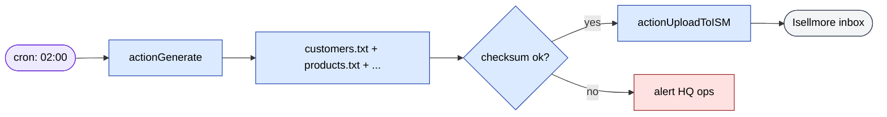

# sd-cs `api` module

The `api` module is sd-cs's outbound integration surface. Most controllers
do not serve a UI — they read from dealer DBs (via the `dealer` connection,
see [sd-cs - sd-main integration](../sd-main-integration.md)), generate a
file in a partner-specific format, and either expose it over HTTP or push
it to the partner. A couple of controllers are operator utilities or
support endpoints for billing and a Vue mobile client.

Twelve controllers, around 80 callable actions total. None of them sit
behind the normal session/cookie auth — they set `checkIsGuest = false`
and `checkAccess = false`, and rely on network-level controls (IP allowlist,
private VPC, partner-side credentials) plus per-controller token logic
where applicable.

## Key features

| Feature | What it does | Caller |
|---|---|---|
| Partner data feeds | Generate TSV/CSV/text files in partner-specific schema | Distributor integrators (Isellmore, Lianeks, Cislink, Pradata) |
| Multi-version Isellmore | Four parallel versions of the Isellmore export pipeline live side-by-side for migration safety | Isellmore platform |
| Mobile v2 RPC | JSON-RPC-style endpoint with HMAC tokens for a Vue mobile client | sd-mobile / Vue app |
| Operator utilities | One-shot maintenance actions (price-type backfill, log cleaner, photo fixes) | HQ engineer, sometimes cron |
| Billing handshake | Returns the country-sale server descriptor to sd-billing | sd-billing |
| Cross-dealer access audit | Builds a single dealer-wide auth assignment report | HQ admin via UI |
| Telegram reports | Sends scheduled summaries into a Telegram group | cron |

## Folder

```
protected/modules/api/
  controllers/
    AccessReportController.php       (1 action)
    BillingController.php            (1 action)
    CislinkController.php            (5 actions)
    IsellmoreController.php          (14 actions)
    Isellmore2Controller.php         (13 actions)
    Isellmore3Controller.php         (14 actions)
    Isellmore4Controller.php         (14 actions)
    LianeksstockController.php       (7 actions)
    OperatorController.php           (6 actions)
    PradataController.php            (4 actions)
    TelegramReportController.php     (2 actions)
    V2Controller.php                 (1 action; 5 dispatched methods)
  views/                             # only for Index/Status admin pages
```

## Controllers

| Controller | Purpose | Actions | Caller / trigger | Auth |
|---|---|---|---|---|
| `IsellmoreController` | Original Isellmore partner export. Generates customers, products, warehouses, stock balance, sales, returns, receipts as `*.txt` files in `/uploads/isellmore/` | 14 | Cron + Isellmore-side pull | None (filesystem ACL + network) |
| `Isellmore2Controller` | Variant for a second Isellmore tenant or schema generation. Same action set minus `salesOrigin`, plus `receiptVtorichka` | 13 | Same | None |
| `Isellmore3Controller` | Third variant adds `generateCheck` (audit/validation pass on generated files) | 14 | Same | None |
| `Isellmore4Controller` | Fourth variant - currently the newest live one, mirrors v3 | 14 | Same | None |
| `LianeksstockController` | Same idea for the Lianeks partner. Emits sales/return/receipt/customers/products/warehouses/stockbalance files | 7 | Cron + Lianeks pull | None |
| `CislinkController` | Distributor integration with cislinkdts.com. Generates files locally, then `actionUpload` posts them to `dapi.cislinkdts.com` | 5 (`index`, `status`, `log`, `generate`, `upload`) | Cron + UI status page | Partner API key (in config) |
| `PradataController` | Pradata partner integration. `generateReport` writes the report file; `upload` pushes it | 4 | Cron | None |
| `V2Controller` | Single `actionIndex` that dispatches JSON-RPC-style `method` field: `login`, `getFilials`, `getAgent`, `getClient`, `getVisit`. Pagination via `limit/page/total` | 1 + 5 | Vue mobile client | HMAC-SHA256 token, 30-day TTL, `userId` + `token` per request |
| `BillingController` | `actionStatus` returns `{status, url, code, type: "countrysale"}` so sd-billing can register the HQ instance | 1 | sd-billing | Implicit (`app=sdmanager` flag) |
| `OperatorController` | One-shot maintenance: `fixPrices` (backfill `OldPriceType`), `cleaner` (purge `cs_dblog` older than 60/120 days), `fixPhotos`, `fixAppleIcon`, `user`, `getRaw($year)` | 6 | HQ engineer; `cleaner` is cron-eligible | None (admin network only) |
| `AccessReportController` | Single dealer-wide auth dump: joins `authassignment` + `authitem` across every filial and outputs a table for audit. Reads via the `dealer` connection | 1 | HQ admin via UI | Normal session |
| `TelegramReportController` | `index` renders config UI; `cron` builds the daily sales summary and posts it to a Telegram chat | 2 | Cron (`cron`), HQ admin (`index`) | None for `cron`; session for `index` |

### Isellmore action set (canonical)

Every `Isellmore*Controller` exposes the same action surface (paths differ
by controller name):

| Action | Output file | Content |
|---|---|---|
| `actionCustomers` | `customers.txt` | One TSV-like line per client across all filials |
| `actionProducts` | `products.txt` | Catalog snapshot |
| `actionWarehouses` | `warehouses.txt` | Filial-to-warehouse mapping |
| `actionStockbalance` | `stockbalance.txt` | Per-filial stock |
| `actionSales` | `sales.txt` | Last 5 days of paid/delivered orders |
| `actionSalesOrigin` (v1 only) | `salesOrigin.txt` | Pre-rewrite sales feed |
| `actionReturn` | `return.txt` | Returns |
| `actionReceipt` | `receipt.txt` | Receipts |
| `actionReceiptVtorichka` | `receipt_vtorichka.txt` | Secondary-sales receipts |
| `actionChecksum` | `checksum.txt` | File-level integrity checksums |
| `actionDocuments` | `documents.txt` | Document index |
| `actionUploadToISM` | - | POST generated files to the Isellmore endpoint |
| `actionUpload2` | - | Variant upload path |
| `actionGenerate` | - | One-shot driver that runs all generators in order |
| `actionGenerateCheck` (v3, v4) | - | Re-runs generators in dry-run and diffs against last good output |

Most actions follow the same shape: `setFilial($prefix)` on each model to
route the query through the dealer connection, then `addLineToFile()` to
append a TSV line.

## Notable workflows

### Isellmore daily push



### V2 RPC auth handshake

1. Client POSTs `{method: "login", auth: {login, password}}` to `/api/v2`.
2. `V2Controller::login` looks up the HQ user, checks `hash` (bcrypt/argon)
   then `dealer_password` (md5/legacy) as fallback.
3. On success: returns `{userId: "d0_<id>", token: "<b64u(payload).b64u(sig)>"}`.
   Token is HMAC-SHA256 over `header.payload` with the secret, 30-day TTL,
   KID `salesdoc-v2`.
4. All subsequent requests pass `{auth: {userId, token}, method, params, ...}`.
   `verifyToken()` recomputes the HMAC and compares with `hash_equals`.

`needAuth()` is the gate for every method except `login`.

## Cross-module touchpoints

- **`dealer` connection**: every Isellmore/Lianeks/Cislink/Pradata action
  loops `Filial::model()->findAll()` and reswitches the dealer connection
  per filial. See [sd-cs - sd-main integration](../sd-main-integration.md).
- **`cs_dblog`**: `OperatorController::cleaner` purges this table; the
  audit log writer for every cross-DB read lives here.
- **`User` table**: V2Controller authenticates against the cs HQ user
  table, but issues a `d0_<id>` style identifier so the mobile client can
  share the same id space with sd-main.
- **sd-billing**: `BillingController::status` is the handshake endpoint
  the billing service hits when it provisions the country-sale instance.

## Gotchas

- **Four parallel Isellmore controllers**: kept side-by-side intentionally
  while partner tenants migrate. When patching schema for one, ask which
  version each tenant is pinned to before changing the others.
- **No auth, by design**: most controllers run with
  `checkIsGuest = false; checkAccess = false;`. The protection is the
  reverse-proxy IP allowlist plus the fact that the endpoints write to
  filesystem paths the partner pulls over a separate channel. If you
  expose any of these on a public host without a firewall, every dealer's
  data leaks.
- **`actionGenerate` is heavy**: it runs every sub-action sequentially
  across every filial. On a 30-filial deployment expect 5-10 minutes
  wall clock. Don't trigger from a request handler that has a normal
  timeout - run from CLI or a long-timeout cron worker.
- **`emulatePrepare = true`** is required on the dealer connection in
  every loop; missing it causes silent failures when filials are on
  older MySQL versions.
- **TelegramReport.cron** schedules itself by reading the `times` and
  `days` arrays - any change to those constants takes effect on the
  next cron tick, no deploy needed.
- **V2 token secret rotation**: rotating `getSecret()` invalidates every
  outstanding mobile token. Plan for a forced re-login window.

## See also

- [sd-cs - sd-main integration](../sd-main-integration.md)
- [sd-cs multi-DB connection](../multi-db.md)
- [Security - auth and roles](../../security/auth-and-roles.md)
- [api3 module](./api3.md)
