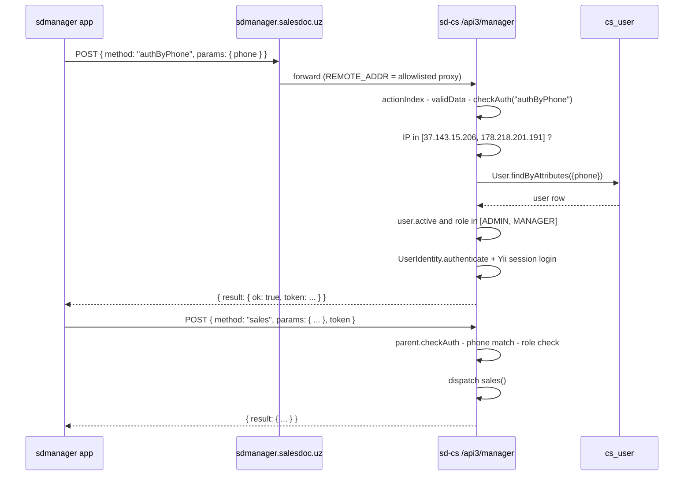

# sd-cs `api3` module

`api3` is the JSON-RPC backend for the `sdmanager` mobile app used by
brand-owner managers to inspect sales, balances, warehouses, and KPI
across every dealer in a country. It has exactly one controller with one
HTTP-callable action; everything else is dispatched in-process through
the `method` field of the JSON-RPC envelope.

The module sits behind an IP allowlist - only the sdmanager.salesdoc.uz
proxies (currently `37.143.15.206` and `178.218.201.191`) can authenticate.
Per-request auth is by phone number against the HQ `User` table, gated to
`ROLE_ADMIN` and `ROLE_MANAGER`.

## Key features

| Feature | What it does | Owner role(s) |
|---|---|---|
| Phone-based login | Verifies the caller's phone exists, is active, and has manager role; logs them into the Yii session | admin, manager |
| Daily summary | Per-day sales, returns, and target tracking for selected dealers | admin, manager |
| Sales drilldown | Sales by period and dimension (filial, agent, client, product) | admin, manager |
| Warehouse view | Stock balances aggregated across selected dealers | admin, manager |
| Client info | Detail on one client across the dealer's database | admin, manager |
| CS pivot reads | `dataCS`, `saleReportCS`, `getProductsCS` read pre-built HQ pivots (`cs_*`), not per-dealer loops | admin, manager |
| CORS open | `Access-Control-Allow-Origin: *` so the mobile shell can call it from any origin | - |

## Folder

```
protected/modules/api3/
  controllers/
    ManagerController.php   (1 action, 10 dispatched RPC methods)
```

## Controllers

| Controller | Purpose | Actions | Auth |
|---|---|---|---|
| `ManagerController` | Single JSON-RPC entry. Extends `JsonRPCController` (the platform's tiny dispatcher). Validates request, checks IP allowlist + phone, then calls the named private method | 1 | Phone match in `cs_user` + IP allowlist + `JsonRPCController::checkAuth` token |

## The single action

| | |
|---|---|
| Route | `POST /api3/manager` (the `actionIndex` of `ManagerController`) |
| Content-Type | `application/json` |
| CORS | Wide open (`*`), `GET, POST, OPTIONS`, headers `Content-Type, Authorization` |
| Body | JSON-RPC 2.0-style: `{"id": <n>, "method": "<name>", "params": { ... }}` |
| Dispatch | `actionIndex` -> validate -> `checkAuth(method)` -> `$this->{$method}($data)` |
| Error envelope | `{code: <int>, message: <string>}` returned via `JsonRPCController::fail()` |

If `method` is not in the allowlist (`methods()` private method):

```json
{"code": -32601, "message": "Method not found"}
```

### Methods table

| `method` | Purpose | Requires login | Notes |
|---|---|---|---|
| `authByPhone` | Bootstrap login by phone number. Sets up a `UserIdentity` and logs into the Yii session for the duration of the request | no | Gated to allowlisted REMOTE_ADDR only |
| `daily` | Daily sales / returns / plan for chosen dealers and date range | yes | Uses `dataCS` cache when available |
| `sales` | Sales drilldown (period + filial + agent + client + product) | yes | Heaviest method |
| `warehouse` | Stock balance across selected dealers | yes | |
| `balance` | Receivables / payables totals | yes | |
| `clientInfo` | One-client detail page | yes | |
| `dataCS` | Read pre-built sd-cs pivots (`cs_*`) directly | yes | Avoids per-dealer loops |
| `saleReportCS` | Sales report sourced from `cs_*` pivot tables | yes | |
| `getProductsCS` | Catalog projection from `cs_*` | yes | Auto-collapses to category view when product count is over `productCount` (default 60) |
| `checking` | Health/diag method for the mobile app | yes | |

### Auth flow



### Error codes

| Code | Meaning |
|---|---|
| `-32601` | Method not found |
| `-40100` | User not found (no `cs_user` row with this phone) |
| `-40102` | User inactive |
| `-40103` | User does not have ADMIN/MANAGER role |
| `-40104` | Remote IP not in allowlist (`<ip>: this server does not have access`) |

## Cross-module touchpoints

- **HQ `User` table**: identity is the user's `phone` field, not their
  login. Phone is the join key with the mobile-app database too. See
  [user module](./user.md).
- **`cs_*` pivots**: `dataCS`, `saleReportCS`, and `getProductsCS` skip
  the per-dealer loop entirely and read from pivot tables prepared by
  the `pivot` module. Faster, but only as fresh as the pivot's last
  rebuild.
- **`dealer` connection**: `daily`, `sales`, `warehouse`, `balance`,
  `clientInfo` use the canonical per-dealer loop (see
  [sd-cs - sd-main integration](../sd-main-integration.md)). They can be
  slow on large country deployments.
- **`api/V2Controller`**: a related, but separate, RPC-style endpoint for
  a different mobile app. They share no code. See [api module](./api.md).

## Gotchas

- **IP allowlist is hard-coded.** The two manager-proxy IPs live as a
  literal array in `authByPhone()`. Moving the proxy means a code change
  and deploy.
- **`getProductsCS` collapses on size.** When the result would be more
  than `productCount` (default 60) products, the controller silently
  switches to category-level aggregation. The mobile app expects this -
  do not change the threshold without coordinating.
- **The dispatcher trusts the method name.** `$this->{$method}($data)`
  is called by dynamic dispatch after a single `in_array` check against
  `methods()`. Adding a new private method that is not in `methods()` is
  safe; renaming an existing private method without updating `methods()`
  is a silent break.
- **Phone uniqueness is not enforced** at the DB level. If two `cs_user`
  rows have the same phone, `findByAttributes` returns the first - which
  may not be the operator who actually sent the request.
- **CORS is fully open.** Any origin can POST to this endpoint and probe
  for valid phones. The IP allowlist is the only thing stopping that.

## See also

- [api module](./api.md) - sister module with V2Controller (different
  mobile client, different auth scheme)
- [user module](./user.md) - the `cs_user` table that `authByPhone` queries
- [sd-cs - sd-main integration](../sd-main-integration.md) - cross-dealer
  read pattern used by the heavy RPC methods
- [Security - auth and roles](../../security/auth-and-roles.md)
