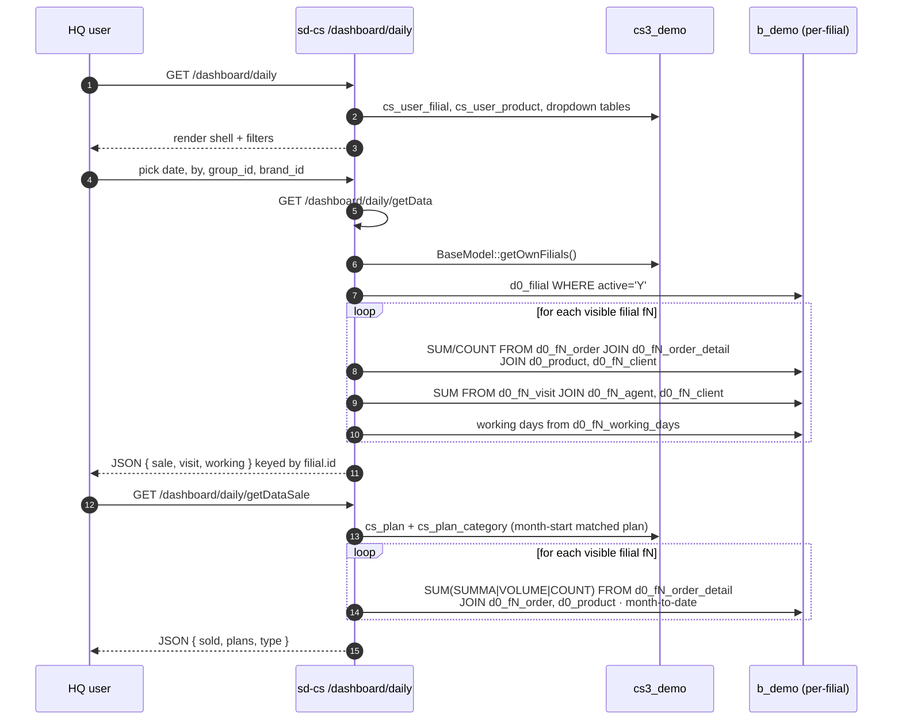

# sd-cs · `dashboard` module

The HQ daily dashboard. One screen, "today" by default, with sales /
visit / coverage KPIs rolled up across every filial the signed-in user
is allowed to see.

> Not to be confused with sd-main's dashboard. sd-main has a
> per-dealer dashboard scoped to a single tenant DB. **sd-cs's
> dashboard is HQ-wide**: it loops over `BaseModel::getOwnModels()`
> (the user's visible filials) and aggregates across them by running
> the same SQL against each `d0_fN_*` table set.

## Where it lives

| | |
|---|---|
| URL | `/dashboard/daily` |
| Module | `protected/modules/dashboard/` |
| Controllers | `DailyController`, `SupervayzerController` |
| Connection | `Yii::app()->dealer` (the `b_demo` warehouse) |
| Access keys | `dashboard.daily.*` in `cs_access_role` |

```
protected/modules/dashboard/
├── controllers/
│   ├── DailyController.php        — 317 LOC · 3 actions
│   └── SupervayzerController.php  —  11 LOC · 1 action (redirect)
└── views/
    └── daily/index.php            — render shell
```

## Key views

| View | What it shows | Who reads it |
|------|---------------|--------------|
| Daily — Sales | Sum / volume / blocks / AKB per filial, sliced by product category, client category, product group, sub-category or brand | Country manager, brand lead |
| Daily — Visits | Planned vs visited, photo, reject, GPS-confirmed, planned-but-not-visited, by filial | Field-sales lead, supervisor |
| Daily — Plan vs Sale | Month-to-date sales vs plan per filial | Country manager, KPI team |
| Daily — Working days | Total vs worked days in the month, per filial | KPI team (denominator) |

The supervayzer URL (`/dashboard/supervayzer`) currently 302-redirects
to `/dashboard/daily/` — it is a placeholder slot for a future
supervisor-scoped variant.

## Controllers

| Controller | Action | Method | Purpose |
|------------|--------|--------|---------|
| `DailyController` | `actionIndex` | GET `/dashboard/daily` | Render the shell. Loads dropdowns: currencies, product categories, product groups, brands, client categories, filial groups, product sub-categories. |
| `DailyController` | `actionGetData` | GET `/dashboard/daily/getData` | Returns the day's `sale[]`, `visit[]`, `working[]` per filial. Whitelisted `by` (0=cat, 1=client cat, 2=group, 4=subcat, else brand) drives the GROUP BY. |
| `DailyController` | `actionGetDataSale` | GET `/dashboard/daily/getDataSale` | Returns month-to-date `sold[]` per filial against `plans[]` from `Plan` (matched by month-start date). Used by the plan-vs-sale tile. |
| `SupervayzerController` | `actionIndex` | GET `/dashboard/supervayzer` | Redirect to `/dashboard/daily/`. |

`DailyController::$allowedActions = ['getData', 'getDataSale']`. The
shell `actionIndex` is page-access-gated; the two JSON endpoints
bypass page-level check and are reachable to any signed-in user with
the dashboard module access key.

## Data flow



The "dealer swap" is `setFilial($filial->prefix)`. One `Order` /
`OrderDetail` / `Client` / `Agent` / `Visit` / `WorkingDays` model
class addresses N tenants, one at a time, by rewriting the table token
from `{{order}}` to `{{f3_order}}` before each query. See
[architecture](../architecture.md#setfilial-table-rewrite) for the
mechanism.

## Sales SQL — what each KPI is

Inside `actionGetData`, the sales loop computes per filial:

| Field | Formula |
|-------|---------|
| `count` | `SUM(detail.COUNT)` — or `SUM(detail.COUNT / product.PACK_QUANTITY)` when `on_block=1` |
| `SUMMA` | `SUM(detail.SUMMA)` — line totals in `order.CURRENCY` |
| `VOLUME` | `SUM(detail.VOLUME)` — physical volume |
| `block` | `SUM(detail.COUNT / product.PACK_QUANTITY)` |
| `akb` | `COUNT(DISTINCT client.CLIENT_ID)` — clients who ordered today |

Filter chain (`addNotInCondition`, `compare`):

- `order.DATE BETWEEN :date 00:00:00 AND :date 23:59:59`
- `order.STATUS NOT IN (4, 5)` — exclude cancelled / rejected
- optional `product.PRODUCT_GROUP_ID`, `product.BRAND`,
  `cat.ACTIVE='Y'`
- `product.PRODUCT_ID NOT IN UserProduct::findByUser(userId, 3)` —
  per-user product blacklist

## Visit SQL — what each KPI is

| Field | Formula |
|-------|---------|
| `planned` | `SUM(t.PLANED)` |
| `visited` | `SUM(t.VISITED)` |
| `akb` | `SUM(t.ORDER)` — visits that produced an order |
| `reject` | `SUM(t.REJECT)` |
| `photo` | `SUM(t.PHOTO)` |
| `not_planned` | visited without a plan slot |
| `plan_visit`, `plan_order`, `plan_photo` | planned-slot counts where the agent actually visited / ordered / photographed |
| `no_plan_visit / order / photo` | unplanned-slot equivalents |
| `plan_gps`, `no_plan_gps` | visits with `t.GPS_STATUS = 10` (GPS-confirmed) |
| `not_visited` | planned but `t.VISITED = 0` |

Joins: `INNER JOIN d0_fN_agent ON agent.AGENT_ID = t.AGENT_ID AND
agent.ACTIVE='Y'` and `INNER JOIN d0_fN_client ON ... AND
client.ACTIVE='Y'`. Filter `t.ROLE = 4` (sales agent).

## Cross-module touchpoints

| Reads | From | Why |
|-------|------|-----|
| `cs_user_filial` | `cs3_demo` | filial scope |
| `cs_user_product` | `cs3_demo` | per-user product blacklist (via `UserProduct::findByUser(uid, 3)`) |
| `cs_filial_group` | `cs3_demo` | optional dropdown filter "filial group" |
| `cs_plan`, `cs_plan_category` | `cs3_demo` | plan-vs-sale target |
| `d0_filial` | `b_demo` | tenant registry |
| `d0_product`, `d0_product_category`, `d0_product_group`, `d0_product_subcategory`, `d0_adt_brand`, `d0_client_category`, `d0_currency` | `b_demo` | dealer-global dimensions |
| `d0_fN_order`, `d0_fN_order_detail` | `b_demo` per filial | sales numbers |
| `d0_fN_client`, `d0_fN_agent`, `d0_fN_visit` | `b_demo` per filial | visit numbers |
| `d0_fN_working_days` | `b_demo` per filial | denominator for "average per working day" |

## Gotchas

- **`actionGetData` swallows per-filial crashes.** The SQL is wrapped
  in `try / catch (\Throwable $th) { H::p($filial); }` — if a single
  filial's tables are out of sync (schema drift after a deploy), that
  filial dumps via `H::p` and the rest of the response continues. If
  the dashboard shows fewer filials than expected, check the response
  body and the web log for `H::p` dumps.
- **`by` whitelist is implicit.** `0`, `1`, `2`, `4` map to fixed
  dimensions; **any other value** (including `3`, undefined, or a
  garbage string) silently falls through to brand. New users typing
  `by=brand` will see the right result by accident; new users typing
  `by=cat` will get brand, not category.
- **`actionGetDataSale` relies on `cs_plan.date` being month-start.**
  The query is `findAllByAttributes(['date' => $startDate])` where
  `$startDate = date('Y-m-01', ...)`. Plans saved with mid-month dates
  will not match.
- **`type_id` for plan-vs-sale is set inside a loop.** The variable
  `$type_id` is overwritten on each plan row, so when several plans
  for the same month use different units (`SUMMA`, `VOLUME`, `COUNT`),
  only the last one wins. Plans authoring should use one unit per
  month per filial.
- **Currency is not converted.** The `sale[filial.id]` array carries
  one row per `(category, currency)` pair. If a filial sells in two
  currencies in one day, you get two rows for that category — the UI
  is responsible for summing or splitting.
- **`SupervayzerController` is a stub.** It only redirects. Don't link
  external tooling to `/dashboard/supervayzer` expecting a different
  payload.

## See also

- [sd-cs architecture](../architecture.md) — two-DB model and the
  `setFilial()` table-rewrite mechanism.
- [Multi-DB connection](../multi-db.md) — historical view of the
  cross-dealer connection model.
- [`pivot` module](./pivot.md) — heavier slice-and-dice reports built
  on the same per-filial loop.
- [Workflow · report-sale](../workflows/report-sale.md) — the
  single-screen sales report that uses the same per-filial loop with
  a wider date range.
- [Workflow · pivot-akb](../workflows/pivot-akb.md) — the
  client-side pivot UI built on per-filial streaming JSON.
