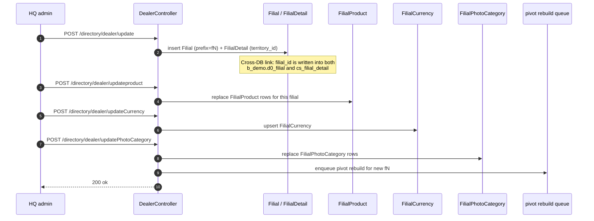
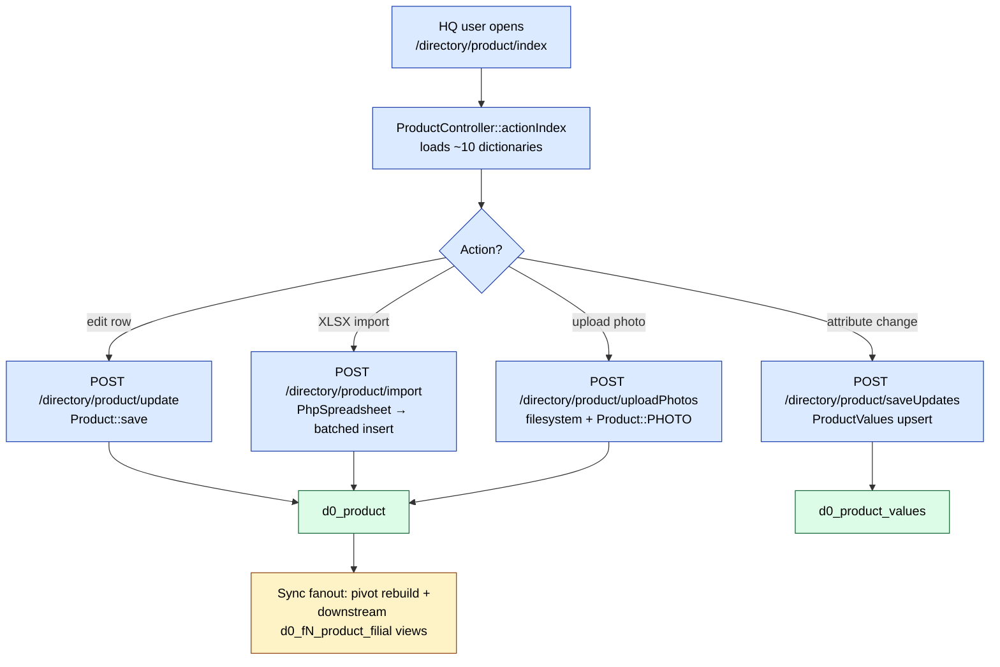

# `directory` module (sd-cs)

`directory` is by far the biggest module in sd-cs: **57 controllers and
144 ActiveRecord models**. It is the HQ-owned master-data layer — the
single place where head-office staff configure everything that the
per-tenant `b_demo` warehouse later reads or that flows back to the
operational dealers (`d0_fN_*`) through pivot and sync paths.

If `dashboard`, `report` and `pivot` are *read* surfaces, `directory`
is the *write* surface. It owns the product catalog, the pricing &
discount engine, the bonus rules, the dealer / filial registry, the
geography tree (country / region / territory), classification
dictionaries (client class, channel, type, ADT brand / pack / segment),
plans, royalty contracts, knowledge base and Telegram-bot wiring.

## Key responsibilities

| Area | What HQ does here | Primary tables touched |
|------|-------------------|------------------------|
| **Product catalog** | Define products, categories, groups, brands, segments, units, ADT params | `d0_product`, `d0_product_category`, `d0_product_group`, `d0_adt_*` |
| **Dealer / filial config** | Register tenants, map them to territories, set product visibility, photo categories, currency | `d0_filial`, `cs_filial_detail`, `d0_filial_product`, `d0_filial_photo_category`, `d0_filial_currency` |
| **Pricing** | Manage price types (sell / purchase), price lists, markups, old-price archive | `d0_price`, `d0_price_type`, `d0_price_type_filial`, `d0_product_price_markup` |
| **Bonus / discount** | Configure promo rules, exclusions, dealer overrides, manual discounts | `d0_bonus*`, `d0_skidka*`, `d0_rlp_bonus` |
| **Royalty** | Per-filial royalty contracts and transaction ledger | `d0_royalty`, `d0_royalty_filial`, `d0_royalty_transaction` |
| **Geography** | Country / region / territory tree used for filial scoping | `cs_country`, `cs_region`, `cs_territory` |
| **Classification** | Client class / channel / type / category, photo categories, reject reasons, inventory types | `d0_client_class`, `d0_client_channel`, `d0_client_type`, `d0_reject*`, `d0_inventory_*` |
| **Planning** | Agent and product plans (monthly targets, KPI templates) | `d0_plan*`, `d0_kpi*` |
| **Knowledge & comms** | Knowledge-base posts, in-app notifications, Telegram-bot config | `d0_knowledge_*`, `d0_notification`, `d0_telegram_bot*` |
| **Tara / packaging** | Returnable packaging master + product bindings | `d0_tara` |
| **ADT (Audit Doctor Team)** | Brand / pack / producer / segment / property / poll dictionaries used by audit | `d0_adt_*` |

## Folder layout

```
protected/modules/directory/
├── DirectoryModule.php          # Imports directory.models.*, directory.components.*, pivot.models.*
├── controllers/                 # 57 controllers
│   ├── Product*.php             # 6 controllers (catalog backbone)
│   ├── Adt*.php                 # 9 controllers (audit dictionaries)
│   ├── Client*.php              # 4 controllers (client classification)
│   ├── Plan*.php                # 3 controllers (planning)
│   ├── Bonus / Skidka / Rlp     # 4 controllers (promo engine)
│   ├── Price* / Royalty / Tara  # 5 controllers (pricing & royalty)
│   ├── Country / Region / …     # 3 controllers (geography)
│   ├── Knowledge* / Notification / TelegramBot   # comms
│   ├── Inventory* / Reject* / TaskType / OrderComment / PhotoReportCategory
│   ├── Group / Currency / Shipper / Unit / TradeDirection / Closed / Dealer
│   └── ApiController.php        # JSON helper endpoint
├── forms/
│   └── FilialForm.php           # Server-side filial-edit form
└── models/                      # 144 ActiveRecord classes (grouped below)
```

The module imports `pivot.models.*` because most write operations
need to enqueue a pivot rebuild for the affected filial.

## Controllers — grouped by area

The 57 controllers break into eight thematic groups. The 10 most
action-dense controllers are documented in detail below; the rest are
listed in the long-form table further down.

### Top 10 controllers (detailed)

| Controller | Actions | What it owns |
|------------|--------:|--------------|
| `ProductController` | 10 | The catalog editor. `index`, `getProduct`, `update`, `delete`, `preview`, `import` (XLSX), `uploadPhotos`, `saveUpdates`, `getAttributeLabels`. Loads units, categories, groups, brands, producers, packs, segments, trade directions, custom properties — basically every dictionary needed to describe a SKU. Writes to `d0_product` + `d0_product_values` (custom attribute store). |
| `DealerController` | 9 | The filial / tenant editor. `index`, `list`, `update`, `delete`, `open`, `updateproduct` (per-filial SKU whitelist), `updatePhotoCategory` (per-filial photo-report mapping), `updateCurrency` (filial → currency binding). The screen joins `Filial` + `FilialDetail` + `Territory` + `FilialProduct` + `FilialCurrency` + `FilialPhotoCategory`. |
| `SkidkaController` | 8 | Discount-rule editor. `index`, `getSkidka`, `availableSkidka`, `availableExcSkidka`, `updateExclude`, `updateRelation`, `update`, `delete`. Manages `Skidka` + `SkidkaFilial` (dealer-scoping) + `SkidkaExclude` (product/client opt-outs) + `SkidkaRelation` (product bindings). |
| `BonusController` | 8 | Bonus-rule editor — mirror of `SkidkaController` for buy-X-get-Y promos. Manages `Bonus`, `BonusFilial`, `BonusExclude`, `BonusRelation`, `BonusLimit`. The `availableBonus` and `availableExcBonus` actions return product candidate lists for the rule builder. |
| `PriceTypeController` | 7 | Price-list editor. `index`, `update`, `getPrices`, `setPrices`, `delete`, `getTemplate` (XLSX template download), `import` (XLSX upload). Supports both sell-side and purchase-side price types via the `TYPE` field. |
| `TaraController` | 6 | Returnable-packaging master. `index`, `list`, `products` (bound SKUs), `create`, `update`, `updateProducts`. Tara is the returnable-packaging concept (TODO: dedicated concept page). |
| `PlanProductController` | 6 | Product-level monthly plan grid. `index`, `getData`, `set`, `getProducts`, `getCategories`, `import`. |
| `NotificationController` | 6 | In-app notifications. `index`, `getData`, `update`, `sendFilial` (fanout to selected filials), `deleteFilial`, `delete`. |
| `InventoryController` | 6 | Equipment inventory (cooler / shelf assets at clients). `index`, `pivotData`, `reports`, `saveReport`, `deleteReport`, `visitings`. |
| `PlanController` | 5 | Generic plan grid (agent / category). `index`, `getData`, `set`, `preview`, `import`. |

### Top 11–15 controllers

| Controller | Actions | What it owns |
|------------|--------:|--------------|
| `RegionController` | 5 | Region CRUD + list (geography). |
| `TerritoryController` | 5 | Territory CRUD + list. |
| `CountryController` | 5 | Country CRUD + list. |
| `ProductCompetitorController` | 5 | Competitor-product dictionary (used by audit). |
| `GroupController` | 5 | Product groups (top-level catalog node). |
| `AdtParamsController` | 5 | Custom ADT parameters (Property1 / Property2). |

### Long-form controller table (rest)

| Controller | Actions | Group | Purpose |
|------------|--------:|-------|---------|
| `ProductCategoryController` | 3 | Catalog | Category CRUD |
| `ProductSubcategoryController` | 4 | Catalog | Subcategory CRUD |
| `ProductGroupController` | 3 | Catalog | Group CRUD |
| `ProductCatGroupController` | 4 | Catalog | Cat→Group bridge |
| `ProductPropertiesController` | 2 | Catalog | Custom-attribute defs |
| `AdtBrandController` | 3 | ADT | Brand dictionary |
| `AdtPackController` | 3 | ADT | Pack dictionary |
| `AdtProducerController` | 3 | ADT | Producer dictionary |
| `AdtSegmentController` | 3 | ADT | Segment dictionary |
| `AdtPropertyController` | 3 | ADT | Property dictionary |
| `AdtCommentController` | 3 | ADT | Audit comment library |
| `AdtAuditController` | 4 | ADT | Audit-template editor |
| `AdtPollController` | 4 | ADT | Audit-poll editor |
| `ClientCategoryController` | 3 | Client | Category dictionary |
| `ClientChannelController` | 3 | Client | Channel dictionary |
| `ClientClassController` | 3 | Client | Class dictionary |
| `ClientTypeController` | 3 | Client | Type dictionary |
| `PriceListController` | 3 | Pricing | Read-only price-list browser |
| `RoyaltyController` | 3 | Pricing | Royalty rates |
| `RlpBonusController` | 3 | Promo | RLP bonus rules |
| `SkidkaManualController` | 3 | Promo | Manual / one-off discounts |
| `RejectController` | 3 | Ops | Reject reasons |
| `RejectDefectController` | 3 | Ops | Defect-specific rejects |
| `InventoryTypeController` | 3 | Ops | Inventory equipment types |
| `InventoryGroupController` | 2 | Ops | Inventory equipment groups |
| `TaskTypeController` | 3 | Ops | Task types (for KPI / agent tasks) |
| `KpiTaskTemplateGroupController` | 3 | Ops | KPI-template groupings |
| `KnowledgePostController` | 4 | Comms | KB articles |
| `KnowledgeCategoryController` | 3 | Comms | KB categories |
| `TelegramBotController` | 3 | Comms | Telegram-bot config |
| `PhotoReportCategoryController` | 3 | Ops | Photo-report categories |
| `OrderCommentController` | 3 | Ops | Order-level comment templates |
| `PlanAgentController` | 3 | Planning | Agent-level plan grid |
| `CurrencyController` | 3 | Geo | Currency master |
| `UnitController` | 3 | Catalog | Unit-of-measure master |
| `TradeDirectionController` | 3 | Catalog | Trade-direction dictionary |
| `ShipperController` | 3 | Catalog | Shipper / carrier master |
| `ClosedController` | 4 | Ops | Closed-period config (period close) |
| `ApiController` | 2 | Misc | JSON helper used by inline AJAX |

## Models — grouped by concept

The 144 model classes split into roughly 12 concept groups. Each group
below lists the headline entities; the rest follow the same shape.

| Group | Count | Key entities | What it stores |
|-------|------:|--------------|----------------|
| **Product master** | ~22 | `Product`, `ProductCategory`, `ProductSubcategory`, `ProductGroup`, `ProductCatGroup`, `ProductCompetitor`, `ProductUnit`, `ProductValues`, `ProductCaseType`, `ProductPriceMarkup`, `Properties`, `Units`, `Tara` | The core SKU table plus its dictionary fan-out and custom-attribute store |
| **ADT (audit) reference** | ~16 | `AdtBrand`, `AdtPack`, `AdtProducer`, `AdtSegment`, `AdtProperty`, `AdtProperty1`, `AdtProperty2`, `AdtPoll`, `AdtPollQuestion`, `AdtPollVariant`, `AdtPollResultData`, `AdtAudit`, `AdtAuditBindProducts`, `AdtComment`, `AdtParams` | Reference data used by every audit workflow |
| **Dealer / filial** | ~12 | `Filial`, `FilialDetail`, `FilialCurrency`, `FilialGroup`, `FilialOrder`, `FilialPhotoCategory`, `FilialProduct`, `Diler`, `UserDiler`, `UserFilial`, `ParentPhotoReport`, `WorkingDays` | Tenant registry + per-tenant config (SKU whitelist, photo categories, currency, working calendar) |
| **Geography** | ~4 | `Country`, `Region`, `Territory`, `City` | The country→region→territory→city tree |
| **Pricing** | ~8 | `Price`, `PriceType`, `PriceTypeFilial`, `OldPrice`, `OldPriceType`, `ProductPriceMarkup`, `Currency`, `Exchange`, `ExchangeDetail`, `FilialCurrency` | Sell + purchase price types, archived prices, FX |
| **Bonus / discount** | ~14 | `Bonus`, `BonusExclude`, `BonusFilial`, `BonusLimit`, `BonusOrder`, `BonusOrderDetail`, `BonusRelation`, `Skidka`, `SkidkaBudget`, `SkidkaExclude`, `SkidkaFilial`, `SkidkaManual`, `SkidkaManualFilial`, `SkidkaOrder`, `SkidkaRelation`, `RlpBonus` | The complete promo engine (rule, scope, exclusions, application history) |
| **Royalty** | ~3 | `Royalty`, `RoyaltyFilial`, `RoyaltyTransaction` | Per-filial royalty contracts + ledger |
| **Client classification** | ~9 | `Client`, `ClientCategory`, `ClientChannel`, `ClientClass`, `ClientType`, `ClientFinans`, `ClientTransaction`, `CreatedStores`, `SalesCategory` | The classification dictionaries that field-force apps tag clients with |
| **Inventory (equipment)** | ~6 | `Inventory`, `InventoryCheck`, `InventoryCheckPhoto`, `InventoryGroup`, `InventoryHistory`, `InventoryType`, `PhotoInventory` | Asset register (coolers / shelves at clients) and audit history |
| **Planning & KPI** | ~7 | `Plan`, `PlanCategory`, `PlanProduct`, `Planning`, `Kpi`, `KpiTask`, `KpiTaskTemplate`, `KpiTaskTemplateGroup`, `TaskType` | Plan grids, KPI templates |
| **Stock & sales ops** | ~16 | `Order`, `OrderDetail`, `OrderDetailHistory`, `OrderComment`, `OrderDefect`, `OrderDefectDetail`, `OrderReplace`, `OrderReplaceDetail`, `Store`, `StoreCorrector`, `StoreDetail`, `StoreLog`, `StoreReserve`, `Purchase`, `PurchaseDetail`, `PurchaseRefund`, `PurchaseRefundDetail`, `Consumption`, `ConsumptionChild`, `ConsumptionParent`, `Excretion`, `WarehouseDetail`, `Lot`, `LotDistribution`, `Reject`, `RejectClient`, `RejectDefect` | Operational tables surfaced as models so directory screens can cross-reference SKU → stock / orders / rejects |
| **Comms & misc** | ~10 | `Notification`, `KnowledgePost`, `KnowledgeCategory`, `KnowledgeBind`, `KnowledgeBindDealer`, `TelegramBot`, `TelegramBotConfig`, `TelegramBotUser`, `TelegramGroup`, `Shipper`, `ShipperTransaction`, `Cashbox`, `PaymentDeliver`, `Group`, `Closed`, `TradeDirection`, `TaskType`, `Visit`, `Visiting`, `PhotoReport`, `Agent`, `Supervayzer`, `Properties` | Notifications, KB, Telegram, plus aliases to ops models reused on directory screens |

> Total adds up to slightly more than 144 because a few models
> straddle two groups (e.g. `Properties` is both catalog and custom
> attribute; `Currency` is geo + pricing). The group counts above are
> the canonical assignment used in the rest of these docs.

## Notable workflows

### Setting up a new dealer (filial)



The new filial is immediately visible in `getOwnFilials()` for any HQ
user whose `cs_user_filial` is updated, and per-filial table-prefix
rewriting (`setFilial('fN')`) starts working as soon as the schema
clone job finishes provisioning `d0_fN_*` tables (handled outside
`directory`).

### Managing the product catalog at HQ



The catalog is **dealer-global** (lives in `b_demo.d0_product`, not
inside a filial prefix). Per-filial scoping happens via
`FilialProduct` — that table picks which SKUs each filial sells.

## Cross-module touchpoints

| Direction | What flows | Where it lands |
|-----------|------------|----------------|
| **directory → pivot** | Every catalog / pricing / bonus write triggers a pivot rebuild for the affected filial via `pivot.models.*` (imported in `DirectoryModule::init`). | `pivot_config` rows in `cs3_demo`, materialized cubes in `b_demo` |
| **directory → report** | Reports read the same masters (`d0_product`, `d0_price`, `d0_filial`) by joining through filial-scoped tables. No direct call — shared schema. | `b_demo.d0_*` (read-only from `report`) |
| **directory → api / api3** | Mobile clients fetch SKU / price / dealer info via the public API; `directory` controllers are the canonical write path. | Same dealer-global tables |
| **directory ← sd-main** | sd-main writes operational data into `b_demo.d0_fN_*` via `DealerConnection`; some directory screens (e.g. `InventoryController::pivotData`) read those tables back. | Read across via `setFilial('fN')` |
| **directory ↔ cs (control)** | `Country / Region / Territory` and `FilialDetail` live in `cs3_demo`; everything else lives in `b_demo`. The split is enforced by the `db` vs `dealer` Yii connections. | `cs_*` vs `d0_*` |

See [Architecture (verified)](../architecture.md) for the connection
mechanics and [sd-main integration](../sd-main-integration.md) for the
cross-DB linkage.

## Gotchas

| # | Gotcha |
|---|--------|
| 1 | **Two big sub-engines look alike but are not.** `Bonus*` (buy-X-get-Y) and `Skidka*` (percentage / amount discounts) share the same controller layout — `index`, `getXxx`, `availableXxx`, `availableExcXxx`, `updateRelation`, `updateExclude`, `update`, `delete` — but write to entirely different tables. Always confirm which engine a screen is editing before patching code. |
| 2 | **Legacy duplicates.** `OldPrice` / `OldPriceType` shadow `Price` / `PriceType` — they hold the pre-cutover price archive and must not be written by new code. Same pattern: `Diler` (legacy spelling) vs `Filial` — `Diler` survives only for old report JOINs. |
| 3 | **`ProductValues` is the wide-column store.** Custom attributes are not columns on `Product`; they are rows in `d0_product_values` keyed by `MODEL_ID + PROPERTY_ID`. To list a product with attributes, join `Product` + `ProductValues` + `Properties`. Skipping `Properties` loses the attribute name. |
| 4 | **`FilialProduct` is the per-filial SKU whitelist.** A SKU in `d0_product` is not visible to a filial unless it has a `FilialProduct` row for that filial. Catalog imports that forget this step produce silently-empty product lists in the mobile app. |
| 5 | **Geography is the only part in `cs3_demo`.** `Country / Region / Territory` use `Yii::app()->db` (control DB); every other model on this page uses `Yii::app()->dealer` (warehouse DB). Mixing them in one JOIN is impossible — fetch both sides and merge in PHP. |
| 6 | **ADT property fan-out.** ADT has three property tables — `AdtProperty`, `AdtProperty1`, `AdtProperty2` — used as a three-level taxonomy for audit templates. The numbered names are not version suffixes. |
| 7 | **Models live in `directory.models` but are reused everywhere.** `Order`, `OrderDetail`, `Store`, `Visit`, `Agent`, `Supervayzer`, `Client`, `Cashbox` are all imported here so directory screens can read operational data. They are not owned by this module — operational writes go through sd-main / api3 / agent flows. |
| 8 | **57 controllers, 1 module — RBAC is per-action.** There is no module-level RBAC gate. Each action does its own `Yii::app()->user->checkAccess('operation.directory.…')` (or relies on `allowedActions` for public AJAX). Adding a new action without an explicit check exposes it to any logged-in HQ user. |
| 9 | **`DirectoryModule` imports `pivot.models.*`.** Catalog and pricing writes are expected to enqueue pivot rebuilds. If you bypass the model events (raw SQL `INSERT`) you also bypass the pivot fanout — downstream cubes go stale. |
| 10 | **`Closed` controls period close.** `ClosedController` writes lock-rows that other modules (orders, stock) check before allowing edits. Treat it as a write-only "circuit breaker", not a normal CRUD screen. |

## Related pages

- [sd-cs Architecture (verified)](../architecture.md) — two-DB layout, `setFilial()` mechanics
- [Data schemes](../data-schemes.md) — `d0_*` / `cs_*` schemas in full
- [sd-main integration](../sd-main-integration.md) — how operational writes land here
- [Defect vs reject states](../../concepts/defect-vs-reject.md)
- [Period-close mechanics](../../concepts/period-close.md)
