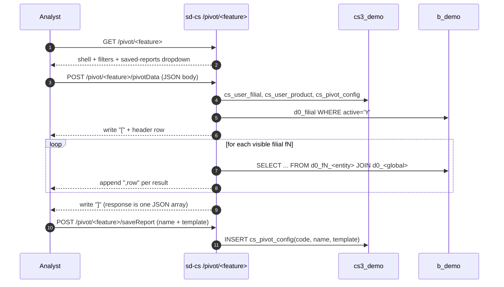
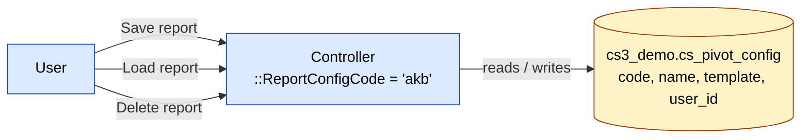

# sd-cs · `pivot` module

The `pivot` module hosts 16 pivot-table screens. Each one is a thin
server: it accepts filter parameters, loops `BaseModel::getOwnModels()`,
runs one heavy SQL per filial, and **streams rows back as a single
JSON array** assembled incrementally. The pivot UI (drag-drop rows /
columns / measures) is client-side.

Saved pivot configurations live in `cs3_demo.cs_pivot_config`, keyed
by a `ReportConfigCode` constant declared on each controller.

```
protected/modules/pivot/controllers/        — 16 controllers
protected/modules/pivot/views/<feature>/    — thin index views + JS
```

## How a pivot screen works



Three properties are universal:

1. **Thin shell + streaming JSON endpoint.** `actionIndex` renders an
   empty page; `actionPivotData` (or `actionGetData`) does the work.
2. **Per-filial loop with `setFilial()` rewrite.** One model class
   addresses N tenants by rewriting `{{order}}` to `{{fN_order}}`.
3. **Saved views in `cs_pivot_config`.** `actionReports` /
   `actionSaveReport` / `actionDeleteReport` form the CRUD trio.

## Controllers

| Controller | Actions | `ReportConfigCode` | One-line purpose |
|------------|--------:|--------------------|------------------|
| `AkbController` | 5 | `akb` | AKB and OKB ratio sliced by any allowed dimension. **[Workflow](../workflows/pivot-akb.md).** |
| `ConsumptionController` | 4 | `consumption` | Product consumption per client over a period. Filter by currency. |
| `DefectController` | 4 | (no constant; uses `'defect'`) | Defective-product returns sliced by territory / category / group. |
| `DiscountController` | 4 | `sale` | Discount usage per client / product (legacy discount engine). |
| `ExpeditorController` | 5 | `expeditor` | Expeditor (driver) performance: deliveries, returns, on-time. |
| `LotReportController` | 5 | `lot_report` | Per-lot P&L tracing. **Time-gated**: returns 404 between 10:00 and 19:00 to protect the warehouse during business hours. |
| `NewDiscountController` | 5 | `sale` | Newer discount-engine pivot (replaces `DiscountController`). |
| `NewSaleController` | 5 | `sale` | Newer sales-engine pivot (uses `order.DATE_LOAD` instead of `DATE`; statuses 2 + 3 only). |
| `PlanVisitController` | 7 | `planVisit`, `planVisitDetail` | Visit-plan vs actual. Has a drill-down `detail` / `pivotDataDetail` second tab. |
| `PurchaseController` | 5 | `purchase` | Purchase orders to suppliers sliced by product / shipper / type. |
| `RfmController` | 6 | (uses `'rfm'`) | RFM segmentation of clients (Recency, Frequency, Monetary). Per-user threshold settings. |
| `SaleController` | 5 | (uses `'sale'`) | Headline sales pivot — the most-used pivot screen. Has a `getDataCount` companion endpoint and a `getJoins` / `getJoin` mechanism for ad-hoc column joins. |
| `SaleDetailController` | 9 | `sale_detail` | Sales pivot at line-item level. Heaviest endpoint — has `commonCatalog` / `dilerCatalog` / `filials` / `eachFilialData` helpers that pre-load dimensions to the client. |
| `SkuController` | 4 | `consumption` | SKU-level sales by agent / city / client-cat / dealer / client-type. |
| `TransactionsController` | 7 | `transaction` | Cash / non-cash client transactions. Filter by currency, trans-type, trade direction. |
| `UserAccessController` | 8 | `userAccess` | Per-user / per-filial access exposure pivot — who can see which filial. Returns role label from a Russian-only hardcoded map. |

Each controller exposes `actionIndex` plus the action set declared in
`$allowedActions` (the JSON-only endpoints, which bypass the
page-level access check). See each controller file for the exact list.

## Saved-views model



`template` is the full pivot configuration as JSON (rows / columns /
measures / filters as the JS pivot library serialized them).
`PivotConfig::getReports(code)` lists saved views for the current
user; `actionSaveReport` upserts; `actionDeleteReport` removes.

Note that several controllers share a `ReportConfigCode` (`SaleController`,
`NewSaleController`, `DiscountController`, `NewDiscountController` all
use `'sale'`). Saved views from one screen will appear in the saved-view
dropdown of the others — that is intentional, since the underlying
columns overlap, but be careful when migrating a saved view across
screens.

## Workflow pages

Three controllers have dedicated workflow pages today:

| Controller | Workflow |
|------------|----------|
| `AkbController` | [pivot-akb](../workflows/pivot-akb.md) |
| (inventory pivots, cross-module) | [pivot-inventory](../workflows/pivot-inventory.md) |
| `RfmController` | [pivot-rfm](../workflows/pivot-rfm.md) |

The remaining 13 controllers are **stubs** — the SQL lives in code but
no end-user-facing workflow page exists yet. Future work:

| Controller | Status |
|------------|--------|
| `ConsumptionController` | stub |
| `DefectController` | stub |
| `DiscountController` | stub |
| `ExpeditorController` | stub |
| `LotReportController` | stub (note time gating!) |
| `NewDiscountController` | stub |
| `NewSaleController` | stub |
| `PlanVisitController` | stub (has drill-down) |
| `PurchaseController` | stub |
| `SaleController` | stub (highest-value page to write next) |
| `SaleDetailController` | stub (heaviest; has 9 actions) |
| `SkuController` | stub |
| `TransactionsController` | stub |
| `UserAccessController` | stub |

Use the `sd-cs-workflow-author` skill
(`sd-docs/skills/sd-cs-workflow-author/SKILL.md`) when drafting each
stub.

## Cross-module touchpoints

| Reads | From | Why |
|-------|------|-----|
| `cs_pivot_config` | `cs3_demo` | saved views (CRUD by every pivot controller) |
| `cs_user_filial` | `cs3_demo` | filial scope (`BaseModel::getOwnFilials`) |
| `cs_user_product` | `cs3_demo` | per-user product / category / group blacklist (`UserProduct::getUserRestrictions`) |
| `cs_plan*` | `cs3_demo` | targets for `PlanVisitController`, sale-vs-plan side tiles |
| `d0_filial` | `b_demo` | tenant registry |
| `d0_product`, `d0_product_category`, `d0_product_group`, `d0_adt_brand`, `d0_currency`, `d0_client_category` | `b_demo` | dealer-global dimensions joined into every per-filial query |
| `d0_fN_order`, `d0_fN_order_detail` | `b_demo` per filial | sales-side numerators (most controllers) |
| `d0_fN_visit`, `d0_fN_visiting`, `d0_fN_client`, `d0_fN_agent` | `b_demo` per filial | coverage-side numerators (AKB, PlanVisit, Sku) |
| `d0_fN_consumption`, `d0_fN_defect`, `d0_fN_purchase`, `d0_fN_lot`, `d0_fN_client_trans` | `b_demo` per filial | feature-specific tables |

## Gotchas

- **Responses are streamed JSON arrays, not NDJSON.** The endpoint
  writes `[`, then comma-prefixed JSON rows, then `]`. A mid-stream
  crash truncates the document and the client gets invalid JSON. If
  the pivot grid is empty, open the network tab and inspect the raw
  response body for an unclosed `[`.
- **`actionPivotData` reads JSON from `php://input`** in most
  controllers, but a few (`SaleController`, `PurchaseController`,
  `DefectController`, `RfmController`, `DiscountController`,
  `AkbController`) read from `$_GET` instead. Don't assume the
  request shape from one controller transfers to another.
- **Some controllers have unbound `$period` checks.** Several
  controllers contain `if ($period < 0) { ... die(); }` where
  `$period` was never assigned in that branch — left over from
  refactors. Harmless (always falsy), but easy to misread when
  copy-pasting between controllers.
- **`LotReportController` is time-gated.** Between 10:00 and 19:00
  local server time, `actionIndex` renders an `unavailable` view and
  `actionPivotData` returns `404`. This is a warehouse-load guard;
  test scheduling matters.
- **`UserAccessController` has a hardcoded Russian role label map.**
  Translation depends on UI side — server-side payload is RU-only.
- **`NewSaleController` filters `order.STATUS IN (2, 3)`**, while
  `SaleController` does not constrain status. Comparing the two
  screens against the same date range will produce different totals;
  this is expected.
- **`SaleController` has `getJoins` / `getJoin`.** These two actions
  return SQL join clauses based on the user's saved column choices —
  they exist because the sale pivot supports arbitrary dimension
  joins the other screens do not. Treat them as internal.
- **Time-gating, `php://input` vs `$_GET`, status filters, and
  hardcoded role labels** are the four most common surprises when
  bouncing between pivot controllers — keep this list nearby when
  reading code.

## See also

- [sd-cs architecture](../architecture.md) — two-DB model and
  `setFilial()` mechanism.
- [`dashboard` module](./dashboard.md) — the same per-filial loop, but
  on a one-day window with no client-side pivot.
- [`reports-pivots`](../reports-pivots.md) — bird's-eye on the
  report vs pivot split.
- [Workflow · pivot-akb](../workflows/pivot-akb.md) — canonical
  reference for "what a pivot workflow page looks like".
- [Workflow · pivot-inventory](../workflows/pivot-inventory.md),
  [pivot-rfm](../workflows/pivot-rfm.md) — the other two written
  workflow pages.
- [Style guide](../workflows/style.md) — voice / structure for
  drafting the remaining 13 stubs.
