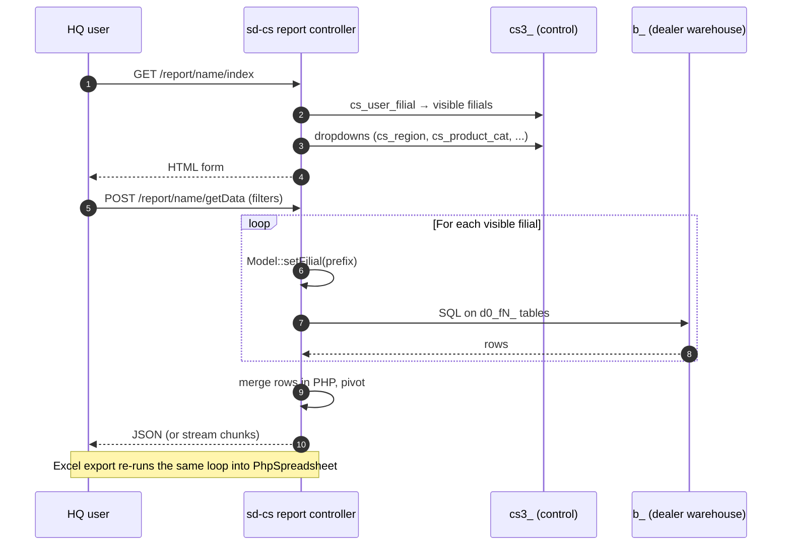

# `report` module

`sd-cs/protected/modules/report/` is the **cross-dealer reporting
surface** of the HQ control plane. 30 controllers and ~146 actions
all follow the same shape: take a filter form, fan out across the
visible dealer filials, read from each dealer's `d0_*` tables, merge
the rows in PHP, and return HTML / paginated JSON / Excel.

There is **no caching layer** between the dealers and the HQ report
output — every page-load re-runs the underlying SQL on every dealer
the user can see. Tuning the WHERE clauses per controller is the
primary performance lever.

## How this module differs from sd-main's `report`

| | sd-main `report` | sd-cs `report` (this page) |
|---|---|---|
| Scope | Single tenant — one filial's own DB | Many tenants — one HQ user sees N dealers at once |
| Connection | `Yii::app()->db` (tenant DB) | `Yii::app()->dealer` swapped per filial inside a loop |
| Filters | `filial_id` not present | `filial_id` array is *always* a top-level filter |
| Persistence | None | Saved-filter / saved-pivot rows in `cs_*` config tables (PivotInventory, Movement, Planning) |
| Excel pipeline | `xlsxwriter` (streaming) + PHPExcel | `PhpSpreadsheet` (PhpOffice) — in-memory, smaller default ceilings |

If you're after the per-tenant report families (sale-detail, RFM,
defect, expeditor, visit, etc.) you want the
[sd-main `report` module](/docs/modules/report) instead.

## Report catalog

30 controllers, sorted by action count:

| Controller | Purpose | # actions | Workflow page |
|---|---|---:|---|
| `PivotInventory` | Cross-dealer stock pivot — the biggest controller. Saved reports + dashboards. | 22 | [pivot-inventory](/docs/sd-cs/workflows/pivot-inventory) |
| `Store` | Stock per warehouse — value, volume, count; daily & monthly. | 13 | [report-inventory](/docs/sd-cs/workflows/report-inventory) |
| `Inventory` | Inventory snapshot — by product / by store / by category. | 9 | [report-inventory](/docs/sd-cs/workflows/report-inventory) |
| `Sell` | Consolidated sales pulse across all visible filials. | 8 | [report-sell](/docs/sd-cs/workflows/report-sell), [report-sale](/docs/sd-cs/workflows/report-sale) |
| `Classification` | Client classification rollups (A/B/C, channels, segments). | 6 | — |
| `SummaryBonus` | Aggregated bonus accrual / payout across dealers. | 6 | — |
| `Movement` | Stock-movement pivot — receipts, transfers, write-offs. | 5 | — |
| `Nmedov` | Tenant-specific "Nmedov" sales pivot. | 5 | — |
| `Photo` | Photo-merchandising audit results per dealer. | 5 | [report-photo](/docs/sd-cs/workflows/report-photo) |
| `PlanProduct` | Plan-vs-fact per product across dealers. | 5 | [report-plan](/docs/sd-cs/workflows/report-plan) |
| `Planning` | Plan setup + plan-vs-fact summary. | 5 | [report-plan](/docs/sd-cs/workflows/report-plan) |
| `Purchase` | Purchase-order rollups (supplier-side). | 5 | — |
| `Stock` | Stock by SKU with reorder-point flags. | 5 | [report-inventory](/docs/sd-cs/workflows/report-inventory) |
| `Agent` | Agent-level sales rollup. | 4 | [report-agent](/docs/sd-cs/workflows/report-agent) |
| `BonusSale` | Bonus-driven sales attribution. | 4 | — |
| `Material` | Marketing-material distribution audit. | 4 | — |
| `Neon` | Tenant-specific "Neon" pivot. | 4 | — |
| `Okb` | OKB (overall client base) coverage rate. | 4 | — |
| `Akb` | AKB (active client base) coverage rate. | 3 | — |
| `AnalyzeAkb` | AKB trend / dynamics analysis. | 3 | — |
| `Plan` | Plan summary (day / month). | 3 | [report-plan](/docs/sd-cs/workflows/report-plan) |
| `AgentVisit` | Agent visit-coverage report. | 2 | [report-agent](/docs/sd-cs/workflows/report-agent) |
| `AkbCategory` | AKB sliced by product category. | 2 | — |
| `Bonus` | Promo-bonus distribution view. | 2 | — |
| `ClientData` | Client-master rollup across dealers. | 2 | — |
| `Debt` | Outstanding-debt rollup. | 2 | [report-debt](/docs/sd-cs/workflows/report-debt) |
| `Kpi` | KPI calculation — streamed JSON response. | 2 | [report-kpi](/docs/sd-cs/workflows/report-kpi) |
| `Licence` | Licence-usage per dealer. | 2 | — |
| `Log` | Operator action log viewer. | 2 | — |
| `Shipper` | Shipper / expeditor performance. | 2 | — |

Source: `protected/modules/report/controllers/*Controller.php`. Action
totals taken from `grep -c "public function action"` on each file.

## Common report mechanics

Every controller in this module is a thin variation on the same
recipe. Knowing it once means you can read any of the 30.

1. `actionIndex` renders the filter form. It assembles dropdowns
   (regions, territories, product groups, price types) from
   `Yii::app()->db` (the `cs_*` config DB).
2. An AJAX call posts the filter values to `actionGetData` (or
   `actionPivotData`, `actionGetClients`, etc.).
3. `BaseModel::getOwnModels()` returns the filial rows the current HQ
   user is allowed to see (filtered by `cs_user_filial`).
4. The controller loops over each filial, calling
   `Model::setFilial($prefix)->tableName()` to rewrite the
   model's table name to the dealer-side `d0_fN_<table>` form.
5. Raw SQL is issued through `Yii::app()->dealer->createCommand(...)`.
   Result rows are merged into an in-memory PHP array keyed by the
   pivot dimensions.
6. The merged array is serialised as JSON (HTML view) or written into
   a `PhpSpreadsheet` workbook (`actionExport*`).

`Yii::app()->dealer` is the single connection used inside the loop —
`setFilial($prefix)` only rewrites the table name on the model, it
does not switch DB. See [Multi-DB](/docs/sd-cs/multi-db) for the
schema map.

### Streamed JSON (Kpi only)

`KpiController::actionGetData` writes its response chunk by chunk:

- it sends `Content-Type: application/json; charset=utf-8` then
  `echo "["`,
- it `echo`s a JSON fragment after each filial,
- it closes the array with `]`.

This avoids holding the whole KPI matrix in memory for a multi-dealer
month. No other controller currently uses this pattern — the rest
build the full result then `json_encode` it once.

## Top 5 controllers in detail

### `PivotInventoryController` (22 actions)

The single largest controller in the module. Backs the
*Stock Pivot* page: the HQ user picks dimensions (filial, region,
territory, product category, group, subcategory, client category /
channel) and the controller renders a saveable pivot.

| Action | Purpose |
|---|---|
| `actionIndex` | Render the pivot UI shell. |
| `actionCommonCatalog` | Common product/dealer catalog feed for the dimension picker. |
| `actionDilerCatalog` | Per-dealer catalog feed for cross-dealer SKUs. |
| `actionPivotData` | The main pivot — fans out across dealers and aggregates. |
| `actionReports` | List saved pivot configurations for the current user. |
| `actionSaveReport` | Persist a filter+layout combo as a named pivot in `cs_*`. |
| `actionDeleteReport` | Remove a saved pivot. |
| `actionFilials` | Filial dimension picker. |
| `actionInventoryTypes` | Inventory-type filter source. |
| `actionProductCats` | Product-category dimension. |
| `actionProductGroups` | Product-group dimension. |
| `actionProductSubcats` | Product-subcategory dimension. |
| `actionClientCats` | Client-category dimension. |
| `actionClientChannels` | Client-channel dimension. |
| `actionUnits` | Unit-of-measure dimension. |
| `actionProducts` | Product dimension (large list — paginated). |
| `actionTerritories` | Territory dimension. |
| `actionRegions` | Region dimension. |
| `actionDashboard` | Renders the inventory-dashboard tile shell. |
| `actionDashboardData` | Tile data feed for the dashboard. |
| `actionOkb_inv` | OKB-inventory cross-pivot (clients × stock-on-hand). |
| `actionCategoryData` | Category-level rollup for the dashboard. |

### `StoreController` (13 actions)

Stock-per-warehouse report. Three time slices (one-shot,
daily-rolling, monthly) each with their own data-feed and Excel
endpoints.

| Action | Purpose |
|---|---|
| `actionIndex` | Stock-per-warehouse form. |
| `actionGetData` | Aggregate stock by warehouse for the current filter. |
| `actionGetProducts` | Drill-down: stock per SKU for the chosen warehouse(s). |
| `actionExport` | Excel of the warehouse rollup. |
| `actionExportProducts` | Excel of the SKU drill-down. |
| `actionDaily` | Daily-rolling stock view (last N days). |
| `actionGetDailyData` | Data feed for the daily view. |
| `actionGetDailyProducts` | Per-SKU rows for the daily view. |
| `actionExportDaily` | Excel of the daily view (style 1). |
| `actionExportDaily2` | Excel of the daily view (style 2 — alternate layout). |
| `actionExportDaily1Products` | Per-SKU Excel for the daily view (style 1). |
| `actionExportDaily2Products` | Per-SKU Excel for the daily view (style 2). |
| `actionGetMonthlyData` | Monthly rollup feed. |

### `SellController` (8 actions)

The "consolidated sales pulse." Sees every filial the user can
access; merges Order + OrderDetail rows from each. See the
[report-sell workflow](/docs/sd-cs/workflows/report-sell) for the
end-user view.

| Action | Purpose |
|---|---|
| `actionIndex` | Sales filter form (filial, region, group, brand, period). |
| `actionGetFilials` | Filial dropdown source — visible filials only. |
| `actionGetData` | Aggregate sales by the chosen dimension. |
| `actionGetClients` | Drill-down by client. |
| `actionGetStore` | Drill-down by warehouse. |
| `actionGetProducts` | Drill-down by SKU. |
| `actionExport` | Excel of the rollup. |
| `actionExportProducts` | Excel of the SKU drill-down. |

### `MovementController` (5 actions)

Stock-movement pivot — receipts (purchase), transfers, write-offs,
sales-outflow. Persists saved layouts the same way PivotInventory
does.

| Action | Purpose |
|---|---|
| `actionIndex` | Movement-pivot UI shell. |
| `actionPivotData` | Movement rows aggregated across dealers. |
| `actionReports` | List saved movement layouts. |
| `actionSaveReport` | Save a movement-pivot layout. |
| `actionDeleteReport` | Remove a saved layout. |

### `PhotoController` (5 actions)

Photo-merchandising audit. Each photo lives in the dealer's object
store; this controller catalogs the audit decisions but does not
host the binaries. See [report-photo](/docs/sd-cs/workflows/report-photo).

| Action | Purpose |
|---|---|
| `actionIndex` | Photo-audit filter form. |
| `actionGetData` | Audit-result counts grouped by filter dimension. |
| `actionGetClients` | Drill-down by client. |
| `actionGetFilials` | Filial dropdown source. |
| `actionGetPhotos` | Paginated photo list with audit verdicts. |

## Cross-module touchpoints

### Reads (per-dealer `d0_*`)

| Controller family | Dealer tables read |
|---|---|
| PivotInventory, Stock, Store, Inventory, Movement | `d0_fN_store`, `d0_fN_store_remains`, `d0_fN_order_detail`, `d0_fN_order`, `d0_product` |
| Sell, Agent, AgentVisit, Plan, PlanProduct, Planning | `d0_fN_order`, `d0_fN_order_detail`, `d0_fN_client`, `d0_fN_visiting`, `d0_fN_plan`, `d0_fN_agent` |
| Akb, AkbCategory, AnalyzeAkb, Okb, ClientData, Classification | `d0_fN_client`, `d0_fN_client_transaction`, `d0_fN_visiting` |
| Debt, BonusSale, SummaryBonus, Bonus | `d0_fN_order`, `d0_fN_client_transaction`, `d0_fN_bonus`, `d0_fN_kpi` |
| Kpi | `d0_fN_kpi`, `d0_fN_kpi_task`, `d0_fN_kpi_task_template`, `d0_fN_supervayzer`, `d0_fN_user` |
| Photo, Material, Log, Shipper, Neon, Nmedov, Purchase, Licence | tenant-specific tables — see the controller source |

### Writes (HQ `cs_*` only)

The report module never writes to dealer DBs. The only writes are to
HQ config tables that persist saved filter / pivot layouts:

| Controller | Save table |
|---|---|
| `PivotInventoryController` | saved-report rows scoped to `user_id` |
| `MovementController` | same shape, separate table |
| `PlanningController` | plan-template saves |

See [Reports & pivots overview](/docs/sd-cs/reports-pivots) for the
saved-pivot schema and [Data schemes](/docs/sd-cs/data-schemes) for
the underlying `cs_*` config tables.

## Gotchas

- **N-dealer queries.** Every report iterates over the user's visible
  filials. A country-manager view with 30 dealers issues 30 round
  trips per report-load — each with its own query plan. Add WHERE
  clauses early in the per-filial SQL, not in the merge step.
- **No caching.** Nothing in this module memoises results. Pressing
  *Apply* re-runs the full fan-out. If the same filter ran 30s ago
  the controller still issues the SQL.
- **Excel size ceilings.** Exports go through `PhpSpreadsheet`
  in-memory. The PHP request runs out of memory long before Excel
  runs out of rows; ~50k rows is the practical ceiling per export.
  Heavy exports should be split by month / region.
- **Streamed JSON is one-off.** Only `KpiController::actionGetData`
  streams. Every other large-result controller builds the full PHP
  array first, then `json_encode`s once. Don't assume the rest stream
  just because Kpi does.
- **Saved pivots are user-scoped.** Saved-report rows live in `cs_*`
  with `user_id`. A user does not see another user's saved pivots
  unless they share a config row — there is no team / role-level
  share. RBAC gates the controller, not individual saves.
- **`allowedActions` bypasses page RBAC.** Most controllers list
  data-feed actions (`getData`, `getClients`, ...) in
  `$allowedActions`. Those actions are *not* re-checked against
  `cs_access_role`. RBAC only gates `actionIndex`. If a feed action
  leaks data the user shouldn't see, RBAC will not stop it — the
  filial loop must.
- **`setFilial` is per-call.** `Model::setFilial($prefix)` rewrites
  the model's table name *for that model instance only*. Re-using
  the same model across filials without re-calling `setFilial` will
  silently target the previous filial's table.
- **Tenant-specific controllers (`Neon`, `Nmedov`).** These are
  hard-wired to specific customers' schemas. Do not generalise — if a
  third tenant needs a similar report, write a new controller.

## See also

Existing workflow deep-dives:

- [report-sale](/docs/sd-cs/workflows/report-sale) — Sale rollup
- [report-sell](/docs/sd-cs/workflows/report-sell) — Sell pulse
- [report-agent](/docs/sd-cs/workflows/report-agent) — Agent rollup
- [report-debt](/docs/sd-cs/workflows/report-debt) — Debt rollup
- [report-plan](/docs/sd-cs/workflows/report-plan) — Plan vs fact
- [report-inventory](/docs/sd-cs/workflows/report-inventory) — Stock
- [report-kpi](/docs/sd-cs/workflows/report-kpi) — KPI calc
- [report-photo](/docs/sd-cs/workflows/report-photo) — Photo audit
- [pivot-inventory](/docs/sd-cs/workflows/pivot-inventory) — Stock pivot

Controllers without a workflow page yet (TODO: per-report deep dive):

- `AkbController`, `AkbCategoryController`, `AnalyzeAkbController`,
  `OkbController`, `ClientDataController`, `ClassificationController`
- `BonusController`, `BonusSaleController`, `SummaryBonusController`
- `MovementController`, `StockController`, `StoreController` (own
  page level — currently merged into `report-inventory`)
- `PlanProductController`, `PlanningController`, `PlanController`
- `MaterialController`, `LicenceController`, `LogController`,
  `ShipperController`, `PurchaseController`
- `NeonController`, `NmedovController` (tenant-specific — may stay
  undocumented)

Related platform docs:

- [Architecture](/docs/sd-cs/architecture) — the two-DB connection map
- [Multi-DB](/docs/sd-cs/multi-db) — how `setFilial` works
- [Reports & pivots](/docs/sd-cs/reports-pivots) — saved-pivot schema
- [sd-main `report` module](/docs/modules/report) — the per-tenant
  sibling of this module
