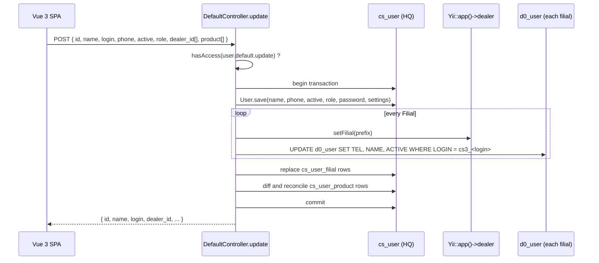
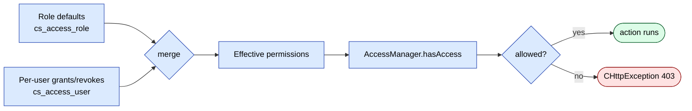

# sd-cs `user` module

The `user` module owns identity and access control on the HQ side. It
manages the `cs_user` table, handles login, exposes a role-and-permission
editor wired to `AccessManager`, and - critically - keeps every dealer's
`d0_user` row in sync with the HQ user record so the same operator can
log into both surfaces with one credential.

Four controllers, fourteen actions total. The login path is conventional
Yii cookie-session auth; everything else is gated by `AccessManager`
permission strings.

## Key features

| Feature | What it does | Owner role(s) |
|---|---|---|
| Cookie-session login | LoginForm + UserIdentity; supports remember-me up to 60 days | any |
| HQ user CRUD | List, create, update, delete users (`cs_user`) plus dealer-side mirror write-through | admin |
| Dealer fan-out | Every update propagates name/phone/active to every dealer's `d0_user` row (matched by `cs3_<login>`) | admin |
| Filial assignment | Many-to-many user-to-filial via `cs_user_filial`; per-user product allow-list via `cs_user_product` | admin |
| Per-user permission override | `AccessUser` records can grant or revoke specific permissions on top of the role default | admin |
| Role permission editor | UI-driven matrix of role + permission key; persists into `cs_access_role` | admin |
| Profile self-edit | Any logged-in user can update their own name, phone, and password | any |
| V2 / Vue 3 layout entry | Optional Vue 3 SPA entry alongside the legacy server-rendered list | admin |
| Cron view stub | `CroneController::index` renders a view used by a scheduled diagnostic job | system |

## Folder

```
protected/modules/user/
  controllers/
    CroneController.php       (1 action)
    DefaultController.php     (8 actions)
    LoginController.php       (2 actions)
    RoleController.php        (3 actions)
  models/
    User.php                  # cs_user
    UserFilial.php            # cs_user_filial
    UserProduct.php           # cs_user_product
    AccessUser.php            # cs_access_user (per-user overrides)
    AccessRole.php            # cs_access_role (role defaults)
    UserIdentity.php          # Yii identity class
    LoginForm.php
  components/
    AccessManager.php         # central permission map, Yii application component
  views/
    default/                  # legacy server-rendered list, create, update
    login/
    role/
    crone/
```

## Controllers

| Controller | Purpose | Actions | Auth |
|---|---|---|---|
| `LoginController` | Login form + test stub | `index` (handles login form GET/POST), `actionTest` (dumps `Yii::app()->user`) | guest-allowed (`checkIsGuest = false`); login posts redirect when already authenticated |
| `DefaultController` | HQ user CRUD + permission management | `v2`, `list`, `index`, `update`, `getAccess`, `setAccess`, `delete`, `profile` | `AccessManager::hasAccess('user.default.*')` except `profile` (any session) and `delete`/`setAccess` (admin-only via `Yii::app()->user->isAdmin()`); `$allowedActions = ['profile', 'v2', 'list', 'update']` permits anonymous-route framework access for AJAX |
| `RoleController` | Role permission matrix editor | `index` (render view), `list` (AJAX payload), `update` (persist `AccessRole` rows) | `$allowedActions = ['list']`; `update` typically gated upstream to admin |
| `CroneController` | Renders the view used by a recurring diagnostic page | `index` | None (intended to be called by an internal scheduler that runs an authenticated curl) |

### `LoginController` actions

| Action | Method | What it does |
|---|---|---|
| `actionIndex` | GET, POST | GET renders the login form. POST validates `LoginForm`, runs `UserIdentity::authenticate`, sets remember-me duration (60 days if `rememberMe`), redirects to `/site/index`. Returns `Yii::app()->ajax->success/failure` for XHR clients |
| `actionTest` | GET | Prints `Yii::app()->user` for diagnostics. Should not be enabled in production |

Notes:
- `checkIsGuest = false` keeps the framework from forcing a redirect to
  login for guests on this controller.
- `checkAccess = false` skips `AccessManager` for the whole controller.
- The remember-me duration is `3600 * 24 * 60` seconds.

### `DefaultController` actions

| Action | Method | Permission gate | What it does |
|---|---|---|---|
| `actionV2` | GET | `user.default.index` | Renders the Vue 3 SPA shell (`//frontend/pages/user/index`) under the `vue3-layout` |
| `actionList` | XHR (POST/GET) | `user.default.index` | Returns the JSON payload for the SPA - users joined with filial, role, products, settings |
| `actionIndex` | GET | (none enforced - reachable via `allowedActions`) | Legacy server-rendered list view |
| `actionUpdate` | POST | `user.default.create` if no `id`, else `user.default.update` | Insert or update one user. Writes `cs_user`, replaces `cs_user_filial`, syncs `cs_user_product` deltas, then propagates `name`, `phone`, `active` to every dealer's `d0_user` row keyed by `cs3_<login>`. Wrapped in a transaction |
| `actionGetAccess` | XHR | (none explicit; relies on session) | Computes effective permission set for a user as `role_defaults UNION user_grants MINUS user_revokes` |
| `actionSetAccess` | XHR | `Yii::app()->user->isAdmin()` | Persists per-user overrides into `cs_access_user`. Iterates `AccessManager::$accesses` to ensure every permission key has a row |
| `actionDelete` | XHR | `Yii::app()->user->isAdmin()` | Deletes a user. Refuses to delete `ROLE_ADMIN` accounts |
| `actionProfile` | XHR | (any logged-in user) | Updates own `name`, `phone`, `password` via `Yii::app()->user->profile` |

### `RoleController` actions

| Action | Method | What it does |
|---|---|---|
| `actionIndex` | GET | Renders the role x permission matrix view |
| `actionList` | XHR | Returns the matrix data: roles, full permission tree (grouped by `module.controller`), and current per-role grants. Filters out tenant-specific keys (e.g. `report.nmedov.index` is hidden unless the host matches a tenant whitelist) |
| `actionUpdate` | XHR | Persists the matrix. For every role, sets `cs_access_role.access` to 1 or 0 for each known permission key |

### `CroneController` actions

| Action | What it does |
|---|---|
| `actionIndex` | Renders `crone/index` - a stub view used by a scheduled job to render system status into a fetchable page |

## Notable workflows

### HQ user save propagating to every dealer



The match key on the dealer side is `LOGIN = "cs3_<login>"` - any HQ user
who needs dealer-side access must already have a `d0_user` row with that
prefixed login, created during onboarding.

### Permission resolution at request time



## Cross-module touchpoints

- **Every other sd-cs module** calls
  `Yii::app()->accessManager->hasAccess('<module>.<controller>.<action>')`
  in its action handlers. The permission strings the editor manipulates
  are precisely the keys those modules check.
- **`api3/ManagerController`** authenticates mobile callers against
  `cs_user.phone` and reuses `UserIdentity` to start a Yii session on
  behalf of the manager - see [api3 module](./api3.md).
- **`api/V2Controller`** does its own bcrypt/md5 verification against
  `cs_user.hash` + `cs_user.dealer_password`, bypassing `UserIdentity`.
  Both flows are documented in [api module](./api.md).
- **dealer `d0_user` table** is written from `actionUpdate`. The write
  uses the canonical `setFilial(prefix)` + `Yii::app()->dealer` pattern.
  See [sd-cs - sd-main integration](../sd-main-integration.md).
- **`cs_user_product`** restricts which catalog products a user sees in
  reports - referenced from the `report` module.

## Gotchas

- **`actionUpdate` writes to every dealer**, even when the only field
  changing is `password` - the dealer-side UPDATE only syncs `TEL`,
  `NAME`, `ACTIVE`. Password changes therefore only land on the HQ side
  unless the dealer login is rotated through onboarding scripts.
- **`actionTest` is a debug dump.** `LoginController::actionTest` echoes
  the entire `Yii::app()->user` object. Remove or gate before deploying
  to a public host.
- **No throttling on login.** `LoginController::actionIndex` accepts
  unlimited POSTs. Brute-force protection lives at the reverse proxy.
- **`allowedActions` is not a permission check.** It tells the parent
  `Controller` filter chain that the action does not require a session,
  not that the action is safe to call anonymously. `actionList` and
  `actionUpdate` are listed there for AJAX routing, but each enforces
  permissions in the action body.
- **`isAdmin()` is the only gate on `delete` and `setAccess`.** The
  permission editor cannot revoke those for an admin - they are
  hard-coded to the admin role.
- **Tenant-specific permission keys** (e.g. `report.nmedov.index`) are
  hidden from the role editor unless the host matches a whitelist
  inside `RoleController::buildIndexData`. Adding a new tenant means
  patching that whitelist.
- **Profile password update writes through `Yii::app()->user->profile`**
  and saves the full `User` model. If `User::beforeSave()` rehashes the
  password, you get a hash; if not, you get plaintext. Verify before
  relying on either.

## See also

- [api module](./api.md) - V2Controller mobile auth against `cs_user`
- [api3 module](./api3.md) - phone-based manager-app login
- [sd-cs - sd-main integration](../sd-main-integration.md) - `d0_user`
  write-through detail
- [Security - auth and roles](../../security/auth-and-roles.md)
- [Security - RBAC](../../security/rbac.md)
- [Security - sessions](../../security/sessions.md)
