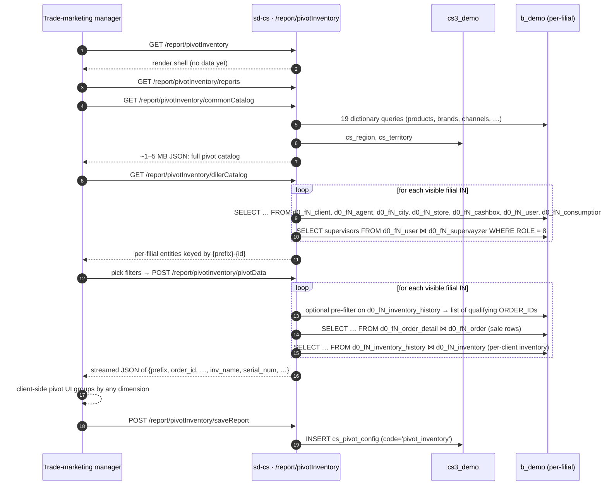

# Pivot inventory

## Purpose

Answers *"across every dealer filial, which clients have which pieces
of branded equipment (fridges, racks, dispensers) installed, and what
did those clients buy during the period the equipment was on site?"*
This is the largest controller in the `report` module (973 lines, 22
actions) because it both ships a custom client-side pivot UI and
serves the data feeds, the catalog dictionaries, the saved-report
CRUD, and a companion dashboard.

## Who uses it

| Role | What they do here |
|------|-------------------|
| Trade-marketing manager | Builds custom pivots of inventory vs. sales |
| Regional supervisor | Spots filials where equipment was placed but no sales followed |
| Country manager | Saves and re-runs canonical reports (e.g. *Fridges Q4*) |

The full action list — 22 entries — is registered in
`PivotInventoryController::$allowedActions` (lines 6-7) and bypasses
the page-level access check; `actionIndex` and `actionDashboard` are
gated by RBAC under `report.pivot_inventory.*`.

## Where it lives

| | |
|---|---|
| URL | `/report/pivotInventory` (pivot UI), `/report/pivotInventory/dashboard` (dashboard UI) |
| Controller | [`protected/modules/report/controllers/PivotInventoryController.php`](https://github.com/salesdoctor/sd-cs/blob/master/protected/modules/report/controllers/PivotInventoryController.php) (973 lines) |
| Index view | `protected/modules/report/views/pivotInventory/index.php` |
| Dashboard view | `protected/modules/report/views/pivotInventory/dashboard.php` |
| Connection | `Yii::app()->dealer` (the `b_*` warehouse) |
| Saved-report code | `pivot_inventory` (see `PivotConfig.code`) |

## The 22 actions

The controller is best read as four sub-controllers sharing an
authentication surface and the `getOwnModels()` loop pattern.

### UI entry points (2)

| Action | What it does |
|--------|--------------|
| `actionIndex` | Render the pivot UI (`views/pivotInventory/index.php`) |
| `actionDashboard` | Render the dashboard UI (`views/pivotInventory/dashboard.php`) |

### Catalog feeds (12)

These are pure dictionary endpoints — they read dealer-global tables
(no per-filial loop) and return JSON arrays. All are GET-callable
and unauthenticated (via `$allowedActions`).

| Action | Source table | Notes |
|--------|--------------|-------|
| `actionCommonCatalog` | `d0_product`, `d0_product_category`, `d0_product_subcategory`, `d0_product_group`, `d0_adt_brand`, `d0_adt_producer`, `d0_adt_segment`, `d0_adt_property`, `d0_product_case_type`, `d0_price_type`, `d0_currency`, `d0_client_channel`, `d0_client_category`, `d0_client_type`, `cs_region`, `cs_territory`, `d0_skidka`, `d0_inventory_type`, `d0_units`, plus the `BaseModel::getOwnModels()` dealer list | The single mega-fetch that drives the client-side pivot |
| `actionDilerCatalog` | `d0_fN_client`, `d0_fN_agent`, `d0_fN_city`, `d0_fN_store`, `d0_fN_cashbox`, `d0_fN_user`, `d0_fN_consumption_parent`, `d0_fN_consumption_child`, `d0_fN_supervayzer` | Per-filial dictionaries with `{prefix}-{id}` composite keys |
| `actionFilials` | `BaseModel::getOwnModels()` | Dropdown list of visible filials |
| `actionInventoryTypes` | `d0_inventory_type (ACTIVE='Y')` | Branded-equipment types |
| `actionProductCats` | `d0_product_category (ACTIVE='Y')` | Filtered by `UserProduct.getUserRestrictions()` |
| `actionProductGroups` | `d0_product_group` | Unfiltered |
| `actionProductSubcats` | `d0_product_subcategory (ACTIVE='Y')` | Unfiltered |
| `actionClientCats` | `d0_client_category (ACTIVE='Y')` | Client categories |
| `actionClientChannels` | `d0_client_channel` | Channels |
| `actionUnits` | `d0_units (ACTIVE='Y')` | Units of measure |
| `actionProducts` | `d0_product (ACTIVE='Y')` minus `UserProduct.findByUser(..,3)` | Product master list |
| `actionTerritories` | `cs_territory` | Cross-DB read from `cs3_demo` |
| `actionRegions` | `cs_region` | Cross-DB read from `cs3_demo` |

### Data feeds (4)

These are the heavy SQL streamers. All read the dealer DB
(`Yii::app()->dealer`) and loop over `BaseModel::getOwnModels()`,
performing one SQL per filial.

| Action | Returns | Key SQL shape |
|--------|---------|---------------|
| `actionPivotData` | Order-line rows (or no-sale client rows) decorated with inventory metadata, streamed as a JSON array | `d0_fN_order_detail ⋈ d0_fN_order` filtered by `STATUS IN (2,3)`, `TYPE=1`, `COUNT > 0`; outer-joined with `d0_fN_inventory_history` for `INV_NAME` / `SERIAL_NUM` / `DATE_FROM/TO` per `(CLIENT_ID, INV_TYPE_ID)` |
| `actionDashboardData` | Compact `[prefix, summa, count, product_id, client_id]` rows for the dashboard widgets | Same join shape as `pivotData` but only sale rows; minimal columns |
| `actionOkb_inv` | `{okb, inv: {type: {count, group_id}}, groups}` snapshot for the dashboard's coverage card | `COUNT(DISTINCT visit.CLIENT_ID)` from `d0_fN_visit` plus `COUNT(INVENTORY_ID)` from `d0_fN_inventory` |
| `actionCategoryData` | `{categoryId: {date: summa}}` for the dashboard's category trend chart | Like `pivotData` but groups by `PRODUCT_CAT × DATE(order.DATE)`; auto-switches `%Y-%m-%d` → `%Y-%m` bucketing when the date range exceeds 31 days |

### Saved-report CRUD (2)

| Action | What it does |
|--------|--------------|
| `actionReports` | List saved configurations (`PivotConfig.code = 'pivot_inventory'`) |
| `actionSaveReport` | Insert / update a `PivotConfig` row (named template) |
| `actionDeleteReport` | Hard-delete a saved configuration by id |

(There are technically three CRUD actions; the table is broken out
this way to highlight that delete is also in `$allowedActions`.)

## Workflow

1. User opens `/report/pivotInventory`. The page is a thin shell;
   the heavy work is the three follow-up XHRs (catalog, dealer-
   catalog, pivot data).
2. `actionCommonCatalog` is called once on page load and downloads
   the entire dealer-global catalog as one JSON blob — products,
   categories, brands, channels, currencies, etc. — plus
   `cs_region` / `cs_territory` cross-fetched from `cs3_demo`.
3. `actionDilerCatalog` is called once on page load and loops every
   visible filial, prefixing each entity id with `{prefix}-` so the
   client can globally identify any row (e.g. `f1-c123`).
4. When the user applies filters and clicks *Run*,
   `actionPivotData` streams the merged sale × inventory rows. If
   `inventoryTypes` is set, the controller first issues a pre-
   filter SQL to scope the order list to clients that had that
   equipment installed during the period.
5. `saleField == 2` switches the report to *"clients with
   equipment but no sales"* — useful for spotting placement
   failures. The output schema changes from order-detail to
   client-only.
6. The user can save the current filter / row / column / measure
   configuration into `cs_pivot_config` via `actionSaveReport`;
   `actionReports` lists them back; `actionDeleteReport` hard-
   deletes.

## Rules

- **Date range cap** — `actionPivotData` rejects periods > 93 days
  with HTTP 400. `actionCategoryData` accepts longer ranges but
  silently downgrades the bucket from day to month.
- **Date field** — one of `date` (`DATE`), `date_load`
  (`DATE_LOAD`), `date_deliver` (`DATE_DELIVERED`). The
  `foreach (… as $key => $value) { if (isset($object->dateField)) { … break; }}` loop
  always takes the first iteration regardless of `dateField`
  value — this is a latent bug that only happens to work because
  `DATE` is the most common choice.
- **`UserProduct` blacklist** is applied in `actionPivotData`,
  `actionDashboardData`, `actionCategoryData`, `actionProducts`,
  and `actionProductCats`. Other catalog endpoints expose every
  row.
- **Filial filter** — `$object->filials` is a CSV; empty means
  "all visible". The per-filial loop skips filials whose id is
  not in the list when the list is non-empty.
- **Territory filter** — `$object->territory != 0` further
  narrows the loop by `filial.detail.territory_id`.
- **Client filter** — the `$object->clients` array entries are
  `{prefix}-{client_id}`; the controller splits them and only
  fetches clients per filial whose prefix matches.
- **`for_sale` vs `inventory`** — when `inventoryTypes` is empty,
  the SQL uses `WHERE order.{dateField} BETWEEN … AND order.TYPE=1
  AND order.STATUS IN (2,3)`. When non-empty, the pre-filter
  scopes to clients with matching inventory installed in the
  period, and the main SQL adds `order.ORDER_ID IN (…)`.
- **Without-sale mode** (`saleField == 2`) — the second branch of
  `actionPivotData` instead fetches `(CLIENT_ID)` from
  `d0_fN_inventory_history ⋈ d0_fN_client` filtered by
  inventory type and client category, then **removes** any client
  that has at least one order, producing the no-sale list.
- **Inventory metadata join** — every row is back-filled from the
  `(CLIENT_ID, INV_TYPE_ID)`-grouped inventory map with
  `INV_NAME`, `SERIAL_NUM`, `INV_NO`, `DATE_FROM`, `DATE_TO`. If
  the client has no inventory in the period, `INV_NAME` becomes
  `"Без название"` (sic).
- **Saved configuration code** — `PivotConfig.code = 'pivot_inventory'`
  is the constant key. Saving with a different code (or via
  another controller) makes the report invisible.

## Performance notes

- **Catalog payload is large.** `actionCommonCatalog` returns a
  multi-megabyte JSON blob for any organization with thousands
  of products. The endpoint runs ~19 sequential SELECTs against
  `Yii::app()->dealer` plus two against `cs3_demo`.
- **`actionDilerCatalog` is O(filials × 8 SELECTs).** For a
  20-filial org that's 160 queries on every page load. There is
  no caching; users who refresh frequently will see slow page
  loads.
- **`actionPivotData` issues at most three SQLs per filial** —
  the optional pre-filter, the main SELECT, and the inventory
  metadata SELECT. With 20 filials and `inventoryTypes` set this
  is 60 queries. The result is streamed so the client can begin
  pivoting while the server is still iterating.
- **`actionCategoryData` 31-day rule** — the comment about
  rejecting long ranges is *commented out*; the controller
  silently switches to monthly bucketing at day 32. The pivot UI
  caches results per (filter, bucket) so the user must clear the
  pivot to re-run with the larger range.

## Data sources

| Schema | Table | Why it's read |
|--------|-------|---------------|
| `cs3_demo` | `cs_user_filial` | Filial-visibility ACL for non-admins |
| `cs3_demo` | `cs_region`, `cs_territory` | Catalog feeds (cross-DB) |
| `cs3_demo` | `cs_pivot_config` | Saved configurations (`code='pivot_inventory'`) |
| `b_demo` | `d0_filial` | Tenant registry — prefix, `active`, `xml_id` |
| `b_demo` | `d0_product`, `d0_product_category`, `d0_product_subcategory`, `d0_product_group`, `d0_adt_*`, `d0_product_case_type`, `d0_price_type`, `d0_currency`, `d0_client_*`, `d0_skidka`, `d0_inventory_type`, `d0_units` | Catalog feeds (dealer-global) |
| `b_demo` | `d0_fN_order`, `d0_fN_order_detail` | Sales rows in `pivotData` / `dashboardData` / `categoryData` |
| `b_demo` | `d0_fN_inventory`, `d0_fN_inventory_history` | Per-client equipment timeline |
| `b_demo` | `d0_fN_client`, `d0_fN_agent`, `d0_fN_city`, `d0_fN_store`, `d0_fN_cashbox`, `d0_fN_user`, `d0_fN_consumption_*`, `d0_fN_supervayzer` | Per-filial dictionaries |
| `b_demo` | `d0_fN_visit` | `OKB` count in `actionOkb_inv` |

For the column reference, see [data schemes](../data-schemes.md).

## Gotchas

- **Server streams JSON manually.** `actionPivotData` /
  `actionDashboardData` `echo` a `"["` header, then `","+row` per
  match, then a `"]"` close. Front-end clients must await the
  full response before parsing.
- **Inventory `DATE_TO IS NULL`** is treated as "still installed",
  which is correct, but a stale row from a closed account will
  still match. Trace mismatches back to `d0_fN_inventory_history`
  before assuming the report is wrong.
- **`actionCommonCatalog` is unauthenticated except for
  page-level RBAC.** Any user with `report.pivot_inventory.index`
  can dump the full product catalog. Treat the catalog endpoint
  as a public-to-org surface.
- **`{prefix}-{id}` is the canonical client / agent identifier.**
  Forgetting the prefix when crafting custom filter calls returns
  zero rows silently — the per-filial filter falls through.
- **Save / delete are unauthenticated.** Both `actionSaveReport`
  and `actionDeleteReport` are in `$allowedActions` and have no
  ownership check on `cs_pivot_config`; any logged-in user can
  delete any saved report.
- **No paging.** Large pivots can return tens of thousands of
  rows. The client-side pivot UI caches them in memory; browser
  tabs OOM if a country manager picks a year-long range over an
  unfiltered org.

## See also

- [sd-cs architecture](../architecture.md) — two-DB model and
  `setFilial()` mechanism.
- [report · Inventory](./report-inventory.md) — single-screen
  inventory placement count + scan timeline (no pivot UI).
- [`PivotInventoryController.php` source](https://github.com/salesdoctor/sd-cs/blob/master/protected/modules/report/controllers/PivotInventoryController.php) — full controller (973 lines).
