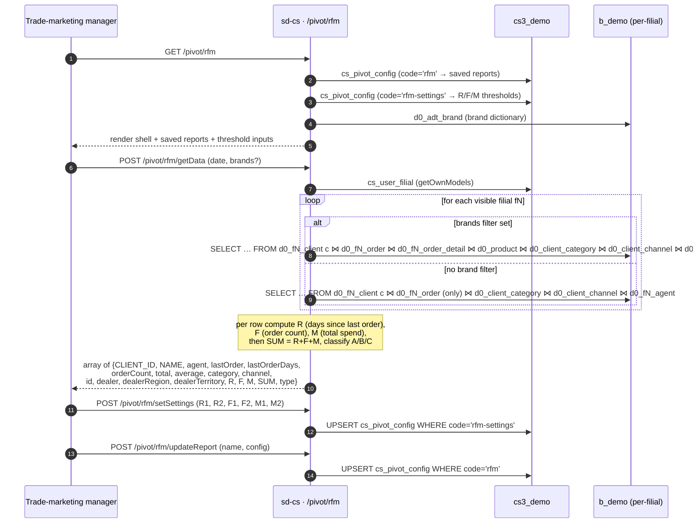

# RFM pivot

## Purpose

Answers *"across every dealer filial, group every client into one of
three Recency × Frequency × Monetary buckets and score them A / B / C
so trade-marketing can target re-activation, retention, and reward
campaigns separately."* The RFM pivot is the canonical client-
segmentation view at HQ — it consolidates per-filial order history
into a single classified client list, with the R/F/M thresholds
configurable per organisation.

## Who uses it

| Role | What they do here |
|------|-------------------|
| Trade-marketing manager | Targets *C-grade lapsed* clients with re-activation campaigns |
| Country manager | Tracks the A-grade share month over month |
| Sales-ops analyst | Saves filter / dimension layouts as named pivot configurations |

Five endpoints (`getData`, `getFilials`, `updateReport`,
`deleteReport`, `setSettings`) are listed in
`RfmController::$allowedActions` (line 5) and bypass the page-level
access check; `actionIndex` is gated by RBAC under `pivot.rfm.*`.

## Where it lives

| | |
|---|---|
| URL | `/pivot/rfm` |
| Controller | [`protected/modules/pivot/controllers/RfmController.php`](https://github.com/salesdoctor/sd-cs/blob/master/protected/modules/pivot/controllers/RfmController.php) (240 lines) |
| Index view | `protected/modules/pivot/views/rfm/index.php` |
| Connection | `Yii::app()->dealer` (the `b_*` warehouse) |
| Saved-report code | `rfm` (data) / `rfm-settings` (thresholds) |

## The 6 actions

| Action | Purpose |
|--------|---------|
| `actionIndex` | Render the pivot view with saved reports, current R/F/M thresholds, and brand dictionary |
| `actionGetFilials` | Visible filials filtered by group / user (used by client-side filter form) |
| `actionGetData` | Per-filial client aggregation, R/F/M scoring, A/B/C classification |
| `actionUpdateReport` | Save / update a named pivot configuration (`PivotConfig.code = 'rfm'`) |
| `actionDeleteReport` | Hard-delete a saved configuration by id |
| `actionSetSettings` | Persist the R/F/M thresholds as `PivotConfig.code = 'rfm-settings'` |

Per-filial models read here: `Order`, `OrderDetail` (when brand
filter is set), `Agent`, `Client` — all addressed via
`setFilial($prefix)`.

Dealer-global models read here: `ClientCategory`, `ClientChannel`,
`Product` (only when brand filter is set), `AdtBrand`.

Control-plane models read here: `FilialGroup`, `UserFilial`,
`PivotConfig`.

## Workflow

1. User opens `/pivot/rfm`. The page loads saved reports, the
   active R/F/M thresholds, and the brand dictionary.
2. User picks a date range and optional brand filter; pressing
   *Apply* POSTs to `/pivot/rfm/getData`.
3. For every visible filial:
   - When brands are set, the SQL joins through
     `d0_fN_order_detail ⋈ d0_product` so the totals only include
     order lines for the chosen brands. The `total` column uses
     `SUM(ord.SUMMA)` from order details, and `average` is
     `SUM/COUNT(DISTINCT ORDER_ID)`.
   - When brands are *not* set, the SQL uses `order.SUMMA`
     directly (faster — no `order_detail` / product join) and
     `average` is `AVG(order.SUMMA)`.
   - Both shapes group by `client.CLIENT_ID` so each client
     appears once per filial.
4. PHP iterates each client row and scores it:
   - `R` (recency) — `1` if `lastOrderDays ≤ R1`, `2` if `≤ R2`,
     else `3`.
   - `F` (frequency) — `3` if `orderCount < F2`, `2` if `≤ F1`,
     else `1`.
   - `M` (monetary) — `3` if `total ≤ M1`, `2` if `≤ M2`, else
     `1`.
   - `SUM = R + F + M`; classification `A` for `SUM ≤ 5`, `B`
     for `≤ 7`, else `C`.
5. The row is decorated with the filial id, name, region and
   territory before being merged into the response array.
6. Users can save the current pivot layout as a `PivotConfig` row
   with `code='rfm'` (via `actionUpdateReport`) or update the
   org-wide R/F/M thresholds (via `actionSetSettings`).

## Rules

- **Date filter applies to `order.DATE_LOAD`** and uses
  `STATUS IN (2,3)` and `TYPE = 1` — only confirmed sale orders
  count for frequency and monetary.
- **`lastOrderDays`** is computed in SQL via
  `DATEDIFF(date[1], MAX(order.DATE_LOAD))`. The recency baseline
  is the *end* of the requested period, not today — so re-running
  yesterday's report tomorrow will not shift the R scores.
- **Default thresholds** are written into `getSettings()` when no
  `rfm-settings` row exists:
  - `R1 = 30`, `R2 = 90` (days)
  - `F1 = 4`, `F2 = 2` (orders)
  - `M1 = 50,000,000`, `M2 = 100,000,000` (UZS, by convention)
- **Threshold ordering is inverted between R and F**: low recency
  (recent) is good (`R=1`), but low frequency is bad (`F=3`). The
  classification rule (A = SUM ≤ 5) only works when the rules are
  read in that direction; flipping any threshold's polarity breaks
  the A/B/C semantics.
- **Brand filter applies to order *lines*, not orders.** When
  `brands` is set, only the matching lines contribute to `total`,
  but `orderCount` still counts the distinct parent orders that
  contain at least one matching line. A client who bought 1 line
  of a target brand plus 9 lines of other brands counts as 1 order
  with the brand's revenue only.
- **Saved-report code split** — `rfm` is the named pivot layout
  (row / column / measure choices), `rfm-settings` is the
  thresholds singleton. `actionSetSettings` uses
  `findByAttributes(['code' => 'rfm-settings'])` and upserts.
- **Visible filials** — `actionGetData` uses
  `BaseModel::getOwnModels()` (default `activeOnly=true`); the
  client-side filter form uses `actionGetFilials`, which also
  filters by `FilialGroup.group_id` and (for non-admins) by
  `UserFilial`.

## Scoring matrix

The 3×3×3 RFM cube collapses to A/B/C using `SUM = R + F + M`:

| R+F+M | Classification | Interpretation |
|-------|----------------|----------------|
| 3 (best) | A | Recent, frequent, high-spend — VIP |
| 4 | A | One dimension below ideal |
| 5 | A | Two dimensions below ideal |
| 6 | B | Mid-tier across all dimensions |
| 7 | B | Likely retention candidate |
| 8 | C | At-risk — likely re-activation needed |
| 9 (worst) | C | Lapsed — no orders, low spend |

See [RFM concept](../../concepts/rfm.md) for the long-form
explanation and campaign-targeting playbook.

## Data sources

| Schema | Table | Why it's read |
|--------|-------|---------------|
| `cs3_demo` | `cs_user_filial` | Filial-visibility ACL for non-admins |
| `cs3_demo` | `cs_filial_group` | Group-filter dimension in `actionGetFilials` |
| `cs3_demo` | `cs_pivot_config` | Saved layouts (`code='rfm'`) + thresholds (`code='rfm-settings'`) |
| `b_demo` | `d0_filial` | Tenant registry — prefix, `active` |
| `b_demo` | `d0_client_category`, `d0_client_channel` | Category / channel labels per client |
| `b_demo` | `d0_adt_brand` | Brand dictionary in the filter form |
| `b_demo` | `d0_product` | Joined when brand filter is set |
| `b_demo` | `d0_fN_client` | Client master (source of one row per client) |
| `b_demo` | `d0_fN_order` | Order header — STATUS, TYPE, DATE_LOAD, SUMMA |
| `b_demo` | `d0_fN_order_detail` | Only joined when brand filter is set |
| `b_demo` | `d0_fN_agent` | Agent name attached to each client row |

For the column reference, see [data schemes](../data-schemes.md).

## Gotchas

- **Brand-filtered `total` and unfiltered `total` are not
  comparable.** Switching the brand filter changes the SQL shape
  from order-summa to order-detail-summa; the same client will
  show different M values, which can flip them across the A/B/C
  boundary.
- **`PivotConfig` has no ownership check.** `actionUpdateReport`
  and `actionDeleteReport` are in `$allowedActions` and any logged-
  in user can overwrite or delete any saved RFM report. Treat
  saved reports as shared org state.
- **Thresholds are org-wide.** `actionSetSettings` updates the
  single `rfm-settings` row. Two users editing thresholds at the
  same time will lose the earlier update silently (last write
  wins).
- **`DATEDIFF` with an empty `date[1]`** defaults to today
  23:59:59, but `lastOrderDays` for a client who hasn't ordered in
  the period at all is `NULL`, which compares as `<= R1` in PHP
  (because `null <= 30` is `true` in loose comparison). Such
  clients get `R=1`. If you see suspiciously many A-grade clients,
  check for those with `lastOrder=null`.
- **No pagination.** Large orgs (50k+ clients) return a single
  multi-megabyte response. The pivot UI keeps everything in
  memory.

## See also

- [RFM concept](../../concepts/rfm.md) — the scoring rules and
  campaign-targeting playbook.
- [sd-cs architecture](../architecture.md) — two-DB model and
  `setFilial()` mechanism.
- [pivot · AKB / OKB](./pivot-akb.md) — sibling pivot with the
  same `cs_pivot_config` save mechanism.
- [`RfmController.php` source](https://github.com/salesdoctor/sd-cs/blob/master/protected/modules/pivot/controllers/RfmController.php) — full controller (240 lines).
