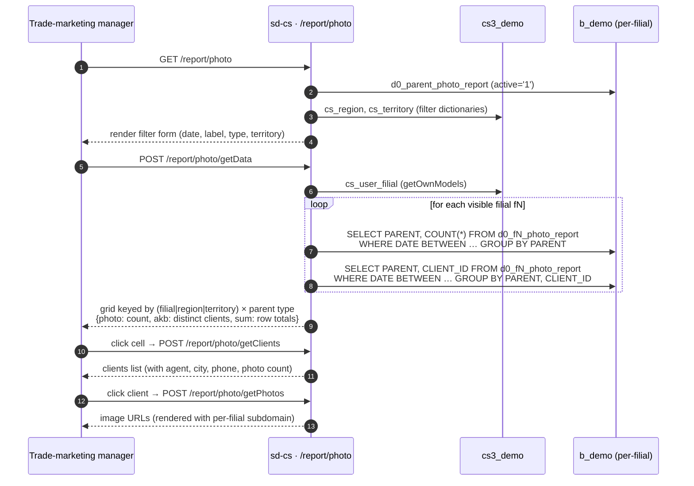

# Photo report

## Purpose

Answers *"how many merchandising photos were taken by agents across
every dealer filial in a period, how many distinct buying clients did
they cover, and what is the photo-coverage split per
`PhotoReportCategory` (parent type) per filial / region / territory?"*
The Photo report rolls up the visit-time photo evidence — fridges,
shelves, POS displays — so HQ can audit field execution without
opening every filial's mobile app.

## Who uses it

| Role | What they do here |
|------|-------------------|
| Trade-marketing manager | Counts photos per category to verify campaign coverage |
| Regional supervisor | Drills per-filial / per-agent to spot missing photo evidence |
| Audit / compliance | Pulls the image gallery for a given client × period |

Three endpoints (`getData`, `getClients`, `getPhotos`) are listed in
`PhotoController::$allowedActions` (line 5) and bypass the page-level
access check; `actionIndex` is gated by RBAC.

## Where it lives

| | |
|---|---|
| URL | `/report/photo` |
| Controller | [`protected/modules/report/controllers/PhotoController.php`](https://github.com/salesdoctor/sd-cs/blob/master/protected/modules/report/controllers/PhotoController.php) (236 lines) |
| Index view | `protected/modules/report/views/photo/index.php` |
| Connection | `Yii::app()->dealer` (the `b_*` warehouse) |
| Image host | `https://{filial.domain}.salesdoc.io` (per-filial subdomain, written into the `src` URL by `actionGetPhotos`) |
| Saved-report code | *not used* |

Five actions:

| Action | Purpose |
|--------|---------|
| `actionIndex` | Render filter form with regions, territories, photo types |
| `actionGetData` | Aggregate photo + AKB counts by filial / region / territory × PhotoReport parent type |
| `actionGetClients` | Drill-down: clients (with city, agent, phone) for a given filial × type × period |
| `actionGetFilials` | Return visible filials filtered by country / group / territory / user |
| `actionGetPhotos` | Return image URLs for a given filial × type × agent × client × period |

Per-filial models read here: `PhotoReport`, `User`, `Client`, `City`
— all addressed via `setFilial($prefix)`.

Dealer-global models read here: `ParentPhotoReport`
(`d0_parent_photo_report`), `InventoryType` (used by the drill-down
to label categories), `Region`, `Territory`.

## Workflow

1. User opens `/report/photo`. Page loads regions, territories,
   and the list of `ParentPhotoReport` types (these are the audit
   categories — fridge, shelf, POS, etc.).
2. User picks date range, optional photo-type, optional territory,
   and a `label` (group-by) value; pressing *Apply* POSTs to
   `/report/photo/getData`.
3. For every visible filial:
   - The first SQL counts photo rows grouped by `PARENT` (photo
     type) inside the date range.
   - The second SQL counts distinct `(PARENT, CLIENT_ID)` pairs
     — this is the per-type AKB for the period.
   - PHP merges the two into `data[key][parent_id] = {photo, akb}`
     where `key` is filial-id, region-id, or territory-id depending
     on `label`.
4. The per-row `sum.photo` is computed by iterating all parent
   types and summing their `photo` counts; AKB is the distinct
   client count seen in the AKB pass.
5. Clicking a cell triggers `actionGetClients`, which joins
   `d0_fN_photo_report ⋈ d0_fN_user ⋈ d0_fN_client ⋈ d0_fN_city`
   to expose agent name, agent id, client name, telephone, city
   (territory), and photo count, grouped by `(USER_ID, CLIENT_ID)`.
6. Clicking a client triggers `actionGetPhotos`, which selects the
   raw `PR_ID` + `URL` rows. The `URL` column is relative; the
   server interpolates `https://{$filial->domain}.salesdoc.io` in
   front so the front-end can `` directly without knowing
   the filial.

## Rules

- **Visible filials** come from `BaseModel::getOwnModels()` — admin
  sees all active, non-admins see the `cs_user_filial` subset.
- **`label` (group-by)**:
  - `0` → group by filial id (the default; most common HQ view).
  - `1` → group by `filial.detail.territory.region_id`.
  - else → group by `filial.detail.territory_id`.
  Filials without an assigned territory are silently skipped when
  `label != 0`.
- **`territory` filter** narrows the per-filial loop further: when
  set, only filials whose `territory_id` matches contribute.
- **Date filter** applies to `photo_report.DATE`. Empty `date[0]`
  defaults to today 00:00:00; empty `date[1]` defaults to today
  23:59:59 (coerced through `strtotime`).
- **Photo-type filter** (`params->type`) overrides the default
  `ACTIVE='1'` selector — only types matching `PR_CAT_ID = type`
  are kept in the loop. The two main SQLs do not filter by type
  themselves; the type filter applies only to the dictionary used
  for zero-padding result rows.
- **AKB-distinct semantics**: the second SQL groups by
  `(PARENT, CLIENT_ID)` so each client contributes one AKB row per
  type. PHP then `countClient[client_id] = 1` builds a per-filial
  distinct-client count regardless of type, exposed as `sum.akb`.
- **Zero-padding**: for every `ParentPhotoReport.PR_CAT_ID` not
  represented in the per-filial result, the row is back-filled
  with `{photo: 0, akb: 0}` so the front-end grid has uniform
  column counts.
- **Photo URL rewrite**: `actionGetPhotos` concatenates
  `'https://' + filial.domain + '.salesdoc.io'` to the stored
  `URL` column. If `filial.domain` is empty, the resulting URL is
  malformed — there is no fallback.
- **`actionGetFilials` is the canonical filial dictionary** for
  the photo report; it intersects `cs_user_filial`, `cs_group`,
  `cs_territory`, and `cs_region.country_id`, so the dropdown shows
  only filials visible to the current user and matching the
  selected country / group / territory.

## Data sources

| Schema | Table | Why it's read |
|--------|-------|---------------|
| `cs3_demo` | `cs_user_filial` | Filial-visibility ACL for non-admins |
| `cs3_demo` | `cs_filial_detail`, `cs_territory`, `cs_region` | Group-by keys (region / territory) |
| `cs3_demo` | `cs_filial_group` | Group-filter dimension in `actionGetFilials` |
| `b_demo` | `d0_filial` | Tenant registry — provides prefix, `domain`, `active` |
| `b_demo` | `d0_parent_photo_report` | Photo-type dictionary (column headers + zero-padding) |
| `b_demo` | `d0_fN_photo_report` | Raw photo log: `DATE`, `PARENT`, `CLIENT_ID`, `USER_ID`, `URL` |
| `b_demo` | `d0_fN_user` | Agent display name in `actionGetClients` |
| `b_demo` | `d0_fN_client` | Client name and `TEL` in `actionGetClients` |
| `b_demo` | `d0_fN_city` | Territory label per client |

For the column reference, see [data schemes](../data-schemes.md).

## Gotchas

- **Photo images live on per-filial subdomains.** The URL
  `https://{filial.domain}.salesdoc.io{URL}` is built at response
  time. The browser must reach each subdomain; HQ users on a
  corporate VPN that whitelists only the HQ host will see broken
  images for every dealer.
- **Two SQLs per filial.** For a 20-filial admin, `getData` issues
  40 queries. There is no `UNION ALL` shortcut and no caching.
- **Photo-type filter only affects zero-padding.** The two main
  per-filial SQLs do not include the `PR_CAT_ID` predicate; they
  return *every* parent. The selected type narrows only the
  dictionary used for row back-filling. Counts shown for the
  filtered type are correct, but other types are still queried.
- **`actionGetClients` doesn't filter by agent.** It groups by
  `(USER_ID, CLIENT_ID)` so the same client visited by two agents
  shows up twice. The drill-down panel does not deduplicate.
- **Inactive filials**: `getOwnModels()` is called without
  arguments → defaults to `activeOnly = true`. Photos taken at a
  filial that has since been deactivated will not appear, even
  inside the requested date range.
- **`countClient` is not reset per filial in the AKB pass.** The
  PHP variable accumulates across the entire loop, so `sum.akb`
  shown for the *last* filial actually reflects all clients seen
  so far. This is a latent bug — check
  `PhotoController.php:97-99` if AKB numbers look inflated.

## See also

- [sd-cs architecture](../architecture.md) — two-DB model and
  `setFilial()` mechanism.
- [report · Inventory](./report-inventory.md) — companion report
  that counts branded-equipment scans rather than photos.
- [`PhotoController.php` source](https://github.com/salesdoctor/sd-cs/blob/master/protected/modules/report/controllers/PhotoController.php) — full controller (236 lines).
