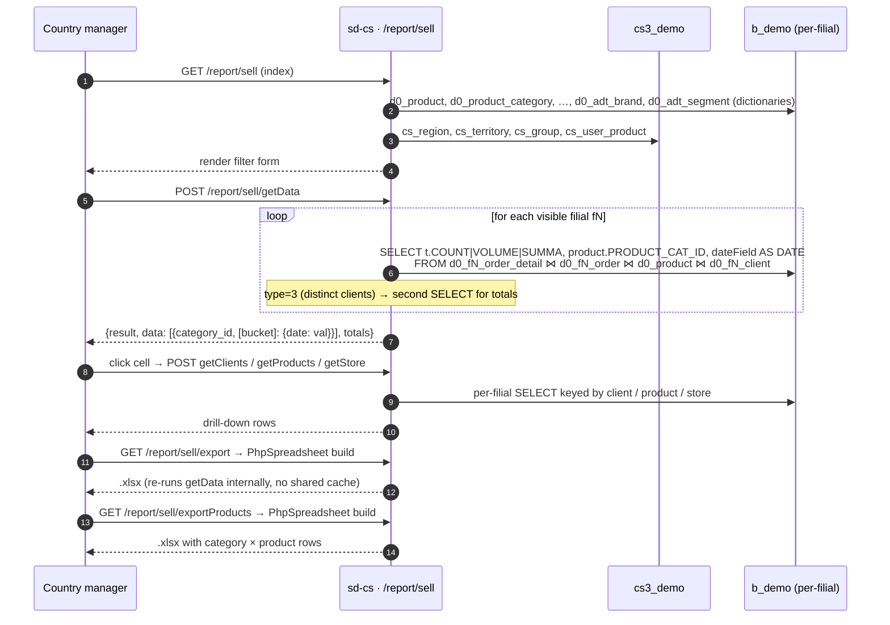

# Sell report — full action surface

:::note Same controller, two pages
[`report · Sale`](./report-sale.md) covers the *Sale grid* — the
filter form, the `getData` aggregation, and the rules manager use
day-to-day. **This page** is the deep-dive of all eight actions on
`SellController`, including the three drill-downs and two export
pipelines, so you have a single reference when debugging the page or
adding a new column.
:::

## Action map

The controller is one PHP class with 961 lines and eight actions; all
seven non-`actionIndex` entries are in `$allowedActions` (line 11)
and bypass the page-level access check.

| Action | Method | Returns | Used for |
|--------|--------|---------|----------|
| `actionIndex` | GET | HTML view + filter dictionaries | Page load |
| `actionGetFilials` | POST | Filial list with region / territory ids | Filter-form filial dropdown |
| `actionGetData` | POST | Grid aggregation (category × bucket) | Main grid |
| `actionGetClients` | POST | Clients drill-down for one (filial, category) cell | Cell expand |
| `actionGetStore` | POST | Stock-on-hand drill-down for one (filial, category) cell | "Show stock" toggle |
| `actionGetProducts` | POST | Per-product drill-down for one category | Product list panel |
| `actionExport` | GET | `.xlsx` file (`PhpSpreadsheet`) — category × filial grid | "Export grid" button |
| `actionExportProducts` | GET | `.xlsx` file — category × product × filial breakdown | "Export products" button |

## Data flow

## Action-by-action reference

### `actionIndex` — line 13

Loads dictionaries: `UserProduct.getUserData()` (the user's allowed
products / categories / groups / brands), plus `Region`, `Territory`,
`TradeDirection`, `ClientCategory`, `ClientChannel`, `Group`,
`AdtSegment`, `ProductSubcategory`. Renders
`protected/modules/report/views/sell/index.php` with all of them in
the `$data` array.

### `actionGetFilials` — line 65

Thin wrapper around the `getFilials()` helper: returns
`{value, text, region_id, territory_id}` for every filial in
`BaseModel::getOwnModels(!$all)`. Used by the filter form to populate
the filial dropdown without forcing the user to wait for the main
grid.

### `actionGetData` — line 70

The main grid query. See [`report · Sale`](./report-sale.md) for the
full rules — this page just enumerates the action.

### `actionGetClients` — line 223

Drill-down: for one filial (`dealer_id`), one category, and the
current filter set, return all buying clients with totals. SQL joins
`d0_fN_order_detail ⋈ d0_fN_order ⋈ d0_fN_client ⋈ d0_fN_city ⋈
client_category ⋈ d0_product`. Includes a separate `d0_fN_visiting ⋈
d0_fN_agent` query to attach the visiting-agent name(s) per client.
Returns `[{id, name, category, sum, count, block, volume, agent,
city}]` ordered by `summa DESC`.

### `actionGetStore` — line 306

Drill-down: stock-on-hand snapshot for the current filter. Reads
`d0_fN_store_detail ⋈ d0_fN_store ⋈ d0_product`, filtered to
`STORE_TYPE IN (1, 4, 5)` (sale-eligible warehouses). When `type
== 2` (summa view), prices are read from the active retail
`PriceType` (`TYPE=1, ACTIVE='Y'`) and multiplied by stock count.

### `actionGetProducts` — line 397

Drill-down: per-product breakdown for one category. Issues one SQL
per filial. When `store=true` and `type != 3`, additionally fetches
stock-on-hand per product to surface a *sold vs. on-hand* view.
Returns `[{id, name, sort, [bucket]: {sold, store}}]`.

### `actionExport` — line 577

Server-side `.xlsx` export. Builds a `Spreadsheet` with a category
× bucket grid where buckets are filials (`label=0`), regions
(`label=1`), or territories (`label≥2`). Re-runs the same aggregation
as `actionGetData` (no shared cache) and applies cell formatting
(borders, header fill). The `country_id` filter additionally drops
filials whose territory's region's country doesn't match.

### `actionExportProducts` — line 748

Server-side `.xlsx` export with one row per *product*, grouped by
category. Adds a *Доля* (share) column showing the product's
percentage of the grand total and a *Всего* footer row. Like
`actionExport`, it re-runs queries from scratch.

## Performance notes

- **Three drill-downs run independently.** Clicking a cell does not
  reuse the grid SQL; each drill issues a fresh per-filial loop.
  Heavy users will see two grid SQLs (`getData` plus `getProducts`)
  and another for `getClients` per cell expand.
- **Exports re-run queries.** Plan filter changes before clicking
  the export — there is no shared cache between `getData` and
  `actionExport*`. For a 20-filial org with a year-long range the
  export can take 60–90 seconds.
- **`UserProduct` blacklist is applied in every action.** Removing
  a product from a user's blacklist mid-session requires a page
  reload before the grid will show it again (the blacklist is read
  per request).

## Gotchas

- **Two controllers in one file = duplicate documentation.** This
  file and [`report · Sale`](./report-sale.md) point at the same
  PHP class. If you change `SellController`, update both pages.
- **`type === 3` is the distinct-client mode, not summa.** It does
  not return a date-bucketed grid — only one value per category ×
  bucket. The front-end must render the totals row differently for
  this mode.
- **`actionGetProducts` `store` flag is silently ignored when
  `type=3`.** Distinct-client views never show stock-on-hand.
- **Export filenames are date-stamped but not filter-stamped.**
  Two exports issued the same day with different filters overwrite
  each other in the user's downloads folder. Rename on save.

## See also

- [report · Sale](./report-sale.md) — the day-to-day user-facing
  description (rules, filters, output schema for `actionGetData`).
- [sd-cs architecture](../architecture.md) — two-DB model and
  `setFilial()` mechanism.
- [`SellController.php` source](https://github.com/salesdoctor/sd-cs/blob/master/protected/modules/report/controllers/SellController.php) — full controller (961 lines).
