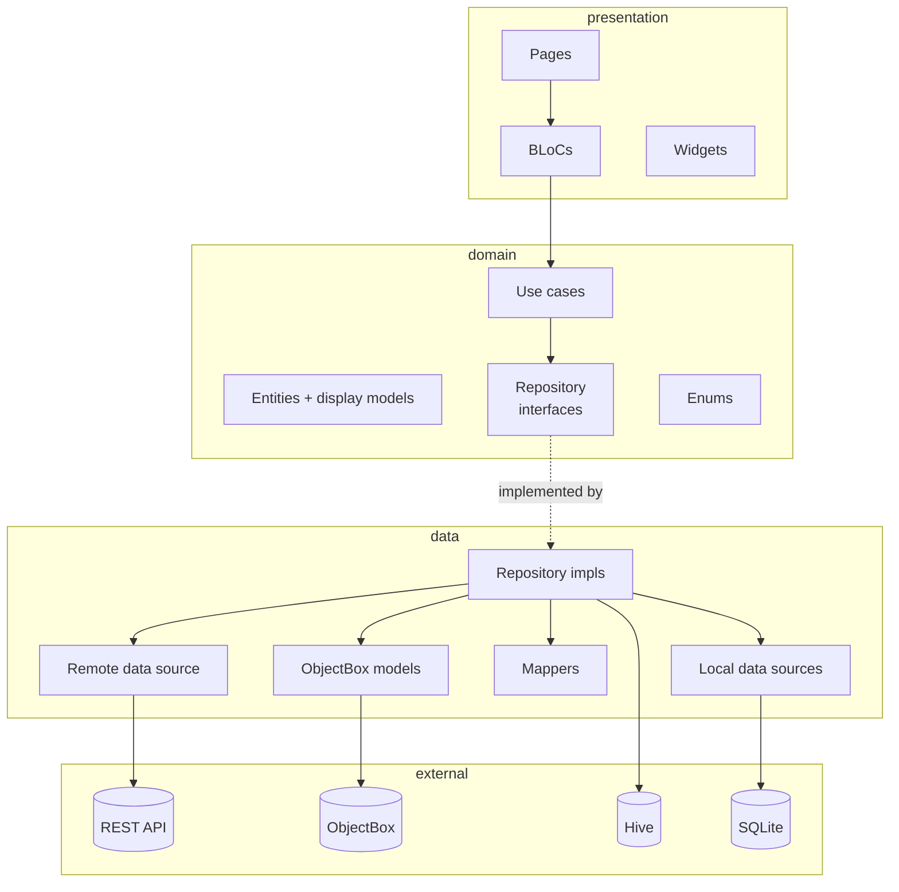

# 01 — Architecture

## The shape

sdaudit is **clean architecture**, single feature module, three
layers:

## Dependency rule

A module may only depend on modules drawn **above** it in the diagram.
Concretely:

- `presentation/` may import `domain/`.
- `data/` may import `domain/`.
- `domain/` may import **neither** `presentation/` nor `data/`.
- All three may import `core/` (errors, network info, themes).

If a presentation file imports something from `data/`, that's a
violation. If a domain file imports something from `data/`, that's a
violation. The existing code mostly upholds this — exceptions are
flagged in [`20-known-issues-and-debt.md`](20-known-issues-and-debt.md).

## Why `Either<Failure, T>`

Every repository method returns `Future<Either<Failure, T>>` (from
`dartz`). This means:

1. **No exceptions cross the domain boundary.** `BaseRepositoryImpl`
   wraps every `DioException` / `ApiException` into a `Failure` and
   hands a `Left` back. Domain and presentation never need `try/catch`.
2. **Errors are values.** A BLoC always sees a fold:
   `result.fold((l) => ErrorState(l.message), (r) => SuccessState(r))`.
   No control-flow gymnastics.
3. **Three failure subclasses** — `ServerFailure(message, statusCode?,
   errorCode?)`, `NetworkFailure(message)`, `LocaleFailure(message)` —
   carry enough metadata to decide retry vs alert vs ignore.

Details in [`14-error-handling.md`](14-error-handling.md).

## Single-feature module: `lib/features/sd_audit/`

Most Flutter clean-architecture templates suggest one folder per
feature. This codebase has **one feature** that contains everything:
auth, dashboard, clients, visits, audits, polls, photos, tasks,
reports, stock, revise.

Tradeoffs:

| Pro | Con |
|---|---|
| Easy cross-feature reuse (`ClientsModelBox` used in audits, photos, reports) | Folder is large — 605 dart files in this single feature |
| Single DI container in `injection_container.dart` covers it all | The container is 1,101 lines and hard to scan |
| One shared `RemoteDataSources` with 34 methods | `RemoteDataSources` is 801 lines and a god-object risk |
| No premature feature boundaries | If sdaudit ever splits (e.g. an "admin" app reusing parts), refactoring will be painful |

A future split would carve along sub-folders inside
`lib/features/sd_audit/presentation/`: each top-level subfolder of
`bloc/` and `pages/` is already a candidate feature
(`audit/`, `client_*`, `dashboard/`, `polls/`, `photo_report/`,
`tasks/`, `reports/`, etc.).

## Cross-cutting modules

Some modules sit **outside** the feature directory because they're
shared infrastructure or genuinely global state:

| Path | Why outside the feature |
|---|---|
| `lib/main.dart` | Process entrypoint |
| `lib/injection_container.dart` | App-wide DI graph; depends on everything |
| `lib/db/objectbox/`, `lib/db/hive/`, `lib/db/sql/` | Schema is global; mutating it touches every feature |
| `lib/db/models/` | Boxes are shared across the whole app |
| `lib/common/` | `EndPoints` constants, background service, shared constants |

A pure clean-architecture purist would say `lib/db/` should be split
into a data-source detail and `lib/db/models/` should be private to
`data/`. In this codebase the boxes are leaked into BLoCs and pages
freely (e.g. `ClientsModelBox` is referenced in presentation files).
That coupling is by design here — it keeps things small — but it does
mean schema changes ripple far.

## The "core" sub-tree

`lib/features/sd_audit/core/` holds feature-internal infrastructure:

- `core/error/` — `Failure`, `ApiException`
- `core/network/` — `NetworkInfo`
- `core/http_client/` — `HttpClient`, local Dio + interceptors
- `core/services/` — location, version, routing
- `core/themes/` — `AppThemeData`, `theme_extensions.dart`

It's the layer **all three** of `domain/`, `data/`, `presentation/`
may depend on.

## What's _not_ in the architecture

A few things you might expect that are absent:

- **No `core/usecase/` base class.** Use cases are just classes with
  `call()`. There's no `abstract class UseCase<T, P>`.
- **No `Equatable` on most entities.** `Failure` extends `Equatable`;
  most entity classes do not. State comparison in BLoC tests therefore
  uses `isA<>()` matchers, not equality.
- **No router.** `Navigator.push(MaterialPageRoute(builder: ...))` is
  used everywhere. There's no `GoRouter`, no named routes. See
  [`15-navigation.md`](15-navigation.md).
- **No global event bus.** Cross-BLoC communication is done by
  re-fetching from ObjectBox after a sibling BLoC has written to it,
  not via streams.
