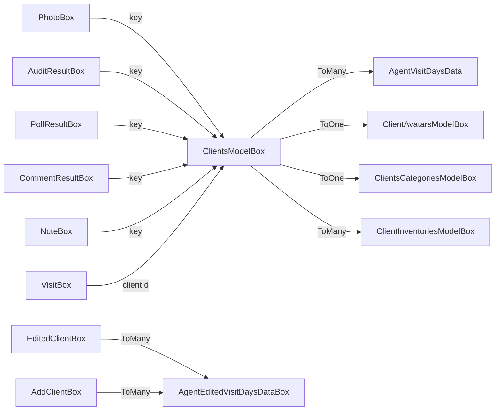

# 08 — Databases

Three persistence systems coexist. They serve disjoint concerns —
nothing is duplicated across them, but each has its rationale.

| System | Used for | Code |
|---|---|---|
| **ObjectBox** | Domain entities (clients, visits, audits, polls, photos, stock, …) | `lib/db/objectbox/object_box.dart` (1,773 lines), models in `lib/db/models/` |
| **Hive** | App-scoped key-value (last sync date, auth flag, version flags, API keys) | `lib/db/hive/sd_audit_box.dart` |
| **SQLite (sqflite)** | Users + GPS tracks | `lib/db/sql/user_data_sql.dart`, `lib/db/sql/gps_track_sql.dart` |

**Rule:** DB operations live in data sources (or, for ObjectBox-only
repos, the repo impl). They do **not** live in BLoCs or pages.

## ObjectBox

### The `ObjectBox` class

`lib/db/objectbox/object_box.dart` is a wrapper around `Store` that
owns one `Box<T>` per entity. The class is 1,773 lines because each
entity ships with a small set of CRUD + query helpers.

Constructor + factory:

```dart
class ObjectBox {
  late final Store store;
  late final Box<ConfigBox> _configBox;
  late final Box<ClientsModelBox> _clientsBox;
  // ... 34 more box fields

  ObjectBox._create(this.store) { /* assign boxes */ }

  static Future<ObjectBox> create({required String name}) async {
    final docsDir = await getApplicationDocumentsDirectory();
    final store = await openStore(directory: p.join(docsDir.path, name));
    return ObjectBox._create(store);
  }
}
```

The instance is held in the global `objectBox` declared in
`lib/main.dart` and initialised before `runApp`:

```dart
late ObjectBox objectBox;
// ...
objectBox = await ObjectBox.create(name: "obx-data");
```

### All 36 boxes

Pulled directly from the `late final Box<T>` declarations:

| Box | Purpose |
|---|---|
| `ConfigBox` | App config: GPS thresholds, photo settings, audit flags |
| `TerritoryBox` | Territory catalogue |
| `PollBox` | Poll definitions (synced from server) |
| `PollResultBox` | Per-client poll answers (synced back) |
| `HomeEntityBox` | Cached supervisor dashboard data |
| `MerchandHomeBox` | Cached merchandiser dashboard data |
| `ClientBox` | (legacy aggregate, fading out) |
| `ClientClientBox` | Bridge entity in client relationships |
| `CommentBox` | Comment template catalogue |
| `CommentResultBox` | Per-client comment with status, check-in/out time |
| `NoteBox` | Per-client visit notes |
| `EditedClientBox` | Client edits awaiting sync |
| `AddClientBox` | New-client drafts awaiting sync |
| `AgentBox` | Agent catalogue |
| `SearchModelBox` | Search filter persistence (agent ids, categories, days) |
| `ClientsCategoryBox` | (legacy) |
| `VisitBox` | Per-client visit instance |
| `TaskBox` | Tasks (assigned + completed) |
| `TaskTypesBox` | Task type catalogue |
| `ChannelBox` | Distribution channels |
| `PhotoTypesBox` | Photo category catalogue |
| `PhotoBox` | Per-client photos with status |
| `AuditBox` | Audit template / definition |
| `AuditResultBox` | Per-client audit answers with check-in/out times |
| `LastSyncTimeBox` | Per-entity last-sync timestamp |
| `ClientAvatar` | (legacy) |
| `TrackGpsBox` | (legacy — see SQLite section; this box is not the active store) |
| `ClientAvatarsModelBox` | Avatar metadata for clients |
| `ClientsModelBox` | **The current client entity** (relations: agents `ToMany`, auditor `ToOne`, inventories, avatar ids) |
| `ClientsCategoriesModelBox` | Categories used by `ClientsModelBox` |
| `StockBox` | Per-warehouse stock |
| `WarehouseBox` | Warehouse catalogue |
| `ProductBox` | Product catalogue |
| `ProductCategoryBox` | Product category tree |
| `PriceTypeBox` | Price-type catalogue |
| `PriceBox` | Per-product-per-priceType price |
| `TradeBox` | Trade entries (revise feature) |
| `ReviseBox` | Revise data per client / date range |

### Relationship cheat sheet

`ClientsModelBox` is the hub. Cross-reference from observed entity
fields:



Lookups are usually by `clientId` (a string the API supplies), not by
ObjectBox int IDs.

### Converters & relationships sub-folders

- `lib/db/converters/visit_status_converter.dart` — `@PropertyType`
  converter so `VisitStatus` enum survives a round trip.
- `lib/db/relationships/*.dart` — explicit relation helpers (added
  because the codegen workaround mentioned below can't express all
  required types directly).

### The codegen edit gotcha

ObjectBox generates `lib/db/objectbox.g.dart` via `build_runner`. The
`README.md` notes that after every codegen the generator emits a
`ToMany<AgentEditedVisitDaysDataBox>?` (nullable) where the codebase
wants `ToMany<AgentEditedVisitDaysDataBox>` (non-nullable). You have
to open the generated file and remove the `?` manually.

This is fragile. Failure mode: a CI re-run of `flutter pub run
build_runner build --delete-conflicting-outputs` undoes the fix and
the build fails next time someone pulls. Document the workaround
prominently (see [`18-build-and-deploy.md`](18-build-and-deploy.md)).

## Hive

Just one box: `GeneralBox` in `lib/db/hive/sd_audit_box.dart`. The
whole class is small:

```dart
class GeneralBox {
  final Box _box;
  GeneralBox._create(this._box);

  static Future<GeneralBox> initialize() async =>
      GeneralBox._create(await Hive.openBox("sd_audit_box"));

  // last_auto_synchronization_date  (default: today, format dd.MM.yyyy)
  Future setLastAutoSynchronizationDate(String value)
      => _box.put('last_auto_synchronization_date', value);
  String get lastAutoSynchronizationDate
      => _box.get('last_auto_synchronization_date',
           defaultValue: DateTime.now().format('dd.MM.yyyy'));

  // yandex_api_key
  Future setYandexAPIKey(String value)  => _box.put('yandex_api_key', value);
  String get yandexAPIKey               => _box.get('yandex_api_key', defaultValue: '');

  // unauthenticated_error flag (set when API returns 401)
  Future setUnauthenticatedError(bool v) => _box.put('unauthenticated_error', v);
  bool   get unauthenticatedError        => _box.get('unauthenticated_error');

  // version flags (used by AppVersionManager)
  Future setVersionForceUpdate(bool v)     => _box.put('version_force_update', v);
  bool   get versionForceUpdate            => _box.get('version_force_update', defaultValue: false);

  Future setVersionRecommendUpdate(bool v) => _box.put('version_recommend_update', v);
  bool   get versionRecommendUpdate        => _box.get('version_recommend_update', defaultValue: false);

  Future setLastUpdateVersion(String v)    => _box.put('last_update_version', v);
  String get lastUpdateVersion             => _box.get('last_update_version', defaultValue: '');

  Future setLastVersionCheckTime(DateTime v) => _box.put('last_version_check_time', v.toIso8601String());
  DateTime get lastVersionCheckTime { /* parse ISO8601; epoch if missing */ }

  Future close() async => await _box.close();
  Future clear() async => await _box.clear();
}
```

**Keys in `sd_audit_box`:**

| Key | Type | Set by | Read by |
|---|---|---|---|
| `last_auto_synchronization_date` | `String dd.MM.yyyy` | `SynchronizationRepositoryImpl.getAllData` post-success | `_MyAppState.checkAutoSynchronization` |
| `yandex_api_key` | `String` | (server-supplied) | map widgets |
| `unauthenticated_error` | `bool` | response interceptor on 401 | splash / login flow |
| `version_force_update` | `bool` | `AppVersionManager` | `MyApp.build` → version dialog |
| `version_recommend_update` | `bool` | `AppVersionManager` | optional update dialog |
| `last_update_version` | `String` | `AppVersionManager` | deduping prompts |
| `last_version_check_time` | `DateTime` (iso) | `AppVersionManager` | rate-limit version checks |

Note `unauthenticatedError` has no default in the getter — reading it
before it's ever set throws. Setters are scattered through error paths;
test coverage is thin.

## SQLite (sqflite)

Two isolated schemas, each owned by one data source:

| Schema | Owned by | Tables | Why SQLite |
|---|---|---|---|
| Users | `UserDataSourceImpl` (`lib/features/sd_audit/data/data_sources/local_data_sources/user_data_sources.dart`) | one `users` table | Predates ObjectBox migration; small, relational user list with "currently selected" flag |
| GPS tracks | `TrackGpsDataSourceImpl` (`lib/features/sd_audit/data/data_sources/local_data_sources/track_gps_data_sources.dart`) | one `track_gps` table | Large-volume append-only queue, batched read/delete pattern |

GPS tracks use a 20-row batch pattern:
`updateAndReturnFirst20Records()` → upload → `deleteTrackGpsData20()`.
The boxed `TrackGpsBox` exists in ObjectBox too but isn't the active
store — the SQLite table is.

## Initialization order in `main()`

```dart
WidgetsFlutterBinding.ensureInitialized();
HttpOverrides.global = MyHttpOverrides();          // ⚠️ SSL bypass (see 20)
await di.setUp();                                  // also registers GeneralBox (Hive)
await EasyLocalization.ensureInitialized();
await Hive.initFlutter();                          // Hive box was already registered
await FastCachedImageConfig.init(...);
await Firebase.initializeApp(...);
objectBox = await ObjectBox.create(name: "obx-data");
runApp(...);
```

Note that `Hive.initFlutter` runs **after** `di.setUp()` even though
`GeneralBox.initialize()` is called inside `setUp()`. This works
because `Hive.openBox` is itself async and Hive permits initialization
before the platform-channel `initFlutter` finishes — but it's fragile.
A safer ordering would put `Hive.initFlutter()` before `di.setUp()`.

## Cross-DB invariants

A handful of state lives in two places and must stay consistent:

- **Token & role** — live in SQLite (`UserDataSourceImpl.getUser()`)
  and are read by `RemoteDataSourceImpl` on every request. Stale
  state here causes 401 storms.
- **Last sync timestamp** — Hive (`GeneralBox.lastAutoSynchronizationDate`).
  ObjectBox has a `LastSyncTimeBox` but Hive is the source of truth
  the lifecycle handler consults.
- **App version flags** — Hive only; no ObjectBox copy.

When in doubt: prefer Hive for "one global setting", ObjectBox for
"per-entity row", SQLite for "we already had it".
