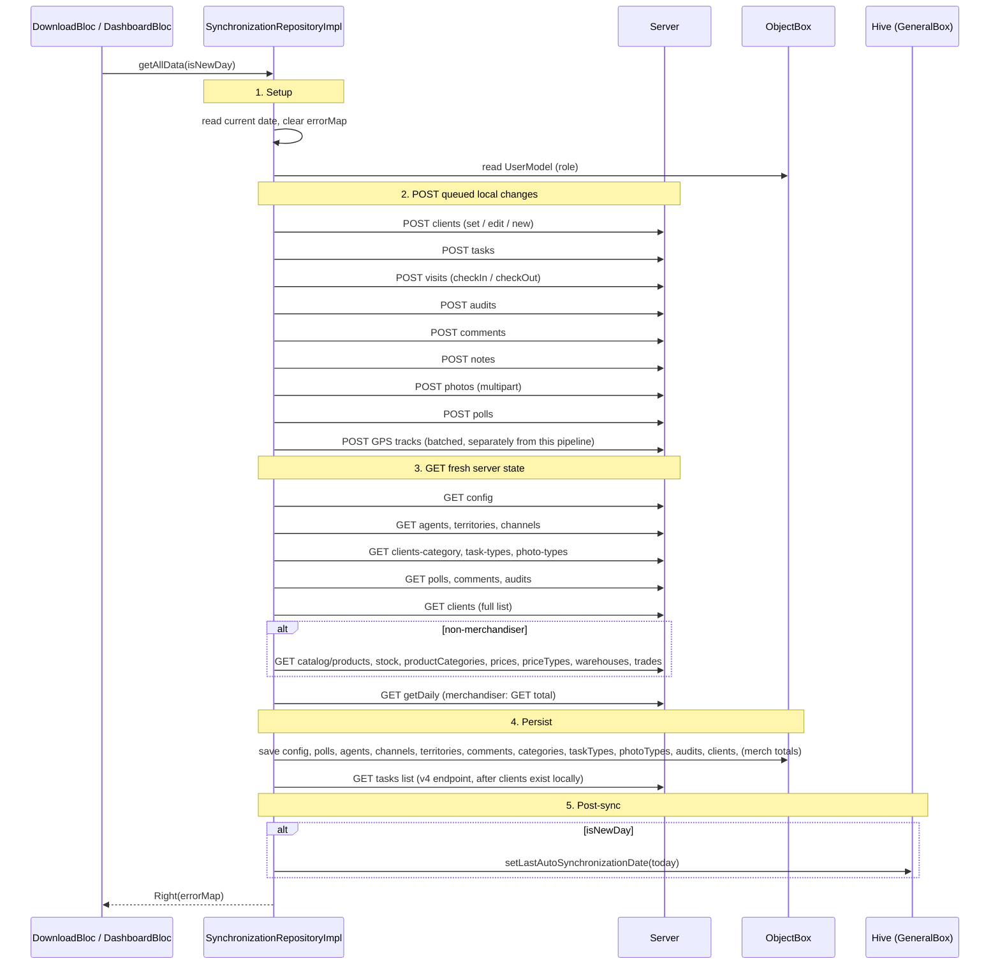

# 10 — Synchronization

The most consequential single file in the codebase:
**`lib/features/sd_audit/data/repositories/synchronization_repository_impl.dart`**
(1,448 lines). It implements `SynchronizationRepository`:

```dart
abstract class SynchronizationRepository {
  Future<Either<Failure, bool>> checkToken();
  Future<Either<Failure, Map<String, String>>> getAllData({required bool isNewDay});
}
```

`checkToken()` is a cheap ping. **`getAllData()` is the sync
pipeline** — everything else in this doc is about its behavior.

## The pipeline

`getAllData` runs a fixed-order pipeline. The body is one big
`workWithServer(() async { ... })` so any unhandled exception becomes
a `Failure`.



`Future.wait` is used for the persist step so the writes happen in
parallel after all GETs are complete.

## POST before GET, deliberately

The order is **POST → GET → save**:

1. The user may have created/edited locally since the last sync.
2. The server reconciles those and assigns server IDs.
3. The GET phase pulls back the new authoritative state.

If GET ran first, the user's local edits would be overwritten by a
stale server view before they had a chance to upload. The order is a
real invariant; do not reverse it.

Inside the POST phase, several methods are kicked off via futures
held in local variables (`var postClient = postClients();`) so they
proceed in parallel with the next GETs. They're awaited again
explicitly before the matching save (e.g. `await postClient;` runs
before `saveClientsData2(...)`).

## The `errorMap`

The repo holds an instance field `Map<String, String> errorMap = {}`,
which sync helpers populate when they decide to swallow an error for a
single step rather than fail the whole pipeline. The end-of-pipeline
`return errorMap;` becomes the `Right` value:

```dart
@override
Future<Either<Failure, Map<String, String>>> getAllData(...) async =>
    await workWithServer(() async {
      // ... 1400 lines ...
      return errorMap;
    });
```

`DownloadBloc` shows the map as a per-step status list in the
`DownloadScreen`: each key is a step name (e.g. `"clients"`,
`"audits"`), each value is the error description or empty string.
Users see which steps succeeded and which failed without the whole
sync being aborted.

A `Left(Failure)` is reserved for **catastrophic** failures (auth,
network outage, top-level exception). Individual endpoint failures
collect in `errorMap` instead.

## Triggers

| Trigger | Caller |
|---|---|
| First launch after login | `DownloadBloc` (from `login_screen_2` after `LoginSuccessState`) |
| Day rollover | `_MyAppState.didChangeAppLifecycleState` resumed/paused → pushes `DownloadScreen` if `differences >= 1` |
| Manual sync from dashboard FAB | `DownloadBloc.FloatingActionButtonPressedEvent` |
| End-of-visit | `ClientsVisitBloc` issues a targeted POST batch (not the full pipeline) |
| Splash screen auto-sync | `SplashBloc` if last sync date is older than today |

The lifecycle handler in `_MyAppState`:

```dart
@override
void didChangeAppLifecycleState(AppLifecycleState state) {
  super.didChangeAppLifecycleState(state);
  if (state == AppLifecycleState.resumed || state == AppLifecycleState.paused) {
    checkAutoSynchronization();
    if (differences >= 1) {
      navigatorKey.currentState?.pushAndRemoveUntil(
        MaterialPageRoute(builder: (context) => const DownloadScreen()),
        (route) => false,
      );
    }
  }
}

Future checkAutoSynchronization() async {
  final format = DateFormat('dd.MM.yyyy');
  final now = format.parse(format.format(DateTime.now()));
  final last = format.parse(generalBox.lastAutoSynchronizationDate);
  differences = now.difference(last).inDays;
}
```

Quirks:

- The route stack is **wiped** (`pushAndRemoveUntil` with
  `(route) => false`) when a day has rolled over. Any deep-link state
  is lost.
- `paused` is treated like `resumed` — sync is triggered as the app
  goes to background, not only when it's brought forward. That can
  bite users who paused mid-input.

## Constituent methods (public API of `SynchronizationRepositoryImpl`)

| Method | Phase | What it does |
|---|---|---|
| `checkToken()` | top-level | calls `profile` endpoint as a token-validity ping |
| `getAllData({isNewDay})` | top-level | the full pipeline above |
| `deletePhotoReport()` | POST prelude | drops local photo report state if `isNewDay` |
| `postClients()` | POST | uploads new/edited client drafts |
| `postPhotoResult()` | POST | multipart upload of pending photos |
| `postCommentResult()` | POST | uploads comments with `ready` status |
| `postTasks()` | POST | uploads task results (v4 endpoint) |
| `postNotes()` | POST | uploads note results |
| `postPollResult()` | POST | uploads filled-in polls |
| `postAuditResult()` | POST | uploads audit results |
| `postCheckIn()` | POST | uploads visit check-in/out events |
| `savePollsData()` | save | catalog persist |
| `saveAgentsData()` | save | catalog persist |
| `saveTerritoryData()` | save | catalog persist |
| `saveClientsData2()` | save | persists the latest client list (renames suffix `2` — older `saveClientsData` exists too) |
| `saveComments()` | save | comment-template catalog |
| `saveChannelsData()` | save | catalog persist |
| `saveClientsCategoryData()` | save | catalog persist |
| `saveTaskTypesData()` | save | catalog persist |
| `savePhotoTypesData()` | save | catalog persist |
| `saveConfig()` | save | persists `ConfigBox` |
| `saveStockToDb()`, `saveTradeToDb()`, `saveProductCategoryToDb()`, `savePriceToDb()`, `savePriceTypeToDb()`, `saveWarehouseToDb()`, `saveProductToDb()` | save | non-merch catalog cluster |
| `saveTasksList()` | save | persists tasks |
| `saveAuditsData()` | save | audit catalog |
| `saveMerchandData()` | save | merch-only |
| `toManyAgentData2()`, `toManyAuditData2()`, `toManyAgentData()`, `toManyAuditData()` | helpers | rebuild ToMany relations from response JSON |
| Plus private `_get*FromServer` helpers per cluster. |

## Why this file should be split (some day)

1,448 lines doing dozens of unrelated jobs. Plausible split:

- `SyncOrchestrator` — owns `getAllData` and the order.
- `SyncPostQueue` — owns the POST methods.
- `SyncCatalogPersister` — owns the `save*Data` methods.
- `SyncStockPersister` — owns the seven catalog-cluster methods.

Each could be tested in isolation. The current shape makes adding a
single new sync step a 1,500-line file diff. Tracked in [`20`](20-known-issues-and-debt.md).
