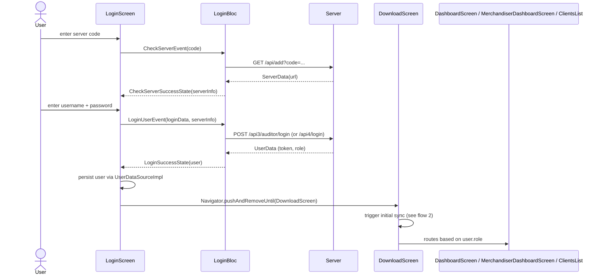
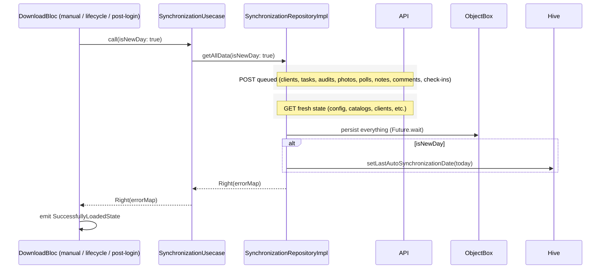
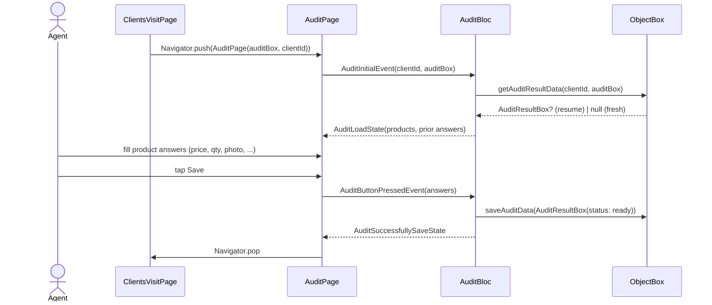
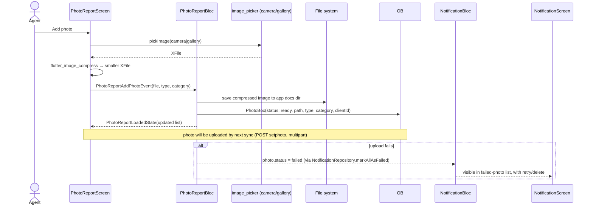

# 16 — Key flows

End-to-end traces of the five workflows that matter most. Each is a
mermaid sequence diagram + a short narrative; for any individual
piece, follow the link into the relevant doc.

## 1. Login



**Role routing**, on `LoginSuccessState`:

| `user.role` | Home |
|---|---|
| `supervisor` / `manager` | `DashboardScreen` |
| `merchandiser` | `MerchandiserDashboardScreen` |
| otherwise (plain agent / auditor) | `ClientsList` |

Source of truth: `domain/enums/user_role.dart`.

After login the sync pipeline (flow 2) runs before the home screen
mounts — otherwise the home would be empty.

## 2. Sync

Full breakdown in [`10-synchronization.md`](10-synchronization.md). At
flow level:



The lifecycle handler (`_MyAppState.didChangeAppLifecycleState`)
triggers this same pipeline if the on-disk last-sync date is older
than today's date.

## 3. Visit

```mermaid
sequenceDiagram
    actor Agent
    participant CL as ClientsList
    participant CI as ClientInfoScreen
    participant CV as ClientsVisitPage
    participant CVB as ClientsVisitBloc
    participant GPS as Geolocator
    participant OB as ObjectBox

    Agent->>CL: tap a client
    CL->>CI: Navigator.push(ClientInfoScreen)
    CI->>CV: Start visit button → Navigator.push(ClientsVisitPage)

    CV->>CVB: StartVisitEvent
    CVB->>GPS: getCurrentPosition
    GPS-->>CVB: lat, lng (accuracy)
    CVB->>CVB: validateGpsAndStartVisit(config thresholds)
    alt within range
        CVB->>OB: create VisitBox(checkInTime)
        CVB-->>CV: ClientsVisitState(active: true)
    else outside range
        CVB-->>CV: ClientsVisitState(error: "too_far")
    end

    Agent->>CV: open Audit / Photo / Polls / Note / Comment
    CV->>(sub-page): Navigator.push
    Note over (sub-page),OB: user fills in answers; sub-pages write AuditResultBox / PollResultBox / PhotoBox / NoteBox / CommentResultBox with status=ready

    Agent->>CV: End visit
    CV->>CVB: EndVisitEvent
    CVB->>GPS: getCurrentPosition (check-out coords)
    CVB->>OB: VisitBox.checkOutTime = now
    CVB->>OB: updatePhotosCheckout(clientId, now)
    CVB->>OB: updateClientVisitTimes(...)
    CVB->>OB: updateAuditResultVisitFinished(clientId, true)
    CVB->>OB: updatePollResultVisitFinished(clientId, true)
```

The check-out propagates the visit end time into every dependent box
so reports correctly span the visit window. If the user backs out
without ending the visit, `getActiveVisitClientName()` flags the
in-progress visit on next entry to `ClientsList`.

Sync of the visit data happens **eventually** — either when the next
full sync runs (flow 2) or when the user explicitly hits the FAB.
There's no auto-push on check-out today.

## 4. Audit



The `AuditResultBox` carries the answers, a `status` from
`AuditStatus`, and the `checkInTime` / `checkOutTime` so the result
can be associated with the right visit instance. `status = ready`
means "filled in, awaiting next sync".

## 5. Task

```mermaid
sequenceDiagram
    actor Supervisor
    participant TS as TasksScreen
    participant ET as EditTaskScreen
    participant ETB as EditTaskBloc
    participant API
    participant OB

    Supervisor->>TS: open task list
    TS->>API: (via TasksBloc) GET tasks (if missing locally)
    API-->>TS: list
    Supervisor->>ET: create new task
    ET->>ETB: ButtonPressedEvent(taskBox)
    ETB->>API: POST /api4/create/task (via setTaskUsecase → repo → remote DS)
    alt success
        API-->>ETB: ok
        ETB->>OB: TaskBox(status: notSynced → completed)
        ETB-->>ET: EditTaskSaveState
        ET->>TS: Navigator.pop(true)
        TS->>TS: refresh list
    else failure
        API-->>ETB: error
        ETB-->>ET: EditTaskErrorState
        ET->>ET: snackbar; user retries
    end
```

For agents, tasks are read-mostly — agents complete tasks (status
changes from `newTask` → `completed`) and the next sync uploads.
Supervisors create and assign.

## 6. Photo report



The `failed` photo status surfaces in `NotificationScreen` so users
can retry (or delete to give up). This is the only status path that
admits a permanent failure — everything else cycles through
`initial → ready → success`.
